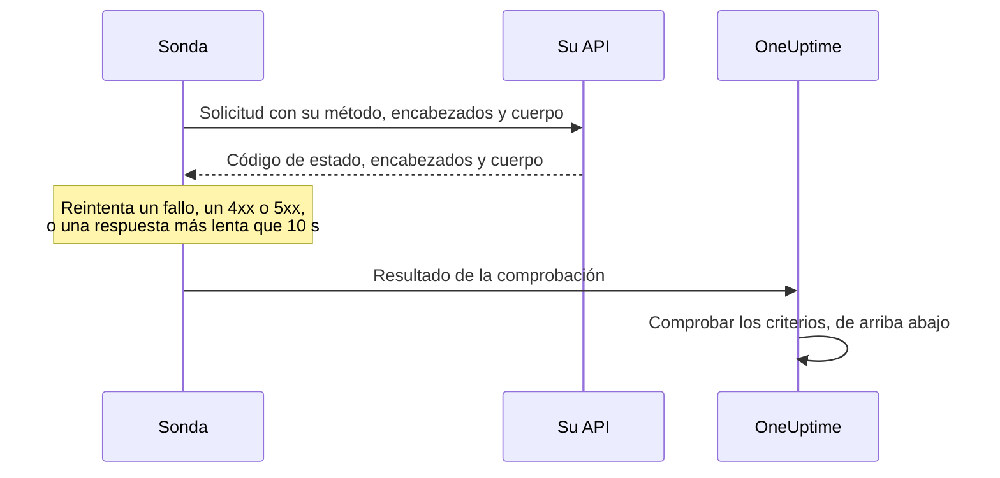

# Monitor de API

Un monitor de API llama a un endpoint HTTP según una programación, con el método, los encabezados y el cuerpo que usted elija, y comprueba lo que vuelve: el código de estado, el tiempo de respuesta, los encabezados y el cuerpo. Úselo para endpoints REST, JSON y GraphQL, comprobaciones de salud y cualquier llamada de la que dependan sus usuarios.

:::cards
- [Crear el monitor](#crear-un-monitor-de-api): Seis pasos en el panel.
- [Opciones de configuración](#opciones-de-configuración): Método, encabezados, cuerpo, redirecciones, certificados, tiempos de espera y reintentos.
- [Criterios de monitoreo](#criterios-de-monitoreo): Qué cuenta como disponible o caído, desde el principio.
- [Solución de problemas](#solución-de-problemas): Cuando falla una comprobación que debería pasar.
:::

## Cómo funciona

En cada comprobación, una sonda envía la solicitud, sigue las redirecciones y registra el código de estado, el tiempo de respuesta, los encabezados y el cuerpo. Una solicitud que falla, agota el tiempo de espera, responde con un estado `4xx` o `5xx`, o tarda más de 10 segundos se vuelve a intentar, hasta el número de reintentos que permita. Después, OneUptime pasa el resultado por los criterios del monitor.



Una sonda que ha perdido su propia conexión de red no informa de ningún resultado, así que no puede marcar su API como sin conexión.

## Antes de empezar

- **Un rol que pueda crear monitores**: Project Owner, Project Admin, Project Member, Monitor Admin o Monitor Member, o un rol personalizado con el permiso Create Monitor.
- **Una sonda que pueda llegar a la API.** Las sondas predeterminadas de su proyecto se eligen para cada monitor nuevo. Si un cortafuegos protege la API, permita las [direcciones IP de las sondas de OneUptime Cloud](/docs/configuration/ip-addresses). Una API en una red privada necesita una [sonda personalizada](/docs/probe/custom-probe) dentro de esa red, con permiso para llegar a direcciones privadas: consulte [Acceso a red privada](/docs/self-hosted/private-network-access).
- **Credenciales como secretos de monitor.** Si la API necesita una clave o un token, guárdelo primero como [secreto de monitor](/docs/monitor/monitor-secrets), para que el monitor solo contenga una referencia a él.

## Crear un monitor de API

:::steps
### Empezar un monitor nuevo

Vaya a **Monitores** y haga clic en **Crear monitor**. En **Tipo de monitor**, elija **API**.

### Ponerle nombre

Introduzca un **Nombre**, como `Orders API`, y haga clic en **Siguiente**.

### Introducir la solicitud

En **URL de API**, introduzca la URL completa del endpoint, como `https://api.example.com/health`. Elija el **Tipo de solicitud de API** (**GET** salvo que lo cambie). Para añadir encabezados o un cuerpo, abra **Más campos** y rellene **Encabezados de la solicitud** y **Cuerpo de la solicitud (en JSON)**.

### Probarlo

Haga clic en **Probar monitor**, elija una sonda en **Seleccionar sonda** y haga clic en **Ejecutar prueba**. **Resultado de la prueba del monitor** muestra lo que respondió la API.

### Revisar los criterios

**Criterios del monitor** empieza con los [criterios predeterminados](#criterios-predeterminados): sin conexión cuando la API no responde o responde con un error, en línea con cualquier estado `2xx` o `3xx`. Para comprobar también lo que devuelve la API, añada un filtro y haga clic en **Siguiente**.

### Elegir sondas y crear

Conserve o cambie las **Sondas** y el **Intervalo de monitoreo** (empieza en **Cada 5 minutos**), y haga clic en **Crear monitor**. Se abre la página del monitor.
:::

## Opciones de configuración

### URL de API

El endpoint al que se llama, como URL completa con su esquema, como `https://api.example.com/v1/health`. Puede poner un [secreto de monitor](/docs/monitor/monitor-secrets) en la URL como `{{monitorSecrets.NAME}}`.

### Marcadores de URL dinámicos

Cuando un CDN o un proxy de caché está delante de la API, una sonda puede recibir la respuesta de la caché en lugar de su servidor. Para saltarse la caché, añada un marcador a la URL; la sonda lo sustituye por un valor nuevo en cada comprobación.

| Marcador | Se sustituye por | Valor de ejemplo |
| --- | --- | --- |
| `{{timestamp}}` | La hora Unix actual, en segundos | `1719500000` |
| `{{random}}` | Una cadena aleatoria y única de 32 caracteres hexadecimales | `3f2b8c1d9e7a4b6c8d0e1f2a3b4c5d6e` |

Una URL con un marcador:

```text
https://api.example.com/health?cb={{timestamp}}
```

Lo que la sonda solicita en dos comprobaciones separadas por cinco minutos:

```text
https://api.example.com/health?cb=1719500000
https://api.example.com/health?cb=1719500300
```

Use `{{random}}` de la misma manera: `https://api.example.com/health?nocache={{random}}`.

### Tipo de solicitud de API

El método HTTP que se envía. **GET** es el predeterminado; los otros son **POST**, **PUT**, **PATCH**, **DELETE** y **HEAD**. Si una solicitud **HEAD** recibe un estado `4xx` o `5xx`, la sonda la repite como `GET`.

### Más campos

Estos ajustes están plegados en **Más campos**. El encabezado plegado los enumera y muestra cuáles ha cambiado.

| Campo | Predeterminado | Qué hace |
| --- | --- | --- |
| **Encabezados de la solicitud** | Ninguno | Los encabezados que se envían, como pares de nombre y valor. Haga clic en **Añadir Request Header** para cada uno. |
| **Cuerpo de la solicitud (en JSON)** | Ninguno | Un objeto JSON que se envía como cuerpo, normalmente con **POST**, **PUT** o **PATCH**. Debe ser JSON válido. |
| **No seguir redirecciones** | Desactivado | Juzgar la primera respuesta en lugar de seguir las redirecciones. Consulte [más abajo](#no-seguir-redirecciones). |
| **Permitir certificados autofirmados** | Desactivado | Omitir la validación del certificado TLS para el propio nombre de host del monitor. |
| **Usar certificado de cliente (mTLS)** | Desactivado | Presentar un certificado de cliente y una clave privada. Consulte [Certificado de cliente (mTLS)](#certificado-de-cliente-mtls). |
| **Tiempo de espera de la solicitud (segundos)** | `60` | Cuánto esperar cada intento. El máximo es de 60 segundos. |
| **Reintentos en caso de fallo** | El predeterminado de la sonda, normalmente `3` | Cuántas veces reintentar un intento fallido. El máximo es 3. Consulte [Reintentos y tiempos de espera](#reintentos-y-tiempos-de-espera). |

Los encabezados y el cuerpo de la solicitud pueden usar [secretos de monitor](/docs/monitor/monitor-secrets), por ejemplo un encabezado `Authorization` con el valor `Bearer {{monitorSecrets.ApiKey}}`.

#### No seguir redirecciones

De forma predeterminada, la sonda sigue las redirecciones (`301`, `302`, `303`, `307` y `308`), hasta 10, y juzga la respuesta en la que termina. Active **No seguir redirecciones** para juzgar en su lugar la propia respuesta de redirección. Los [criterios predeterminados](#criterios-predeterminados) cuentan una respuesta de redirección como en línea.

Cuando sigue una redirección:

- Un `303`, o un `301` o `302` que responde a un `POST`, convierte la solicitud en un `GET` sin cuerpo, como hacen los navegadores.
- Sus encabezados de solicitud solo van al origen propio de la URL (el mismo esquema, host y puerto). Una redirección a otro origen se envía sin ellos.
- Una redirección a otro origen hace fallar la comprobación si la solicitud todavía tiene un cuerpo, o un método distinto de `GET` o `HEAD`.
- **Permitir certificados autofirmados** sigue las redirecciones que se quedan en el propio nombre de host del monitor. Una redirección a otro nombre de host se verifica como siempre.

#### Certificado de cliente (mTLS)

Si la API exige TLS mutuo, active **Usar certificado de cliente (mTLS)** y rellene:

| Campo | Qué introducir |
| --- | --- |
| **Certificado de cliente (PEM)** | El certificado de cliente codificado en PEM que se presenta. |
| **Clave privada de cliente (PEM)** | La clave privada correspondiente, codificada en PEM. |
| **Frase de contraseña de la clave privada de cliente** | Opcional. La frase de contraseña, solo si la clave privada está cifrada. |

Equivale a las opciones `--cert` y `--key` de curl:

```bash
curl --cert client.crt --key client.key https://api.example.com/health
```

Para mantener la clave fuera de los ajustes del monitor, guarde el certificado y la clave como [secretos de monitor](/docs/monitor/monitor-secrets) e introduzca `{{monitorSecrets.NAME}}` en estos campos. Los secretos se rellenan en el servidor, y sus valores nunca aparecen en el panel.

El certificado de cliente solo se presenta mientras la solicitud se mantiene en el origen de la URL. Tras una redirección a otro origen, la sonda continúa sin él.

#### Reintentos y tiempos de espera

**Reintentos en caso de fallo** cuenta los reintentos _después_ del primer intento, así que `0` ejecuta la comprobación una vez y `2` hasta tres veces. Si se deja en blanco, usa el valor predeterminado de la sonda: 3, a menos que `PROBE_MONITOR_RETRY_LIMIT` de la sonda indique otra cosa. La sonda espera un segundo entre intentos, y cada intento recibe el **Tiempo de espera de la solicitud (segundos)** completo.

Estos fallos se reintentan: errores de conexión, tiempos de espera agotados, respuestas `4xx` y `5xx`, y respuestas más lentas que 10 segundos. Estos no, porque reintentar no los cambia: una URL no válida o bloqueada, más de 10 redirecciones y una respuesta de más de 512 KiB.

## Criterios de monitoreo

Los criterios deciden cuándo la API cuenta como en línea, degradada o sin conexión, y si eso declara un incidente o crea una alerta. Cada criterio comprueba uno o más filtros:

| Filtro | Condiciones | Qué comprueba |
| --- | --- | --- |
| **Is Online** | **Verdadero**, **Falso** | Si la API respondió, sea cual sea el código de estado. |
| **Código de estado de respuesta** | **Equal To**, **Not Equal To**, **Greater Than**, **Less Than**, **Greater Than Or Equal To**, **Less Than Or Equal To** | El código de estado HTTP. |
| **Tiempo de respuesta (en ms)** | **Greater Than**, **Less Than**, **Greater Than Or Equal To**, **Less Than Or Equal To** | Cuánto tardó la solicitud, redirecciones incluidas. |
| **Cuerpo de la respuesta** | **Contiene**, **Not Contains** | Texto en el cuerpo de la respuesta. La coincidencia distingue mayúsculas y minúsculas. |
| **Response Header** | **Contiene**, **Not Contains** | Si la respuesta tiene un encabezado con este nombre. Escriba el nombre en minúsculas, como `x-request-id`. |
| **Response Header Value** | **Contiene**, **Not Contains** | Si un encabezado tiene exactamente este valor, comparado en minúsculas, como `application/json`. |
| **JavaScript Expression** | **Evaluates To True** | Una expresión sobre la respuesta. Consulte [Expresiones JavaScript](/docs/monitor/javascript-expression). |
| **Is Request Timeout** | **Verdadero**, **Falso** | Si la solicitud agotó el tiempo de espera en todos los intentos. |

Una respuesta JSON se comprueba en su forma compacta, sin espacios entre claves y valores. Para encontrar `"status": "ok"` con **Cuerpo de la respuesta**, introduzca `"status":"ok"`.

**Añadir criterios** añade un criterio que ya lleva el nombre de su filtro, por ejemplo _Response Time (in ms) is above 3000_. El nombre cambia con los filtros hasta que escribe uno propio. La descripción es opcional: para añadirla, abra los **Ajustes** del criterio.

Con dos o más filtros, **Condición de coincidencia** decide si deben coincidir **Todos** o basta con **Cualquiera**. Las **Acciones** de un criterio deciden qué hace: cambiar el estado del monitor, crear una alerta, declarar un incidente, o varias de estas cosas.

### Criterios predeterminados

Un monitor de API nuevo empieza con dos criterios, así que funciona sin cambiar nada:

- **Sin conexión** — la API no responde, o responde con un código de estado de `400` o superior (o inferior a `200`). El monitor se marca como **Sin conexión** y se crea un incidente. El incidente se resuelve solo cuando la API vuelve.
- **En línea** — la API responde con cualquier código de estado `2xx` o `3xx`, como `200`, `201`, `202` o `204`. El monitor se marca como **Operativo**.

En la lista de criterios llevan el nombre del monitor: _Check if (name) is offline_ y _Check if (name) is online_.

Así que un endpoint que responde `201 Created` o `204 No Content` cuenta como disponible. Si para usted solo un código de estado significa que está sano, cambie ambos criterios en la página **Configuración → Criterios** del monitor: por ejemplo **Código de estado de respuesta** / **Equal To** / `200` en el criterio en línea y **Not Equal To** / `200` en el de sin conexión, en lugar de los dos filtros de código de estado que tiene cada uno. Para comprobar también lo que devuelve la API, añada un filtro **Cuerpo de la respuesta** o **JavaScript Expression** al criterio de sin conexión.

Los criterios se comprueban de arriba abajo, y el primero que coincide decide qué ocurre.

Cuando ninguno coincide, el monitor vuelve a su estado predeterminado: **Operativo**, salvo que elija otro en **Más campos**, debajo de los criterios. El encabezado plegado de **Más campos** muestra qué estado es.

Los monitores creados antes de que OneUptime cambiara estos valores predeterminados conservan los criterios con los que se crearon, que solo cuentan `200` como en línea. Los monitores creados mediante la API o Terraform usan los criterios que usted envía.

### Evaluar durante un periodo de tiempo

**Evaluar estos criterios durante un periodo de tiempo** es una casilla debajo de un filtro, disponible para **Is Online**, **Código de estado de respuesta** y **Tiempo de respuesta (en ms)**. Actívela para juzgar una ventana de comprobaciones anteriores en lugar de la última: elija una agregación en **Evaluar** y una ventana, de 2 a 60 minutos, en **Durante los últimos (en minutos)**.

| Agregación | Coincide cuando |
| --- | --- |
| **Promedio**, **Suma**, **Maximum Value**, **Minimum Value** | Esa cifra, en la ventana, cumple la condición. Solo filtros numéricos. |
| **All Values** | Cada comprobación de la ventana cumple la condición. |
| **Any Value** | Al menos una comprobación de la ventana cumple la condición. |

**All Values** solo coincide cuando la ventana está realmente cubierta por datos. Un monitor recién creado, o uno cuyas comprobaciones dejaron de registrarse, no tiene historial suficiente para decir nada de los últimos N minutos, así que el criterio espera en lugar de coincidir con la única lectura que tiene. **Any Value** es el ajuste para «avísame en cuanto una sola comprobación supere el umbral» y sigue disparándose de inmediato.

**Si no hay datos** decide qué ocurre mientras la ventana no puede respaldar el criterio:

| Opción | Qué ocurre | Úsela para |
| --- | --- | --- |
| **Ignore** (predeterminado) | El criterio no coincide. | Alertas de umbral normales. |
| **Disparador** | Los datos que faltan cuentan como el problema. | Comprobaciones en las que el silencio es en sí un fallo. |
| **Treat As Zero** | La ventana se compara como un único cero. | Contadores en los que la ausencia de eventos significa realmente cero. |

### Criterios de ejemplo

| Objetivo | Filtro | Condición | Valor |
| --- | --- | --- | --- |
| Marcar la API como degradada cuando es lenta | **Tiempo de respuesta (en ms)** | **Greater Than** | `1000` |
| Sin conexión cuando la comprobación de salud informa de un problema | **Cuerpo de la respuesta** | **Not Contains** | `"status":"ok"` |
| Lo mismo, leído del JSON analizado | **JavaScript Expression** | **Evaluates To True** | `"{{responseBody.status}}" !== "ok"` |
| Aceptar solo `201` de un `POST` | **Código de estado de respuesta** | **Equal To** | `201` |

## Solución de problemas

:::details La API responde a mis solicitudes, pero el monitor está sin conexión
La sonda recibió una respuesta distinta a la suya. La causa raíz del incidente, y **Registros de monitoreo** en el monitor, muestran lo que vio la sonda. Compruebe que la sonda envía lo que la API espera: el método, el encabezado `Authorization`, el cuerpo. Un cortafuegos o un limitador de tasa delante de la API también puede bloquear las sondas: permita las [direcciones IP de las sondas de OneUptime Cloud](/docs/configuration/ip-addresses).
:::

:::details El monitor envía `{{monitorSecrets.NAME}}` literalmente
El monitor no puede usar el secreto, o el nombre no coincide. Consulte [Secretos del monitor](/docs/monitor/monitor-secrets) para saber quién puede usar un secreto.
:::

:::details La comprobación falla con «unsafe cross-origin redirect»
La API redirigió una solicitud con un cuerpo, o con un método distinto de `GET` o `HEAD`, a otro origen, y la sonda no reenvía esas solicitudes. Apunte el monitor a la URL a la que redirige la API, o active **No seguir redirecciones** y compruebe la propia redirección.
:::

:::details La comprobación falla con «Remote response exceeded the allowed size.»
La sonda lee como máximo 512 KiB de una respuesta, y esta es más grande. Llame a un endpoint que devuelva menos, por ejemplo con un tamaño de página menor.
:::

## Próximos pasos

:::cards
- [Expresiones JavaScript](/docs/monitor/javascript-expression): Comprobar campos profundos de una respuesta JSON.
- [Secretos del monitor](/docs/monitor/monitor-secrets): Mantener las claves de API y los tokens fuera de los ajustes del monitor.
- [Monitor de sitio web](/docs/monitor/website-monitor): Comprobar una página web en lugar de un endpoint.
- [Plantillas de incidentes y alertas](/docs/monitor/incident-alert-templating): Poner detalles de la respuesta en los títulos de incidentes y alertas.
:::
