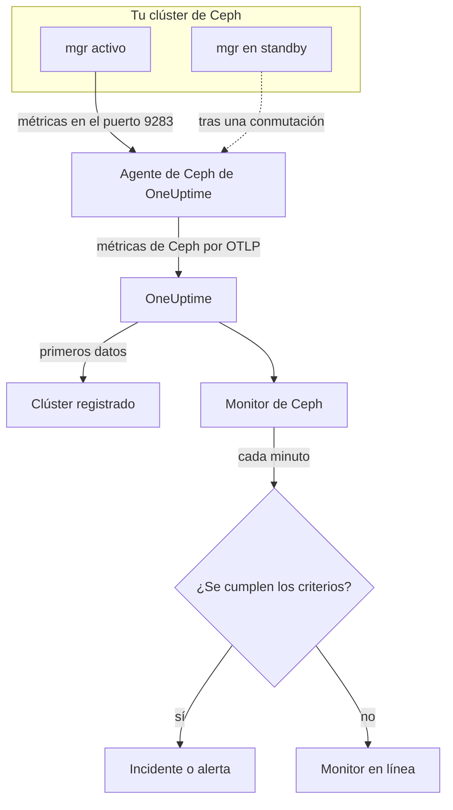

# Monitor de Ceph

Un monitor de Ceph vigila un clúster de Ceph —su salud, sus health checks, el quórum de monitores, los OSD, los pools y los placement groups— y te avisa en cuanto la salud empeora, un OSD cae o la capacidad empieza a escasear. Lee las métricas `ceph_*` que exporta el módulo `prometheus` del mgr de Ceph, recogidas por el agente de Ceph de OneUptime, así que no se sondea nada desde fuera.

:::cards
- [Crear el monitor](#crear-un-monitor-de-ceph): Seis pasos en el panel.
- [Plantillas](#plantillas-de-alerta-predefinidas): 23 alertas listas para salud, OSD, placement groups y capacidad.
- [Health checks](#series-de-health-checks): Alertar sobre cualquier health check de Ceph por su nombre.
- [Métricas](#métricas-recopiladas): Cada serie `ceph_*` sobre la que el monitor puede alertar.
:::

## Cómo funciona

El módulo `prometheus` del mgr de Ceph sirve las métricas del clúster en el puerto 9283. El agente de Ceph de OneUptime consulta cada daemon mgr cada 30 segundos —el activo responde, los standby no devuelven nada hasta que toman el relevo—, conserva las etiquetas propias de Ceph (`ceph_daemon`, `pool_id`) y envía las métricas a OneUptime por OTLP, marcadas con el nombre del clúster, `ceph.cluster.name`. Los primeros datos registran el clúster.

Un monitor de Ceph está ligado a un clúster. Cada minuto ejecuta su consulta sobre las métricas de ese clúster y compara el resultado con sus criterios.



## Antes de empezar

- **Habilita el módulo `prometheus` del mgr** en el clúster:

  ```bash
  ceph mgr module enable prometheus
  ```

- **Instala el agente de Ceph** en una máquina que pueda llegar a cada daemon mgr en el puerto 9283, y enuméralos todos en `CEPH_MGR_ENDPOINTS`. La [guía del agente de Ceph](/docs/telemetry/ceph) explica la instalación.
- **Comprueba que el clúster está registrado.** Aparece en **Productos → Infraestructura → Ceph → Todos los clústeres**, con el nombre de `CEPH_CLUSTER_NAME` del agente, alrededor de un minuto después de la primera consulta.
- **Para alertas sobre health checks**, usa Ceph Quincy o posterior. Las versiones anteriores no exportan `ceph_health_detail`.

## Crear un monitor de Ceph

:::steps
### Empezar un monitor nuevo

Ve a **Monitores** y haz clic en **Crear monitor**.

### Elegir Ceph

En **Tipo de monitor**, haz clic en **Más tipos de monitor** y elige **Ceph** en **Infraestructura**, o escribe `ceph` en el cuadro de búsqueda. Escribe un **Nombre** —se usa en los títulos de incidentes y alertas— y haz clic en **Siguiente**.

### Elegir el clúster

En **Configuración del monitor de Ceph**, elige el clúster en **Clúster de Ceph**. Todos los clústeres que han enviado datos están en la lista.

### Elegir qué vigilar

Elige una de las tres pestañas:

- **Quick Setup**: haz clic en una [plantilla](#plantillas-de-alerta-predefinidas). Define las métricas, los filtros, la agregación, el intervalo de tiempo y los umbrales, y sustituye los criterios de abajo por los suyos. Aún puedes cambiar el **Intervalo de tiempo**.
- **Custom Metric**: elige una métrica en **Métrica de Ceph** y luego ajusta **Agregación** e **Intervalo de tiempo**. **OSD** e **ID del pool** la limitan a un daemon o a un pool.
- **Avanzado**: crea tú mismo consultas y fórmulas en **Seleccionar métricas**, por ejemplo una proporción de capacidad usada a partir de `ceph_cluster_total_used_bytes / ceph_cluster_total_bytes`. Usa **Agrupar por** `ceph_daemon` o `pool_id` para evaluar cada daemon o pool por separado.

### Revisar los criterios

Abre cada criterio en **Criterios del monitor** y revisa su **Métrica**, **Agregación**, **Condición** y **Umbral**. Una plantilla los rellena. Con **Custom Metric** o **Avanzado**, el monitor empieza con los [criterios predeterminados](#criterios-predeterminados), que solo detectan que una métrica cae a cero, así que define tu propio umbral.

### Crear el monitor

Haz clic en **Crear monitor**. OneUptime abre la página del monitor y lo evalúa cada minuto. Los incidentes y alertas que genera también aparecen en las páginas **Incidentes** y **Alertas** del clúster.
:::

> [!TIP]
> Para configurar varias plantillas a la vez, abre el clúster desde **Productos → Infraestructura → Ceph** y ve a **Recomendaciones**. Elige las plantillas que quieras y a quién se avisa, y OneUptime crea un monitor por plantilla.

## Ajustes del monitor

| Campo | Pestaña | Para qué sirve |
| --- | --- | --- |
| **Clúster de Ceph** | Todas | Obligatorio. Limita cada consulta a `resource.ceph.cluster.name`. |
| **OSD** | Custom Metric, Avanzado | Opcional. Coincidencia exacta con la etiqueta `ceph_daemon`, por ejemplo `osd.3`. |
| **ID del pool** | Custom Metric, Avanzado | Opcional. Coincidencia exacta con la etiqueta `pool_id`, por ejemplo `2`. |
| **Métrica de Ceph** | Custom Metric | Una métrica del [catálogo](#métricas-recopiladas). |
| **Agregación** | Custom Metric | Cómo se combinan las muestras: **Promedio**, **Máximo**, **Mínimo**, **Suma** o **Recuento**. Empieza con la agregación habitual de la métrica. |
| **Intervalo de tiempo** | Todas | La ventana móvil que lee la consulta, de **Past 1 Minute** a **Past 365 Days**. Un monitor nuevo empieza en **Past 1 Minute**; las plantillas fijan el suyo. |
| **Seleccionar métricas** | Avanzado | El generador de consultas: **Métrica**, **Agregar por**, **Filtrar por atributos**, **Agrupar por**, además de **Añadir métrica** y **Añadir fórmula** para combinar consultas. |

Las series de datos de los pools solo llevan la etiqueta `pool_id`: el nombre del pool solo existe en `ceph_pool_metadata`. Filtra y agrupa las series de pools por `pool_id`, y busca el nombre en `ceph_pool_metadata` cuando lo necesites.

### Series de health checks

`ceph_health_detail` exporta **una serie por cada health check activo**, con las etiquetas `name` (por ejemplo `OSD_NEARFULL` o `RECENT_CRASH`) y `severity`. Una serie solo existe mientras su check se activa, así que no tener series significa que todo está bien. Para alertar sobre cualquier health check de Ceph, filtra por su `name`, dispara con **Máximo** por encima de `0` y recupera en `0` con **Si no hay datos** en **Treat As Zero**, exactamente como están hechas las plantillas de health checks. `ceph_daemon_health_metrics` funciona igual por daemon, con una etiqueta `type` (por ejemplo `SLOW_OPS`) y `ceph_daemon`.

## Plantillas de alerta predefinidas

**Quick Setup** ofrece 23 plantillas que cubren la salud del clúster, los OSD, los placement groups y la capacidad. Cada una crea un monitor completo: consultas, filtros de etiquetas, una agrupación, un criterio que dispara y otro que recupera. Los umbrales son un punto de partida que puedes editar.

Las plantillas leen los últimos 5 minutos salvo que la tabla diga otra cosa. Un criterio solo dispara si la condición se cumple en cada minuto de su ventana, y un criterio con umbral se recupera un 10 % más allá de su umbral, para que un valor que ronda la línea no oscile. **Gravedad** es la etiqueta que muestra el selector; el incidente y la alerta que crea una plantilla empiezan con la gravedad de incidente y de alerta más alta de tu proyecto.

### Plantillas de salud del clúster

| Plantilla | Gravedad | Vigila | Dispara cuando | Se recupera cuando |
| --- | --- | --- | --- | --- |
| Cluster Health Error | Crítico | `ceph_health_status`, Max, último minuto | 2 o más: `HEALTH_ERR` | Por debajo de 1,8: `HEALTH_WARN` o mejor |
| Cluster Health Warning | Advertencia | `ceph_health_status`, Max | 1 o más: `HEALTH_WARN` o peor | Por debajo de 0,9: `HEALTH_OK` |
| Monitor Quorum Degraded | Crítico | `ceph_mon_quorum_status`, Min por `ceph_daemon`, último minuto | Un monitor baja de 1 y sale del quórum. Un incidente por monitor | Vuelve a 1 |
| Slow Operations | Advertencia | `ceph_healthcheck_slow_ops`, Max | Por encima de 0: el check `SLOW_OPS` del clúster está activo | En 0 |
| Daemon Slow Operations | Advertencia | `ceph_daemon_health_metrics` para `type = SLOW_OPS`, Max por `ceph_daemon` | Por encima de 0. Un incidente por OSD o monitor | La serie desaparece |
| Daemon Crash | Crítico | `ceph_health_detail` para `name = RECENT_CRASH`, Max | El check está activo: hay caídas de daemons sin archivar. El mgr no tiene ninguna métrica `ceph_crash_*`, así que esta es la única señal de caídas | Las caídas se archivan |
| Monitor Clock Skew | Advertencia | `ceph_health_detail` para `name = MON_CLOCK_SKEW`, Max | El check está activo: los relojes de los monitores se desvían más de lo permitido (0,05 s por defecto) | El check desaparece |
| Monitor Disk Critically Low | Crítico | `ceph_health_detail` para `name = MON_DISK_CRIT`, Max | El check está activo: el disco de base de datos de un monitor tiene menos de un 5 % libre (por defecto) | El check desaparece |
| Monitor Disk Space Low | Advertencia | `ceph_health_detail` para `name = MON_DISK_LOW`, Max | El check está activo: menos de un 30 % libre (por defecto) | El check desaparece |

### Plantillas de OSD

| Plantilla | Gravedad | Vigila | Dispara cuando | Se recupera cuando |
| --- | --- | --- | --- | --- |
| OSD Down | Crítico | `ceph_osd_up`, Min por `ceph_daemon` | Un OSD baja de 1. Un incidente por OSD | Vuelve a 1 |
| OSD Out | Advertencia | `ceph_osd_in`, Min por `ceph_daemon` | Un OSD baja de 1: queda fuera de la distribución de datos | Vuelve a 1 |
| OSD High Latency | Advertencia | `ceph_osd_apply_latency_ms`, Avg por `ceph_daemon` | Por encima de 100 ms. Un incidente por OSD | En 90 ms o menos |
| OSD Slow Heartbeats | Advertencia | `ceph_health_detail` para `name = OSD_SLOW_PING_TIME_FRONT` y `name = OSD_SLOW_PING_TIME_BACK`, Max | Uno de los checks está activo: los heartbeats en la red pública o en la del clúster son lentos. El mgr no exporta ningún indicador de tiempo de ping | Ambos checks desaparecen |

### Plantillas de placement groups

| Plantilla | Gravedad | Vigila | Dispara cuando | Se recupera cuando |
| --- | --- | --- | --- | --- |
| Inactive Placement Groups | Crítico | `ceph_pg_total` − `ceph_pg_active`, Max por `pool_id` | Por encima de 0: hay PG que no pueden atender E/S, así que las solicitudes de los clientes a ellas se quedan colgadas. Un incidente por pool | En 0 |
| Degraded Placement Groups | Advertencia | `ceph_pg_degraded`, Max por `pool_id` | Por encima de 0: hay objetos con menos réplicas de las configuradas | En 0 |
| Undersized Placement Groups | Advertencia | `ceph_pg_undersized`, Max por `pool_id` | Por encima de 0: hay PG asignadas a menos OSD que su número de réplicas | En 0 |
| Damaged Placement Groups | Crítico | `ceph_health_detail` para `name = PG_DAMAGED` y `name = OSD_SCRUB_ERRORS`, Max | Uno de los checks está activo: el scrubbing encontró daños o errores de lectura | Ambos checks desaparecen |

### Plantillas de capacidad

| Plantilla | Gravedad | Vigila | Dispara cuando | Se recupera cuando |
| --- | --- | --- | --- | --- |
| Cluster Near Full | Advertencia | `ceph_cluster_total_used_bytes` ÷ `ceph_cluster_total_bytes` × 100 | Por encima del 85 %, la proporción nearfull predeterminada de Ceph | En 76,5 % o menos |
| Cluster Full | Crítico | La misma proporción | Por encima del 95 %, la proporción full predeterminada de Ceph, en la que se detienen las escrituras en todo el clúster | En 85,5 % o menos |
| Pool Near Full | Advertencia | `ceph_pool_stored` ÷ (`ceph_pool_stored` + `ceph_pool_max_avail`) × 100, por `pool_id` | Por encima del 85 % de lo que el pool puede contener. Un incidente por pool | En 76,5 % o menos |
| OSD Nearfull | Advertencia | `ceph_health_detail` para `name = OSD_NEARFULL`, Max | El check está activo: un OSD superó el umbral nearfull (85 % por defecto). Un OSD suelto se llena mucho antes que la media del clúster | El check desaparece |
| OSD Backfillfull | Advertencia | `ceph_health_detail` para `name = OSD_BACKFILLFULL`, Max | El check está activo: se rechaza el backfill hacia el OSD (90 % por defecto) y la recuperación se atasca | El check desaparece |
| OSD Full | Crítico | `ceph_health_detail` para `name = OSD_FULL`, Max, último minuto | El check está activo: un OSD alcanzó el umbral full (95 % por defecto) y se rechazan las escrituras | El check desaparece |

- **Las plantillas de caída y de quórum usan el mínimo**, para que un solo OSD caído o un solo monitor fuera del quórum las dispare en lugar de quedar oculto por la mayoría sana.
- **Las plantillas de recuentos y de health checks usan el máximo**, para que baste con una sola consulta mala.
- **Las series de PG y de pools son por pool**: no hay un indicador de todo el clúster, así que esas plantillas agrupan por `pool_id` y abren un incidente por pool.
- **Las proporciones de capacidad** toman la **Suma** de ambos lados. Los dos salen de la misma consulta al mgr, así que el resultado es un porcentaje real. **Inactive Placement Groups** usa en cambio **Máximo** por pool, porque una suma acumularía consultas en una resta.
- **Las plantillas de health checks** se recuperan cuando el check desaparece: sus criterios de recuperación cuentan una serie ausente como 0.

Algunas alertas no tienen plantilla. El desequilibrio de PG necesita estadísticas entre series que los criterios no pueden calcular. La previsión de capacidad necesita un ajuste de crecimiento, que en su lugar dibuja el panel del clúster. La predicción de fallos de disco y el scrubbing atrasado no tienen métrica en el mgr, y NVMe-oF, la replicación de RBD y cephadm necesitan otros exportadores.

## Métricas recopiladas

El agente consulta cada daemon mgr cada 30 segundos y conserva las etiquetas propias de Ceph, así que las series por daemon llevan `ceph_daemon` (`osd.3`, `mon.a`) y las series por pool llevan `pool_id`.

### Métricas de salud del clúster

| Métrica | Unidad | Descripción |
| --- | --- | --- |
| `ceph_health_status` | — | Salud general: 0 = `HEALTH_OK`, 1 = `HEALTH_WARN`, 2 = `HEALTH_ERR`. |
| `ceph_health_detail` | recuento | Una serie por cada health check **activo**, con las etiquetas `name` y `severity`. Solo desde Quincy. |
| `ceph_healthcheck_slow_ops` | recuento | Operaciones lentas de OSD y monitores que informa el check `SLOW_OPS`. |
| `ceph_daemon_health_metrics` | recuento | Métricas de salud por daemon, identificadas por `type` (por ejemplo `SLOW_OPS`) y `ceph_daemon`. |
| `ceph_mon_quorum_status` | recuento | 1 cuando el monitor está en el quórum, por `ceph_daemon` (por ejemplo `mon.a`). |
| `ceph_mon_metadata` | recuento | Metadatos del monitor, siempre 1. Súmalos para contar los monitores. |
| `ceph_cluster_total_bytes` | bytes | Capacidad bruta total. |
| `ceph_cluster_total_used_bytes` | bytes | Capacidad bruta en uso. |

### Métricas de OSD

| Métrica | Unidad | Descripción |
| --- | --- | --- |
| `ceph_osd_up` | recuento | 1 cuando el OSD está activo, por `ceph_daemon` (por ejemplo `osd.3`). |
| `ceph_osd_in` | recuento | 1 cuando el OSD forma parte de la distribución de datos. |
| `ceph_osd_apply_latency_ms` | ms | Tiempo para aplicar una operación al almacenamiento subyacente. |
| `ceph_osd_commit_latency_ms` | ms | Tiempo para confirmar una operación en el journal o el WAL. |
| `ceph_osd_stat_bytes` | bytes | Capacidad bruta del dispositivo del OSD. |
| `ceph_osd_stat_bytes_used` | bytes | Bytes brutos usados en el OSD. Compáralo con el total para detectar OSD desequilibrados o casi llenos. |
| `ceph_osd_numpg` | recuento | Placement groups en el OSD. |
| `ceph_osd_metadata` | recuento | Metadatos del OSD (nombre de host, clase de dispositivo, versión), siempre 1. Súmalos para contar los OSD. |

### Métricas de pools

| Métrica | Unidad | Descripción |
| --- | --- | --- |
| `ceph_pool_stored` | bytes | Datos de usuario almacenados en el pool. |
| `ceph_pool_max_avail` | bytes | Bytes que aún se pueden escribir en el pool, según su perfil de replicación o de erasure coding. |
| `ceph_pool_objects` | recuento | Objetos del pool. |
| `ceph_pool_rd` | ops | Operaciones de lectura en el pool. Un contador acumulado de toda su vida. |
| `ceph_pool_wr` | ops | Operaciones de escritura en el pool. Un contador acumulado de toda su vida. |
| `ceph_pool_rd_bytes` | bytes | Bytes leídos del pool. Un contador acumulado de toda su vida. |
| `ceph_pool_wr_bytes` | bytes | Bytes escritos en el pool. Un contador acumulado de toda su vida. |
| `ceph_pool_metadata` | recuento | Metadatos del pool, siempre 1: la única serie que asocia `pool_id` con un nombre. |

### Métricas de placement groups

Cada serie `ceph_pg_*` es por pool, con la etiqueta `pool_id`; suma entre pools para obtener un recuento de todo el clúster.

| Métrica | Unidad | Descripción |
| --- | --- | --- |
| `ceph_pg_total` | recuento | Placement groups del pool. |
| `ceph_pg_active` | recuento | PG en estado `active`, capaces de atender E/S. |
| `ceph_pg_clean` | recuento | PG en estado `clean`, completamente replicadas. |
| `ceph_pg_degraded` | recuento | PG en estado `degraded`. |
| `ceph_pg_undersized` | recuento | PG en estado `undersized`. |
| `ceph_num_objects_degraded` | recuento | Objetos con menos réplicas de las configuradas. |
| `ceph_num_objects_misplaced` | recuento | Objetos que no están donde CRUSH los quiere. Los datos están a salvo; solo la ubicación es incorrecta. |

## Criterios de supervisión

Un criterio compara una de las consultas o fórmulas del monitor con un umbral. Los criterios de un monitor de Ceph no tienen **Tipo de filtro**: cada regla comprueba el valor de la métrica, con estos campos.

| Campo | Para qué sirve |
| --- | --- |
| **Métrica** | La consulta o fórmula que se comprueba, por su nombre de variable. |
| **Agregación** | Cómo los valores de la ventana se convierten en una sola respuesta: **Promedio**, **Suma**, **Maximum Value**, **Minimum Value**, **All Values** (todos los valores deben cumplirse) o **Any Value** (basta con uno). |
| **Condición** | **Greater Than**, **Less Than**, **Greater Than Or Equal To**, **Less Than Or Equal To** o **Equal To**, o una condición de anomalía: **Anomalously High**, **Anomalously Low** o **Anomalous**. |
| **Umbral** | El valor con el que se compara. Junto a él aparece una lista de unidades cuando la métrica tiene unidad. No se muestra con las condiciones de anomalía. |
| **Sensibilidad** | Solo condiciones de anomalía. **Low** (4σ), **Medium** (3σ, la predeterminada) o **Alta** (2σ). |
| **Ventana de referencia** | Solo condiciones de anomalía. 14 días (la predeterminada), 28, 60 o 90 días de historial. |
| **Si no hay datos** | En **Más campos**. Qué pasa cuando la ventana no tiene muestras: **Ignore** (la predeterminada), **Treat As Zero** o **Disparador**. |

Las condiciones de anomalía comparan cada valor con la misma hora de la semana en la referencia. Permanecen en estado «Learning», sin generar nada, hasta que la ventana de referencia tiene suficiente historial.

Cada criterio indica además qué hacer cuando se cumple: cambiar el estado del monitor, crear una alerta o declarar un incidente. Los criterios se comprueban de arriba abajo, y decide el primero que se cumple.

### Criterios predeterminados

Un monitor que no creas a partir de una plantilla empieza con dos criterios:

| Orden | Criterio | Se cumple cuando | Entonces |
| --- | --- | --- | --- |
| 1 | Check if _nombre del monitor_ is offline | Algún valor de la primera consulta es `0` | Marca el monitor como **Sin conexión** y declara el incidente «_nombre del monitor_ is offline», que se resuelve solo cuando el monitor se recupera. |
| 2 | Check if _nombre del monitor_ is online | Algún valor está por encima de `0` | Marca el monitor como **Operativo**. |

Estos valores predeterminados sirven para pocas métricas de Ceph: `ceph_health_status` es 0 cuando el clúster está sano. Elige una plantilla o define tus propios criterios.

> [!IMPORTANT]
> El silencio no cumple ninguno de los dos criterios: un clúster que deja de enviar datos deja el monitor como estaba. Para enterarte cuando dejan de llegar datos, pon **Si no hay datos** en **Disparador** en un criterio.

## Solución de problemas

:::details El clúster no aparece en la lista Clúster de Ceph
Los clústeres se registran solos a partir de los datos del agente. Comprueba que el agente está en marcha y enviando datos (consulta la [guía del agente de Ceph](/docs/telemetry/ceph)) y que `CEPH_CLUSTER_NAME` está definido.
:::

:::details Las métricas se detuvieron tras una conmutación del mgr
El agente tiene que consultar **todos** los daemons mgr, no solo el activo: los standby no devuelven nada hasta que toman el relevo. Enumera cada mgr en `CEPH_MGR_ENDPOINTS`.
:::

:::details ceph_health_status es 1 pero no se dispara nada
Comprueba que el criterio usa **Greater Than Or Equal To** `1` y no **Greater Than**, y que el **Intervalo de tiempo** del monitor cubre al menos una consulta de 30 segundos.
:::

:::details Las plantillas de health checks nunca se disparan
Las plantillas que vigilan `ceph_health_detail` —Daemon Crash, Monitor Clock Skew, OSD Nearfull, OSD Backfillfull, OSD Full, las dos plantillas de disco de los monitores, Damaged Placement Groups y OSD Slow Heartbeats— necesitan el módulo `prometheus` del mgr de Quincy o posterior. Mientras un check está activo, confirma que la serie existe:

```bash
curl http://ACTIVE_MGR:9283/metrics | grep ceph_health_detail
```

Las series de health checks, incluida `ceph_daemon_health_metrics`, solo existen mientras un check se activa, así que es normal no encontrar ninguna cuando el clúster está sano.
:::

:::details Contadores como ceph_pool_wr_bytes solo crecen
Las series de E/S de los pools son contadores acumulados, y los criterios comparan valores en bruto: no hay operador de tasa, y **Convertir a tasa por segundo** en el generador de consultas solo cambia el gráfico. Represéntalas como tasa, o alerta sobre su crecimiento con una fórmula, como una consulta con **Máximo** menos una consulta con **Mínimo** del mismo contador.
:::

## Próximos pasos

:::cards
- [Agente de Ceph](/docs/telemetry/ceph): Instalar y actualizar el agente del que lee este monitor.
- [Monitor de Proxmox](/docs/monitor/proxmox-monitor): Vigilar el clúster de Proxmox VE que usa el almacenamiento.
- [Monitor de cabinas de almacenamiento](/docs/monitor/storage-array-monitor): El mismo tipo de monitor para cabinas de Pure Storage.
- [Incidentes](/docs/incidents/index): Qué ocurre después de que un criterio declara un incidente.
:::
