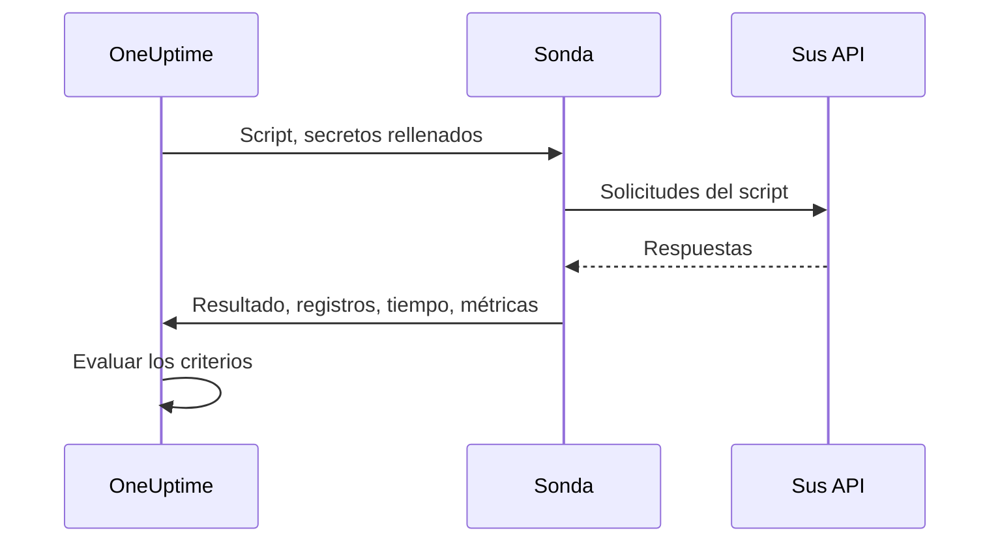

# Monitor de código personalizado

Un monitor Custom Code ejecuta, de forma programada y desde una sonda, un script de JavaScript que usted escribe. Úselo para comprobaciones que los demás tipos de monitor no pueden expresar: un inicio de sesión seguido de una llamada autenticada a una API, una transacción de varios pasos o un valor que calcula a partir de varias respuestas. Si el script lanza un error, la comprobación falla; lo que devuelve queda a disposición de sus criterios y de sus plantillas de incidentes.

:::cards
- [Crear el monitor](#crear-un-monitor-custom-code): Escriba un script y elija las sondas que lo ejecutan.
- [Escribir el script](#escribir-el-script): Una comprobación de API de varios pasos lista para usar como punto de partida.
- [Usar secretos](#usar-secretos-de-monitor): Mantenga contraseñas y tokens fuera del script.
- [Capturar métricas personalizadas](#métricas-personalizadas): Grafique cualquier número que calcule su script.
:::

## Cómo funciona

En cada comprobación, una sonda ejecuta su script en un sandbox de JavaScript aislado, con sus secretos de monitor ya rellenados. El script llama a lo que necesite y luego devuelve un resultado o lanza un error. La sonda informa del resultado, los mensajes de registro del script, cuánto tardó y las métricas que capturó, y OneUptime evalúa sus criterios con todo ello.



El sandbox no es Node.js: no hay `require`, ni `process`, ni `fetch`, ni sistema de archivos, solo los [módulos que se enumeran más abajo](#módulos-disponibles-en-el-script).

## Antes de empezar

- Una **sonda** que alcance todos los endpoints a los que llama el script. Use una [sonda personalizada](/docs/probe/custom-probe) para endpoints dentro de su red.
- Para llamar a una dirección privada (como `10.0.0.5`), la sonda debe permitirlo: defina `PROBE_ALLOW_PRIVATE_NETWORK_MONITORS=true` en esa sonda. Las direcciones de loopback, link-local y de metadatos de la nube se rechazan siempre. Consulte [Acceso a red privada](/docs/self-hosted/private-network-access).
- Cualquier contraseña, clave de API o token que necesite el script, guardado como [secreto de monitor](/docs/monitor/monitor-secrets).

## Crear un monitor Custom Code

:::steps
### Empezar un monitor nuevo

Vaya a **Monitores** y haga clic en **Crear monitor**. En **Tipo de monitor**, haga clic en **Más tipos de monitor** y elija **Custom JavaScript Code** en **Synthetic Monitoring**, o escriba `script` en el cuadro de búsqueda. Introduzca un **Nombre** y haga clic en **Siguiente**.

### Añadir el script

Escriba su script en el editor **Código JavaScript**. Parta del [ejemplo de abajo](#escribir-el-script).

### Probarlo

Haga clic en **Probar monitor** para ejecutar el script una vez desde una sonda y revise su resultado.

### Revisar los criterios

El monitor empieza con dos criterios: queda sin conexión, y declara un incidente, cuando el script falla, y en línea cuando no falla. Cámbielos o añada los suyos —consulte [Criterios](#criterios)— y haga clic en **Siguiente**.

### Elegir sondas y crear

Seleccione las **Sondas** que alcanzan sus endpoints y un **Intervalo de monitoreo** —a los monitores Custom Code se les ofrecen intervalos de 5 minutos o más— y haga clic en **Crear monitor**.
:::

## Escribir el script

El script es el cuerpo de una función `async`: puede usar `await` en el nivel superior, devolver un resultado con `return` y hacer fallar la comprobación con `throw`. Este ejemplo inicia sesión, llama a un endpoint con el token obtenido y falla si la respuesta no es la esperada:

```javascript title="Custom code monitor script"
// 1. Log in. axios rejects a 4xx or 5xx response, which fails the check.
const login = await axios.post("https://api.example.com/v1/login", {
  username: "monitoring@example.com",
  password: "{{monitorSecrets.ApiPassword}}",
});

// 2. Call an endpoint that needs the token.
const orders = await axios.get("https://api.example.com/v1/orders?limit=10", {
  headers: { Authorization: `Bearer ${login.data.token}` },
  timeout: 10000,
});

// 3. Fail the check when the data is wrong, not only when the request fails.
if (!Array.isArray(orders.data.items)) {
  throw new Error("The orders endpoint returned no items");
}

console.log(`Fetched ${orders.data.items.length} orders`);

// 4. Return what the criteria and incident templates should see.
return {
  data: orders.data.items.length,
};
```

| Para | Haga esto | Lo que registra OneUptime |
| --- | --- | --- |
| Informar de un resultado | `return { data: ... }` con cualquier valor JSON | El **Resultado**. Solo se conserva la propiedad `data`: `return 5` no registra ningún resultado. |
| Hacer fallar la comprobación | `throw new Error("...")` | El **Error de script**, que los criterios predeterminados convierten en un incidente. |
| Dejar un rastro | `console.log(...)` | Los **Mensajes de registro**, hasta 1.000 por ejecución. |

Para ver una ejecución, abra la **Vista general** del monitor: la tarjeta **Resumen del monitor** muestra la sonda, el tiempo de ejecución y el error, y **Mostrar más detalles** muestra el resultado, el error de script y los mensajes de registro. **Registros de monitoreo** tiene el mismo resumen para las comprobaciones anteriores.

> [!NOTE]
> En este sandbox, `axios` no sigue las redirecciones, y sus solicitudes no pasan por un proxy configurado en la sonda. Solicite la URL final.

## Usar secretos de monitor

Haga referencia a un secreto con `{{monitorSecrets.NAME}}` en cualquier parte del script. OneUptime sustituye la referencia por el valor del secreto, como texto sin formato, antes de que el script llegue a la sonda. Así que ponga el secreto entre comillas para usarlo como cadena, y déjelo sin comillas para usarlo como número o booleano:

```javascript
// Used as a string: wrap it in quotes.
const apiKey = "{{monitorSecrets.ApiKey}}";

// Used as a number or a boolean: leave it bare.
const retryLimit = {{monitorSecrets.RetryLimit}};
const verbose = {{monitorSecrets.Verbose}};

// Check the secret was filled in without logging the secret itself.
console.log(apiKey.length > 0);
```

Un valor de secreto que contiene un carácter de comillas rompe la cadena que lo rodea. Una referencia que el monitor no puede usar queda en el script tal como está escrita. Para crear un secreto y elegir qué monitores pueden usarlo, consulte [Secretos del monitor](/docs/monitor/monitor-secrets).

## Métricas personalizadas

Puede capturar métricas personalizadas desde su script con la función `oneuptime.captureMetric()`. Estas métricas se guardan en OneUptime y se pueden graficar en paneles con el explorador de métricas.

```javascript
oneuptime.captureMetric(name, value, attributes);
```

| Parámetro | Tipo | Descripción |
| --- | --- | --- |
| `name` | string, obligatorio | El nombre de la métrica (p. ej., `"api.response.time"`). Se guarda automáticamente con el prefijo `custom.monitor.`. |
| `value` | number, obligatorio | El valor numérico de la métrica. Un valor que no es un número se ignora. |
| `attributes` | object, opcional | Pares clave-valor para aportar contexto. Se registran los valores de cadena, número y booleano (números y booleanos se guardan como texto, porque los atributos de las métricas son dimensiones y no mediciones). Los valores de cualquier otro tipo se ignoran. |

### Ejemplo

```javascript
const response = await axios.get("https://api.example.com/health");

// Capture a simple metric
oneuptime.captureMetric("api.response.time", response.data.latency);

// Capture a metric with attributes
oneuptime.captureMetric("api.queue.depth", response.data.queueDepth, {
  region: "us-east-1",
  environment: "production",
});

return {
  data: response.data,
};
```

Una vez capturadas, estas métricas aparecen en el explorador de métricas con nombres como `custom.monitor.api.response.time`, y en la página **Métricas** del monitor, bajo **Métricas personalizadas**. OneUptime añade el monitor y la sonda a cada punto de datos, para que pueda graficarlas, alertar sobre ellas y filtrar por monitor, por sonda o por cualquier atributo personalizado que haya indicado.

### Límites

| Límite | Valor | Al superar el límite |
| --- | --- | --- |
| Métricas por ejecución del script | 100 | Las llamadas adicionales se ignoran. |
| Longitud del nombre de la métrica | 200 caracteres | El nombre se recorta. |
| Atributos por métrica | 50 | Los atributos adicionales se descartan. |
| Longitud de la clave de un atributo | 200 caracteres | La clave se recorta. |
| Longitud del valor de un atributo | 1000 caracteres | El valor se recorta. |

### Claves de atributo reservadas

Algunos nombres de atributo son propios de OneUptime, y un script no puede escribirlos. Si su script define uno, el atributo se descarta —la métrica en sí se registra igualmente— y se escribe una advertencia con el nombre de la clave en los registros del servidor de OneUptime. Son:

- La identidad del monitor: `monitorId`, `projectId`, `monitorName`, `probeName`, `probeId`, `isCustomMetric`.
- Cualquier cosa en los espacios de nombres `oneuptime.` o `resource.`: contienen los identificadores que OneUptime añade en la ingesta.
- Los atributos de identidad de recursos: `service.name`, `host.name`, `k8s.cluster.name`, `iot.fleet.name`, `proxmox.cluster.name`, `vmware.vcenter.name`, `ceph.cluster.name`, `storage.array.name` y `docker.swarm.cluster.name`.

Estos nombres no son solo etiquetas: OneUptime los lee como la afirmación de a qué recurso pertenece un punto de datos. Una métrica etiquetada con `service.name: payments-api` aparecería en la pestaña Métricas de ese servicio, y si más adelante creara un monitor de métricas agrupado por `service.name`, sus alertas quedarían vinculadas a ese servicio, avisarían a los responsables de ese servicio y se silenciarían durante una ventana de mantenimiento del servicio. Para asociar un monitor a un servicio o a un host, use en su lugar las etiquetas propias del monitor.

## Criterios

Los criterios de un monitor Custom Code pueden comprobar:

| Tipo de filtro | Qué comprueba | Condiciones del filtro |
| --- | --- | --- |
| **Error** | El error que lanzó el script, si lo hubo. | Contiene, Not Contains, Equal To, Not Equal To, Is Empty, Is Not Empty |
| **Result Value** | Los `data` que devolvió el script. Se comparan como número cuando lo son. | Las mismas, más Greater Than, Less Than, Greater Than Or Equal To, Less Than Or Equal To, Verdadero y Falso |
| **Tiempo de ejecución (en ms)** | Cuánto tardó el script. | Comparaciones numéricas |

Los criterios predeterminados marcan el monitor en línea cuando **Error** está vacío, y sin conexión —con un incidente que se resuelve solo cuando el script vuelve a funcionar— cuando no lo está. En las plantillas de incidentes y alertas, la ejecución está disponible como `{{result}}`, `{{scriptError}}`, `{{logMessages}}` y `{{executionTimeInMs}}`: consulte [Plantillas de incidentes y alertas](/docs/monitor/incident-alert-templating).

### Alertar sobre los datos devueltos

Lo que el script devuelve como `data` es el **Result Value** del monitor, y un criterio puede compararlo; por ejemplo, _Result Value es Equal To `UP`_.

Cuando `data` es un objeto o un array, rellene **Ruta del campo (opcional)** en el filtro Result Value para comparar uno de sus campos en lugar del valor completo. Use puntos para los campos anidados y `[n]` para los elementos de un array:

```javascript
const response = await axios.get("https://api.example.com/health");

return {
  data: {
    status: response.data.status, // "UP"
    cpu_busy_percent: response.data.cpu, // 42
    healthy: response.data.healthy, // true
    checks: response.data.checks, // [{ name: "db", latency: 12 }]
  },
};
```

| Ruta del campo | Compara | Condición de ejemplo |
| --- | --- | --- |
| `status` | `"UP"` | Not Equal To `UP` |
| `cpu_busy_percent` | `42` | Greater Than `90` |
| `healthy` | `true` | Falso |
| `checks[0].latency` | `12` | Greater Than `500` |

Añada un filtro por cada campo que quiera comprobar; cada uno puede tener su propia condición y su propio valor.

- Deje la ruta del campo vacía para comparar el valor completo, como en un script que devuelve un único número o cadena.
- Greater Than, Less Than y las demás condiciones numéricas solo coinciden con un número, así que devuelva un campo como `42`, no como `"42"`. Verdadero y Falso solo coinciden con un booleano.
- Un campo que no está en los datos devueltos (una clave que falta, o un índice de array más allá del final) se compara como vacío: **Is Empty** coincide con él, y ninguna otra condición.
- Un campo cuyo nombre contiene un punto no se puede direccionar con una ruta.
- En Terraform, el `custom_code_monitor_options` del filtro define la ruta del campo: consulte [Pasos del monitor](/docs/terraform/monitor-steps#comparing-one-field-of-a-scripts-result).

## Módulos disponibles en el script

| Nombre | Qué es |
| --- | --- |
| `axios` | Un cliente HTTP basado en promesas: llame a `axios(...)`, o a `axios.get`, `post`, `put`, `patch`, `delete`, `head`, `options`, `request` y `create`. El tamaño de solicitudes y respuestas está limitado (10 MB cada una), las redirecciones no se siguen y no se usa el proxy de la sonda. |
| `crypto` | `createHash` y `createHmac` (llame a `update()` una vez y después a `digest()`), `randomBytes`, `randomInt` y `randomUUID`. No es el módulo `crypto` de Node.js: no hay cifrados ni firmas. |
| `http`, `https` | Solo su clase `Agent`, para pasarla a `axios`; por ejemplo, `httpsAgent: new https.Agent({ rejectUnauthorized: false })`. No hay `request` ni `get`. |
| `console.log` | Registra datos para depurar. Solo existe `console.log`; `console.error` y los demás no existen. |
| `oneuptime.captureMetric` | Captura una métrica personalizada. Consulte [Métricas personalizadas](#métricas-personalizadas). |
| `setTimeout`, `clearTimeout`, `sleep(ms)` | Esperar dentro del script. Una espera nunca supera el tiempo límite del script. |

## Aspectos a tener en cuenta

- **Tiempo límite.** Un script que se ejecuta durante más de 60 segundos se detiene y la comprobación falla con "Script execution timed out". En una sonda autoalojada, `PROBE_CUSTOM_CODE_MONITOR_SCRIPT_TIMEOUT_IN_MS` cambia el límite.
- **Memoria.** Cada ejecución tiene su propio sandbox con un límite de memoria de 128 MB.
- **Redirecciones.** `axios` no las sigue, así que una URL que redirige hace fallar la solicitud. Use la URL final.

## Solución de problemas

:::details La comprobación falla con "Script execution timed out"
El script superó el tiempo límite. Dé a cada solicitud su propio `timeout` (en milisegundos) para que un endpoint lento falle rápido, con un error que lo nombre.
:::

:::details Una solicitud falla con un estado 301 o 302
Aquí, `axios` no sigue las redirecciones. Cambie la URL por la dirección a la que redirige.
:::

:::details Se rechaza una solicitud a una dirección interna
La sonda no permite direcciones de red privada. Defina `PROBE_ALLOW_PRIVATE_NETWORK_MONITORS=true` en una sonda dentro de su red y ejecute el monitor desde ella; consulte [Acceso a red privada](/docs/self-hosted/private-network-access).
:::

:::details Un secreto no se rellena
El monitor no puede usar el secreto, o el nombre de la referencia no coincide exactamente con el nombre del secreto. Consulte [Secretos del monitor](/docs/monitor/monitor-secrets).
:::

## Próximos pasos

:::cards
- [Monitor sintético](/docs/monitor/synthetic-monitor): Maneje un navegador real en lugar de llamar a API.
- [Secretos del monitor](/docs/monitor/monitor-secrets): Guarde las credenciales que usa su script.
- [Plantillas de incidentes y alertas](/docs/monitor/incident-alert-templating): Lleve el resultado y los registros del script a los incidentes.
:::
