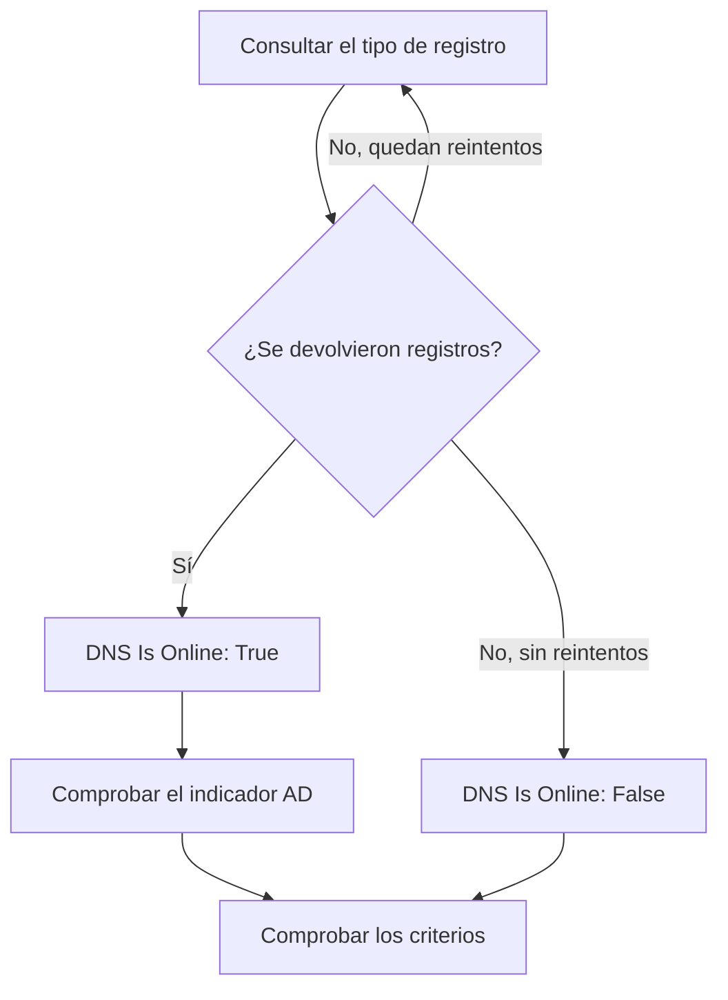

# Monitor de DNS

Un monitor de DNS consulta un registro DNS de forma periódica y comprueba la respuesta: que el nombre se resuelve, con qué rapidez y qué dicen los registros. Úselo para detectar una caída de DNS, un registro que cambió o desapareció, o un resolutor lento, antes de que lo noten sus usuarios.

:::cards
- [Crear el monitor](#crear-un-monitor-de-dns): Seis pasos en el panel.
- [Opciones de configuración](#opciones-de-configuración): El nombre, el tipo de registro y el servidor DNS.
- [Criterios de monitoreo](#criterios-de-monitoreo): Resolución, registros, tiempo de respuesta y DNSSEC.
- [Solución de problemas](#solución-de-problemas): Cuando el monitor y `dig` no coinciden.
:::

## Cómo funciona

En cada comprobación, una sonda pide a un servidor DNS un tipo de registro de un nombre, como los registros `A` de `example.com`. El nombre está en línea cuando el servidor responde con al menos un registro de ese tipo. Una consulta que falla, agota el tiempo de espera o no devuelve ningún registro se vuelve a intentar un segundo después, hasta el número de reintentos que fije. Después, la sonda pregunta a un resolutor validador si la respuesta lleva el indicador authenticated-data (AD) de DNSSEC, y OneUptime pasa el resultado por los criterios del monitor.



Una sonda que ha perdido su propia conexión de red no informa de ningún resultado, así que no puede marcar su DNS como sin conexión.

## Antes de empezar

- **Un rol que pueda crear monitores**: Project Owner, Project Admin, Project Member, Monitor Admin o Monitor Member, o un rol personalizado con el permiso Create Monitor.
- **Una sonda que pueda llegar al servidor DNS.** Las sondas predeterminadas de su proyecto se eligen para cada monitor nuevo. Para consultar un servidor DNS de una red privada, como un resolutor interno, use una [sonda personalizada](/docs/probe/custom-probe) dentro de esa red.

## Crear un monitor de DNS

:::steps
### Empezar un monitor nuevo

Vaya a **Monitores** y haga clic en **Crear monitor**. En **Tipo de monitor**, haga clic en **Más tipos de monitor** y elija **DNS** en **DNS Monitoring**.

### Ponerle nombre

Introduzca un **Nombre**, como `example.com A records`, y haga clic en **Siguiente**.

### Introducir la consulta

Introduzca el **Nombre de dominio** que se va a consultar, como `example.com`, y elija su **Tipo de registro**. Para consultar un servidor concreto, introdúzcalo en **Servidor DNS (opcional)**; déjelo vacío para usar el resolutor propio de la sonda.

### Probarlo

Haga clic en **Probar monitor**, elija una sonda en **Seleccionar sonda** y haga clic en **Ejecutar prueba**. **Resultado de la prueba del monitor** muestra los registros que recibió la sonda.

### Revisar los criterios

**Criterios del monitor** empieza con los [criterios predeterminados](#criterios-predeterminados): sin conexión cuando el nombre no se resuelve, en línea cuando se resuelve. Para comprobar qué dicen los registros, añada un filtro **DNS Record Value** y haga clic en **Siguiente**.

### Elegir sondas y crear

Mantenga o cambie las **Sondas** y el **Intervalo de monitoreo** (empieza en **Cada 5 minutos**) y haga clic en **Crear monitor**. Se abre la página del monitor.
:::

## Opciones de configuración

| Campo | Predeterminado | Qué introducir |
| --- | --- | --- |
| **Nombre de dominio** | Ninguno | El nombre que se consulta, como `example.com` o `_sip._tcp.example.com`. Para un registro `PTR`, el nombre inverso, como `34.216.184.93.in-addr.arpa`. |
| **Tipo de registro** | `A` | El tipo de registro que se consulta. Consulte [Tipos de registro](#tipos-de-registro). |
| **Servidor DNS (opcional)** | El resolutor de la sonda | Un servidor DNS al que preguntar en su lugar, como `8.8.8.8` o `ns1.example.com`. Todos los tipos de registro, `CAA` incluido, se le preguntan a él. |
| **Puerto** (en **Más campos**) | `53` | El puerto del servidor de **Servidor DNS (opcional)**. La comprobación de DNSSEC pregunta en el mismo puerto. |
| **Tiempo de espera (ms)** (en **Más campos**) | `5000` | Cuánto esperar una respuesta, en milisegundos. |
| **Reintentos** (en **Más campos**) | `3` | Reintentos después de que falle el primer intento. `0` significa un solo intento. |

### Tipos de registro

Un criterio **DNS Record Value** compara su texto con cada registro tal como lo escribe la sonda, así que respete este formato:

| Tipo de registro | Qué contiene | Formato del valor, para los criterios |
| --- | --- | --- |
| `A` | Direcciones IPv4 | `93.184.216.34` |
| `AAAA` | Direcciones IPv6 | `2606:2800:220:1:248:1893:25c8:1946` |
| `CNAME` | El nombre del que este es un alias | `example.net` |
| `MX` | Servidores de correo | `10 mail.example.com` (prioridad y luego el servidor) |
| `NS` | Servidores de nombres | `ns1.example.com` |
| `TXT` | Texto, como registros SPF y de verificación | `v=spf1 include:_spf.example.com ~all` |
| `SOA` | El inicio de autoridad de la zona | `ns1.example.com hostmaster.example.com 2024010101 7200 3600 1209600 3600` (servidor, contacto, número de serie, refresh, retry, expire, TTL mínimo) |
| `PTR` | El nombre al que apunta una dirección (DNS inverso) | `server1.example.com` |
| `SRV` | Servicios | `10 5 5060 sip.example.com` (prioridad, peso, puerto, destino) |
| `CAA` | Las autoridades de certificación que pueden emitir para el nombre | `0 letsencrypt.org` (indicador y luego la autoridad) |

Un registro `TXT` dividido en varias cadenas se une en un solo valor.

## Criterios de monitoreo

Los criterios deciden cuándo el nombre cuenta como en línea, degradado o sin conexión, y si eso declara un incidente o crea una alerta. Cada criterio comprueba uno o más filtros:

| Filtro | Condiciones | Qué comprueba |
| --- | --- | --- |
| **DNS Is Online** | **Verdadero**, **Falso** | Si la consulta devolvió al menos un registro del tipo. |
| **DNS Response Time (in ms)** | **Greater Than**, **Less Than**, **Greater Than Or Equal To**, **Less Than Or Equal To** | Cuánto tardó la consulta. |
| **DNS Record Exists** | **Verdadero**, **Falso** | Si volvió algún registro del tipo. |
| **DNS Record Value** | **Contiene**, **Not Contains**, **Starts With**, **Ends With**, **Equal To**, **Not Equal To** | Los valores de los registros. El filtro coincide cuando coincide un solo registro. |
| **DNSSEC Is Valid** | **Verdadero**, **Falso** | Si un resolutor validador pone el indicador AD en la respuesta. |

**DNS Record Value** coincide cuando coincide _cualquiera_ de los registros. Con varios registros `A`, **Equal To** `93.184.216.34` coincide cuando uno de ellos es esa dirección, y **Not Equal To** coincide cuando uno de ellos no lo es.

**DNSSEC Is Valid** pregunta al servidor de **Servidor DNS (opcional)**, en su **Puerto**, o a Google Public DNS (`8.8.8.8`) cuando está vacío, así que el servidor que indique debe validar DNSSEC. El filtro no tiene valor, y no coincide en ningún sentido, cuando la sonda no puede hacer esa comprobación. Para una comprobación completa de una zona firmada, use un [monitor de DNSSEC](/docs/monitor/dnssec-monitor).

Con dos o más filtros, **Condición de coincidencia** decide si deben coincidir **Todos** o basta con **Cualquiera**. Las **Acciones** de un criterio deciden qué hace: cambiar el estado del monitor, crear una alerta, declarar un incidente, o varias de estas cosas.

### Criterios predeterminados

Un monitor de DNS nuevo empieza con dos criterios:

- **Sin conexión** — el nombre no se resuelve, o no tiene ningún registro del tipo, después de todos los reintentos. El monitor se marca como **Sin conexión** y se crea un incidente llamado «_monitor name_ is offline». El incidente se resuelve solo cuando el nombre vuelve a resolverse.
- **En línea** — el nombre se resuelve. El monitor se marca como **Operativo**.

Los criterios se comprueban de arriba abajo, y el primero que coincide decide qué ocurre. Cuando ninguno coincide, el monitor muestra su estado predeterminado: **Operativo**, salvo que elija otro en **Más campos**, debajo de los criterios.

### Evaluar durante un periodo de tiempo

**Evaluar estos criterios durante un periodo de tiempo** es una casilla bajo un filtro, disponible para **DNS Is Online** y **DNS Response Time (in ms)**. Actívela para juzgar una ventana de comprobaciones pasadas en lugar de la última: elija una agregación en **Evaluar** y una ventana, de 2 a 60 minutos, en **Durante los últimos (en minutos)**.

| Agregación | Coincide cuando |
| --- | --- |
| **Promedio**, **Suma**, **Maximum Value**, **Minimum Value** | Ese valor, en la ventana, cumple la condición. Solo **DNS Response Time (in ms)**. |
| **All Values** | Cada comprobación de la ventana cumple la condición. |
| **Any Value** | Al menos una comprobación de la ventana cumple la condición. |

**All Values** solo coincide cuando la ventana está realmente cubierta de datos. Un monitor recién creado, o uno cuyas comprobaciones dejaron de registrarse, no tiene historial suficiente para decir nada de los últimos N minutos, así que el criterio espera en lugar de coincidir con la única lectura que tiene. **Any Value** es el ajuste para «avíseme en cuanto una sola comprobación supere el umbral» y sigue disparándose de inmediato.

**Si no hay datos** decide qué ocurre mientras la ventana no puede respaldar el criterio:

| Opción | Qué ocurre | Úsela para |
| --- | --- | --- |
| **Ignore** (predeterminado) | El criterio no coincide. | Alertas de umbral normales. |
| **Disparador** | La falta de datos cuenta como el problema. | Comprobaciones en las que el silencio es en sí un fallo. |
| **Treat As Zero** | La ventana se compara como un único cero. | Contadores en los que no tener eventos significa realmente cero. |

### Criterios de ejemplo

| Objetivo | Filtro | Condición | Valor |
| --- | --- | --- | --- |
| Sin conexión cuando el nombre deja de resolverse | **DNS Is Online** | **Falso** | — |
| Alertar cuando cambia el único registro `A` de un nombre | **DNS Record Value** | **Not Equal To** | `93.184.216.34` |
| Alertar cuando un registro `MX` apunta fuera de su dominio | **DNS Record Value** | **Not Contains** | `example.com` |
| Marcar el DNS como degradado cuando es lento | **DNS Response Time (in ms)** | **Greater Than** | `500` |
| Alertar cuando falla la validación de DNSSEC | **DNSSEC Is Valid** | **Falso** | — |

## Solución de problemas

:::details El monitor dice sin conexión, pero a mí el nombre se me resuelve
La sonda preguntó a otro servidor, o por otro tipo de registro. Revise el **Tipo de registro**: un nombre que solo tiene un `CNAME`, o solo registros `AAAA`, no tiene registro `A`. Compare con `dig` contra el mismo servidor:

```bash
dig @8.8.8.8 example.com A
```
:::

:::details Un criterio Not Equal To se dispara aunque la dirección correcta está ahí
**DNS Record Value** coincide cuando coincide un solo registro. Con varios registros, **Not Equal To** se dispara en cuanto uno de ellos es distinto. Para comprobar que un valor concreto está entre los registros, apóyese en el orden de los criterios, ya que gana el primero que coincide:

1. Mantenga arriba el criterio sin conexión predeterminado: **DNS Is Online** / **Falso**.
2. Debajo, añada un criterio con **DNS Record Value** / **Equal To** / el valor que espera, que marque el monitor como **Operativo**.
3. Debajo de ese, añada un criterio con **DNS Is Online** / **Verdadero**, que marque el monitor como **Sin conexión** y declare un incidente. Solo coincide con respuestas que no tienen el valor.
:::

:::details DNSSEC Is Valid nunca coincide
El servidor de **Servidor DNS (opcional)** no valida DNSSEC, así que nunca pone el indicador AD, o la sonda no pudo hacer la comprobación. Deje el campo vacío para validar con `8.8.8.8`, o use un [monitor de DNSSEC](/docs/monitor/dnssec-monitor).
:::

## Próximos pasos

:::cards
- [Monitor de DNSSEC](/docs/monitor/dnssec-monitor): Validar la cadena de confianza de una zona firmada.
- [Monitor de dominio](/docs/monitor/domain-monitor): Vigilar el registro y la caducidad del dominio.
- [Sondas personalizadas](/docs/probe/custom-probe): Consultar servidores DNS internos desde su propia red.
- [Visión general de los incidentes](/docs/incidents/index): Qué ocurre después de que el monitor declare uno.
:::
