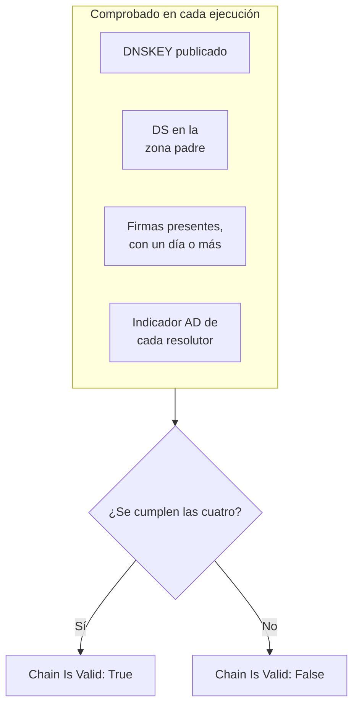

# Monitor de DNSSEC

Un monitor de DNSSEC comprueba que una zona DNS firmada sigue validando: que publica sus claves, que su zona padre responde por ella, que sus firmas no han caducado y que los resolutores validadores la aceptan. Úselo para detectar una cadena de confianza rota antes de que los resolutores empiecen a responder `SERVFAIL` para su dominio.

:::cards
- [Crear el monitor](#crear-un-monitor-de-dnssec): Seis pasos en el panel.
- [Qué se comprueba](#cómo-funciona): Las comprobaciones detrás de una cadena válida.
- [Criterios de monitoreo](#criterios-de-monitoreo): Validez de la cadena, claves, registros DS, firmas, resolutores y servidores de nombres.
- [Buenas prácticas](#buenas-prácticas): Umbrales y resolutores que funcionan.
:::

## Cómo funciona

En cada comprobación, una sonda ejecuta un conjunto de consultas DNS contra la zona:

| Consulta | A quién se pregunta | Qué le dice |
| --- | --- | --- |
| `DNSKEY` | Al primer resolutor de **Resolutores** | Si la zona publica sus claves de firma. |
| `DS` | Al primer resolutor de **Resolutores** | Si la zona padre publica un registro de firmante de delegación para la zona. |
| `SOA`, con registros DNSSEC | Al primer resolutor de **Resolutores** | Si los registros de la zona están firmados (el `RRSIG` que firma su registro `SOA`) y cuándo caduca la firma más próxima a vencer. |
| `A`, con validación DNSSEC | A cada resolutor de **Resolutores** | Si cada resolutor validador acepta la zona, lo que indica con el indicador authenticated-data (AD). |
| `NS`, luego `SOA` | Al primer resolutor y luego a cada servidor de nombres autoritativo que este nombra | Si cada servidor de nombres sirve el mismo número de serie SOA. Solo cuando **Comprobar coherencia de los servidores de nombres** está activado. |

Los resolutores validadores comprueban la cadena de confianza desde la raíz hacia abajo, así que el indicador AD le dice que toda la cadena se sostiene. La cadena cuenta como válida cuando se cumple todo esto:

Una firma a la que le queda menos de un día ya cuenta como rota, así que se entera hasta un día antes de que los resolutores empiecen a rechazar la zona. Una comprobación que encuentra la cadena rota, o los servidores de nombres desacompasados, se repite un segundo después, hasta el número de reintentos que fije, antes de que OneUptime pase el resultado por los criterios del monitor. Todas las consultas de un intento comparten un plazo de tres veces el **Tiempo de espera (ms)**; un intento que se queda sin tiempo informa de un tiempo de espera agotado, no de un veredicto sobre la zona.

## Antes de empezar

- **Un rol que pueda crear monitores**: Project Owner, Project Admin, Project Member, Monitor Admin o Monitor Member, o un rol personalizado con el permiso Create Monitor.
- **Una zona firmada.** La zona debe estar firmada, y su registro DS publicado en la zona padre a través de su registrador.
- **DNS saliente desde la sonda** hacia los resolutores que indique y, para la comprobación de coherencia de los servidores de nombres, hacia los servidores de nombres autoritativos de la zona. Las sondas predeterminadas de su proyecto se eligen para cada monitor nuevo.

## Crear un monitor de DNSSEC

:::steps
### Empezar un monitor nuevo

Vaya a **Monitores** y haga clic en **Crear monitor**. En **Tipo de monitor**, haga clic en **Más tipos de monitor** y elija **DNSSEC** en **DNS Monitoring**.

### Ponerle nombre

Introduzca un **Nombre**, como `example.com DNSSEC`, y haga clic en **Siguiente**.

### Introducir la zona

En **Zona (nombre de dominio)**, introduzca la zona que se va a validar, como `example.com`. Mantenga los **Resolutores** predeterminados, o indique los suyos, separados por comas. Deje **Comprobar coherencia de los servidores de nombres** activado salvo que su red bloquee el DNS hacia servidores arbitrarios.

### Probarlo

Haga clic en **Probar monitor**, elija una sonda en **Seleccionar sonda** y haga clic en **Ejecutar prueba**. **Resultado de la prueba del monitor** muestra lo que encontró cada comprobación.

### Revisar los criterios

**Criterios del monitor** empieza con los [criterios predeterminados](#criterios-predeterminados): sin conexión cuando la cadena está rota, en línea cuando es válida. Para recibir un aviso antes de que caduquen las firmas, añada un criterio (consulte [Buenas prácticas](#buenas-prácticas)) y haga clic en **Siguiente**.

### Elegir sondas y crear

Mantenga o cambie las **Sondas** y el **Intervalo de monitoreo** (empieza en **Cada 5 minutos**) y haga clic en **Crear monitor**. Se abre la página del monitor.
:::

## Opciones de configuración

| Campo | Predeterminado | Qué introducir |
| --- | --- | --- |
| **Zona (nombre de dominio)** | Ninguno | La zona que se valida, como `example.com`. |
| **Resolutores** | `1.1.1.1, 8.8.8.8, 9.9.9.9` | Resolutores validadores que se consultan, separados por comas. Cada uno debe devolver el indicador AD para que la cadena cuente como válida. |
| **Comprobar coherencia de los servidores de nombres** | Activado | Consultar directamente cada servidor de nombres autoritativo y comparar sus números de serie SOA. Desactívelo si su red bloquea el DNS saliente hacia servidores arbitrarios. |
| **Aviso de caducidad de la firma (días)** (en **Más campos**) | `7` | Se guarda con el monitor. El filtro **DNSSEC Signature Expires In Days** usa el valor que le dé en el criterio, así que fije allí su umbral. |
| **Tiempo de espera (ms)** (en **Más campos**) | `10000` | Cuánto esperar cada consulta DNS, en milisegundos. Un intento puede tardar en total hasta tres veces esto. |
| **Reintentos** (en **Más campos**) | `3` | Reintentos después de que falle el primer intento. `0` significa un solo intento. |

## Criterios de monitoreo

Los criterios deciden cuándo la zona cuenta como en línea, degradada o sin conexión, y si eso declara un incidente o crea una alerta. Cada criterio comprueba uno o más filtros:

| Filtro | Condiciones | Qué comprueba |
| --- | --- | --- |
| **DNSSEC Chain Is Valid** | **Verdadero**, **Falso** | Se cumplen las cuatro comprobaciones de arriba: claves publicadas, DS en la zona padre, firmas presentes con un día o más por delante, y el indicador AD de cada resolutor. |
| **DNSSEC DNSKEY Record Exists** | **Verdadero**, **Falso** | La zona publica al menos un registro DNSKEY. |
| **DNSSEC DS Record Exists At Parent** | **Verdadero**, **Falso** | La zona padre publica un registro DS para la zona. |
| **DNSSEC Signature Expires In Days** | **Greater Than**, **Less Than**, **Greater Than Or Equal To**, **Less Than Or Equal To** | Los días completos hasta que caduca la firma (RRSIG) más próxima a vencer. |
| **DNSSEC Resolver Consensus (AD Flag)** | **Verdadero**, **Falso** | Cada resolutor de **Resolutores** devuelve el indicador AD. |
| **DNSSEC Nameservers Are Consistent** | **Verdadero**, **Falso** | Cada servidor de nombres autoritativo responde con el mismo número de serie SOA. Siempre **Verdadero** mientras **Comprobar coherencia de los servidores de nombres** está desactivado. |

Con dos o más filtros, **Condición de coincidencia** decide si deben coincidir **Todos** o basta con **Cualquiera**. Las **Acciones** de un criterio deciden qué hace: cambiar el estado del monitor, crear una alerta, declarar un incidente, o varias de estas cosas.

### Criterios predeterminados

Un monitor de DNSSEC nuevo empieza con dos criterios:

- **Cadena rota** — **DNSSEC Chain Is Valid** es **Falso**. El monitor se marca como **Sin conexión** y se crea un incidente llamado «_monitor name_ DNSSEC chain is broken». El incidente se resuelve solo en cuanto la cadena vuelve a ser válida.
- **Cadena válida** — el monitor se marca como **Operativo**.

Los criterios se comprueban de arriba abajo, y el primero que coincide decide qué ocurre. Cuando ninguno coincide, el monitor muestra su estado predeterminado: **Operativo**, salvo que elija otro en **Más campos**, debajo de los criterios.

Los criterios predeterminados no vigilan por sí solos la caducidad de las firmas ni la coherencia de los servidores de nombres. Añada criterios para ellas, como se indica abajo.

### Criterios de ejemplo

| Objetivo | Filtro | Condición | Valor |
| --- | --- | --- | --- |
| Sin conexión cuando la cadena está rota (uno predeterminado) | **DNSSEC Chain Is Valid** | **Falso** | — |
| Avisar antes de que caduquen las firmas | **DNSSEC Signature Expires In Days** | **Less Than** | `7` |
| Detectar una delegación que perdió su registro DS | **DNSSEC DS Record Exists At Parent** | **Falso** | — |
| Detectar resolutores que no coinciden | **DNSSEC Resolver Consensus (AD Flag)** | **Falso** | — |
| Detectar servidores de nombres desacompasados | **DNSSEC Nameservers Are Consistent** | **Falso** | — |

## Buenas prácticas

1. **Elija resolutores que estén siempre accesibles.** Cada resolutor debe devolver el indicador AD para que la cadena cuente como válida, así que un resolutor al que la sonda no llega hace fallar la comprobación cuando se agotan los reintentos. Los predeterminados, `1.1.1.1`, `8.8.8.8` y `9.9.9.9`, los gestionan tres operadores distintos, lo que también detecta una zona que valida en un resolutor pero no en otro.
2. **Reciba un aviso antes de que caduquen las firmas.** Los firmantes vuelven a firmar una zona antes de que caduquen sus firmas, así que una firma a punto de caducar significa que la refirma se ha detenido. Añada un criterio con **DNSSEC Signature Expires In Days** / **Less Than** / `7` que cree una alerta, y un segundo en `2` que declare un incidente. Arrastre ambos por encima del criterio que marca la cadena como válida, primero el de `2` días, porque gana el primer criterio que coincide. Elija umbrales inferiores al tiempo que su firmante suele dejar en una firma antes de volver a firmar, para que no se disparen mientras la refirma funciona.
3. **Monitorice cada zona firmada.** Incluya el dominio raíz, los subdominios firmados y cualquier zona delegada a otro operador.
4. **Mantenga activada la comprobación de coherencia de los servidores de nombres,** y añada un criterio para ella. Detecta un servidor secundario que dejó de recibir transferencias del primario, algo que la validación de DNSSEC por sí sola puede pasar por alto.

## Solución de problemas

:::details La cadena se informa como rota, pero la zona valida con `dig`
Uno de los resolutores de **Resolutores** no devolvió el indicador AD: no era accesible desde la sonda, o no valida DNSSEC. La tabla **Comprobaciones del resolutor**, en **Resultado de la prueba del monitor** y en el resumen de cada comprobación, muestra la respuesta y el error de cada resolutor. Quite los resolutores a los que la sonda no llega, e indique solo resolutores validadores.
:::

:::details Los servidores de nombres se informan como incoherentes justo después de un cambio
Los secundarios pueden ir por detrás del primario durante un tiempo después de que cambie la zona. La tabla **Consistencia de los servidores de nombres** del resumen de la comprobación muestra el número de serie SOA de cada servidor de nombres. Si uno se queda atrás, ese secundario ha dejado de recibir transferencias. Si todos los servidores de nombres muestran un error, puede que a la sonda se le impida consultarlos directamente: desactive **Comprobar coherencia de los servidores de nombres**.
:::

:::details La comprobación informa de un tiempo de espera agotado
Todas las consultas de un intento comparten tres veces el **Tiempo de espera (ms)**. Un resolutor lento o inaccesible lo consume; quítelo de **Resolutores**, o aumente el tiempo de espera.
:::

## Próximos pasos

:::cards
- [Monitor de DNS](/docs/monitor/dns-monitor): Comprobar que un nombre se resuelve y qué dicen sus registros.
- [Monitor de dominio](/docs/monitor/domain-monitor): Vigilar el registro y la caducidad del dominio.
- [Monitor de certificado SSL](/docs/monitor/ssl-certificate-monitor): Vigilar los certificados que se sirven en el dominio.
- [Visión general de los incidentes](/docs/incidents/index): Qué ocurre después de que el monitor declare uno.
:::
