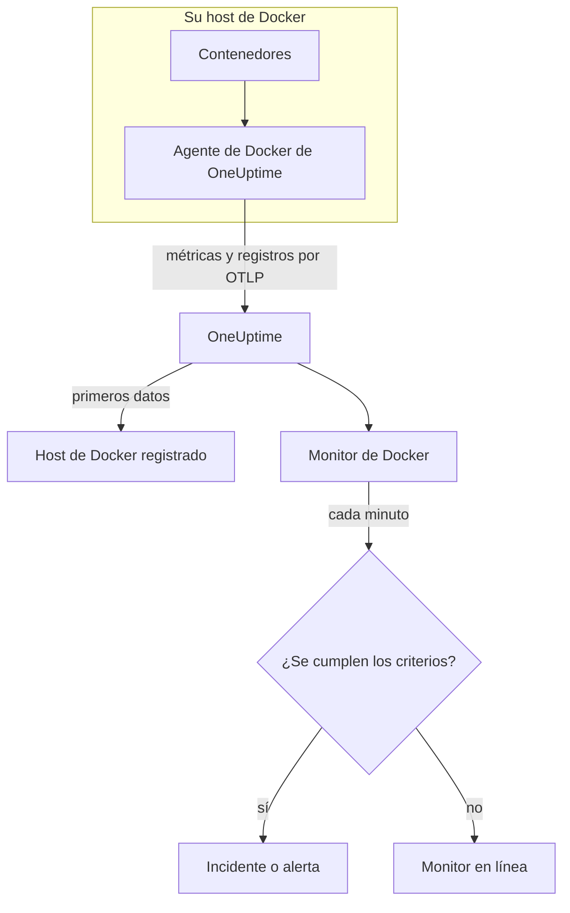

# Monitor de Docker

Un monitor de Docker vigila los contenedores de un host de Docker y le avisa cuando un contenedor se calienta, se queda sin memoria o entra en un bucle de reinicios. Lee las métricas que el agente de Docker de OneUptime envía desde el host, así que nada se sondea desde fuera: instale el agente y luego cree el monitor a partir de una plantilla o de su propia consulta.

:::cards
- [Crear el monitor](#crear-un-monitor-de-docker): Seis pasos en el panel.
- [Plantillas](#plantillas-de-alerta-listas-para-usar): Seis alertas listas para usar, un incidente por contenedor.
- [Métricas](#métricas-recopiladas): Qué recopila el agente y qué significa cada métrica.
- [Registros](#registros-recopilados): Los registros de los contenedores y el controlador de registro que necesitan.
:::

## Cómo funciona

El agente de Docker de OneUptime se ejecuta como contenedor en el host. Cada 30 segundos lee las estadísticas de los contenedores desde la API de Docker Engine, sigue los archivos de registro de los contenedores y envía ambos a OneUptime por OTLP. Los primeros datos de un host lo registran en OneUptime.

Un monitor de Docker está vinculado a un host. Cada minuto ejecuta su consulta sobre las métricas de los contenedores de ese host y compara el resultado con sus criterios.



## Antes de empezar

- **Instale el agente de Docker** en el host. La [guía del agente de Docker](/docs/telemetry/docker-host) explica cómo instalarlo, actualizarlo y comprobarlo.
- **Compruebe que el host está registrado.** Aparece en **Productos → Infraestructura → Docker → Todos los hosts**, con el nombre del `DOCKER_HOST_NAME` del agente, en cuanto llegan sus primeros datos.
- **Para los registros de los contenedores**, ejecute los contenedores con el controlador de registro `json-file` de Docker. Consulte [Requisito del controlador de registro](#requisito-del-controlador-de-registro).

## Crear un monitor de Docker

:::steps
### Empezar un monitor nuevo

Vaya a **Monitores** y haga clic en **Crear monitor**.

### Elegir Docker Container

En **Tipo de monitor**, haga clic en **Más tipos de monitor** y elija **Docker Container** en **Infraestructura**, o escriba `docker` en el cuadro de búsqueda. Introduzca un **Nombre** – se usa en los títulos de los incidentes y las alertas – y haga clic en **Siguiente**.

### Elegir el host

En **Configuración del monitor Docker**, elija el host en **Host de Docker**. Cada host que ha enviado datos está en la lista.

### Elegir qué vigilar

Elija una de las tres pestañas:

- **Quick Setup** – haga clic en una [plantilla](#plantillas-de-alerta-listas-para-usar). Fija la métrica, la agregación, el intervalo de tiempo y los umbrales, y sustituye los criterios de abajo por los suyos. Aún puede cambiar el **Intervalo de tiempo**.
- **Custom Metric** – elija una métrica en **Métrica de Docker** y luego fije la **Agregación** y el **Intervalo de tiempo**. **Nombre del contenedor** e **Imagen del contenedor** la restringen a algunos contenedores.
- **Avanzado** – cree usted mismo consultas y fórmulas en **Seleccionar métricas**. Use **Agrupar por** `resource.container.name` para juzgar cada contenedor por separado.

### Revisar los criterios

Abra cada criterio en **Criterios del monitor** y revise su **Métrica**, **Agregación**, **Condición** y **Umbral**. Una plantilla los rellena. Con **Custom Metric** o **Avanzado**, el monitor empieza con los [criterios predeterminados](#criterios-predeterminados), que solo detectan que una métrica cae a cero, así que fije su propio umbral.

### Crear el monitor

Haga clic en **Crear monitor**. OneUptime abre la página del monitor y lo evalúa cada minuto. Los incidentes y alertas que genera también aparecen en las páginas **Incidentes** y **Alertas** del host.
:::

> [!TIP]
> Para configurar varias plantillas a la vez, abra el host desde **Productos → Infraestructura → Docker** y vaya a **Recomendaciones**. Elija las plantillas que quiera, elija a quién se avisa, y OneUptime crea un monitor por plantilla.

## Ajustes del monitor

| Campo | Pestaña | Qué hace |
| --- | --- | --- |
| **Host de Docker** | Todas | Obligatorio. Limita cada consulta al `resource.host.name` del host. OneUptime también añade `resource.container.runtime = docker` a cada consulta. |
| **Métrica de Docker** | Custom Metric | Una métrica del catálogo del agente, agrupada en CPU, memoria, red, E/S de bloques y contenedor. |
| **Nombre del contenedor** | Custom Metric, Avanzado | Opcional. Coincidencia exacta con `resource.container.name`, por ejemplo `my-container`. |
| **Imagen del contenedor** | Custom Metric, Avanzado | Opcional. Coincidencia exacta con `resource.container.image.name`, por ejemplo `nginx:latest`. |
| **Agregación** | Custom Metric | Cómo se combinan las muestras: **Promedio**, **Máximo**, **Mínimo**, **Suma** o **Recuento**. Empieza en la agregación habitual de la métrica. |
| **Intervalo de tiempo** | Todas | La ventana móvil que lee la consulta, de **Past 1 Minute** a **Past 365 Days**. Un monitor nuevo empieza en **Past 1 Minute**; las plantillas fijan la suya. |
| **Seleccionar métricas** | Avanzado | El generador de consultas: **Métrica**, **Agregar por**, **Filtrar por atributos**, **Agrupar por**, además de **Añadir métrica** y **Añadir fórmula** para combinar consultas. |

## Plantillas de alerta listas para usar

**Quick Setup** ofrece seis plantillas. Cada una crea un monitor completo: una consulta agrupada por `resource.container.name`, un criterio que se dispara y otro que se recupera. Cada contenedor se juzga por separado, así que un contenedor ocupado no oculta a otro, y cada contenedor que supera el umbral recibe su propio incidente y su propia alerta. Los umbrales son puntos de partida que puede editar.

Salvo que la tabla diga lo contrario, un criterio solo se dispara cuando la condición se cumple en cada minuto de su ventana, y se recupera un 10 % más allá del umbral para que un valor que oscila en el límite no cambie de estado una y otra vez.

| Plantilla | Gravedad | Vigila | Se dispara cuando | Se recupera cuando |
| --- | --- | --- | --- | --- |
| High Container CPU Usage | Advertencia | `container.cpu.utilization`, Max por contenedor, últimos 5 minutos | Por encima de 80 (% de un núcleo) | En 72 o menos |
| High Container Memory Usage | Advertencia | `container.memory.percent`, Max por contenedor, últimos 5 minutos | Por encima del 85 % | En el 76,5 % o menos |
| Container Restart Loop | Crítico | Crecimiento de `container.restarts` por contenedor, últimos 15 minutos | Más de 3 reinicios en la ventana (Suma) | 2,7 o menos |
| Container CPU Throttling | Advertencia | Crecimiento de `container.cpu.throttling_data.throttled_time` en ms por contenedor, últimos 5 minutos | Más de 1000 ms en la ventana (Suma) | 900 ms o menos |
| High Container Process Count | Advertencia | `container.pids.count`, Max por contenedor, últimos 5 minutos | Por encima de 2000 | En 1800 o menos |
| Container Down (Low Uptime) | Crítico | `container.uptime`, Min por contenedor, último 1 minuto | Igual a 0 | Por encima de 0 |

**Gravedad** es la etiqueta que muestra el selector. El incidente y la alerta que crea una plantilla empiezan con la gravedad de incidente y de alerta más alta de su proyecto; cámbielas en los criterios.

> [!NOTE]
> `container.cpu.utilization` es el número que imprime `docker stats`: el 100 % es un núcleo de CPU completo, no todo el host, así que un contenedor que usa dos núcleos marca 200. En un host con varios núcleos, el umbral de 80 es un presupuesto de CPU, no una parte de la máquina.

> [!NOTE]
> `container.memory.percent` divide entre el límite de memoria del contenedor cuando hay uno y, si no, entre la memoria total **del host**. Compruebe si el contenedor se inició con `--memory` antes de tratar una superación como una terminación inminente por falta de memoria.

> [!WARNING]
> `container.restarts` y `container.cpu.throttling_data.throttled_time` solo crecen, así que esas dos plantillas alertan según cuánto crecieron en la ventana: una consulta de Máximo y otra de Mínimo por minuto, restadas mediante una fórmula y sumadas. Con la recopilación del agente cada 30 segundos, eso ve aproximadamente la mitad de la actividad real, y los umbrales ya lo tienen en cuenta. Si sube el `collection_interval` del agente a 60 segundos o más, cada minuto contiene una sola muestra y ambas plantillas dejan de alertar.

> [!CAUTION]
> **Container Down (Low Uptime)** no puede detectar un contenedor que se detiene y sigue detenido. El agente solo informa de los contenedores en ejecución, así que un contenedor detenido no envía ningún dato y su tiempo de actividad nunca marca 0. Para un servicio que debe seguir activo, vigile también lo que sirve – por ejemplo con un [monitor de API](/docs/monitor/api-monitor).

## Métricas recopiladas

El agente usa el receptor `docker_stats` de OpenTelemetry contra el socket de Docker, cada 30 segundos. Las métricas de cada contenedor llevan su identidad como atributos de recurso: `resource.container.name`, `resource.container.image.name`, `resource.container.id`, `resource.container.runtime` (`docker`) y `resource.host.name`.

### CPU

| Métrica | Descripción |
| --- | --- |
| `container.cpu.utilization` | Uso de CPU, donde el 100 % es un núcleo de CPU completo (la columna CPU% de `docker stats`). |
| `container.cpu.usage.total` | Tiempo de CPU usado desde que se inició el contenedor, en nanosegundos. Un contador de toda la vida útil. |
| `container.cpu.throttling_data.throttled_time` | Nanosegundos que el contenedor ha estado limitado por su límite de CPU desde que se inició. Un contador de toda la vida útil. |
| `container.cpu.throttling_data.throttled_periods` | Periodos de limitación desde que se inició el contenedor. Un contador de toda la vida útil. |

### Memoria

| Métrica | Descripción |
| --- | --- |
| `container.memory.usage.total` | Memoria en uso, en bytes. |
| `container.memory.usage.limit` | Límite de memoria, en bytes. |
| `container.memory.percent` | Uso de memoria como porcentaje del límite del contenedor, o de la memoria total del host cuando el contenedor no tiene límite. |

### Red

| Métrica | Descripción |
| --- | --- |
| `container.network.io.usage.rx_bytes` | Bytes recibidos. Un contador de toda la vida útil. |
| `container.network.io.usage.tx_bytes` | Bytes enviados. Un contador de toda la vida útil. |

### E/S de bloques

| Métrica | Descripción |
| --- | --- |
| `container.blockio.io_service_bytes_recursive.read` | Bytes leídos de dispositivos de bloques. |
| `container.blockio.io_service_bytes_recursive.write` | Bytes escritos en dispositivos de bloques. |

### Contenedor

| Métrica | Descripción |
| --- | --- |
| `container.uptime` | Segundos desde que se inició el contenedor. Solo los contenedores en ejecución la informan. |
| `container.restarts` | Veces que el contenedor se ha reiniciado desde que se creó. Un contador de toda la vida útil. |
| `container.pids.count` | Tareas del contenedor. El controlador pids del cgroup cuenta los hilos además de los procesos. |

La lista **Métrica de Docker** también ofrece `container.cpu.usage.percpu`, `container.memory.rss`, `container.memory.cache` y los contadores de paquetes de red. La configuración del agente que se distribuye no las activa, así que revise la página **Métricas** del host antes de basarse en ellas. `container.cpu.throttling_data.throttled_periods` no está en la lista; consúltela desde **Avanzado**.

## Criterios de monitoreo

Un criterio compara una de las consultas o fórmulas del monitor con un umbral. Los criterios de un monitor de Docker no tienen **Tipo de filtro**: cada regla comprueba el valor de la métrica, con estos campos.

| Campo | Qué hace |
| --- | --- |
| **Métrica** | La consulta o fórmula que se comprueba, por su nombre de variable. |
| **Agregación** | Cómo los valores de la ventana se convierten en una sola respuesta: **Promedio**, **Suma**, **Maximum Value**, **Minimum Value**, **All Values** (cada valor debe coincidir) o **Any Value** (basta con uno). |
| **Condición** | **Greater Than**, **Less Than**, **Greater Than Or Equal To**, **Less Than Or Equal To** o **Equal To**, o una condición de anomalía: **Anomalously High**, **Anomalously Low** o **Anomalous**. |
| **Umbral** | El valor con el que comparar. Junto a él hay una lista de unidades cuando la métrica tiene unidad. No se muestra para las condiciones de anomalía. |
| **Sensibilidad** | Solo condiciones de anomalía. **Bajo** (4σ), **Medio** (3σ, el predeterminado) o **Alto** (2σ). |
| **Ventana de referencia** | Solo condiciones de anomalía. 14 días (el predeterminado), 28, 60 o 90 días de historial. |
| **Si no hay datos** | En **Más campos**. Qué ocurre cuando la ventana no tiene muestras: **Ignore** (el predeterminado), **Treat As Zero** o **Disparador**. |

Las condiciones de anomalía comparan cada valor con la misma hora de la semana en la referencia. Permanecen en un estado «Learning», y no generan nada, hasta que la ventana de referencia contiene suficiente historial.

Cada criterio indica también qué hacer cuando coincide: cambiar el estado del monitor, crear una alerta o declarar un incidente. Los criterios se comprueban de arriba abajo, y el primero que coincide decide.

### Criterios predeterminados

Un monitor que no crea a partir de una plantilla empieza con dos criterios:

| Orden | Criterio | Coincide cuando | Entonces |
| --- | --- | --- | --- |
| 1 | Check if _monitor name_ is offline | Cualquier valor de la primera consulta es `0` | Marca el monitor como **Sin conexión** y declara el incidente «_monitor name_ is offline», que se resuelve solo cuando el monitor se recupera. |
| 2 | Check if _monitor name_ is online | Cualquier valor está por encima de `0` | Marca el monitor como **Operativo**. |

> [!IMPORTANT]
> El silencio no coincide con ninguno de los dos criterios: un host que deja de enviar datos deja el monitor como estaba. Para que se le avise cuando dejen de llegar datos, ponga **Si no hay datos** en **Disparador** en un criterio. El tiempo en que el propio OneUptime no estaba recibiendo nunca cuenta como falta de datos: una comprobación cuya ventana lo contiene espera en su lugar, como explica [Cuando OneUptime no recibe datos](/docs/monitor/when-oneuptime-is-not-receiving).

## Registros recopilados

El agente también sigue el archivo `*-json.log` de cada contenedor y envía cada línea como un registro de OpenTelemetry con:

| Campo | Valor |
| --- | --- |
| `resource.host.name` | El host, de `DOCKER_HOST_NAME`. |
| `resource.container.id` | El ID completo del contenedor. |
| `resource.container.runtime` | Siempre `docker`. |
| `attributes["log.iostream"]` | `stdout` o `stderr`. |
| `severityText` / `severityNumber` | Se lee de una palabra clave de nivel allí donde haya un nivel en la línea (`[ERROR]`, `app.INFO:`, `{"level":"warn"}`, `level=error`). Una línea sin nivel recurre a su flujo: `stderr` es `ERROR`, `stdout` es `INFO`. |
| `body` | La línea que escribió el contenedor. Las líneas que empiezan con un espacio o un corchete de cierre, como las líneas de una traza de pila, se unen a la línea anterior. |
| `time` | La marca de tiempo del demonio de Docker para la línea. |

Los registros aparecen en la página **Registros** del host y en la página de cada contenedor.

### Requisito del controlador de registro

El agente solo puede leer los registros de los contenedores que usan el controlador de registro `json-file` de Docker. Es el predeterminado de Docker, pero un contenedor o todo el demonio pueden usar otro:

| Controlador | Qué ve el agente |
| --- | --- |
| `json-file` | Cada línea. |
| `local` | Nada: el archivo es binario y el agente no puede analizarlo. |
| `journald`, `syslog`, `fluentd`, `gelf`, `awslogs`, `splunk`, … | Nada: los registros van a otro sitio, así que no hay archivo que seguir. |
| `none` | Nada: los registros se descartan. |

Compruebe el controlador de un contenedor y el predeterminado del demonio:

```bash
docker inspect <container> --format '{{.HostConfig.LogConfig.Type}}'
docker info --format '{{.LoggingDriver}}'
```

Cambie a `json-file`. Docker fija el controlador de registro de un contenedor cuando se crea el contenedor, así que vuelva a crear cada contenedor después del cambio: un reinicio conserva el controlador anterior.

:::tabs
@tab Docker Compose
Fije el controlador en cada servicio, con rotación:

```yaml title="docker-compose.yml"
services:
  my-app:
    image: my-app:latest
    logging:
      driver: "json-file"
      options:
        max-size: "100m"
        max-file: "5"
```

Luego vuelva a crear el servicio:

```bash
docker compose up -d --force-recreate <service>
```
@tab Demonio de Docker
Haga de `json-file` el predeterminado para cada contenedor que se cree después:

```json title="/etc/docker/daemon.json"
{
  "log-driver": "json-file",
  "log-opts": {
    "max-size": "100m",
    "max-file": "5"
  }
}
```

Reinicie el demonio de Docker y luego elimine y vuelva a crear cada contenedor:

```bash
docker rm -f <container>
docker run ... <image>
```
:::

## Solución de problemas

:::details El host no aparece en la lista Host de Docker
Los hosts se registran solos a partir de los datos del agente. Compruebe que el contenedor del agente se está ejecutando y que el host aparece en **Productos → Infraestructura → Docker → Todos los hosts**. La [guía del agente de Docker](/docs/telemetry/docker-host) incluye las comprobaciones que debe ejecutar en el host.
:::

:::details Llegan métricas, pero la página Registros está vacía
Casi seguro que los contenedores no usan el controlador de registro `json-file`. Compruébelos con los comandos de [Requisito del controlador de registro](#requisito-del-controlador-de-registro), cambie los contenedores cuyos registros quiera y vuelva a crearlos.
:::

:::details El agente registra «no files match the configured criteria»
El agente busca `/var/lib/docker/containers/*/*-json.log` y no ha encontrado nada. O ningún contenedor del host usa `json-file`, o falta o está vacío el montaje `/var/lib/docker/containers` del agente (`-v /var/lib/docker/containers:/var/lib/docker/containers:ro`), o el agente se ejecuta en Docker Desktop para macOS, cuyos archivos de contenedores están dentro de su VM de Linux.
:::

:::details Los datos llegan con un nombre de host incorrecto
OneUptime identifica un host por `resource.host.name`, que el agente toma de `DOCKER_HOST_NAME`. Cambiar `DOCKER_HOST_NAME` después de los primeros datos crea un segundo host en lugar de renombrar el primero, y un monitor sigue vinculado al nombre con el que se creó.
:::

:::details Una alerta de CPU nunca se dispara
Agrupe la consulta por `resource.container.name` y agregue con **Máximo**, como hace la plantilla **High Container CPU Usage**. Un promedio de todos los contenedores de un host ocupado se ve arrastrado a la baja por los inactivos. Recuerde que el 100 % significa un núcleo completo, así que un contenedor al que se permiten varios núcleos necesita un umbral más alto.
:::

:::details La plantilla de bucle de reinicios o de limitación dejó de alertar
Ambas miden cuánto creció un contador entre dos muestras del mismo minuto. Si el `collection_interval` del agente es de 60 segundos o más, cada minuto contiene una sola muestra, el crecimiento siempre marca 0 y ninguna de las dos plantillas se dispara. Mantenga el valor predeterminado del agente, 30 segundos.
:::

## Próximos pasos

:::cards
- [Agente de Docker](/docs/telemetry/docker-host): Instalar, actualizar y solucionar problemas del agente que lee este monitor.
- [Monitor de Podman](/docs/monitor/podman-monitor): El mismo monitor para hosts de Podman.
- [Monitor de Docker Swarm](/docs/monitor/docker-swarm-monitor): Vigilar las tareas de un clúster Swarm.
- [Visión general de los incidentes](/docs/incidents/index): Qué ocurre después de que un criterio declare un incidente.
:::
