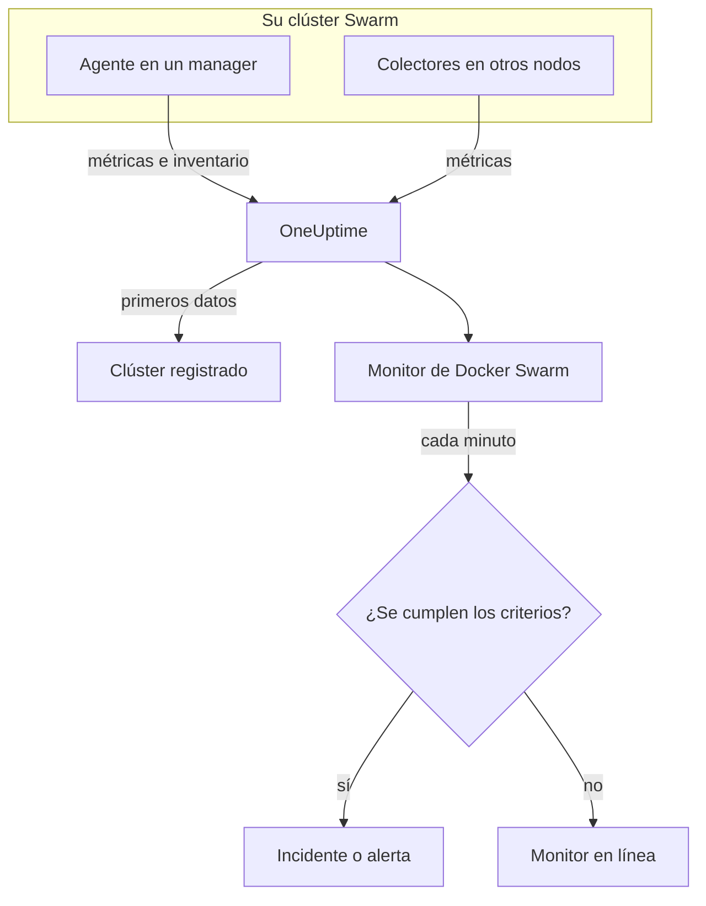

# Monitor de Docker Swarm

Un monitor de Docker Swarm vigila los contenedores que hay detrás de las tareas de servicio de un clúster Swarm y le avisa cuando una tarea se reinicia, se calienta o se queda sin memoria. Lee las métricas de contenedores que envía el agente de Docker Swarm de OneUptime, así que nada se sondea desde fuera: instale el agente y luego cree el monitor a partir de una plantilla o de su propia consulta.

:::cards
- [Crear el monitor](#crear-un-monitor-de-docker-swarm): Seis pasos en el panel.
- [Plantillas](#plantillas-de-alerta-listas-para-usar): Cuatro alertas listas para usar, un incidente por tarea.
- [Métricas](#métricas-recopiladas): Las métricas de contenedores sobre las que puede alertar.
- [Filtros](#ajustes-del-monitor): Restringir un monitor a un servicio, una tarea o una imagen.
:::

## Cómo funciona

El agente de Docker Swarm de OneUptime se ejecuta en un nodo manager. Su colector lee las estadísticas de los contenedores del demonio de Docker de ese nodo cada 30 segundos y marca cada lote con el nombre del clúster, `docker.swarm.cluster.name`. Un pequeño lector de inventario a su lado lee los nodos, servicios y tareas del clúster desde la API de Swarm cada 5 minutos. Los primeros datos registran el clúster en OneUptime.

El colector solo ve los contenedores del nodo en el que se ejecuta. Para tener métricas de cada nodo, ejecute el colector en cada nodo con el mismo `DOCKER_SWARM_CLUSTER_NAME`.

Un monitor de Docker Swarm está vinculado a un clúster. Cada minuto ejecuta su consulta sobre las métricas de los contenedores de ese clúster y compara el resultado con sus criterios.

## Antes de empezar

- **Instale el agente de Docker Swarm** en un nodo manager. La [guía del agente de Docker Swarm](/docs/telemetry/docker-swarm) explica cómo instalarlo y actualizarlo, y cómo ejecutar el colector en los demás nodos.
- **Compruebe que el clúster está registrado.** Aparece en **Productos → Infraestructura → Docker Swarm → Todos los clústeres**, con el nombre del `DOCKER_SWARM_CLUSTER_NAME` del agente, en cuanto llegan sus primeros datos.

## Crear un monitor de Docker Swarm

:::steps
### Empezar un monitor nuevo

Vaya a **Monitores** y haga clic en **Crear monitor**.

### Elegir Docker Swarm

En **Tipo de monitor**, haga clic en **Más tipos de monitor** y elija **Docker Swarm** en **Infraestructura**, o escriba `swarm` en el cuadro de búsqueda. Introduzca un **Nombre** – se usa en los títulos de los incidentes y las alertas – y haga clic en **Siguiente**.

### Elegir el clúster

En **Configuración del monitor de Docker Swarm**, elija el clúster en **Clúster de Docker Swarm**. Cada clúster que ha enviado datos está en la lista.

### Elegir qué vigilar

Elija una de las tres pestañas:

- **Quick Setup** – haga clic en una [plantilla](#plantillas-de-alerta-listas-para-usar). Fija la métrica, la agregación, el intervalo de tiempo y los umbrales, y sustituye los criterios de abajo por los suyos. Aún puede cambiar el **Intervalo de tiempo**.
- **Custom Metric** – elija una métrica en **Métrica de Docker Swarm** y luego fije la **Agregación** y el **Intervalo de tiempo**. Los [filtros](#ajustes-del-monitor) la restringen a algunas tareas.
- **Avanzado** – cree usted mismo consultas y fórmulas en **Seleccionar métricas**. Use **Agrupar por** `resource.container.name` para juzgar cada tarea por separado.

### Revisar los criterios

Abra cada criterio en **Criterios del monitor** y revise su **Métrica**, **Agregación**, **Condición** y **Umbral**. Una plantilla los rellena. Con **Custom Metric** o **Avanzado**, el monitor empieza con los [criterios predeterminados](#criterios-predeterminados), que solo detectan que una métrica cae a cero, así que fije su propio umbral.

### Crear el monitor

Haga clic en **Crear monitor**. OneUptime abre la página del monitor y lo evalúa cada minuto. Los incidentes y alertas que genera también aparecen en las páginas **Incidentes** y **Alertas** del clúster.
:::

> [!TIP]
> Para configurar varias plantillas a la vez, abra el clúster desde **Productos → Infraestructura → Docker Swarm** y vaya a **Recomendaciones**. Elija las plantillas que quiera, elija a quién se avisa, y OneUptime crea un monitor por plantilla.

## Ajustes del monitor

| Campo | Pestaña | Qué hace |
| --- | --- | --- |
| **Clúster de Docker Swarm** | Todas | Obligatorio. Limita cada consulta a `resource.docker.swarm.cluster.name`. Es el único atributo de recurso que pone el agente, así que el monitor no añade ningún filtro de `container.runtime` ni de `host.name`. |
| **Nombre del servicio** | Custom Metric, Avanzado | Opcional. Coincidencia exacta con `docker.swarm.service.name`, por ejemplo `web`. |
| **Nombre del nodo** | Custom Metric, Avanzado | Opcional. Coincidencia exacta con `docker.swarm.node.name`, por ejemplo `swarm-node-1`. |
| **Nombre del contenedor** | Custom Metric, Avanzado | Opcional. Coincidencia exacta con `resource.container.name`. El contenedor de una tarea se llama `<service>.<slot>.<taskid>`, por ejemplo `web.1.abc123`. |
| **Imagen del contenedor** | Custom Metric, Avanzado | Opcional. Coincidencia exacta con `resource.container.image.name`, por ejemplo `nginx:latest`. |
| **Métrica de Docker Swarm** | Custom Metric | Una métrica del [catálogo](#métricas-recopiladas). |
| **Agregación** | Custom Metric | Cómo se combinan las muestras: **Promedio**, **Máximo**, **Mínimo**, **Suma** o **Recuento**. Empieza en la agregación habitual de la métrica. |
| **Intervalo de tiempo** | Todas | La ventana móvil que lee la consulta, de **Past 1 Minute** a **Past 365 Days**. Un monitor nuevo empieza en **Past 1 Minute**; las plantillas fijan la suya. |
| **Seleccionar métricas** | Avanzado | El generador de consultas: **Métrica**, **Agregar por**, **Filtrar por atributos**, **Agrupar por**, además de **Añadir métrica** y **Añadir fórmula** para combinar consultas. |

> [!WARNING]
> El agente que se distribuye aún no define `docker.swarm.service.name` ni `docker.swarm.node.name`, así que un monitor con **Nombre del servicio** o **Nombre del nodo** rellenado no encuentra datos. Restrinja por **Imagen del contenedor** en su lugar, o agrupe por `resource.container.name`.

## Plantillas de alerta listas para usar

**Quick Setup** ofrece cuatro plantillas. Cada una crea un monitor completo: una consulta agrupada por `resource.container.name`, un criterio que se dispara y otro que se recupera. Cada tarea se juzga por separado y recibe su propio incidente y su propia alerta, cuya causa raíz enumera las tareas afectadas y sus valores. Los umbrales son puntos de partida que puede editar.

Salvo que la tabla diga lo contrario, un criterio solo se dispara cuando la condición se cumple en cada minuto de su ventana, y se recupera un 10 % más allá del umbral para que un valor que oscila en el límite no cambie de estado una y otra vez.

| Plantilla | Gravedad | Vigila | Se dispara cuando | Se recupera cuando |
| --- | --- | --- | --- | --- |
| Task Down (Low Uptime) | Crítico | `container.uptime`, Min por tarea, último 1 minuto | Cualquier valor está por debajo de 60 segundos | Cada valor está en 66 segundos o más |
| High Task CPU Usage | Advertencia | `container.cpu.utilization`, Avg por tarea, últimos 5 minutos | Por encima de 80 (% de un núcleo) | En 72 o menos |
| High Task Memory Usage | Advertencia | `container.memory.percent`, Avg por tarea, últimos 5 minutos | Por encima del 85 % | En el 76,5 % o menos |
| High Task Process Count | Advertencia | `container.pids.count`, Max por tarea, últimos 5 minutos | Por encima de 500 | En 450 o menos |

**Gravedad** es la etiqueta que muestra el selector. El incidente y la alerta que crea una plantilla empiezan con la gravedad de incidente y de alerta más alta de su proyecto; cámbielas en los criterios.

> [!NOTE]
> **Task Down (Low Uptime)** se dispara con una sola muestra joven porque un reinicio es un evento, no un nivel. Swarm da a una tarea de sustitución un contenedor nuevo, y por tanto una serie nueva, por eso la plantilla busca un tiempo de actividad inferior a un minuto en lugar de un 0. Un despliegue o un escalado también la disparan, y se resuelve en cuanto las tareas nuevas superan un minuto de actividad. Una tarea que muere y no se sustituye no envía nada, así que no se detecta.

## Métricas recopiladas

El colector del agente usa el receptor `docker_stats` de OpenTelemetry, así que las métricas son las métricas de contenedor habituales, una serie por contenedor de tarea. No hay métricas `docker_swarm_*`: los nodos, servicios y tareas se registran como inventario, en las páginas **Servicios**, **Tareas**, **Nodos** y relacionadas del clúster.

### CPU

| Métrica | Unidad | Descripción |
| --- | --- | --- |
| `container.cpu.utilization` | % | Uso de CPU del contenedor de una tarea, donde el 100 % es un núcleo de CPU completo. |

### Memoria

| Métrica | Unidad | Descripción |
| --- | --- | --- |
| `container.memory.usage.total` | bytes | Memoria usada por el contenedor de una tarea. |
| `container.memory.percent` | % | Memoria usada como porcentaje del límite del contenedor, o de la memoria total del nodo cuando el servicio no fija límite. |

### Red

| Métrica | Unidad | Descripción |
| --- | --- | --- |
| `container.network.io.usage.rx_bytes` | bytes | Bytes recibidos por el contenedor de una tarea. Un contador de toda la vida útil. |
| `container.network.io.usage.tx_bytes` | bytes | Bytes enviados por el contenedor de una tarea. Un contador de toda la vida útil. |

### Contenedor

| Métrica | Unidad | Descripción |
| --- | --- | --- |
| `container.pids.count` | count | Procesos dentro del contenedor de una tarea. Un aumento repentino puede indicar una fork bomb o una fuga. |
| `container.uptime` | seconds | Cuánto tiempo lleva en ejecución el contenedor de una tarea. Una tarea reprogramada o reiniciada empieza un contenedor nuevo en 0. |

Cada serie lleva la identidad del contenedor como atributos de recurso: `resource.container.name` (`<service>.<slot>.<taskid>`), `resource.container.image.name` y `resource.docker.swarm.cluster.name`.

## Criterios de monitoreo

Un criterio compara una de las consultas o fórmulas del monitor con un umbral. Los criterios de un monitor de Docker Swarm no tienen **Tipo de filtro**: cada regla comprueba el valor de la métrica, con estos campos.

| Campo | Qué hace |
| --- | --- |
| **Métrica** | La consulta o fórmula que se comprueba, por su nombre de variable. |
| **Agregación** | Cómo los valores de la ventana se convierten en una sola respuesta: **Promedio**, **Suma**, **Maximum Value**, **Minimum Value**, **All Values** (cada valor debe coincidir) o **Any Value** (basta con uno). |
| **Condición** | **Greater Than**, **Less Than**, **Greater Than Or Equal To**, **Less Than Or Equal To** o **Equal To**, o una condición de anomalía: **Anomalously High**, **Anomalously Low** o **Anomalous**. |
| **Umbral** | El valor con el que comparar. Junto a él hay una lista de unidades cuando la métrica tiene unidad. No se muestra para las condiciones de anomalía. |
| **Sensibilidad** | Solo condiciones de anomalía. **Bajo** (4σ), **Medio** (3σ, el predeterminado) o **Alto** (2σ). |
| **Ventana de referencia** | Solo condiciones de anomalía. 14 días (el predeterminado), 28, 60 o 90 días de historial. |
| **Si no hay datos** | En **Más campos**. Qué ocurre cuando la ventana no tiene muestras: **Ignore** (el predeterminado), **Treat As Zero** o **Disparador**. |

Las condiciones de anomalía comparan cada valor con la misma hora de la semana en la referencia. Permanecen en un estado «Learning», y no generan nada, hasta que la ventana de referencia contiene suficiente historial.

Cada criterio indica también qué hacer cuando coincide: cambiar el estado del monitor, crear una alerta o declarar un incidente. Los criterios se comprueban de arriba abajo, y el primero que coincide decide.

### Criterios predeterminados

Un monitor que no crea a partir de una plantilla empieza con dos criterios:

| Orden | Criterio | Coincide cuando | Entonces |
| --- | --- | --- | --- |
| 1 | Check if _monitor name_ is offline | Cualquier valor de la primera consulta es `0` | Marca el monitor como **Sin conexión** y declara el incidente «_monitor name_ is offline», que se resuelve solo cuando el monitor se recupera. |
| 2 | Check if _monitor name_ is online | Cualquier valor está por encima de `0` | Marca el monitor como **Operativo**. |

> [!IMPORTANT]
> El silencio no coincide con ninguno de los dos criterios: un clúster que deja de enviar datos deja el monitor como estaba. Para que se le avise cuando dejen de llegar datos, ponga **Si no hay datos** en **Disparador** en un criterio. El tiempo en que el propio OneUptime no estaba recibiendo nunca cuenta como falta de datos: una comprobación cuya ventana lo contiene espera en su lugar, como explica [Cuando OneUptime no recibe datos](/docs/monitor/when-oneuptime-is-not-receiving).

## Solución de problemas

:::details El clúster no aparece en la lista Clúster de Docker Swarm
Los clústeres se registran solos a partir de los datos del agente. Compruebe que el agente se está ejecutando en un nodo manager, que `DOCKER_SWARM_CLUSTER_NAME` está definido y que el clúster aparece en **Productos → Infraestructura → Docker Swarm → Todos los clústeres**. La [guía del agente de Docker Swarm](/docs/telemetry/docker-swarm) incluye las comprobaciones que debe ejecutar en el nodo.
:::

:::details Solo algunas tareas tienen métricas
El colector lee el demonio de Docker del nodo en el que se ejecuta, así que solo ve las tareas de ese nodo. Ejecute el colector en cada nodo con el mismo `DOCKER_SWARM_CLUSTER_NAME`.
:::

:::details Un monitor filtrado por servicio o por nodo no encuentra datos
**Nombre del servicio** y **Nombre del nodo** coinciden con `docker.swarm.service.name` y `docker.swarm.node.name`, que el agente que se distribuye no define. Vacíelos y restrinja por **Imagen del contenedor**, o agrupe por `resource.container.name`.
:::

:::details Todas las tareas aparecen como una sola serie
Agrupe por el atributo de recurso, `resource.container.name`, como hacen las plantillas. El `container.name` sin prefijo no coincide con nada, así que todas las tareas se fusionan en una sola serie con el nombre vacío.
:::

## Próximos pasos

:::cards
- [Agente de Docker Swarm](/docs/telemetry/docker-swarm): Instalar y actualizar el agente que lee este monitor.
- [Monitor de Docker](/docs/monitor/docker-monitor): Vigilar los contenedores de un solo host de Docker.
- [Visión general de los incidentes](/docs/incidents/index): Qué ocurre después de que un criterio declare un incidente.
- [Programaciones de guardia](/docs/on-call/schedules): Decidir a quién se avisa cuando una tarea falla.
:::
