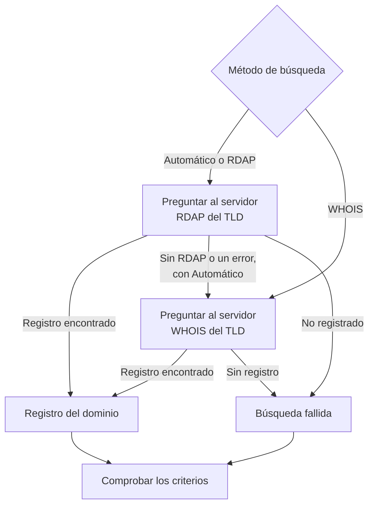

# Monitor de dominio

Un monitor de dominio lee de forma periódica el registro de su dominio, para seguir su fecha de caducidad, su registrador, sus servidores de nombres y sus códigos de estado, y le avisa antes de que caduque. Úselo para cada dominio del que dependan sus sitios web, sus API y su correo: un registro caducado los deja a todos sin servicio a la vez.

:::cards
- [Crear el monitor](#crear-un-monitor-de-dominio): Seis pasos en el panel.
- [Métodos de búsqueda](#métodos-de-búsqueda): RDAP, WHOIS, y por qué **Automático** es el predeterminado.
- [Criterios predeterminados](#criterios-predeterminados): Un aviso de caducidad con 30 días de antelación, sin configurar nada.
- [Solución de problemas](#solución-de-problemas): Servidores WHOIS retirados, proxies y fechas que faltan.
:::

## Cómo funciona

En cada comprobación, una sonda busca el registro del dominio por RDAP o WHOIS, según el **Método de búsqueda**, y normaliza lo que encuentra: la fecha de caducidad, el registrador, los servidores de nombres y los códigos de estado. Una búsqueda que falla se vuelve a intentar, hasta el número de reintentos que fije. Después, OneUptime pasa el registro por los criterios del monitor.

Si una búsqueda no puede obtener datos de registro — porque el servicio del TLD está retirado, o el dominio no está registrado —, el monitor se informa como **sin conexión** con el motivo mostrado en la respuesta de la sonda del monitor, en lugar de informarse como sano con una fecha de caducidad vacía. Un registro que responde «este dominio está disponible» (por ejemplo, el `Status: free` de DENIC) se trata como **no registrado**, no como un registro sano.

Los nombres de dominio internacionalizados se aceptan en cualquiera de sus formas: `münchen.de` se convierte en su A-label (`xn--mnchen-3ya.de`) antes de la búsqueda.

## Antes de empezar

- **Un rol que pueda crear monitores**: Project Owner, Project Admin, Project Member, Monitor Admin o Monitor Member, o un rol personalizado con el permiso Create Monitor.
- **Acceso saliente desde la sonda** a los registros. Las sondas predeterminadas de su proyecto se eligen para cada monitor nuevo; una [sonda personalizada](/docs/probe/custom-probe) necesita llegar a:

| Destino | Protocolo | Se usa para |
| --- | --- | --- |
| `https://data.iana.org/rdap/dns.json` | HTTPS, puerto 443 | El registro de arranque RDAP de la IANA, que indica dónde está el servidor RDAP de cada TLD. Se obtiene una vez y se guarda en caché 24 horas. |
| Los servidores RDAP de los registros | HTTPS, puerto 443 | Las búsquedas RDAP. |
| Los servidores WHOIS | TCP, puerto 43 | Las búsquedas WHOIS. |

Las solicitudes RDAP respetan los ajustes `HTTP_PROXY_URL` / `HTTPS_PROXY_URL` / `NO_PROXY` de la sonda. WHOIS va por un socket sin procesar y no los respeta. Si una sonda no puede llegar a `data.iana.org`, **Automático** recurre a WHOIS y vuelve a intentar con la IANA al cabo de cinco minutos.

## Crear un monitor de dominio

:::steps
### Empezar un monitor nuevo

Vaya a **Monitores** y haga clic en **Crear monitor**. En **Tipo de monitor**, haga clic en **Más tipos de monitor** y elija **Dominio** en **Basic Monitoring**.

### Ponerle nombre

Introduzca un **Nombre**, como `example.com registration`, y haga clic en **Siguiente**.

### Introducir el dominio

Introduzca el **Nombre de dominio**, como `example.com`. Deje **Método de búsqueda** en **Automático** salvo que tenga un motivo para no hacerlo (consulte [Métodos de búsqueda](#métodos-de-búsqueda)).

### Probarlo

Haga clic en **Probar monitor**, elija una sonda en **Seleccionar sonda** y haga clic en **Ejecutar prueba**. **Resultado de la prueba del monitor** muestra el registro que leyó la sonda, y si respondió RDAP o WHOIS.

### Revisar los criterios

**Criterios del monitor** empieza con los [criterios predeterminados](#criterios-predeterminados): sin conexión cuando el registro ha caducado o no se puede leer, una alerta cuando caduca en 30 días o menos. Cámbielos si lo necesita y haga clic en **Siguiente**.

### Elegir sondas y crear

Mantenga o cambie las **Sondas** y el **Intervalo de monitoreo** (empieza en **Cada 5 minutos**) y haga clic en **Crear monitor**. Se abre la página del monitor.
:::

## Opciones de configuración

| Campo | Predeterminado | Qué introducir |
| --- | --- | --- |
| **Nombre de dominio** | Ninguno | El dominio registrado, como `example.com`. Una dirección pegada también funciona: `https://example.com/pricing` se lee como `example.com`. |
| **Método de búsqueda** | **Automático** | **Automático**, **RDAP** o **WHOIS**. Consulte [Métodos de búsqueda](#métodos-de-búsqueda). |
| **Tiempo de espera (ms)** (en **Más campos**) | `10000` | Cuánto esperar cada búsqueda de registro, en milisegundos. |
| **Reintentos** (en **Más campos**) | `3` | Reintentos después de que falle el primer intento. `0` significa un solo intento. |

Cada búsqueda fallida se reintenta, con una pausa de un segundo entre intentos. Eso incluye un registro que responde que el dominio no está registrado, o que no tiene servicio de registro, por si la respuesta fue un fallo pasajero. Solo un nombre de dominio mal formado se informa de inmediato, sin búsqueda.

El tiempo de espera se aplica a cada solicitud, no a la comprobación entera: una comprobación con **Automático** que prueba RDAP y luego recurre a WHOIS puede tardar el doble, o más.

### Métodos de búsqueda

Los datos de registro se pueden leer por dos protocolos, y cuál funciona depende del TLD.

| Método | Comportamiento |
| --- | --- |
| **Automático** | Predeterminado. Usa RDAP cuando el TLD publica un servicio RDAP, y recurre a WHOIS cuando no lo hace, o cuando la búsqueda RDAP falla. |
| **RDAP** | Solo RDAP. Falla con un error claro si el TLD no publica ningún servicio RDAP. |
| **WHOIS** | Solo WHOIS. |

**RDAP** ([RFC 9083](https://www.rfc-editor.org/rfc/rfc9083)) es el sustituto de WHOIS que exige la ICANN. El servidor autoritativo de cada TLD se descubre en el [registro de arranque de la IANA](https://www.rfc-editor.org/rfc/rfc9224), así que sigue siendo correcto cuando los registros se mudan. Cada gTLD publica uno. Cuando el servidor RDAP del TLD dice que el dominio no está registrado, **Automático** lo toma como respuesta y no pregunta a WHOIS.

**WHOIS** no tiene un mecanismo de descubrimiento equivalente — los clientes incluyen una correspondencia fija entre TLD y host WHOIS, y esas correspondencias se quedan anticuadas. Todos los TLD de Identity Digital (`.digital`, `.email`, `.life`, `.today`, `.zone` y unos 290 más) siguen asociados a un host retirado que ahora responde a cada consulta con el texto literal `TLD is not supported.` en lugar de un registro. WHOIS sigue siendo la única opción para los muchos ccTLD que no publican ningún servicio RDAP, como `.io`, `.co`, `.de`, `.ch` y `.jp`.

## Criterios de monitoreo

Los criterios deciden cuándo el dominio cuenta como correcto o roto, y si eso declara un incidente o crea una alerta. Cada criterio comprueba uno o más filtros:

| Filtro | Condiciones | Qué comprueba |
| --- | --- | --- |
| **Is Online** | **Verdadero**, **Falso** | Si la propia búsqueda de registro tuvo éxito. |
| **Is Request Timeout** | **Verdadero**, **Falso** | Si la búsqueda agotó el tiempo de espera, en todos los intentos. |
| **Domain Expires In Days** | **Greater Than**, **Less Than**, **Greater Than Or Equal To**, **Less Than Or Equal To** | Los días que faltan para que caduque el registro, redondeados hacia arriba a un día completo. |
| **Domain Is Expired** | **Verdadero**, **Falso** | Si la fecha de caducidad ya pasó. |
| **Domain Registrar** | **Contiene**, **Not Contains**, **Starts With**, **Ends With**, **Equal To**, **Not Equal To** | El nombre del registrador. |
| **Domain Name Server** | **Contiene**, **Not Contains**, **Starts With**, **Ends With**, **Equal To**, **Not Equal To** | Los servidores de nombres del dominio. Coincide cuando coincide uno cualquiera de ellos. |
| **Domain Status Code** | **Contiene**, **Not Contains**, **Starts With**, **Ends With**, **Equal To**, **Not Equal To** | Los códigos de estado EPP del dominio. Coincide cuando coincide uno cualquiera de ellos. |

Los códigos de estado se normalizan a sus nombres EPP (`clientTransferProhibited`) sea cual sea el protocolo que respondió, así que un criterio sigue coincidiendo cuando **Automático** cambia entre RDAP y WHOIS. Los _nombres_ de registrador son lo que publique el servicio que responde y pueden variar ligeramente entre los dos protocolos, así que prefiera **Contiene** a **Equal To** para un criterio **Domain Registrar**.

Las fechas se normalizan a ISO 8601. Una fecha que un registro publica en un formato que no se puede analizar se omite en lugar de guardarse, así que un criterio de caducidad no puede decidir, y no coincide, en lugar de responder en silencio «no caducado» para siempre.

Con dos o más filtros, **Condición de coincidencia** decide si deben coincidir **Todos** o basta con **Cualquiera**. Las **Acciones** de un criterio deciden qué hace: cambiar el estado del monitor, crear una alerta, declarar un incidente, o varias de estas cosas.

### Criterios predeterminados

Un monitor de dominio nuevo empieza con tres criterios, así que le avisa antes de que caduque un registro sin configurar nada:

1. **Falló la comprobación del dominio** — el registro ha caducado, o no se pudieron leer sus datos de registro. El monitor se marca como **Sin conexión** y se crea un incidente llamado «_monitor name_ domain check failed». El incidente se resuelve solo en cuanto el registro vuelve a leerse y está al día.
2. **El dominio caduca pronto** — el registro no ha caducado pero caduca en 30 días o menos. Se crea una **alerta** llamada «_monitor name_ domain expires soon».
3. **El dominio no ha caducado** — el monitor se marca como **Operativo**.

El aviso de «caduca pronto» es una alerta, no un incidente: no aparece en sus páginas de estado, no avisa a nadie salvo que le añada una política de guardia, y no cambia el estado del monitor. Usa la segunda gravedad de alerta de su proyecto, **Low** en un proyecto nuevo. En cuanto la renovación aparece en el registro, la alerta se resuelve sola. Un registro que no publica fecha de caducidad no le da nada al aviso, así que este no salta.

Los criterios se comprueban de arriba abajo, y el primero que coincide decide qué ocurre. Por eso «caduca pronto» está por encima de «no ha caducado»: un dominio a punto de caducar todavía no ha caducado, así que coincidiría con ambos.

Para recibir el aviso antes, cambie el valor del filtro **Domain Expires In Days** del criterio «caduca pronto», por ejemplo a `60`. Para avisar a alguien en su lugar, abra las **Acciones** de ese criterio: active **Cuando los filtros coinciden, declarar un incidente.**, o mantenga la alerta y añádale una política de guardia en **Políticas de guardia**.

:::details Añadir el aviso a un monitor creado antes de que existiera
Los monitores creados antes de que OneUptime añadiera este aviso no tienen un criterio de «caduca pronto». Para añadirlo:

1. En el monitor, abra **Configuración → Criterios** y haga clic en **Editar criterios de monitoreo**.
2. Haga clic en **Añadir criterios**. Ponga su filtro en **Domain Is Expired** / **Falso**, haga clic en **Añadir filtro** y ponga el segundo en **Domain Expires In Days** / **Less Than Or Equal To** / `30`. Deje **Condición de coincidencia** en **Todos** (aparece bajo los filtros en cuanto hay dos).
3. En **Acciones**, active **Cuando los filtros coinciden, crear una alerta.** y deje desactivado **Cuando los filtros coinciden, cambiar el estado del monitor.**, para que cree una alerta y no cambie el estado del monitor.
4. Arrastre el nuevo criterio por encima del criterio que marca el monitor como en línea, y guarde.
:::

### Criterios de ejemplo

| Objetivo | Filtro | Condición | Valor |
| --- | --- | --- | --- |
| Alertar cuando el dominio caduca en 30 días (uno predeterminado) | **Domain Expires In Days** | **Less Than Or Equal To** | `30` |
| Sin conexión cuando el dominio ha caducado | **Domain Is Expired** | **Verdadero** | — |
| Sin conexión cuando no se puede leer el registro | **Is Online** | **Falso** | — |
| Alertar cuando cambian los servidores de nombres | **Domain Name Server** | **Not Contains** | `ns1.example.com` |
| Alertar cuando el dominio se desbloquea para una transferencia | **Domain Status Code** | **Not Contains** | `clientTransferProhibited` |

**Domain Name Server** y **Domain Status Code** coinciden cuando coincide _cualquier_ valor, así que **Not Contains** coincide en cuanto un servidor de nombres, o un código de estado, no contiene el texto.

## Buenas prácticas

1. **Dese tiempo para renovar** — El aviso predeterminado llega 30 días antes de la caducidad. Si renovar requiere aprobaciones o un pago que tarda más, súbalo a 60 días.
2. **Cubra las búsquedas fallidas** — Incluya un filtro **Is Online** / **Falso** en su criterio sin conexión para que un registro ilegible no se tome por uno sano. Los monitores nuevos lo tienen en sus criterios predeterminados; un monitor creado antes de que se añadiera lo necesita a mano. Para aguantar un servidor WHOIS que limita a la sonda de vez en cuando, marque **Evaluar estos criterios durante un periodo de tiempo** bajo ese filtro y elija **All Values**: el dominio solo pasa a sin conexión cuando fallaron todas las búsquedas de la ventana.
3. **Monitorice todos los dominios críticos** — Incluya los dominios principales, los subdominios registrados por separado y cualquier dominio que se use para correo o API.
4. **Siga los cambios de registrador** — Añada un criterio con **Domain Registrar** / **Not Contains** / el nombre de su registrador, para detectar una transferencia no autorizada.

## Solución de problemas

:::details El servidor WHOIS «answered without any registration data»
El host WHOIS del TLD está retirado, limita a la sonda o tiene un fallo pasajero. Un host retirado, como el que sigue asociado a los TLD de Identity Digital, responde `TLD is not supported.` cada vez. Si el fallo persiste con **Método de búsqueda** en **WHOIS**, cambie a **Automático**, para que la sonda lea el servicio RDAP del TLD cuando lo haya.
:::

:::details La comprobación falla con «No RDAP service is published»
El monitor usa **RDAP**, y el TLD no publica ningún servicio RDAP, como muchos ccTLD. Cambie **Método de búsqueda** a **Automático**, que recurre a WHOIS.
:::

:::details El dominio se informa como no registrado
El registro respondió que el dominio está disponible. Revise la ortografía, y que introdujo el dominio registrado, como `example.com`, y no un subdominio.
:::

:::details Las búsquedas fallan en una sonda detrás de un proxy
RDAP pasa por los ajustes de proxy de la sonda, WHOIS no. Permita el puerto TCP 43 saliente para WHOIS, o use **Automático** o **RDAP** para los TLD que publican un servicio RDAP.
:::

:::details La fecha de caducidad está vacía, y los criterios de caducidad nunca se disparan
El registro no publica fecha de caducidad, o la publica en un formato que no se puede analizar. Los criterios de caducidad no pueden decidir sin fecha, así que no saltan. **Is Online** le sigue diciendo si el registro se puede leer.
:::

## Próximos pasos

:::cards
- [Monitor de certificado SSL](/docs/monitor/ssl-certificate-monitor): Recibir un aviso antes de que caduquen los certificados del dominio.
- [Monitor de DNS](/docs/monitor/dns-monitor): Comprobar que los registros del dominio se resuelven y qué dicen.
- [Monitor de DNSSEC](/docs/monitor/dnssec-monitor): Validar la cadena de confianza de una zona firmada.
- [Reglas de escalado](/docs/on-call/escalation-rules): Decidir a quién avisan las alertas y los incidentes.
:::
