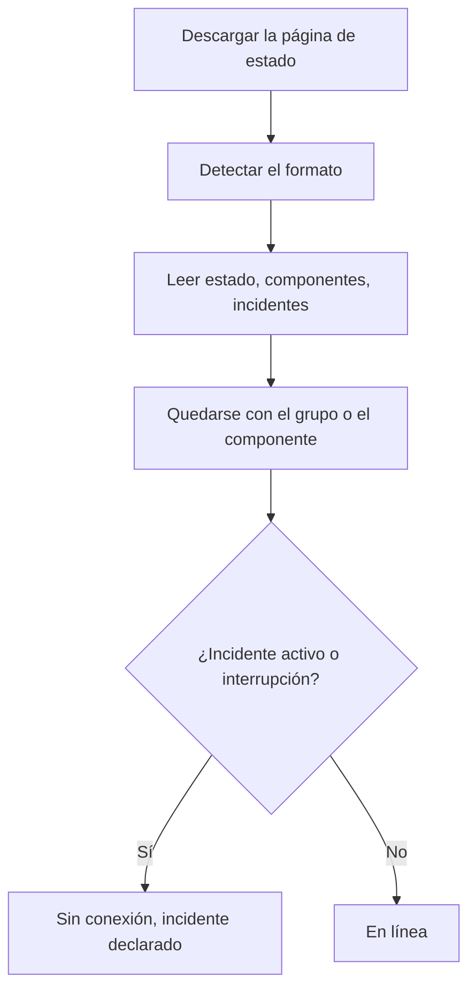

# Monitor de página de estado externa

Un monitor de página de estado externa vigila la página de estado pública de un servicio del que depende —AWS, GCP, Azure, GitHub, OpenAI, Anthropic y muchos más— y le avisa cuando ese proveedor informa de una interrupción o de un rendimiento degradado. Úselo para enterarse de los problemas de sus proveedores en cuanto ellos los comunican, y para distinguirlos de los suyos.

:::cards
- [Crear el monitor](#crear-un-monitor-de-página-de-estado-externa): Pegue la URL de una página de estado y elija qué vigilar.
- [Acotarlo](#opciones-de-configuración): Vigile un grupo de componentes o un componente.
- [Criterios](#criterios-de-monitoreo): Qué cuenta como caído, de entrada.
- [Páginas de estado populares](#url-de-páginas-de-estado-populares): URL de los servicios de los que dependen la mayoría de los equipos.
:::

## Cómo funciona

En cada comprobación, una sonda descarga la página de estado, averigua qué formato usa y lee el estado general, los componentes y los incidentes activos. Si acotó el monitor a un grupo de componentes o a un componente, solo cuentan esos. Después, los criterios deciden si el monitor está en línea o sin conexión.

Puede usarlo para:

- Monitorear la disponibilidad de los servicios de terceros de los que depende su aplicación
- Recibir alertas cuando sus proveedores sufren interrupciones
- Seguir el estado de cada componente
- Acotar el monitoreo a un solo grupo de componentes (p. ej., solo las "APIs" de OpenAI), para que incidentes ajenos en otras partes de la página no activen su monitor
- Detectar un rendimiento degradado antes de que afecte a sus usuarios
- Relacionar sus propios incidentes con los problemas de sus proveedores

## Proveedores compatibles

| Proveedor | Descripción |
| ------------------------ | ---------------------------------------------------------------------- |
| **Automático** (predeterminado) | Detecta automáticamente el formato de la página de estado |
| **Atlassian Statuspage** | Páginas de estado basadas en Atlassian Statuspage (API JSON) |
| **incident.io** | Páginas de estado basadas en incident.io (p. ej., `https://status.openai.com`) |
| **RSS** | Páginas de estado que ofrecen un feed RSS |
| **Atom** | Páginas de estado que ofrecen un feed Atom |

### Detección automática

Con **Automático**, OneUptime detecta automáticamente el formato de la página de estado, en este orden:

1. Primero, prueba la API de páginas de estado de incident.io (`/proxy/<host>`).
2. Después, prueba la API JSON de Atlassian Statuspage (`/api/v2/status.json`, `/api/v2/components.json` y `/api/v2/incidents/unresolved.json`).
3. Si fallan, intenta leer la página como un feed RSS o Atom.
4. Como último recurso, hace una comprobación básica de accesibilidad HTTP.

> [!NOTE]
> incident.io se comprueba primero porque algunas páginas de estado de incident.io (como `https://status.openai.com`) también exponen un endpoint limitado compatible con Atlassian que omite los grupos de componentes y los incidentes activos. Comprobar incident.io primero garantiza que se usen los datos más completos, que conocen los grupos.

La comprobación de accesibilidad también es el último recurso cuando falla un proveedor elegido expresamente. Solo dice si la página responde (en línea con una respuesta `2xx` o `3xx`) y no informa de componentes ni incidentes.

## Crear un monitor de página de estado externa

:::steps
### Empezar un monitor nuevo

Vaya a **Monitores** y haga clic en **Crear monitor**. En **Tipo de monitor**, haga clic en **Más tipos de monitor** y elija **Página de estado externa** en **Basic Monitoring**, o escriba `statuspage` en el cuadro de búsqueda. Introduzca un **Nombre** y haga clic en **Siguiente**.

### Introducir la URL de la página de estado

Introduzca la **URL de la página de estado**. Deje el **Proveedor** en **Automático** salvo que conozca el formato.

### Acotarlo, si hace falta

Abra **Más campos** para introducir un **Filtro de grupo de componentes (opcional)**, como `APIs`, y un **Filtro de nombre de componente (opcional)** para vigilar un solo componente (dentro del grupo, si hay un grupo definido).

### Probarlo

Haga clic en **Probar monitor** para descargar la página una vez, y revise el proveedor, los componentes y los incidentes que encontró.

### Revisar los criterios

El paso de criterios empieza con [los criterios predeterminados](#criterios-predeterminados), que marcan el monitor sin conexión cuando el proveedor informa de un incidente activo o de una interrupción dentro del alcance. Cámbielos si lo necesita y haga clic en **Siguiente**.

### Elegir sondas y crear

Seleccione las **Sondas** y un **Intervalo de monitoreo** —empieza en **Cada 5 minutos**— y haga clic en **Crear monitor**.
:::

## Opciones de configuración

| Opción | Qué introducir | Predeterminado |
| --- | --- | --- |
| **URL de la página de estado** | La URL de la página de estado. En los sitios basados en Atlassian Statuspage e incident.io suele ser la URL raíz (p. ej., `https://status.example.com`). En los feeds RSS/Atom, introduzca directamente la URL del feed. | — |
| **Proveedor** | **Automático** para detectar el formato, o **Atlassian Statuspage**, **incident.io**, **RSS** o **Atom** si lo conoce. | **Automático** |
| **Filtro de grupo de componentes (opcional)** | El grupo al que acotar el monitor. En **Más campos**. | Todos los grupos |
| **Filtro de nombre de componente (opcional)** | El componente que se vigila. En **Más campos**. | Todos los componentes del alcance |
| **Tiempo de espera (ms)** | El tiempo máximo de espera de la página de estado. En **Más campos**. | `10000` (10 segundos) |
| **Reintentos** | Cuántas veces reintentar, con un segundo de separación, después de que falle el primer intento; `0` significa un único intento. En **Más campos**. | `3` (hasta 4 intentos) |

### Filtro de grupo de componentes

Si la página de estado organiza sus componentes en grupos, puede acotar el monitor a un solo grupo. Por ejemplo, en `https://status.openai.com`, introducir `APIs` acota el monitor a los servicios de API de OpenAI.

Cuando hay un grupo de componentes definido, el **número de incidentes activos** y el **estado general** se calculan solo con los componentes de ese grupo: un incidente que afecta a un grupo ajeno (por ejemplo, ChatGPT) no activará un monitor acotado al grupo "APIs".

El filtrado por grupo de componentes es compatible con los proveedores **Atlassian Statuspage** e **incident.io**. Los feeds RSS y Atom no exponen grupos de componentes.

### Filtro de nombre de componente

Si la página de estado informa de varios componentes, puede indicar el nombre de un componente para monitorear solo ese. El filtro coincide con cualquier componente cuyo nombre contenga lo que escriba, sin distinguir mayúsculas y minúsculas: `actions` coincide con un componente llamado "Actions".

Cuando también hay un grupo de componentes definido, el filtro de nombre de componente se aplica **dentro** de ese grupo, lo que le permite apuntar a un solo componente dentro de un grupo más grande. Si no se indica ningún filtro, se monitorean todos los componentes del alcance. En un feed RSS o Atom, el filtro de nombre se compara con los títulos de los elementos del feed.

> [!WARNING]
> Un filtro que no coincide con nada parece sano: sin componentes en el alcance, no hay nada que pueda informar de una interrupción. Compruebe la ortografía en la página de estado, y use **Probar monitor** para ver qué conserva el filtro.

## Criterios de monitoreo

Puede configurar criterios para decidir cuándo el servicio externo se considera en línea o sin conexión, según:

| Tipo de filtro | Qué comprueba | Condiciones del filtro |
| --- | --- | --- |
| **External Status Page Is Online** | Si la página de estado es accesible y devuelve datos de estado | Verdadero o Falso |
| **External Status Page Overall Status** | El estado general que indica la página | Equal To, Not Equal To, Contiene, Not Contains, Starts With, Ends With |
| **External Status Page Component Status** | El estado de los componentes del alcance (respetando los filtros de grupo y de nombre de componente): Operativo, En mantenimiento, Rendimiento degradado, Interrupción parcial, Interrupción grave o Interrupción total | Equal To, Not Equal To, Contiene, Not Contains, Starts With, Ends With |
| **External Status Page Active Incidents** | El número de incidentes activos que muestra la página de estado (acotado al grupo o al componente cuando hay un filtro) | Equal To, Not Equal To y las comparaciones numéricas |
| **External Status Page Response Time (in ms)** | Cuánto se tarda en descargar los datos de la página de estado | Greater Than, Less Than, Greater Than Or Equal To, Less Than Or Equal To |

El estado general es lo que dice la página, así que sus valores dependen del proveedor: una Atlassian Statuspage informa de su propia descripción, como `All Systems Operational`; un feed informa de `operational` o `degraded_performance`; la comprobación de accesibilidad informa de `reachable` o `unreachable`. Estas comparaciones distinguen mayúsculas y minúsculas. Para alertar de interrupciones, **External Status Page Active Incidents** y **External Status Page Component Status** suelen ser más fiables.

En un feed RSS o Atom, los elementos de las últimas 24 horas cuentan como incidentes activos: un elemento RSS por su fecha de publicación, una entrada Atom por su fecha de actualización.

### Criterios predeterminados

De forma predeterminada, OneUptime crea criterios basados en lo que de verdad importa en una página de estado —sus incidentes activos y la salud de sus componentes— y no en la mera accesibilidad:

| Criterio | Filtros | Efecto |
| --- | --- | --- |
| Sin conexión | **Cualquiera** de: la página no está en línea; hay al menos un incidente activo en el alcance; un componente del alcance informa de Rendimiento degradado, Interrupción parcial, Interrupción grave o Interrupción total | Marca el monitor sin conexión y declara un incidente, que se resuelve solo cuando el criterio deja de coincidir |
| En línea | **Todos** de: la página está en línea; no hay incidentes activos en el alcance | Marca el monitor en línea |

Como el número de incidentes activos y los estados de los componentes respetan los filtros de grupo y de nombre de componente, estos criterios predeterminados se centran automáticamente solo en los componentes que le importan.

## Variables de plantilla

Al crear incidentes o alertas a partir de monitores de página de estado externa, puede usar estas variables en títulos, descripciones y notas de corrección (consulte [Plantillas de incidentes y alertas](/docs/monitor/incident-alert-templating)):

| Variable | Descripción |
| ------------------------- | ------------------------------------------------------------------------------- |
| `{{isOnline}}`            | Si la página de estado está en línea (true/false) |
| `{{responseTimeInMs}}`    | Tiempo de respuesta en milisegundos |
| `{{failureCause}}`        | Motivo del fallo, si lo hay |
| `{{overallStatus}}`       | El valor del indicador de estado general |
| `{{activeIncidentCount}}` | Número de incidentes activos (acotado por el filtro, si lo hay) |
| `{{componentStatuses}}`   | Array JSON de estados de componentes (`name`, `status`, `description`, `groupName`) |
| `{{provider}}`            | Proveedor detectado (Atlassian Statuspage, incident.io, RSS, Atom); vacío tras una comprobación de accesibilidad |
| `{{componentGroup}}`      | Grupo de componentes al que está acotado el monitor, si lo hay |
| `{{componentName}}`       | Componente al que está acotado el monitor, si lo hay |

## URL de páginas de estado populares

Aquí tiene una lista de páginas de estado de servicios populares. Muchas usan Atlassian Statuspage o incident.io, así que el proveedor **Automático** las detecta automáticamente. Una página que no se basa en ninguno de los dos, y que no es un feed, solo recibe la comprobación de accesibilidad: en esos casos, monitoree en su lugar el feed RSS o Atom del proveedor, si publica uno.

| Servicio | URL de la página de estado |
| ---------------------------- | --------------------------------------------- |
| AWS                          | `https://health.aws.amazon.com/health/status` |
| Google Cloud Platform        | `https://status.cloud.google.com`             |
| Microsoft Azure              | `https://status.azure.com`                    |
| GitHub                       | `https://www.githubstatus.com`                |
| OpenAI                       | `https://status.openai.com`                   |
| Anthropic                    | `https://status.anthropic.com`                |
| Cloudflare                   | `https://www.cloudflarestatus.com`            |
| Datadog                      | `https://status.datadoghq.com`                |
| PagerDuty                    | `https://status.pagerduty.com`                |
| Twilio                       | `https://status.twilio.com`                   |
| Stripe                       | `https://status.stripe.com`                   |
| Slack                        | `https://status.slack.com`                    |
| Atlassian (Jira, Confluence) | `https://status.atlassian.com`                |
| Vercel                       | `https://www.vercel-status.com`               |
| Netlify                      | `https://www.netlifystatus.com`               |
| DigitalOcean                 | `https://status.digitalocean.com`             |
| Heroku                       | `https://status.heroku.com`                   |
| MongoDB Atlas                | `https://status.cloud.mongodb.com`            |
| Fastly                       | `https://status.fastly.com`                   |
| New Relic                    | `https://status.newrelic.com`                 |
| Sentry                       | `https://status.sentry.io`                    |
| CircleCI                     | `https://status.circleci.com`                 |

## Buenas prácticas

- **Use el proveedor Automático** salvo que conozca el formato exacto: la detección automática funciona bien con la mayoría de las páginas de estado.
- **Acote a un grupo de componentes** si solo depende de una parte de un proveedor (p. ej., solo de las "APIs" de OpenAI), para que los incidentes ajenos no generen ruido.
- **Monitoree componentes concretos** si solo depende de ciertos servicios.
- **Combínelo con sus propios monitores**: empareje los monitores de página de estado externa con sus propios monitores de API y de sitio web. Cuando ambos caen a la vez, la página de estado del proveedor le lleva antes a la causa raíz.

## Solución de problemas

:::details El monitor está sin conexión, pero el incidente es de una parte del servicio que no uso
Acote el monitor con un **Filtro de grupo de componentes**, un **Filtro de nombre de componente** o ambos. Así, el número de incidentes activos y los estados de los componentes solo cuentan lo que está en el alcance.
:::

:::details El monitor nunca queda sin conexión, ni siquiera durante una interrupción
Puede que los filtros no coincidan con nada, lo que parece sano, o que la página solo reciba la comprobación de accesibilidad. Ejecute **Probar monitor** y revise el proveedor y los componentes que encontró.
:::

:::details Automático elige el formato equivocado, o no encuentra componentes
Ponga el **Proveedor** que sabe que usa la página. En un feed RSS o Atom, introduzca la URL del propio feed en lugar de la de la página de estado.
:::

:::details No se puede acceder a una página de estado interna
Una sonda rechaza las direcciones de red privada salvo que tenga permiso para alcanzarlas. Defina `PROBE_ALLOW_PRIVATE_NETWORK_MONITORS=true` en una sonda dentro de su red; consulte [Acceso a red privada](/docs/self-hosted/private-network-access).
:::

## Próximos pasos

:::cards
- [Plantillas de incidentes y alertas](/docs/monitor/incident-alert-templating): Lleve el estado del proveedor a los títulos de sus incidentes.
- [Monitor de API](/docs/monitor/api-monitor): Compruebe sus propios endpoints junto al estado de su proveedor.
- [Crear un monitor](/docs/monitor/create-monitor): Los pasos que comparten todos los tipos de monitor.
:::
