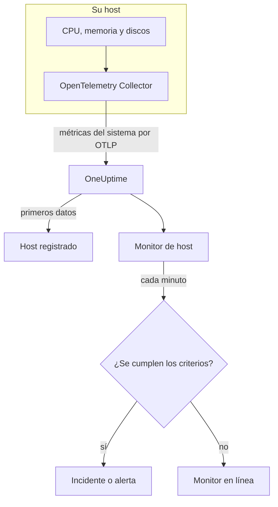

# Monitor de hosts

Un monitor de host vigila una máquina – su CPU, su memoria, sus discos, su carga y sus procesos – y le avisa cuando está saturada o se está llenando. Lee las métricas `system.*` de OpenTelemetry que un OpenTelemetry Collector envía desde el host, los mismos datos que muestra el producto **Hosts**, así que nada se sondea desde fuera.

:::cards
- [Crear el monitor](#crear-un-monitor-de-host): Seis pasos en el panel.
- [Plantillas](#plantillas-de-alerta-listas-para-usar): Cinco alertas listas para usar para CPU, memoria, disco, carga y procesos.
- [Métricas](#métricas-recopiladas): Las métricas de host sobre las que puede alertar, y sus unidades.
- [¿Host o servidor / VM?](#monitor-de-host-o-monitor-de-servidor-vm): Cuál de los dos monitores de máquinas usar.
:::

## Cómo funciona

Un OpenTelemetry Collector se ejecuta en el host con el receptor `hostmetrics`. Cada 30 segundos lee las cifras de CPU, memoria, disco, red, carga y procesos del host y las envía a OneUptime por OTLP. Los primeros datos de un host lo registran en **Hosts**.

Un monitor de host está vinculado a un host. Cada minuto ejecuta su consulta sobre las métricas de ese host y compara el resultado con sus criterios.

### ¿Monitor de host o monitor de servidor / VM?

OneUptime tiene dos monitores para máquinas. Pueden ejecutarse en el mismo host.

| | Monitor de host | Monitor de servidor / VM |
| --- | --- | --- |
| **Agente** | Un OpenTelemetry Collector con el receptor `hostmetrics` | El agente de infraestructura de OneUptime |
| **Datos** | Métricas `system.*` y `process.*` de OpenTelemetry, las mismas que grafican las páginas de **Hosts** | Un informe de estado que el agente envía al monitor |
| **Criterios** | Umbrales o detección de anomalías sobre cualquier consulta de métricas o fórmula | Comprobaciones integradas como el uso de CPU, memoria y disco |
| **Configuración** | Instalar el colector; el host se registra solo | Crear el monitor y luego dar su clave secreta al agente |

Use el monitor de host cuando el host ya envía datos de OpenTelemetry, o cuando quiera registros y métricas más completas del mismo colector. Consulte [Monitor de servidor / VM](/docs/monitor/server-monitor) para el otro.

## Antes de empezar

- **Ejecute un OpenTelemetry Collector en el host** con el receptor `hostmetrics`. [Colector OpenTelemetry en el host](/docs/telemetry/host-otel-collector) cubre Linux, macOS y Windows, y **Productos → Infraestructura → Hosts → Documentación** ofrece una configuración lista para usar.
- **Active las métricas de utilización.** `system.cpu.utilization`, `system.memory.utilization` y `system.filesystem.utilization` son opcionales en el receptor, y las plantillas de CPU, memoria y sistema de archivos las necesitan. La configuración del panel las activa.
- **Compruebe que el host está registrado.** Aparece en **Productos → Infraestructura → Hosts → Todos los hosts**, con el nombre de su `host.name`, en cuanto llegan sus primeros datos.

## Crear un monitor de host

:::steps
### Empezar un monitor nuevo

Vaya a **Monitores** y haga clic en **Crear monitor**.

### Elegir Host

En **Tipo de monitor**, haga clic en **Más tipos de monitor** y elija **Host** en **Infraestructura**. Introduzca un **Nombre** – se usa en los títulos de los incidentes y las alertas – y haga clic en **Siguiente**.

### Elegir la máquina

En **Configuración del monitor de host**, elija la máquina en **Host**. Cada host que ha enviado datos está en la lista.

### Elegir qué vigilar

Elija una de las tres pestañas:

- **Quick Setup** – haga clic en una [plantilla](#plantillas-de-alerta-listas-para-usar). Fija la métrica, la agregación, el intervalo de tiempo y los umbrales, y sustituye los criterios de abajo por los suyos. Aún puede cambiar el **Intervalo de tiempo**.
- **Custom Metric** – elija una métrica en **Métrica del host** y luego fije la **Agregación** y el **Intervalo de tiempo**.
- **Avanzado** – cree usted mismo consultas y fórmulas en **Seleccionar métricas**, por ejemplo un filtro sobre `state` o una agrupación por `mountpoint`.

### Revisar los criterios

Abra cada criterio en **Criterios del monitor** y revise su **Métrica**, **Agregación**, **Condición** y **Umbral**. Una plantilla los rellena. Con **Custom Metric** o **Avanzado**, el monitor empieza con los [criterios predeterminados](#criterios-predeterminados), que solo detectan que una métrica cae a cero, así que fije su propio umbral.

### Crear el monitor

Haga clic en **Crear monitor**. OneUptime abre la página del monitor y lo evalúa cada minuto. Los incidentes y alertas que genera también aparecen en las páginas **Incidentes** y **Alertas** del host.
:::

> [!TIP]
> Para configurar varias plantillas a la vez, abra el host desde **Productos → Infraestructura → Hosts** y vaya a **Recomendaciones**. Elija las plantillas que quiera, elija a quién se avisa, y OneUptime crea un monitor por plantilla.

## Ajustes del monitor

| Campo | Pestaña | Qué hace |
| --- | --- | --- |
| **Host** | Todas | Obligatorio. Limita cada consulta al `resource.host.name` del host. |
| **Métrica del host** | Custom Metric | Una métrica del [catálogo](#métricas-recopiladas), agrupada en CPU, memoria, disco, red, carga y procesos. |
| **Agregación** | Custom Metric | Cómo se combinan las muestras: **Promedio**, **Máximo**, **Mínimo**, **Suma** o **Recuento**. Empieza en la agregación habitual de la métrica. |
| **Intervalo de tiempo** | Todas | La ventana móvil que lee la consulta, de **Past 1 Minute** a **Past 365 Days**. Un monitor nuevo empieza en **Past 1 Minute**; las plantillas fijan la suya. |
| **Seleccionar métricas** | Avanzado | El generador de consultas: **Métrica**, **Agregar por**, **Filtrar por atributos**, **Agrupar por**, además de **Añadir métrica** y **Añadir fórmula** para combinar consultas. |

## Plantillas de alerta listas para usar

**Quick Setup** ofrece cinco plantillas. Cada una crea un monitor completo: una consulta, un criterio que se dispara y otro que se recupera. Los umbrales son puntos de partida que puede editar.

Un criterio solo se dispara cuando la condición se cumple en cada minuto de su ventana, y se recupera un 10 % más allá del umbral para que un valor que oscila en el límite no cambie de estado una y otra vez.

| Plantilla | Gravedad | Vigila | Se dispara cuando | Se recupera cuando |
| --- | --- | --- | --- | --- |
| High CPU Utilization | Advertencia | `system.cpu.utilization` para los estados `user` y `system`, sumados y mostrados como porcentaje, últimos 5 minutos | Por encima del 80 % | En el 72 % o menos |
| High Memory Utilization | Advertencia | `system.memory.utilization` para el estado `used`, como porcentaje, últimos 5 minutos | Por encima del 85 % | En el 76,5 % o menos |
| High Filesystem Usage | Crítico | `system.filesystem.utilization`, Max por `mountpoint` y `device`, como porcentaje, últimos 5 minutos | Por encima del 90 % | En el 81 % o menos |
| High Load Average (1m) | Advertencia | `system.cpu.load_average.1m`, Avg, últimos 5 minutos | Por encima de 4 | En 3,6 o menos |
| High Process Count | Advertencia | `system.processes.count`, Max, últimos 5 minutos | Por encima de 2000 | En 1800 o menos |

**Gravedad** es la etiqueta que muestra el selector. El incidente y la alerta que crea una plantilla empiezan con la gravedad de incidente y de alerta más alta de su proyecto; cámbielas en los criterios.

- **CPU** es el tiempo ocupado (`user` más `system`), la misma cifra que grafica la **Vista general** del host. La espera de E/S y el steal quedan fuera.
- **Memoria** excluye los búferes y la caché de páginas, así que un host lleno sobre todo de caché no la dispara.
- **Sistema de archivos** abre un incidente por montaje. Los pseudo sistemas de archivos de solo lectura, como los montajes snap `squashfs` o `devfs` de macOS, siempre están llenos al 100 %; exclúyalos en el scraper `filesystem` del colector.
- **Promedio de carga** es una longitud bruta de la cola de ejecución, no dividida por el número de núcleos: 4 es saturación en un host de 2 núcleos y rutina en uno de 32, así que súbalo en hosts grandes.
- **Número de procesos** compara el estado de proceso individual más grande (`running`, `sleeping`, …), no el total del host, así que no coincidirá con una lista de procesos. El scraper de procesos solo informa en Linux.

## Métricas recopiladas

La lista **Métrica del host** ofrece estas métricas. Cada una lleva `resource.host.name`, que es como el monitor limita sus consultas a un host.

> [!IMPORTANT]
> Las métricas de utilización son una proporción de 0 a 1, no un porcentaje: use `0.8` para el 80 % en un umbral sobre la métrica sin procesar. Las plantillas convierten a porcentaje con una fórmula, así que sus umbrales indican 80, 85 y 90.

### CPU

| Métrica | Unidad | Descripción |
| --- | --- | --- |
| `system.cpu.utilization` | ratio | Parte del tiempo de CPU en cada `state` (`user`, `system`, `idle`, …). Filtre por `state`: un promedio de todos los estados nunca alcanza un umbral útil. |
| `process.cpu.utilization` | ratio | Uso de CPU de cada proceso del host. |

### Memoria

| Métrica | Unidad | Descripción |
| --- | --- | --- |
| `system.memory.utilization` | ratio | Parte de la memoria física en cada `state` (`used`, `free`, `cached`, …). Filtre por `state = used` para la memoria en uso. |
| `system.memory.usage` | bytes | Uso de memoria en bytes. |

### Disco

| Métrica | Unidad | Descripción |
| --- | --- | --- |
| `system.filesystem.utilization` | ratio | Parte de la capacidad de cada sistema de archivos en uso, por `mountpoint` y `device`. |
| `system.filesystem.usage` | bytes | Uso del sistema de archivos en bytes. |

### Red

| Métrica | Unidad | Descripción |
| --- | --- | --- |
| `system.network.io` | bytes | Bytes recibidos y enviados. Un contador de toda la vida útil. |

### Carga

| Métrica | Unidad | Descripción |
| --- | --- | --- |
| `system.cpu.load_average.1m` | count | Promedio de carga del último minuto. |
| `system.cpu.load_average.5m` | count | Promedio de carga de los últimos 5 minutos. |
| `system.cpu.load_average.15m` | count | Promedio de carga de los últimos 15 minutos. |

### Procesos

| Métrica | Unidad | Descripción |
| --- | --- | --- |
| `system.processes.count` | count | Procesos del host, una serie por `status` de proceso. |

El generador de consultas de **Avanzado** enumera todas las métricas que envía el host, no solo estas.

## Criterios de monitoreo

Un criterio compara una de las consultas o fórmulas del monitor con un umbral. Los criterios de un monitor de host no tienen **Tipo de filtro**: cada regla comprueba el valor de la métrica, con estos campos.

| Campo | Qué hace |
| --- | --- |
| **Métrica** | La consulta o fórmula que se comprueba, por su nombre de variable. |
| **Agregación** | Cómo los valores de la ventana se convierten en una sola respuesta: **Promedio**, **Suma**, **Maximum Value**, **Minimum Value**, **All Values** (cada valor debe coincidir) o **Any Value** (basta con uno). |
| **Condición** | **Greater Than**, **Less Than**, **Greater Than Or Equal To**, **Less Than Or Equal To** o **Equal To**, o una condición de anomalía: **Anomalously High**, **Anomalously Low** o **Anomalous**. |
| **Umbral** | El valor con el que comparar. Junto a él hay una lista de unidades cuando la métrica tiene unidad. No se muestra para las condiciones de anomalía. |
| **Sensibilidad** | Solo condiciones de anomalía. **Bajo** (4σ), **Medio** (3σ, el predeterminado) o **Alto** (2σ). |
| **Ventana de referencia** | Solo condiciones de anomalía. 14 días (el predeterminado), 28, 60 o 90 días de historial. |
| **Si no hay datos** | En **Más campos**. Qué ocurre cuando la ventana no tiene muestras: **Ignore** (el predeterminado), **Treat As Zero** o **Disparador**. |

Las condiciones de anomalía comparan cada valor con la misma hora de la semana en la referencia. Permanecen en un estado «Learning», y no generan nada, hasta que la ventana de referencia contiene suficiente historial.

Cada criterio indica también qué hacer cuando coincide: cambiar el estado del monitor, crear una alerta o declarar un incidente. Los criterios se comprueban de arriba abajo, y el primero que coincide decide.

### Criterios predeterminados

Un monitor que no crea a partir de una plantilla empieza con dos criterios:

| Orden | Criterio | Coincide cuando | Entonces |
| --- | --- | --- | --- |
| 1 | Check if _monitor name_ is offline | Cualquier valor de la primera consulta es `0` | Marca el monitor como **Sin conexión** y declara el incidente «_monitor name_ is offline», que se resuelve solo cuando el monitor se recupera. |
| 2 | Check if _monitor name_ is online | Cualquier valor está por encima de `0` | Marca el monitor como **Operativo**. |

> [!IMPORTANT]
> El silencio no coincide con ninguno de los dos criterios: un host que deja de enviar datos deja el monitor como estaba. Para que se le avise cuando el host se quede en silencio, ponga **Si no hay datos** en **Disparador** en un criterio. El tiempo en que el propio OneUptime no estaba recibiendo nunca cuenta como falta de datos: una comprobación cuya ventana lo contiene espera en su lugar, como explica [Cuando OneUptime no recibe datos](/docs/monitor/when-oneuptime-is-not-receiving).

## Solución de problemas

:::details El host no aparece en la lista Host
Los hosts se registran solos a partir de los datos del colector, que necesitan un `host.name` y el tipo de sistema operativo del host; ambos los aporta el procesador `resourcedetection` del colector. Compruebe que el colector se está ejecutando y que el host aparece en **Productos → Infraestructura → Hosts → Todos los hosts**. [Colector OpenTelemetry en el host](/docs/telemetry/host-otel-collector) cubre la configuración.
:::

:::details Un umbral de CPU o de memoria nunca se dispara
Las métricas de utilización son proporciones que llegan como máximo a `1.0`, así que un umbral escrito a mano de `80` nunca se cruza: use `0.8`, o parta de una plantilla, que convierte a porcentaje. Filtre también por `state`: `user` y `system` para la CPU, `used` para la memoria. Un promedio de todos los estados se queda cerca de 1 dividido entre el número de estados.
:::

:::details Los incidentes se disparan para el host equivocado
El monitor limita cada consulta con `resource.host.name` igual al host que eligió. Los hosts que informan el mismo `host.name` se fusionan en una sola serie, así que dé a cada host un nombre único.
:::

:::details High Filesystem Usage se dispara por un montaje que siempre está lleno
Los pseudo sistemas de archivos de solo lectura, como los montajes en bucle snap `squashfs` bajo `/snap` o `devfs` de macOS, están llenos al 100 % por diseño y nunca se recuperan. Exclúyalos del scraper `filesystem` del colector.
:::

## Próximos pasos

:::cards
- [Colector OpenTelemetry en el host](/docs/telemetry/host-otel-collector): Instalar y configurar el colector que lee este monitor.
- [Monitor de servidor / VM](/docs/monitor/server-monitor): El monitor de máquinas al que un agente envía informes.
- [Monitor de métricas](/docs/monitor/metrics-monitor): Alertar sobre cualquier métrica, en hosts y servicios.
- [Visión general de los incidentes](/docs/incidents/index): Qué ocurre después de que un criterio declare un incidente.
:::
