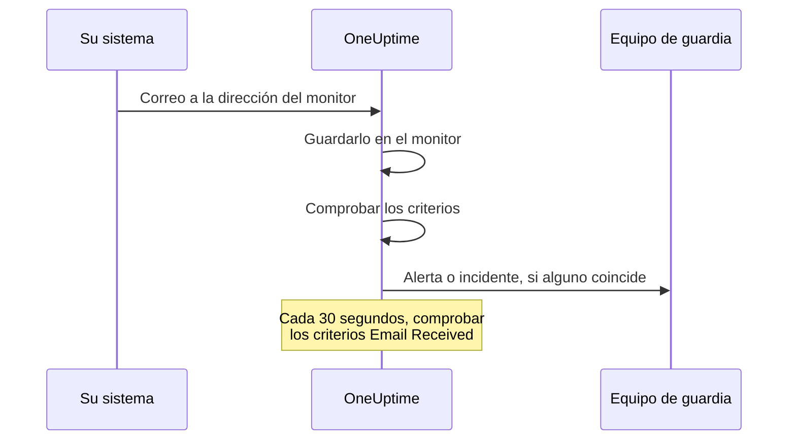

# Monitor de correos entrantes

Un monitor de correos entrantes le da una dirección de correo que pertenece a un solo monitor. Cualquier cosa que pueda enviar correo —un trabajo de copias de seguridad, un sistema heredado, las alertas de un proveedor de nube— envía allí sus resultados, y OneUptime comprueba cada correo con sus criterios para marcar el monitor como caído, abrir un incidente o crear una alerta, y para resolverlos cuando llega el aviso de normalidad.

:::cards
- [Crear el monitor](#crear-un-monitor-de-correos-entrantes): Obtenga una dirección y dirija a ella a su emisor.
- [Verificar la dirección](#verificar-la-dirección-con-el-emisor): Lea en el monitor el correo de confirmación de un emisor.
- [Escribir criterios](#tipos-de-filtro-disponibles): Compare el asunto, el remitente o el cuerpo, o alerte cuando dejen de llegar correos.
- [Usar el correo en las alertas](#variables-de-plantilla): Ponga el asunto y el cuerpo en títulos y descripciones.
:::

## Cómo funciona

El correo es un modelo push: su sistema envía y OneUptime escucha. Cada correo se comprueba con los criterios del monitor en cuanto llega. Los criterios que buscan un correo que *debería* haber llegado también se comprueban de forma programada, cada 30 segundos.



1. Cuando crea un monitor de correos entrantes, OneUptime le da una dirección de correo única.
2. Cada correo enviado a esa dirección se guarda en el monitor y se evalúa con sus criterios, desde arriba; el primer criterio que coincide decide.
3. Un criterio que coincide puede cambiar el estado del monitor, crear una alerta y declarar un incidente. Un incidente con **Resolver incidente automáticamente** activado, o una alerta con **Resolver alerta automáticamente** activado, se resuelve cuando más tarde coincide otro criterio; por ejemplo, el que marca el monitor en línea.

## Crear un monitor de correos entrantes

:::steps
### Empezar un monitor nuevo

Vaya a **Monitores** y haga clic en **Crear monitor**.

### Elegir Incoming Email

En **Tipo de monitor**, haga clic en **Más tipos de monitor** y elija **Incoming Email** en **Inbound Monitoring**, o escriba `email` en el cuadro de búsqueda. Introduzca un **Nombre** y haga clic en **Siguiente**.

### Revisar los criterios

El paso **Criterios** empieza con [los criterios predeterminados](#lo-que-obtiene-de-entrada), que marcan el monitor sin conexión cuando un correo menciona `error`. Haga clic en un criterio para cambiarlo, o en **Añadir criterios** para añadir uno. Consulte [Configuraciones de ejemplo](#configuraciones-de-ejemplo) para ver configuraciones habituales.

### Crear el monitor

Haga clic en **Crear monitor**. El monitor se abre en su página **Vista general**, donde la tarjeta **Dirección de correo entrante** muestra la dirección con un botón para copiar hasta que llega el primer correo.

### Enviar correo a la dirección

Configure su sistema para que envíe sus notificaciones a la dirección. Si el emisor le pide antes que confirme la dirección, consulte [Verificar la dirección con el emisor](#verificar-la-dirección-con-el-emisor).
:::

> [!NOTE]
> La dirección contiene la clave secreta del monitor, así que solo pueden verla las personas que pueden editar monitores. Los demás ven que los detalles de configuración están ocultos.

## Formato de la dirección de correo

Cada monitor de correos entrantes recibe una dirección única con este formato:

```text
monitor-{secret-key}@{inbound-domain}
```

La clave secreta es un UUID, por ejemplo `monitor-3f2b8c1e-5d4a-4f6b-9a7c-2e1d0b9f8a6c@inbound.yourdomain.com`. Después de que llegue el primer correo, la dirección sigue en la página **Vista general** del monitor, en la tarjeta **Inbound email address**, junto a la hora del último correo. La página **Documentación** del monitor también la muestra.

## Restablecer o personalizar la dirección de correo

Vaya a la pestaña **Ajustes** del monitor. La tarjeta **Dirección de correo entrante** muestra la dirección actual y ofrece dos formas de sustituirla:

| Acción | Qué hace | Cuándo usarla |
| --- | --- | --- |
| **Restablecer dirección** | Da al monitor una dirección `monitor-{secret-key}@{inbound-domain}` nueva, generada al azar. Si el monitor tiene una dirección personalizada, restablecerla la elimina. Le pide confirmación antes. | La dirección se ha filtrado, o quiere cortar lo que esté enviando a ella. |
| **Personalizar dirección** | Le deja elegir la parte anterior a la @, por ejemplo `nightly-backups@{inbound-domain}`. Introdúzcala en **Nombre de la dirección** (puede escribir el nombre o pegar la dirección entera) y haga clic en **Guardar dirección**. | Quiere una dirección que la gente reconozca. |

Ambas acciones terminan mostrando la dirección nueva con un botón para copiar.

> [!WARNING]
> **La dirección anterior deja de funcionar al instante**: el correo enviado a ella se ignora, así que actualice todos los sistemas que envían correo a este monitor.

Reglas de las direcciones personalizadas:

- De 3 a 64 caracteres: letras minúsculas, números, puntos (`.`), guiones (`-`) y guiones bajos (`_`), sin dos puntos seguidos. Debe empezar y terminar con una letra o un número. Las mayúsculas que escriba se pasan a minúsculas.
- El dominio es siempre el dominio de correo entrante del servidor.
- El nombre no puede estar ya en uso en otro monitor. Todos los proyectos del servidor comparten el dominio de correo entrante, así que el nombre debe ser único entre todos ellos.
- Los nombres de la forma `monitor-{id}` y `workflow-{id}` están reservados para las direcciones generadas. Los nombres de buzón que pertenecen al propio dominio también están reservados: `abuse`, `admin`, `administrator`, `hostmaster`, `mailer-daemon`, `noc`, `postmaster`, `root`, `security` y `webmaster`.

Una dirección personalizada es una credencial igual que una generada: cualquiera que la conozca puede enviar correo que este monitor evalúa. Las direcciones generadas son prácticamente imposibles de adivinar, pero un nombre corto y obvio no lo es. Elija algo difícil de adivinar si eso le importa.

Los usuarios de la API pueden hacer lo mismo con la API de monitores, sobre un monitor existente: defina `incomingEmailCustomLocalPart` con el nombre para usar una dirección personalizada, o con `null` para volver a la generada. Restablecer significa escribir un `incomingEmailSecretKey` nuevo y poner `incomingEmailCustomLocalPart` a `null` en la misma actualización.

## Verificar la dirección con el emisor

Algunos servicios no envían alertas a una dirección nueva hasta que alguien demuestra que puede leer el correo que llega allí. Primero envían un correo de verificación, que llega al monitor como cualquier otro correo. Para leerlo:

:::steps
### Añadir la dirección al servicio

Añada la dirección del monitor al servicio y guarde. El servicio envía su correo de verificación.

### Abrir el correo más reciente

En OneUptime, abra el monitor. En su página **Vista general**, la tarjeta **Resumen del monitor** muestra el correo más reciente. Compruebe que **De** y **Asunto** son los del correo de verificación y haga clic en **Mostrar más detalles**.

### Copiar el código o el enlace

El código o el enlace está en **Cuerpo del correo electrónico (texto)**. **Cuerpo del correo electrónico (HTML)** muestra el código fuente HTML, así que si copia un enlace desde ahí, cambie cada `&amp;` por `&`.

### Terminar la verificación

Termine la verificación como le indique el correo.
:::

Si desde entonces ha llegado otro correo, la tarjeta ya no muestra el de verificación. Abra **Registros de monitoreo**, busque el correo de verificación por su asunto en la columna **Correo electrónico** y haga clic en **Ver resumen** en esa fila.

> [!IMPORTANT]
> **Sus criterios también lo ven.** El correo de verificación se evalúa como cualquier otro correo. Una frase como "if you received this in error" coincide con el criterio predeterminado `error` y marca el monitor sin conexión. Para evitarlo, desactive **Comprobar este monitor** en la tarjeta **Monitoreo** de la página **Ajustes** del monitor mientras verifica (le pedirá confirmación). Un monitor con el monitoreo desactivado sigue guardando el correo, y la tarjeta **Resumen del monitor** lo sigue mostrando. Pero no evalúa nada, así que el correo no tiene fila en **Registros de monitoreo**: léalo antes de que llegue otro correo. Cuando termine, pulse **Activar el monitoreo** en el banner de la parte superior de las páginas del monitor, o vuelva a activar el interruptor.

**La verificación pertenece a la dirección.** Si [restablece o personaliza la dirección](#restablecer-o-personalizar-la-dirección-de-correo), el servicio ve un destinatario nuevo y tendrá que verificar de nuevo.

### Grupos de acciones de Azure Monitor

Desde julio de 2026, Azure está implantando el requisito de verificar con un código de un solo uso cada nuevo destinatario **Email** de un grupo de acciones. Hasta que lo esté, el grupo de acciones no envía a esa dirección ni alertas ni notificaciones de prueba.

:::steps
1. Añada al grupo de acciones una notificación **Email** con la dirección del monitor, y guarde el grupo de acciones. Azure envía el correo de verificación desde una dirección de Microsoft como `azure-noreply@microsoft.com`.
2. Léalo en el monitor como se describe arriba, y siga sus instrucciones en los 30 minutos siguientes a guardar el grupo de acciones. Si el código caduca, abra el grupo de acciones y seleccione **Resend**.
3. Abra el grupo de acciones y seleccione **Test** para enviar una notificación de prueba. Llega al monitor como una alerta real, así que también muestra si sus criterios coinciden con los correos de Azure.
:::

La verificación cubre todos los grupos de acciones del mismo inquilino de Azure, así que cada dirección solo hay que verificarla una vez.

### Amazon SNS

Una suscripción de correo a un tema de SNS no recibe nada hasta que se confirma. Al crear la suscripción, Amazon SNS envía un correo de confirmación a la dirección. Léalo en el monitor como se describe arriba, y abra su enlace **Confirm subscription** en el navegador. SNS elimina una suscripción que no se confirma en 48 horas; si eso ocurre, vuelva a crear la suscripción.

## Lo que obtiene de entrada

Un monitor de correos entrantes nuevo se crea con dos criterios que leen el cuerpo del correo:

| Criterio | Tipo de filtro | Condición de filtro | Valor | Efecto |
| -------- | ----------- | ---------------- | ------- | -------------------------------------------- |
| Sin conexión | Email Body | Contiene | `error` | Marca el monitor sin conexión, abre un incidente |
| En línea | Email Body | Not Contains | `error` | Marca el monitor en línea |

Esto sirve para el caso habitual en que un trabajo o una herramienta de terceros envía por correo su propio resultado: un mensaje cuyo cuerpo menciona `error` deja el monitor sin conexión, y el siguiente mensaje sin esa palabra lo devuelve a en línea y resuelve el incidente. La coincidencia en el cuerpo no distingue mayúsculas y minúsculas, así que `Error` y `ERROR` también coinciden.

Cambie el valor por lo que su emisor escribe de verdad (`FAILED`, `exit code 1`, etc.).

> [!NOTE]
> Estos criterios predeterminados **no** son un interruptor de hombre muerto: nada aquí se activa cuando dejan de llegar correos. Los criterios que solo leen el asunto, el remitente, el cuerpo o el destinatario se evalúan cuando llega un correo y en ningún otro momento. Para que se le avise del silencio, añada un criterio **Email Received** / **Not Recieved In Minutes**; consulte el [Ejemplo 3](#ejemplo-3-monitor-de-latido-sin-correo-alerta).

## Tipos de filtro disponibles

Puede crear criterios a partir de estos campos del correo:

| Tipo de filtro | Descripción |
| ------------------------- | ----------------------------------------------------------------------------------- |
| **Asunto del correo electrónico** | La línea de asunto del correo entrante |
| **Email From Address** | La dirección del remitente: solo la dirección, en minúsculas, sin nombre visible |
| **Email Body** | La parte de texto sin formato del cuerpo del correo |
| **Email To Address** | La dirección de correo del destinatario |
| **Email Received** | Criterios temporales sobre cuándo se reciben los correos |
| **JavaScript Expression** | Una expresión de JavaScript personalizada que debe dar verdadero |

La dirección propia del monitor se enmascara antes de que ningún criterio lea el correo, así que en **Email To Address**, **Asunto del correo electrónico** y **Email Body** aparece como `[REDACTED]`.

## Condiciones de filtro

### Filtros de cadena (asunto, remitente, cuerpo, destinatario)

| Condición de filtro | Descripción | Ejemplo |
| ---------------- | ----------------------------------------- | ---------------------------------- |
| **Contiene** | El campo contiene el texto indicado | El asunto contiene "CRITICAL" |
| **Not Contains** | El campo no contiene el texto indicado | El asunto no contiene "TEST" |
| **Equal To** | El campo coincide exactamente con el texto indicado | El remitente es igual a "alerts@service.com" |
| **Not Equal To** | El campo no coincide con el texto indicado | El asunto no es igual a "OK" |
| **Starts With** | El campo empieza por el texto indicado | El asunto empieza por "[ALERT]" |
| **Ends With** | El campo termina con el texto indicado | El asunto termina con "- Production" |
| **Is Empty** | El campo está vacío o en blanco | El cuerpo está vacío |
| **Is Not Empty** | El campo tiene contenido | El asunto no está vacío |

Todas estas comparaciones no distinguen mayúsculas y minúsculas. Un filtro con un valor vacío nunca coincide.

### Filtros temporales (Email Received)

El panel escribe estas condiciones "Recieved".

| Condición de filtro | Descripción | Ejemplo |
| --------------------------- | ----------------------------------- | -------------------------------- |
| **Recieved In Minutes** | Se recibió un correo en X minutos | Correo recibido en 30 minutos |
| **Not Recieved In Minutes** | No se recibió ningún correo en X minutos | Ningún correo recibido en 60 minutos |

Un monitor que nunca ha recibido un correo cuenta su hora de creación como el último correo.

### JavaScript Expression

| Condición de filtro | Descripción |
| --------------------- | ------------------------------------- |
| **Evaluates To True** | La expresión devuelve un valor verdadero |

La expresión se ejecuta en un sandbox sin campos de correo vinculados, así que no puede leer el asunto, el remitente, el cuerpo ni el destinatario del mensaje que activó la comprobación. Use los tipos de filtro **Asunto del correo electrónico**, **Email From Address**, **Email Body** y **Email To Address** para comparar el contenido del correo.

## Configuraciones de ejemplo

Cada ejemplo es un par de criterios. Un criterio tiene filtros, una **Condición de coincidencia** (**Todos** o **Cualquiera** de sus filtros) y acciones: cambiar el estado del monitor, crear una alerta, declarar un incidente. Active **Resolver alerta automáticamente** (o **Resolver incidente automáticamente**) en **Más campos** de la alerta o del incidente, para que el segundo criterio resuelva lo que abrió el primero.

### Ejemplo 1: crear una alerta con correos críticos

| Criterio | Filtros | Condición de coincidencia | Acciones |
| --- | --- | --- | --- |
| Correo crítico | **Asunto del correo electrónico** Contiene `CRITICAL`; **Asunto del correo electrónico** Contiene `ALERT`; **Asunto del correo electrónico** Contiene `ERROR` | **Cualquiera** | Cambiar el estado a sin conexión; crear una alerta |
| Correo de recuperación | **Asunto del correo electrónico** Contiene `RESOLVED`; **Asunto del correo electrónico** Contiene `RECOVERED` | **Cualquiera** | Cambiar el estado a en línea |

Ponga el criterio crítico el primero: los criterios se comprueban desde arriba, y el primero que coincide decide.

### Ejemplo 2: monitorear un remitente concreto

| Criterio | Filtros | Condición de coincidencia | Acciones |
| --- | --- | --- | --- |
| Trabajo fallido | **Email From Address** Equal To `monitoring@legacy-system.com`; **Asunto del correo electrónico** Contiene `Failed` | **Todos** | Cambiar el estado a sin conexión; declarar un incidente |
| Trabajo correcto | **Email From Address** Equal To `monitoring@legacy-system.com`; **Asunto del correo electrónico** Contiene `Success` | **Todos** | Cambiar el estado a en línea |

### Ejemplo 3: monitor de latido (sin correo = alerta)

| Criterio | Filtros | Acciones |
| --- | --- | --- |
| El correo se retrasa | **Email Received** Not Recieved In Minutes `60` | Cambiar el estado a sin conexión; crear una alerta |
| El correo llegó | **Email Received** Recieved In Minutes `60` | Cambiar el estado a en línea |

El primer criterio se activa cuando no ha llegado ningún correo en 60 minutos: útil para trabajos programados o procesos por lotes que envían un correo al terminar. El segundo resuelve la alerta en cuanto llega uno. Los minutos en los que el propio OneUptime no estaba recibiendo correo no cuentan para los 60, como explica [Cuando OneUptime no recibe datos](/docs/monitor/when-oneuptime-is-not-receiving).

## Casos de uso

| Caso de uso | Qué hace el monitor |
| --- | --- |
| Integración de sistemas heredados | Convierte en incidentes de OneUptime las alertas solo por correo de sistemas antiguos, y las resuelve cuando llega el correo de recuperación. |
| Servicios de terceros | Recibe notificaciones de proveedores de nube (AWS, GCP, Azure), escáneres de seguridad, herramientas de copias de seguridad y avisos de caducidad de certificados. |
| Trabajos programados | Alerta cuando se retrasa un correo de finalización, o cuando un trabajo informa de un fallo por correo. |
| Agregación de alertas | Reúne las alertas por correo de Nagios, Zabbix u otras herramientas, para que OneUptime sea el único lugar donde gestionarlas. |

## Variables de plantilla

Los títulos, descripciones y notas de corrección de las alertas e incidentes que crea este monitor pueden usar estas variables. Los formularios de alerta e incidente del criterio las enumeran en **Variables de plantilla**, y [Plantillas de incidentes y alertas](/docs/monitor/incident-alert-templating) explica la sintaxis.

| Variable | Descripción |
| --------------------- | ----------------------------------------------------------------- |
| `{{emailSubject}}`    | El asunto del correo recibido |
| `{{emailFrom}}`       | La dirección de correo del remitente |
| `{{emailTo}}`         | A quién se envió el correo, con la dirección propia de este monitor enmascarada |
| `{{emailBody}}`       | El cuerpo en texto sin formato del correo |
| `{{emailReceivedAt}}` | Cuándo se recibió el correo, como marca de tiempo ISO 8601 en UTC |

- **Un título recibe una línea de cada una.** En un título, cada variable se recorta a una línea de como máximo 150 caracteres, y termina en `...` cuando era más larga. Un título no puede superar los 500 caracteres, y una alerta o un incidente con un título demasiado largo no se crea, así que citar un correo entero impediría que el monitor alertara sobre correos largos. Las descripciones y las notas de corrección reciben el valor completo.
- **La dirección de este monitor está enmascarada.** La dirección funciona como una contraseña, así que se enmascara antes de guardar el correo, y `{{emailTo}}` se muestra como `monitor-[REDACTED]@{inbound-domain}` (o `[REDACTED]@{inbound-domain}` en una dirección personalizada).
- **Una comprobación de correo ausente usa el último correo.** Cuando un criterio **Email Received** abre una alerta porque no llegó ningún correo a tiempo, las variables describen el último correo que recibió el monitor. Están vacías si todavía no ha llegado ninguno.

## Vista Resumen del monitor

Una vez que el monitor ha recibido un correo, la tarjeta **Resumen del monitor** de su página **Vista general** muestra el más reciente:

- **Último correo electrónico recibido el**: cuándo se recibió el correo más reciente
- **De**: el remitente del último correo
- **Asunto**: la línea de asunto del último correo

Haga clic en **Mostrar más detalles** para ver el resto:

- **Encabezados del correo electrónico**: los encabezados completos del último correo
- **Cuerpo del correo electrónico (texto)**: el cuerpo en texto sin formato
- **Cuerpo del correo electrónico (HTML)**: el cuerpo HTML, mostrado como código fuente HTML en lugar de renderizado

### Correos anteriores

La tarjeta solo muestra el correo más reciente. Cada correo que evalúa el monitor también se escribe en **Registros de monitoreo**: la columna **Correo electrónico** muestra su asunto y su remitente, y **Ver resumen** en su fila muestra el correo entero igual que la tarjeta. Un monitor con el monitoreo desactivado no evalúa nada, así que los correos que recibe no tienen filas. Si uno de sus criterios comprueba **Email Received**, el monitor también escribe una fila cada vez que busca correos ausentes. La columna **Correo electrónico** dice "Scheduled check" en esas filas, y su **Ver resumen** muestra el correo más reciente en el momento de la comprobación, o "No email yet" si no había llegado ninguno. Los registros de monitoreo se conservan un día de forma predeterminada. En un servidor autoalojado, un administrador puede cambiarlo con **Retención de registros del monitor (días)** en los ajustes del panel de administración.

## Configuración autoalojada

Si aloja OneUptime usted mismo, debe configurar un proveedor de correo entrante. Actualmente se admite:

- **SendGrid Inbound Parse** - Consulte [Correo entrante de SendGrid](/docs/self-hosted/sendgrid-inbound-email) para ver las instrucciones de configuración

Hasta que esté configurado, la tarjeta de dirección del monitor indica que el correo entrante no está configurado.

## Aspectos a tener en cuenta

- **Seguridad de la dirección de correo**: la dirección de correo del monitor funciona como una contraseña: cualquiera que la conozca puede enviar correo al monitor. No la comparta públicamente, y restablézcala desde la pestaña **Ajustes** del monitor si se filtra.
- **Tamaño del correo**: OneUptime acepta un correo entrante de hasta 50 MB, archivos adjuntos incluidos. Los adjuntos no se guardan, solo sus nombres, tipos y tamaños.
- **Tiempo de procesamiento**: los correos se procesan de forma asíncrona. Puede haber unos segundos de retraso entre el envío de un correo y la creación de la alerta.
- **Sin distinción de mayúsculas y minúsculas**: todas las comparaciones de cadenas (Contiene, Equal To, etc.) no distinguen mayúsculas y minúsculas.
- **Texto sin formato**: los criterios sobre el cuerpo leen la parte de texto sin formato del correo. Un correo enviado solo en HTML tiene el cuerpo vacío para los criterios, así que no contiene `error`, y los criterios predeterminados marcan el monitor en línea.

## Solución de problemas

### No se reciben los correos

1. Compruebe que la dirección de correo es correcta (revise si hay errores tipográficos).
2. Compruebe si el emisor está esperando a que verifique la dirección. Los grupos de acciones de Azure Monitor y Amazon SNS no envían nada a una dirección nueva hasta que está verificada. Consulte [Verificar la dirección con el emisor](#verificar-la-dirección-con-el-emisor).
3. Compruebe si los filtros de spam bloquean el correo.
4. Compruebe que su proveedor de correo entrante está bien configurado.
5. Revise los registros de OneUptime en busca de mensajes de error.

### No se crean las alertas

1. Compruebe que sus criterios coinciden con el contenido del correo. Recuerde que la dirección propia del monitor aparece como `[REDACTED]`, y que un correo solo en HTML tiene el cuerpo vacío.
2. Compruebe que el monitoreo está activado: página **Ajustes** del monitor, tarjeta **Monitoreo**.
3. Abra **Registros de monitoreo** y haga clic en **Ver resumen** en la fila del correo para ver qué leyeron los criterios.
4. Compruebe el orden de sus criterios: el primero que coincide decide.

### No se resuelven las alertas

1. Compruebe que sus criterios de resolución coinciden con el correo de recuperación.
2. Compruebe que **Resolver alerta automáticamente** (o **Resolver incidente automáticamente**) está activado en el criterio que la abrió.
3. Compruebe que el correo de resolución se envía a la misma dirección del monitor.

## Próximos pasos

:::cards
- [Plantillas de incidentes y alertas](/docs/monitor/incident-alert-templating): Ponga el asunto y el cuerpo del correo en las alertas.
- [Monitor de solicitudes entrantes](/docs/monitor/incoming-request-monitor): Reciba en su lugar latidos y webhooks por HTTP.
- [Correo entrante de SendGrid](/docs/self-hosted/sendgrid-inbound-email): Configure el correo entrante en un servidor autoalojado.
:::
