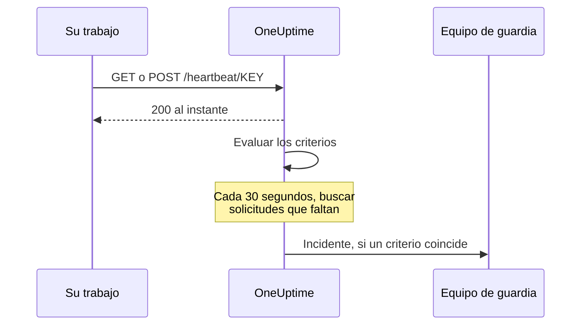

# Monitor de solicitudes entrantes

Un monitor de solicitudes entrantes le da una URL a la que otros sistemas envían solicitudes HTTP. OneUptime evalúa cada solicitud con sus criterios y puede cambiar el estado del monitor, declarar incidentes y avisar a su equipo de guardia.

Cubre dos trabajos distintos:

- **Monitoreo por latido** — un trabajo cron, un worker o un dispositivo llama a la URL de forma programada, y OneUptime abre un incidente cuando las llamadas dejan de llegar.
- **Recibir alertas de otro sistema** — Prometheus Alertmanager, Grafana o cualquier cosa capaz de enviar JSON por POST envía sus alertas, y OneUptime convierte cada una en un incidente con escalado de guardia y resolución automática al recuperarse.

Ambos usan el mismo tipo de monitor. Lo que los separa son los criterios que configura.

:::cards
- [Crear el monitor](#crear-un-monitor-de-solicitudes-entrantes): Obtenga una URL de latido en pocos pasos.
- [Enviar un latido](#enviar-un-latido): Desde curl, cron, Node.js, Python o Go.
- [Alertar cuando cesan las llamadas](#marcar-sin-conexión-si-no-hay-latido-en-10-minutos-un-interruptor-de-hombre-muerto): Convierta el monitor en un interruptor de hombre muerto.
- [Recibir alertas](#recibir-alertas-de-otro-sistema): Un incidente por cada alerta de Alertmanager o Grafana.
:::

## Cómo funciona

Nada comprueba su sistema desde fuera: su sistema llama a la URL del monitor, OneUptime responde al instante y luego evalúa la solicitud con los criterios del monitor. Un criterio que busca solicitudes que *dejaron* de llegar también se vuelve a comprobar en segundo plano cada 30 segundos, para que el silencio también pueda abrir un incidente.



Úselo para:

- Monitorear trabajos cron y tareas programadas
- Verificar que los workers en segundo plano están en marcha
- Monitorear servicios detrás de cortafuegos a los que no se puede llegar desde fuera
- Recibir alertas de Prometheus Alertmanager, Grafana y otros sistemas de alertas
- Seguir las señales de latido de cualquier sistema capaz de usar HTTP

## Crear un monitor de solicitudes entrantes

:::steps
### Empezar un monitor nuevo

Vaya a **Monitores** y haga clic en **Crear monitor**.

### Elegir Solicitud entrante

En **Tipo de monitor**, elija **Solicitud entrante**: es uno de los tipos habituales de la parte superior. Introduzca un **Nombre** y haga clic en **Siguiente**.

### Revisar los criterios

El paso **Criterios** empieza con [los criterios predeterminados](#lo-que-obtiene-de-entrada). Para un latido, haga clic en **Añadir criterios** y dé al nuevo criterio un filtro **Solicitud entrante** / **Not Recieved In Minutes** que cambie el estado a sin conexión y declare un incidente, con **Resolver incidente automáticamente** activado. Después, arrástrelo al principio de la lista; consulte [Criterios de ejemplo](#criterios-de-ejemplo) para saber por qué.

### Crear el monitor

Haga clic en **Crear monitor**. El monitor se abre en su página **Vista general**, donde la tarjeta **Envía el primer latido** muestra la **URL de latido** con un botón para copiar y un comando `curl` de ejemplo.

### Enviar la primera solicitud

Configure su servicio para que envíe solicitudes a esa URL (consulte [Enviar un latido](#enviar-un-latido)). Cuando llega la primera solicitud, la tarjeta deja paso al historial del monitor, y una tarjeta **URL de latido** muestra la URL y cuándo llegó la última solicitud.
:::

> [!NOTE]
> La URL contiene la clave secreta del monitor, así que solo pueden verla las personas que pueden editar monitores. Puede volver a encontrarla en cualquier momento en la página **Documentación** del monitor, en la sección **Configuración** de su menú lateral.

## La URL de solicitud

Su monitor tiene una URL única con este formato:

```text
https://oneuptime.com/heartbeat/YOUR_SECRET_KEY
```

Sustituya `https://oneuptime.com` por la URL de su instancia de OneUptime si la aloja usted mismo.

Envíe solicitudes **GET** o **POST** a esta URL. HEAD se acepta y se trata como GET; PUT, PATCH y DELETE devuelven 404. La clave secreta de la ruta es la única credencial: no hace falta ninguna cabecera ni token. Las cadenas de consulta se ignoran: envíe lo que deban leer los criterios en el cuerpo o en las cabeceras.

> [!WARNING]
> Cualquiera que conozca esta URL puede marcar el monitor como sano, así que trátela como un secreto. Si se filtra, abra la página **Ajustes** del monitor y haga clic en **Restablecer clave secreta de solicitud entrante**, y después actualice cada emisor. Cada cabecera que envía se guarda en el monitor y la ve cualquiera que pueda leerlo: no envíe claves de API ni tokens en las cabeceras a este endpoint.

> [!IMPORTANT]
> OneUptime responde `200` con un objeto JSON vacío (`{}`) al instante y procesa la solicitud en una cola. Esa respuesta se escribe antes de cualquier validación, así que un `200` **no** confirma que la solicitud se aceptó: una clave secreta incorrecta, un monitor eliminado y un monitor desactivado también devuelven `200`. Revise la cronología del monitor para confirmar que las solicitudes llegan.

### Enviar un cuerpo de solicitud

Si quiere acceder a campos dentro del cuerpo (`{{requestBody.status}}` en un título de incidente, una ruta JSON en la agrupación de incidentes o un criterio de expresión JavaScript), envíe `Content-Type: application/json`. Es el formato que esta documentación da por supuesto en todo momento. El cuerpo debe ser un objeto o un array JSON: un JSON mal formado, o un valor suelto como `"error"`, se rechaza con un `500`.

| Tipo de contenido | Qué ven los criterios y las plantillas |
| --- | --- |
| `application/json` | El JSON analizado. |
| `application/x-www-form-urlencoded` | El formulario analizado. Las claves entre corchetes se anidan (`alerts[0][status]=firing`), y cada valor es una cadena. |
| Cualquier otro, o ninguno | Un cuerpo vacío (`{}`), así que cada referencia a `requestBody` no da nada. |

Se aceptan cuerpos de hasta 50 MB; uno más grande se rechaza con un `413`. No comprima el cuerpo con `Content-Encoding: gzip`: no se guarda como JSON, y las rutas dentro de él no se resolverán.

### Enviar un latido

Cada ejemplo envía una solicitud. Sustituya `YOUR_SECRET_KEY` por la clave de la URL de su monitor.

:::tabs
@tab curl
```bash
# Simple GET request
curl https://oneuptime.com/heartbeat/YOUR_SECRET_KEY

# POST request with a JSON body
curl -X POST https://oneuptime.com/heartbeat/YOUR_SECRET_KEY \
  -H "Content-Type: application/json" \
  -d '{"status": "healthy", "version": "1.2.3"}'
```
@tab Cron
```bash
# Send a heartbeat every 5 minutes
*/5 * * * * curl -fsS https://oneuptime.com/heartbeat/YOUR_SECRET_KEY > /dev/null

# Or ping only when the job succeeds, so a failed run counts as a missed heartbeat
0 2 * * * /usr/local/bin/backup.sh && curl -fsS https://oneuptime.com/heartbeat/YOUR_SECRET_KEY > /dev/null
```
@tab Node.js
```javascript title="heartbeat.mjs"
// Node.js 18 or later: fetch is built in. Run with `node heartbeat.mjs`.
const response = await fetch(
  "https://oneuptime.com/heartbeat/YOUR_SECRET_KEY",
  {
    method: "POST",
    headers: { "Content-Type": "application/json" },
    body: JSON.stringify({ status: "healthy", version: "1.2.3" }),
  },
);

console.log(response.status); // 200
```
@tab Python
```python title="heartbeat.py"
# Python 3, standard library only. Run with `python3 heartbeat.py`.
import json
import urllib.request

request = urllib.request.Request(
    "https://oneuptime.com/heartbeat/YOUR_SECRET_KEY",
    data=json.dumps({"status": "healthy", "version": "1.2.3"}).encode(),
    headers={"Content-Type": "application/json"},
    method="POST",
)

with urllib.request.urlopen(request, timeout=10) as response:
    print(response.status)  # 200
```
@tab Go
```go title="heartbeat.go"
// Run with `go run heartbeat.go`.
package main

import (
	"bytes"
	"fmt"
	"net/http"
)

func main() {
	body := []byte(`{"status": "healthy", "version": "1.2.3"}`)

	resp, err := http.Post(
		"https://oneuptime.com/heartbeat/YOUR_SECRET_KEY",
		"application/json",
		bytes.NewReader(body),
	)
	if err != nil {
		panic(err)
	}
	defer resp.Body.Close()

	fmt.Println(resp.StatusCode) // 200
}
```
@tab PowerShell
```powershell
# Windows PowerShell 5.1 or PowerShell 7
Invoke-RestMethod -Method Post `
  -Uri "https://oneuptime.com/heartbeat/YOUR_SECRET_KEY" `
  -ContentType "application/json" `
  -Body '{"status": "healthy", "version": "1.2.3"}'
```
:::

## Criterios de monitoreo

Puede configurar criterios para decidir cuándo su servicio se considera en línea, degradado o sin conexión. Cada filtro de criterio tiene un **Tipo de filtro** (qué se mira), una **Condición de filtro** (cómo se compara) y un **Valor**.

### Lo que obtiene de entrada

Un monitor de solicitudes entrantes nuevo se crea con dos criterios que leen el cuerpo de la solicitud:

| Criterio | Tipo de filtro | Condición de filtro | Valor | Efecto |
| -------- | ------------ | ---------------- | ------- | -------------------------------------------- |
| Sin conexión | Cuerpo de la solicitud | Contiene | `error` | Marca el monitor sin conexión, abre un incidente |
| En línea | Cuerpo de la solicitud | Not Contains | `error` | Marca el monitor en línea |

Esto sirve para el caso habitual en que el emisor informa de su propio estado en la carga útil: una solicitud cuyo cuerpo menciona `error` deja el monitor sin conexión, y la siguiente solicitud sin esa palabra lo devuelve a en línea y resuelve el incidente. Una solicitud sin ningún cuerpo cuenta como «no contiene `error`», así que una simple llamada de latido mantiene el monitor en línea.

Cambie el valor por lo que su emisor envía de verdad (`"status":"firing"`, `FAILED`, etc.): la coincidencia es una búsqueda de subcadena que distingue mayúsculas y minúsculas sobre todo el cuerpo, claves incluidas, así que `{"error":null}` también coincide con `error`.

> [!NOTE]
> Estos criterios predeterminados **no** son un interruptor de hombre muerto: nada aquí se activa cuando dejan de llegar solicitudes. Si quiere que se le avise del silencio, añada un criterio **Solicitud entrante** / **Not Recieved In Minutes** como se describe más abajo.

### Tipos de filtro disponibles

| Tipo de filtro | Comprueba | Notas |
| --------------------- | ------------------------------------------------------ | -------------------------------------------------------------------------------------------- |
| Solicitud entrante | Si se recibió una solicitud dentro de una ventana de tiempo | La única comprobación que puede activarse cuando no llega nada |
| Cuerpo de la solicitud | El cuerpo de la solicitud | Coincidencia de subcadena. Los cuerpos de objeto se comparan como JSON compacto |
| Request Header | Los nombres de las cabeceras de la solicitud | Coincidencia exacta con un nombre de cabecera completo, sin distinguir mayúsculas y minúsculas |
| Request Header Value | Los valores de las cabeceras de la solicitud | Coincidencia exacta con un valor de cabecera completo, sin distinguir mayúsculas y minúsculas |
| JavaScript Expression | Cualquier expresión sobre `requestBody` y `requestHeaders` | La opción más flexible; consulte [Expresiones JavaScript](/docs/monitor/javascript-expression) |

### Condiciones de filtro

Cada tipo de filtro ofrece sus propias condiciones:

| Tipo de filtro | Condiciones |
| --- | --- |
| **Solicitud entrante** | **Recieved In Minutes**: se recibió una solicitud dentro del número de minutos indicado. **Not Recieved In Minutes**: no se recibió ninguna solicitud dentro del número de minutos indicado. (El panel las escribe así.) |
| **Cuerpo de la solicitud**, **Request Header**, **Request Header Value** | **Contiene** y **Not Contains** |
| **JavaScript Expression** | **Evaluates To True** |

> [!NOTE]
> Los nombres y valores de las cabeceras se comparan en minúsculas, con el nombre o el valor completo, no con una subcadena: `application/json` no coincide con `application/json; charset=utf-8`. Solo **Cuerpo de la solicitud** busca subcadenas. Las cabeceras que añade su proxy o el balanceador de carga de OneUptime (`x-forwarded-for`, `x-real-ip`) también se guardan.

Los cuerpos de objeto se comparan como JSON compacto sin espacios, así que un filtro **Cuerpo de la solicitud** / **Contiene** debe escribirse `"status":"firing"`: copiar `"status": "firing"` de una carga útil con formato nunca coincidirá.

### Criterios de ejemplo

#### Marcar sin conexión si no hay latido en 10 minutos (un interruptor de hombre muerto)

| Campo | Valor |
| --- | --- |
| **Tipo de filtro** | Solicitud entrante |
| **Condición de filtro** | Not Recieved In Minutes |
| **Valor** | `10` |

#### Marcar como degradado según el contenido del cuerpo de la solicitud

| Campo | Valor |
| --- | --- |
| **Tipo de filtro** | Cuerpo de la solicitud |
| **Condición de filtro** | Contiene |
| **Valor** | `"status":"degraded"` |

> [!IMPORTANT]
> Coloque el interruptor de hombre muerto **por encima** de los criterios predeterminados. Los criterios se comprueban desde arriba, y el primero que coincide decide. La comprobación en segundo plano vuelve a leer la última solicitud, así que el criterio en línea predeterminado —"Request Body Not Contains `error`"— sigue coincidiendo con ella, y un criterio que esté debajo nunca llega a evaluarse. **Añadir criterios** añade un criterio al final: arrástrelo hacia arriba.

> [!WARNING]
> Un monitor solo se vuelve a evaluar en segundo plano si al menos uno de sus criterios comprueba **Solicitud entrante**. Un monitor cuyos criterios solo comprueban el cuerpo de la solicitud, Request Header o una expresión JavaScript se evalúa cuando llega una solicitud y en ningún otro momento, así que nunca puede quedar sin conexión por sí solo. Si quiere una alarma por latido ausente, necesita un criterio **Solicitud entrante**.

La comprobación en segundo plano cuenta minutos completos y se activa cuando ha pasado *más* que el valor: "Not Recieved In Minutes: 10" se activa unos 11 minutos después de la última solicitud (la comprobación se ejecuta cada 30 segundos). Un monitor que nunca ha recibido una solicitud se trata como si su hora de creación fuera la última solicitud, así que el mismo criterio en un monitor recién creado se activa unos 11 minutos después de crearlo, aunque el emisor nunca se haya conectado. Solo cuentan los minutos en los que OneUptime estaba recibiendo: los minutos en los que el propio OneUptime se reinicia, se actualiza o se pone al día no cuentan, como explica [Cuando OneUptime no recibe datos](/docs/monitor/when-oneuptime-is-not-receiving).

## Recibir alertas de otro sistema

Alertmanager, Grafana y herramientas similares envían por POST un documento JSON que describe una o varias alertas. De forma predeterminada, un criterio abre **un** incidente, así que una carga útil con cinco alertas produciría un único incidente. La agrupación de incidentes cambia eso: extrae un valor de la carga útil y abre un **incidente separado por cada valor distinto**, que pueden estar abiertos todos a la vez.

```mermaid title="Agrupación de incidentes: un incidente por alerta de la carga útil"
flowchart TB
    payload["Carga útil del webhook"] --> keys["Una clave por alerta"]
    keys --> state{"¿Alerta resuelta?"}
    state -->|No| open["Abrir o mantener su incidente"]
    state -->|Sí| resolve["Resolver su incidente"]
```

### Activar la agrupación de incidentes

:::steps
1. Abra el criterio y despliegue **Ajustes**.
2. Active **Agrupa incidentes y alertas por un campo de la carga útil**.
3. Rellene **Abrir un incidente separado para cada…**. Para que cada incidente se resuelva solo, rellene también el campo y el valor de **Auto-resolve each incident when…** (más abajo). Después, guarde el monitor.
:::

| Campo | Ejemplo | Qué hace |
| ---------------------------------- | ---------------------------------------- | ---------------------------------------------------------------------- |
| Abrir un incidente separado para cada… | `requestBody.alerts[*].labels.alertname` | La ruta cuyos valores distintos separan los incidentes |
| Campo que indica la recuperación | `requestBody.alerts[*].status` | La ruta que se comprueba para decidir que una alerta se ha recuperado |
| Valor que significa recuperado | `resolved` | El valor exacto que marca la recuperación |
| Máximo de incidentes por solicitud | `100` (predeterminado) | Límite de seguridad para que un campo con muchos valores no pueda abrir incidentes sin límite |

### Sintaxis de las rutas

Las rutas deben empezar por el prefijo literal `requestBody.`. Una ruta sin él —`alerts[*].labels.alertname`— no coincide con nada, sin avisar. La envoltura `{{ }}` es opcional: `requestBody.status` y `{{requestBody.status}}` se comportan igual.

- `[*]` se despliega sobre un array: un incidente por valor **distinto**. Dos elementos que dan el mismo valor se funden en un solo incidente, y su estado (activo/resuelto) se toma del **primer** elemento que coincide. **Solo el primer `[*]` de una ruta es un comodín**; `requestBody.groups[*].alerts[*].name` no coincide con nada.
- `[0]` y `[last]` seleccionan un único elemento, y pueden ir después de un `[*]`.
- Los valores de objeto y de array, las cadenas vacías y los valores nulos se omiten. `0` y `false` son claves válidas.
- El cuerpo debe ser un objeto JSON; una carga útil cuyo nivel superior es un array no se agrupa.

### La resolución depende de los eventos

Un webhook solo describe lo que hay en esa carga útil, así que OneUptime nunca resuelve un incidente porque su clave haya dejado de aparecer. Un incidente solo se resuelve cuando una carga útil dice explícitamente que esa clave se ha recuperado. Deben cumplirse las dos cosas:

1. **Campo que indica la recuperación** y **Valor que significa recuperado** están definidos y coinciden con la carga útil. La comparación es exacta y distingue mayúsculas y minúsculas: `Resolved` no coincide con `resolved`.
2. El incidente del criterio tiene activado **Resolver incidente automáticamente**, en **Más campos** del formulario del incidente. Sin ello, los eventos de recuperación que coinciden se ignoran y los incidentes siguen abiertos. (Lo mismo vale para las alertas y **Resolver alerta automáticamente**.) El criterio predeterminado de sin conexión lo tiene activado desde el principio; un incidente que añade usted mismo a un criterio empieza con la opción desactivada.

**Máximo de incidentes por solicitud** limita la extracción, no solo la creación. Las claves que superan el límite también son invisibles para la recuperación, así que, en una carga útil con más claves distintas que el límite, una alerta que informe `resolved` por encima de él no cerrará su incidente.

> [!NOTE]
> Cuando un monitor recibe solicitudes más rápido de lo que OneUptime las evalúa, evalúa la más reciente y se salta las intermedias, así que una ráfaga de webhooks puede dejar sin evaluar una alerta activa o una resuelta. En un servidor autoalojado, definir `INCOMING_REQUEST_INGEST_COALESCE_ENABLED=false` en el entorno de la aplicación OneUptime evalúa cada solicitud por separado.

> [!WARNING]
> Si **Campo que indica la recuperación** contiene `[*]` pero **Abrir un incidente separado para cada…** no, nunca se resolverá nada. Use `[*]` en ambos, o en ninguno. Una ruta de recuperación sin `[*]` se evalúa sobre toda la carga útil, así que un `status: resolved` a nivel de la carga útil resuelve todas las claves de esa carga útil, incluidas las alertas cuyo propio estado sigue activo.

### Poner nombre a los incidentes

La clave de agrupación se expone a las plantillas de incidentes y alertas como una variable que lleva el nombre del **último segmento de la ruta**:

| Ruta | Variable |
| ---------------------------------------- | ----------------- |
| `requestBody.alerts[*].labels.alertname` | `{{alertname}}`   |
| `requestBody.alerts[*].fingerprint`      | `{{fingerprint}}` |
| `requestBody.commonLabels.severity`      | `{{severity}}`    |

La carga útil completa está disponible junto a ella, así que funcionan tanto un título de incidente `{{alertname}}` como una descripción que haga referencia a `{{requestBody.commonAnnotations.summary}}`. Consulte [Plantillas de incidentes y alertas](/docs/monitor/incident-alert-templating).

> [!WARNING]
> El nombre de la variable forma parte de la identidad que usa OneUptime para emparejar un evento de recuperación con un incidente abierto. Cambiar la ruta de agrupación por otra con un último segmento distinto deja huérfanos todos los incidentes abiertos con la ruta anterior: ya no se pueden resolver automáticamente y hay que cerrarlos a mano.

`[*]` funciona **solo** en los dos campos de ruta de agrupación. En cualquier otro lugar no se resuelve, y un marcador sin resolver se imprime **tal cual** en lugar de vaciarse: un título `{{requestBody.alerts[*].labels.alertname}}` se muestra con las llaves. Un título `{{requestBody.alerts[0].annotations.summary}}` sí se resuelve, pero siempre lee la primera alerta de la carga útil, no la que abrió este incidente. Prefiera la variable de agrupación más los campos compartidos `commonAnnotations` de la carga útil.

### Ejemplo completo

Para una configuración completa de Alertmanager, consulte [Prometheus Alertmanager](/docs/integrations/prometheus-alertmanager). Para Grafana, consulte [Grafana](/docs/integrations/grafana).

## Buenas prácticas

1. **Ajuste bien la ventana de tiempo**: si su trabajo cron se ejecuta cada 5 minutos, ponga el umbral de "Not Recieved In Minutes" en 10–15 minutos para admitir retrasos ocasionales, y ponga ese criterio el primero.
2. **Incluya datos útiles**: envíe información de estado en el cuerpo de la solicitud para poder definir criterios detallados.
3. **Use POST con `Content-Type: application/json`**: todo lo que lee dentro del cuerpo depende de ello.
4. **No mezcle los dos trabajos en un mismo monitor**: un monitor que recibe alertas por eventos no tiene un ritmo regular, así que un criterio "Not Recieved In Minutes" en él oscilaría. Use un monitor aparte para el interruptor de hombre muerto.
5. **Vigile al vigilante**: asegúrese de que el servicio que envía las solicitudes gestiona bien los errores, para que las solicitudes fallidas no pasen desapercibidas.

## Solución de problemas

:::details Mi emisor recibe un 200, pero no aparece nada en el monitor
El `200` se envía antes de validar la solicitud, así que no demuestra que se haya aceptado. Compruebe que la clave secreta de la URL coincide con la **URL de latido** del monitor, y que el monitor no está desactivado. Después, mire la cronología del monitor para ver si llegan solicitudes.
:::

:::details El monitor nunca queda sin conexión cuando cesan los latidos
Solo un criterio **Solicitud entrante** (**Not Recieved In Minutes**) puede notar el silencio. Añada uno si no lo hay, y arrástrelo por encima de los criterios predeterminados: el criterio en línea predeterminado coincide con la última solicitud en cada comprobación en segundo plano, y el primer criterio que coincide decide.
:::

:::details Un filtro Cuerpo de la solicitud nunca coincide
Envíe `Content-Type: application/json`, y escriba el valor como JSON compacto: `"status":"firing"`, sin espacio después de los dos puntos. Sin un tipo de contenido JSON o de formulario, el cuerpo no se analiza.
:::

:::details Un filtro Request Header nunca coincide
Los nombres y valores de las cabeceras se comparan completos. Indique el valor entero, como `application/json; charset=utf-8`, en lugar de una parte.
:::

:::details El emisor recibe un 500
La solicitud dice `Content-Type: application/json` pero su cuerpo no es un objeto ni un array JSON. Envíe JSON válido, o un tipo de contenido distinto.
:::

## Próximos pasos

:::cards
- [Prometheus Alertmanager](/docs/integrations/prometheus-alertmanager): Una configuración completa de alertas entrantes.
- [Grafana](/docs/integrations/grafana): Lo mismo, para las alertas de Grafana.
- [Plantillas de incidentes y alertas](/docs/monitor/incident-alert-templating): Todas las variables disponibles en títulos y descripciones.
- [Expresiones JavaScript](/docs/monitor/javascript-expression): Sintaxis de las expresiones y reglas de comillas.
:::
