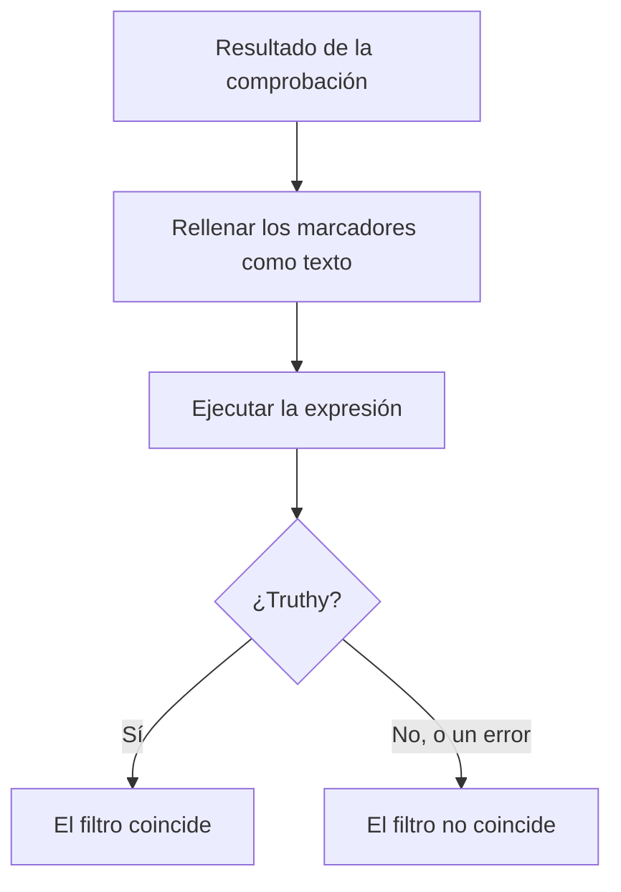

# Expresiones JavaScript

Un filtro de criterio **JavaScript Expression** decide si se cumple el criterio de un monitor con una línea de JavaScript en lugar de una comparación fija. Úselo cuando los filtros integrados no puedan expresar la condición — un campo dentro de una respuesta JSON, dos valores comparados entre sí, o varias comprobaciones combinadas con `&&` y `||`.

:::cards
- [Cómo funciona](#cómo-funciona): Se rellenan los marcadores y luego se ejecuta la expresión.
- [Variables](#variables-por-tipo-de-monitor): Lo que le ofrece cada tipo de monitor.
- [Ejemplos](#ejemplos): Expresiones para API, solicitudes entrantes y bases de datos.
- [Reglas de comillas](#reglas-de-comillas): El error que comete casi todo el mundo.
:::

## Cómo funciona

Antes de que se ejecute la expresión, cada marcador `{{variable}}` que contiene se sustituye por el valor de la última comprobación del monitor — como texto plano. Después, el resultado se ejecuta como JavaScript. Si da un valor verdadero (truthy), el filtro coincide; cualquier otra cosa, incluido un error, significa que no coincide.



Como los marcadores se sustituyen como texto, `{{responseBody.item}}` se convierte en el valor sin procesar. Una cadena tiene que ir entre comillas para ser una cadena de JavaScript; un número o un booleano no — consulte [Reglas de comillas](#reglas-de-comillas). Las expresiones se ejecutan en el servidor de OneUptime, en un entorno aislado.

## Añadir un filtro JavaScript Expression

:::steps
### Abrir los criterios

En el monitor, abra **Configuración → Criterios** y haga clic en **Editar criterios de monitoreo**, o use el paso **Criterios** de **Crear monitor**. Trabaje en el criterio que quiera cambiar, o haga clic en **Añadir criterios** para uno nuevo.

### Añadir un filtro

En **Filtros**, haga clic en **Añadir filtro** y ponga su **Tipo de filtro** en **JavaScript Expression**. La **Condición de filtro** es **Evaluates To True**.

### Escribir la expresión

Introduzca la expresión en **Valor**, usando las [variables del tipo de monitor](#variables-por-tipo-de-monitor). El enlace bajo el filtro, **Lee aquí la documentación sobre el uso de expresiones de JavaScript.**, abre esta página.

### Guardar

Guarde el monitor. El filtro se evalúa en la siguiente comprobación del monitor.
:::

## Variables por tipo de monitor

Las expresiones JavaScript se ofrecen para los monitores de tipo Sitio web, API, Solicitud entrante, Incoming Email, Consulta SQL y Salud de la base de datos.

### Monitores de sitio web y de API

| Variable | Descripción | Tipo |
| --- | --- | --- |
| `responseBody` | El cuerpo de la respuesta. Si el cuerpo de la respuesta es JSON, se analiza; si no, como en HTML o XML, es una cadena. | `string` o `JSON` |
| `responseHeaders` | Las cabeceras de la respuesta, con los nombres en minúsculas. | `Dictionary<string>` |
| `responseStatusCode` | El código de estado de la respuesta. | `number` |
| `responseTimeInMs` | El tiempo de respuesta en milisegundos. | `number` |
| `isOnline` | Si el monitor cuenta la respuesta como en línea. | `boolean` |

### Monitores de solicitudes entrantes

| Variable | Descripción | Tipo |
| --- | --- | --- |
| `requestBody` | El cuerpo de la solicitud. | `string` o `JSON` |
| `requestHeaders` | Las cabeceras de la solicitud, con los nombres en minúsculas. | `Dictionary<string>` |

### Monitores de consultas SQL

| Variable | Descripción | Tipo |
| --- | --- | --- |
| `rowCount` | El número de filas que devolvió la consulta. | `number` |
| `scalarValue` | La primera columna de la primera fila. | cualquiera |
| `firstRow` | La primera fila, como pares columna/valor. | `JSON` |
| `executionTimeInMs` | Cuánto tardó la consulta, en milisegundos. | `number` |
| `queryError` | El error de la consulta, si lo hubo. | `string` |
| `isOnline` | Si la base de datos era accesible y la consulta tuvo éxito. | `boolean` |

### Monitores de salud de la base de datos

`isOnline`, `engineVersion`, `connectionError`, `collectedGroups`, `unavailableGroups` y `metrics`. Consulte [Variables de expresiones JavaScript](/docs/monitor/database-health-monitor#variables-de-las-expresiones-de-javascript) en la página del monitor de salud de la base de datos.

### Monitores de correos entrantes

El filtro se ofrece, pero no tiene campos de correo vinculados: una expresión no puede leer el asunto, el remitente, el cuerpo ni el destinatario. Use en su lugar los tipos de filtro de correo — consulte [Monitor de correos entrantes](/docs/monitor/incoming-email-monitor#tipos-de-filtro-disponibles).

## Ejemplos

Cada línea de abajo es una expresión completa. Para un cuerpo de respuesta JSON como este:

```json
{
  "item": "hello",
  "count": 3,
  "items": [{ "name": "hello" }]
}
```

| Expresión | Coincide cuando |
| --- | --- |
| `"{{responseBody.item}}" === "hello"` | El campo `item` es `hello`. |
| `{{responseBody.count}} > 2` | El campo `count` es mayor que 2. |
| `"{{responseBody.items[0].name}}" === "hello"` | El primer elemento de `items` tiene el nombre `hello`. |
| `{{responseStatusCode}} === 200 && {{responseTimeInMs}} < 500` | El estado es 200 y la respuesta tardó menos de medio segundo. |
| `/hel+o/.test("{{responseBody.item}}")` | El campo `item` coincide con una expresión regular. |
| `"{{responseHeaders.content-type}}".startsWith("application/json")` | La respuesta es JSON. Los nombres de las cabeceras van en minúsculas. |

Combine condiciones con `&&` y `||`, y agrúpelas con paréntesis:

```javascript
({{responseStatusCode}} === 200 || {{responseStatusCode}} === 204) && {{responseTimeInMs}} < 1000
```

Para un monitor de solicitudes entrantes que recibe `{"status": "degraded", "region": "eu"}` como `Content-Type: application/json`:

```javascript
"{{requestBody.status}}" === "degraded" && "{{requestBody.region}}" === "eu"
```

Para un monitor de consultas SQL cuya consulta devuelve un recuento, alertar ante un recuento alto o una consulta lenta:

```javascript
{{scalarValue}} > 50 || {{executionTimeInMs}} > 2000
```

Para un monitor de salud de la base de datos, lea una métrica indexando todo el objeto `metrics` — los nombres de las series contienen puntos, así que no pueden ir dentro de las llaves:

```javascript
{{metrics}}['oneuptime.monitor.database.connections.used.percent'] > 90
```

## Reglas de comillas

`{{var}}` se sustituye por el valor, como texto. Para comparar una cadena, póngala entre comillas, como en `"{{responseBody.item}}" === "hello"`; para comparar un número, déjelo sin comillas, como en `{{responseStatusCode}} === 200`.

| Tipo de valor | Cómo escribirlo | Ejemplo |
| --- | --- | --- |
| Cadena | Entre comillas | `"{{responseBody.status}}" === "ok"` |
| Número | Sin comillas | `{{responseTimeInMs}} < 500` |
| Booleano | Sin comillas | `{{isOnline}} === true` |
| Objeto o matriz | Sin comillas, y luego indexado | `{{responseHeaders}}['content-type']` |

Tres cosas a vigilar:

- **Un marcador entre comillas por sí solo siempre es verdadero.** `"{{responseBody.healthy}}"` es la cadena no vacía `"false"` cuando el campo es `false`. Compárelo: `"{{responseBody.healthy}}" === "true"`, o déjelo sin comillas: `{{responseBody.healthy}} === true`.
- **Los valores no se escapan.** Un valor que contiene una comilla doble o un salto de línea termina la cadena antes de tiempo, y la expresión falla. Para buscar texto en una página HTML, use en su lugar el filtro **Cuerpo de la respuesta**.
- **Una ruta que no existe se queda como está.** Si la comprobación no tiene ese campo, `{{responseBody.item}}` se queda tal cual en la expresión, lo que suele ser un error de sintaxis — así que el filtro no coincide.

## Límites

Una expresión tiene 5 segundos para ejecutarse. Una que tarda más, o que lanza un error, no coincide, y el error se escribe en el registro del servidor de OneUptime.

## Solución de problemas

:::details La expresión nunca coincide
Revise primero las comillas: un marcador de cadena sin comillas se convierte en una palabra suelta, lo que es un error de sintaxis, y un error nunca coincide. Después, compruebe que la ruta existe en el resultado de la comprobación — un marcador de una ruta que no existe no se rellena.
:::

:::details La expresión siempre coincide
Un marcador entre comillas por sí solo es una cadena no vacía, que siempre es truthy. Compárelo con un valor.
:::

## Próximos pasos

:::cards
- [Plantillas de incidentes y alertas](/docs/monitor/incident-alert-templating): Usar los mismos marcadores en los títulos y descripciones de los incidentes.
- [Monitor de API](/docs/monitor/api-monitor): Comprobar un endpoint HTTP y su respuesta.
- [Monitor de solicitudes entrantes](/docs/monitor/incoming-request-monitor): Evaluar las solicitudes que le envían otros sistemas.
:::
