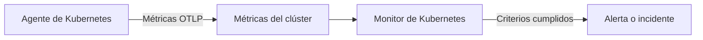

# Monitor de Kubernetes

Un monitor de Kubernetes alerta sobre las métricas que el agente de Kubernetes de OneUptime envía desde un clúster: nodos, pods, contenedores, cargas de trabajo, autoescaladores y el plano de control. Parta de una plantilla de alerta lista para usar, elija una sola métrica o escriba su propia consulta, y luego fije el umbral que abre una alerta o un incidente.

:::cards
- [Instalar el agente](/docs/monitor/kubernetes-agent): Un solo comando de Helm lleva el clúster a OneUptime.
- [Crear el monitor](#crear-un-monitor-de-kubernetes): Elegir el clúster y luego una plantilla, una métrica o una consulta.
- [Plantillas de alerta](#plantillas-de-alerta-listas-para-usar): Diecisiete alertas listas para usar, de CrashLoopBackOff a etcd.
- [Criterios](#criterios-de-monitoreo): Umbrales estáticos y detección de anomalías.
:::

## Cómo funciona

El agente envía las métricas del clúster a OneUptime por OTLP, cada una marcada con el nombre del clúster (`k8s.cluster.name`, el `clusterName` del chart). Los primeros datos de un nombre nuevo registran el clúster en **Kubernetes**, y a partir de ahí el clúster se puede elegir en un monitor de Kubernetes. Cada minuto, el monitor consulta esas métricas en su **Intervalo de tiempo**, las agrega y compara el resultado con sus criterios.

## Antes de empezar

- El agente de Kubernetes de OneUptime en ejecución en el clúster. Consulte [Agente de Kubernetes (instalación con Helm)](/docs/monitor/kubernetes-agent); el clúster aparece en **Kubernetes** unos minutos después de la instalación.
- Para las plantillas del plano de control (**etcd No Leader**, **API Server Request Saturation**, **Scheduler Backlog**): la recopilación del plano de control del agente, `controlPlane.enabled`. Los clústeres gestionados (EKS, GKE, AKS) no exponen estos endpoints, así que esos monitores nunca reciben datos allí.

## Crear un monitor de Kubernetes

:::steps
### Empezar un monitor nuevo

Vaya a **Monitores** y haga clic en **Crear monitor**. En **Más tipos de monitor**, elija **Kubernetes** – o escriba `k8s` en el cuadro de búsqueda.

### Elegir el clúster

Selecciónelo en **Clúster de Kubernetes**. La lista contiene cada clúster desde el que ha informado el agente.

### Elegir qué vigilar

Use una de las tres pestañas:

| Pestaña | Qué elige |
| --- | --- |
| **Quick Setup** | Una [plantilla de alerta lista para usar](#plantillas-de-alerta-listas-para-usar). Rellena la métrica, el ámbito, el intervalo de tiempo y los criterios; aún puede cambiar el **Intervalo de tiempo**. |
| **Custom Metric** | Una métrica del [catálogo de métricas](#catálogo-de-métricas) y luego su **Ámbito del recurso**, filtros, **Agregación** (Promedio, Máximo, Mínimo, Suma o Recuento) e **Intervalo de tiempo**. |
| **Avanzado** | El **Ámbito del recurso**, los filtros y el **Intervalo de tiempo**, y sus propias consultas de métricas y fórmulas en **Seleccionar métricas**, con un gráfico en vivo del resultado. |

### Definir los criterios

Defina cuándo cambia de estado el monitor y cuándo abre una alerta o un incidente – consulte [Criterios de monitoreo](#criterios-de-monitoreo). Una plantilla ya los ha rellenado: revise los umbrales, las gravedades y las políticas de guardia.

### Guardar el monitor

Termine el formulario y guarde. El monitor aparece en **Monitores**, y su estado sigue sus criterios desde la primera evaluación.
:::

## Opciones de configuración

### Ámbito del recurso y filtros

**Ámbito del recurso** fija el nivel en el que se evalúa la métrica y decide qué filtros muestra el formulario. Todos los filtros son opcionales.

| Ámbito | Vigila | Filtros |
| --- | --- | --- |
| Clúster | Todo el clúster | — |
| Espacio de nombres | Los recursos de un espacio de nombres | **Espacio de nombres** |
| Carga de trabajo | Un deployment, statefulset, daemonset, job o cronjob | **Espacio de nombres**, **Nombre de la carga de trabajo** |
| Nodo | Un nodo del clúster | **Nombre del nodo** |
| Pod | Un pod | **Espacio de nombres**, **Nombre del pod** |

### Intervalo de tiempo

**Intervalo de tiempo** es la ventana que cubre la consulta de métricas cada vez que se evalúa el monitor, de **Past 1 Minute** a **Past 365 Days**. Las ventanas cortas (de 1 a 15 minutos) sirven para alertar; las más largas suavizan métricas ruidosas.

### Consultas de métricas y fórmulas

En la pestaña **Avanzado**, cada consulta nombra una métrica, cómo se agregan sus valores y filtros de atributos opcionales. Una **fórmula** combina consultas con aritmética – las plantillas de utilización de nodos, por ejemplo, dividen el uso entre la capacidad asignable.

## Catálogo de métricas

La pestaña **Custom Metric** ofrece estas métricas, agrupadas por tipo de recurso:

| Categoría | Métricas |
| --- | --- |
| Pod | Pod CPU Usage, Pod Memory Usage, Pod Phase (Code), Pod Filesystem Usage, Pod Memory Limit Utilization, Pod CPU Limit Utilization, Pod Network I/O (Cumulative, Both Directions) |
| Nodo | Node CPU Usage, Node Allocatable CPU, Node Memory Usage, Node Filesystem Usage, Node Allocatable Memory, Node Ready Condition, Node Filesystem Available |
| Contenedor | Container Restarts, Container CPU Limit, Container CPU Request, Container Memory Limit, Container Memory Request, Container Ready |
| Carga de trabajo | Deployment Available Replicas, Deployment Desired Replicas, DaemonSet Misscheduled Nodes, DaemonSet Ready Nodes, StatefulSet Ready Replicas, Job Failed Pods, Job Successful Pods |
| HPA | HPA Current Replicas, HPA Desired Replicas, HPA Max Replicas, HPA Min Replicas |
| Plano de control | etcd Has Leader, API Server In-Flight Requests, Scheduler Pending Pods |

> [!NOTE]
> **Pod CPU Usage** y **Node CPU Usage** están en núcleos, no en porcentaje: `0.18` es 0,18 de un núcleo. **Pod Phase (Code)** es un código (1 Pending, 2 Running, 3 Succeeded, 4 Failed, 5 Unknown): agréguelo con Máximo o Mínimo, nunca con Suma. Las métricas del plano de control solo llegan cuando la recopilación del plano de control del agente está activada.

## Criterios de monitoreo

### Qué se evalúa

Estos monitores siempre evalúan el **Metric Value**: el valor de la consulta de métricas o de la fórmula configurada. El formulario de criterios no tiene selector de tipo de filtro; muestra **Métrica**, **Agregación**, **Condición** y **Umbral**.

### Tipos de agregación

| Agregación | Descripción |
| --- | --- |
| Promedio | Valor medio en la ventana de tiempo |
| Suma | Suma de todos los valores |
| Maximum Value | Valor más alto de la ventana de tiempo |
| Minimum Value | Valor más bajo de la ventana de tiempo |
| All Values | Todos los valores deben cumplir el criterio |
| Any Value | Al menos un valor debe cumplirlo |

### Condiciones

Los umbrales estáticos se comparan con el **Umbral** que introduce: **Greater Than**, **Less Than**, **Greater Than Or Equal To**, **Less Than Or Equal To** y **Equal To**.

La detección de anomalías frente a una referencia no necesita umbral. Elija una de estas condiciones, y el formulario muestra **Sensibilidad** y **Ventana de referencia** en su lugar:

| Condición | Coincide cuando el valor |
| --- | --- |
| **Anomalously High** | Sube por encima del rango esperado |
| **Anomalously Low** | Baja por debajo del rango esperado |
| **Anomalous** | Sale del rango esperado en cualquier dirección |

Cada muestra se compara con una referencia de la misma hora de la semana construida a partir de la **Ventana de referencia** (14 días de forma predeterminada; 28, 60 o 90 días). **Sensibilidad** fija la anchura del rango esperado: **Bajo (4σ — solo desviaciones flagrantes)**, **Medio (3σ — recomendado)**, el predeterminado, o **Alto (2σ — con más ruido, servicios muy estables)**. Las condiciones de anomalía permanecen en un estado «Learning» y no producen alertas hasta que existe al menos la ventana de referencia elegida de historial de la métrica.

**Si no hay datos**, en **Más campos**, decide qué ocurre cuando la consulta no devuelve nada en la ventana: **Ignore** (el predeterminado) no coincide, **Disparador** trata el silencio como el problema y **Treat As Zero** compara un cero. El tiempo en que el propio OneUptime no estaba recibiendo nunca cuenta como falta de datos: una comprobación cuya ventana lo contiene espera en su lugar, como explica [Cuando OneUptime no recibe datos](/docs/monitor/when-oneuptime-is-not-receiving).

## Plantillas de alerta listas para usar

La pestaña **Quick Setup** enumera estas plantillas, agrupadas por categoría. Cada una rellena dos criterios: uno que marca el monitor como sin conexión y abre un incidente y una alerta mientras se cumple la condición, y otro que lo vuelve a poner en línea cuando deja de cumplirse.

| Plantilla | Categoría | Se dispara cuando | Gravedad |
| --- | --- | --- | --- |
| CrashLoopBackOff Detection | Carga de trabajo | Un contenedor se ha reiniciado más de 5 veces desde que se creó su pod | Crítico |
| Pod Stuck in Pending | Programación | Algún pod está en la fase Pending en cada muestra de una ventana de 15 minutos | Advertencia |
| Node Not Ready | Nodo | Un nodo informa NotReady | Crítico |
| High Node CPU Utilization | Nodo | El uso medio de CPU de un nodo supera el 90 % de su CPU asignable | Advertencia |
| High Node Memory Utilization | Nodo | El uso medio de memoria de un nodo supera el 85 % de su memoria asignable | Advertencia |
| Deployment Replica Mismatch | Carga de trabajo | Un deployment tiene menos réplicas disponibles de las deseadas durante 15 minutos | Advertencia |
| Job Failures | Carga de trabajo | Un job tiene pods fallidos | Advertencia |
| etcd No Leader | Plano de control | etcd no tiene un líder elegido | Crítico |
| API Server Request Saturation | Plano de control | El servidor de API mantiene 200 o más solicitudes en curso durante toda la ventana | Crítico |
| Scheduler Backlog | Programación | La cola de pods pendientes del scheduler no está vacía durante 5 minutos | Advertencia |
| High Node Disk Usage | Almacenamiento | El sistema de archivos de un nodo está lleno en más del 90 % | Advertencia |
| DaemonSet Misscheduled Nodes | Carga de trabajo | Un DaemonSet ejecuta pods en nodos que ya no coinciden con su selector de nodos, su afinidad o sus tolerancias | Advertencia |
| High Node CPU Request Commitment | Nodo | La suma de las solicitudes de CPU de los contenedores de un nodo supera el 90 % de su CPU asignable | Advertencia |
| High Node Memory Request Commitment | Nodo | La suma de las solicitudes de memoria de los contenedores de un nodo supera el 90 % de su memoria asignable | Advertencia |
| HPA Saturated at Max Replicas | Carga de trabajo | Un HPA funciona al 90 % o más de su `maxReplicas` | Crítico |
| Pod Memory Saturating Container Limit | Carga de trabajo | Un pod usa más del 90 % del límite de memoria de sus contenedores | Crítico |
| Pod CPU Saturating Container Limit | Carga de trabajo | Un pod usa más del 90 % del límite de CPU de sus contenedores | Advertencia |

Las plantillas sobre métricas por objeto evalúan cada nodo, pod, deployment, job, DaemonSet o HPA por separado, de modo que un clúster con varios pods en mal estado recibe un incidente por pod en lugar de uno para todo el clúster.

> [!NOTE]
> **CrashLoopBackOff Detection** lee el número de reinicios del contenedor durante toda la vida de su pod actual, no una tasa. Un contenedor que entró en un bucle de fallos y luego se recuperó mantiene la alerta abierta hasta que se sustituye su pod.

### Detectar causas, no solo síntomas

Las plantillas a nivel de nodo (High Node CPU Utilization, High Node Memory Utilization, Node Not Ready, Pod Stuck in Pending) se disparan al *final* de una cadena de agotamiento de recursos, cuando el clúster ya está degradado. Tres plantillas se disparan al *principio*, que es donde suele estar la solución:

- **Pod Memory Saturating Container Limit** y **Pod CPU Saturating Container Limit** detectan una carga de trabajo pegada a sus propios límites. Superar un límite de memoria provoca un OOMKill inmediato; superar un límite de CPU hace que el kernel limite el pod, que se vuelve más lento sin llegar a dar error. Ambas son la causa habitual detrás de CrashLoopBackOff y de latencias inexplicables.
- **HPA Saturated at Max Replicas** detecta un autoescalador sin margen. Una carga de trabajo con límites por pod demasiado bajos se limita o se mata, lo que infla precisamente la métrica con la que escala el HPA, así que el autoescalador sigue añadiendo réplicas igual de escasas de recursos hasta llegar a su techo. Subir los límites es la solución; subir `maxReplicas` lo empeora.

Actívelas juntas en cualquier espacio de nombres que ejecute una carga de trabajo con autoescalado: la combinación distingue «de verdad necesita más capacidad» de «tiene pocos recursos por pod».

> [!NOTE]
> Las dos plantillas de límite de pod dividen el uso del pod entre la **suma** de los límites de sus contenedores, así que los pods con sidecars se miden correctamente. La cifra de memoria de pod del kubelet incluye caché de páginas recuperable, de modo que una carga de trabajo que usa muchos archivos puede quedarse alta en la plantilla de memoria sin llegar nunca a un OOMKill: léala como «se acerca al límite», no como «está a punto de morir».

## Solución de problemas

:::details El clúster no aparece en la lista Clúster de Kubernetes
Los clústeres se registran solos a partir de los datos del agente, con el `clusterName` con el que se instaló el agente. Compruebe que los pods del agente están en ejecución y que el clúster aparece en **Productos → Infraestructura → Kubernetes → Todos los clústeres**. [Agente de Kubernetes (instalación con Helm)](/docs/monitor/kubernetes-agent) cubre la instalación y qué comprobar cuando no llegan datos.
:::

:::details Una plantilla del plano de control nunca se dispara
**etcd No Leader**, **API Server Request Saturation** y **Scheduler Backlog** leen métricas que solo recopila la recopilación del plano de control del agente. Active `controlPlane.enabled` en los valores de Helm del agente; está desactivada de forma predeterminada. Los clústeres gestionados (EKS, GKE, AKS) no exponen estos endpoints, así que en ellos estos monitores nunca reciben datos.
:::

:::details Un umbral de CPU nunca se dispara
**Pod CPU Usage** y **Node CPU Usage** están en núcleos, no en porcentaje, así que un umbral de `80` significa 80 núcleos. Fije el umbral en núcleos, o parta de **High Node CPU Utilization** o de **Pod CPU Saturating Container Limit**, que comparan un porcentaje.
:::

:::details CrashLoopBackOff Detection sigue abierta después de que el pod se recupere
La plantilla lee el número de reinicios del contenedor durante toda la vida de su pod actual, así que el número no vuelve a bajar una vez que ha superado 5. La alerta se resuelve cuando se sustituye el pod, por ejemplo con un nuevo despliegue, un desalojo o el vaciado de un nodo.
:::

## Próximos pasos

:::cards
- [Agente de Kubernetes (instalación con Helm)](/docs/monitor/kubernetes-agent): Instalar, actualizar y ajustar el agente con Helm.
- [Agente de Kubernetes](/docs/telemetry/kubernetes-agent): Filtros de espacios de nombres, métricas del plano de control, filtros de gravedad de registros y el agente de IA.
- [Monitor de métricas](/docs/monitor/metrics-monitor): Alertar sobre cualquier métrica, incluidas las métricas personalizadas y eBPF del agente.
- [Plantillas de incidentes y alertas](/docs/monitor/incident-alert-templating): Incluir el pod o el nodo afectado en los títulos de los incidentes.
:::
