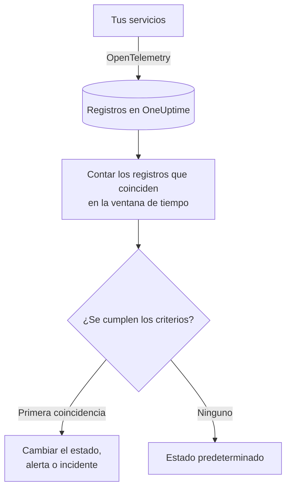
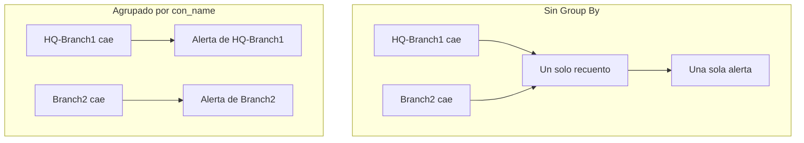

# Monitor de registros

Un monitor de registros cuenta, en una ventana de tiempo, los registros que tus servicios envían a OneUptime y que coinciden con tus filtros (texto, gravedad, servicio, atributos). Cuando el recuento cumple tus criterios, cambia el estado del monitor, crea una alerta o declara un incidente. Úsalo para detectar picos de errores, un mensaje de fallo concreto o un servicio que ha dejado de escribir registros.

:::cards
- [Crear el monitor](#crear-un-monitor-de-registros): Elige qué registros contar y cuándo alertar.
- [Cómo se evalúa](#cómo-se-evalúa): La ventana de tiempo, el recuento y el ciclo de un minuto.
- [Criterios](#criterios): Umbrales, detección de anomalías y los valores predeterminados.
- [Alertas por grupo](#alertas-por-grupo-group-by): Una alerta por túnel, usuario o interfaz.
:::

## Cómo funciona



Cada minuto, OneUptime cuenta los registros que coinciden con los filtros del monitor y llegaron dentro de su ventana de tiempo. Compara ese recuento con los criterios del monitor de arriba abajo, y el primer criterio que coincide decide qué pasa. Si no coincide ninguno, el monitor vuelve a su estado predeterminado.

## Antes de empezar

- Tus servicios envían registros a OneUptime mediante OpenTelemetry (u otra fuente de registros que OneUptime ingiera). Consulta [OpenTelemetry](/docs/telemetry/open-telemetry).
- Para filtrar o agrupar por un valor dentro de la línea de registro, como el nombre de un túnel o de un usuario, conviértelo primero en un atributo con una [canalización de registros](/docs/telemetry/log-pipelines).

## Crear un monitor de registros

:::steps
### Empezar un monitor nuevo

Ve a **Monitores** y haz clic en **Crear monitor**.

### Elegir Logs

En **Tipo de monitor**, haz clic en **Más tipos de monitor** y elige **Registros** en **Telemetría**, o escribe `logs` en el cuadro de búsqueda. Escribe un **Nombre** y haz clic en **Siguiente**.

### Elegir los registros que se cuentan

En **Configuración del monitor de registros**, rellena **Registros del monitor que incluyen este texto**, **Registros del monitor durante (tiempo)** y **Gravedad del registro**. Un filtro que dejas vacío coincide con todos los registros. **Vista previa de registros**, bajo los filtros, muestra los registros con los que coinciden ahora mismo.

### Acotarlos (opcional)

Abre **Más campos** para filtrar por servicio de telemetría, entidad de infraestructura o atributo. Para recibir una alerta por túnel, usuario o interfaz en lugar de una para todo el monitor, añade el atributo en **Group by Attributes**; consulta [Alertas por grupo](#alertas-por-grupo-group-by).

### Definir los criterios

La tarjeta **Criterios del monitor** empieza con dos criterios: fuera de línea, con un incidente, cuando no coincide ningún registro; en línea cuando coincide al menos uno. Cámbialos según lo que quieras alertar; consulta [Criterios](#criterios).

### Crear el monitor

Haz clic en **Crear monitor**. El monitor se abre en su página **Vista general**, y su primera evaluación se ejecuta en menos de un minuto.
:::

## Qué consulta

| Campo | Con qué coincide | Predeterminado |
| --- | --- | --- |
| **Registros del monitor que incluyen este texto** | Registros cuyo cuerpo contiene este texto, sin distinguir mayúsculas y minúsculas. | Vacío: todos los registros |
| **Registros del monitor durante (tiempo)** | Registros de los últimos 5 segundos hasta las últimas 24 horas. | **Último minuto** |
| **Gravedad del registro** | Registros con cualquiera de las gravedades elegidas. | Vacío: todas las gravedades |
| **Group by Attributes** | No es un filtro: cuenta por separado cada combinación de valores de estos atributos. | Vacío: un solo recuento |
| **Filtrar por servicio de telemetría** (en **Más campos**) | Registros de cualquiera de los servicios elegidos. | Vacío: todos los servicios |
| **Filtrar por entidad de infraestructura** (en **Más campos**) | Registros de cualquiera de los hosts, pods, contenedores y otras entidades elegidos. | Vacío: todas las entidades |
| **Filtrar por atributos** (en **Más campos**) | Registros cuyos atributos cumplen todas las condiciones. Cada condición tiene su propio operador, como «es igual a» o «contiene». | Vacío: ninguna condición |

Todos los filtros que definas deben coincidir para que un registro se cuente.

### Gravedad de los registros

Cada registro se guarda con una de siete gravedades. En los registros de OpenTelemetry procede del número de gravedad del registro, así que elige la gravedad, no el texto que imprimió tu logger:

| Gravedad | Números de gravedad de OpenTelemetry |
| --- | --- |
| **Traza** | 1–4 |
| **Depuración** | 5–8 |
| **Información** | 9–12 |
| **Advertencia** | 13–16 |
| **Error** | 17–20 |
| **Fatal** | 21–24 |
| **Sin especificar** | Cualquier otro |

## Cómo se evalúa

- **Cada minuto.** Un monitor de registros no lo comprueban sondas, así que no tiene intervalo que configurar ni página **Sondas e intervalo**.
- **Un número por evaluación.** El monitor cuenta los registros que coinciden con todos los filtros y llegaron dentro de **Registros del monitor durante (tiempo)** antes de la evaluación. Con **Últimos 5 minutos**, cada evaluación mira cinco minutos atrás, así que las ventanas de evaluaciones consecutivas se solapan.
- **Sin registros, el recuento es 0.** Un servicio que deja de escribir registros produce 0, que es lo que busca el criterio de fuera de línea predeterminado.
- **La caída del propio OneUptime no es silencio.** Mientras la ventana de tiempo contenga un periodo en el que OneUptime no recibía datos (se estaba reiniciando, actualizando o poniéndose al día), la comprobación espera: el estado no cambia y no se abre ni se resuelve ningún incidente ni alerta. Consulta [Cuando OneUptime no recibe datos](/docs/monitor/when-oneuptime-is-not-receiving).
- **Criterios de arriba abajo.** Decide el primer criterio que coincide, así que pon primero el más grave. Un monitor agrupado funciona de otra forma: comprueba todos los criterios para cada grupo; consulta [La evaluación de los criterios es distinta](#la-evaluación-de-los-criterios-es-distinta).

Cada cambio de estado, con su motivo, queda registrado en la **Cronología de estados** del monitor.

## Criterios

Los criterios de un monitor de registros tienen un único **Tipo de filtro**: **Log Count**, el número de registros que coincidieron en la ventana. Elige una **Condición de filtro** y, para una condición de umbral, un **Valor**.

| Condición de filtro | Coincide cuando el recuento de registros está… |
| --- | --- |
| **Greater Than** | por encima del valor |
| **Greater Than Or Equal To** | en el valor o por encima |
| **Less Than** | por debajo del valor |
| **Less Than Or Equal To** | en el valor o por debajo |
| **Equal To** | exactamente en el valor |
| **Anomalously High** | por encima del rango esperado para esta hora de la semana |
| **Anomalously Low** | por debajo de ese rango |
| **Anomalous** | fuera de ese rango, en cualquier sentido |

Las condiciones de anomalía no llevan **Valor**. Elige una **Sensibilidad** (Low, Medium, la predeterminada, o High) y una **Ventana de referencia** de 14 (la predeterminada), 28, 60 o 90 días. OneUptime convierte el recuento en una tasa por minuto y la compara con la misma hora de la semana a lo largo de esa ventana. La referencia solo abarca los servicios y las gravedades del monitor: sus filtros de texto y de atributos no forman parte de ella. Hasta que esa hora de la semana tenga suficiente historial, el criterio sigue aprendiendo y no se dispara.

Un monitor de registros nuevo empieza con estos criterios:

| Criterio | Filtro | Efecto |
| --- | --- | --- |
| Check if … is offline | **Log Count** **Equal To** `0` | Pone el monitor fuera de línea y declara un incidente que se resuelve solo |
| Check if … is online | **Log Count** **Greater Than** `0` | Pone el monitor en línea |

> [!TIP]
> Para alertar sobre errores en lugar de sobre el silencio, pon **Gravedad del registro** en **Error** y cambia el criterio de fuera de línea a **Log Count** **Greater Than** el número de errores que toleras en la ventana.

## Ejemplo práctico: un pico de errores

Quieres un incidente cuando el servicio de checkout registra más de 50 errores en cinco minutos:

- **Gravedad del registro**: **Error**
- **Registros del monitor durante (tiempo)**: **Últimos 5 minutos**
- **Filtrar por servicio de telemetría**: `checkout`
- Criterio 1: **Log Count** **Greater Than** `50`: poner el monitor fuera de línea y declarar un incidente
- Criterio 2: **Log Count** **Less Than Or Equal To** `50`: poner el monitor en línea

Cuatro evaluaciones consecutivas:

| Hora | Registros de error de los últimos 5 minutos | Criterio que coincide | Qué pasa |
| --- | --- | --- | --- |
| 10:00 | 12 | 2 | El monitor está en línea. |
| 10:01 | 64 | 1 | El monitor pasa a fuera de línea y se declara un incidente. |
| 10:02 | 81 | 1 | Sigue fuera de línea. El incidente ya está abierto, así que no se declara un segundo. |
| 10:06 | 9 | 2 | El monitor vuelve a estar en línea, y el incidente se resuelve solo porque **Resolver incidente automáticamente** está activado. |

Como las ventanas se solapan, una sola ráfaga de errores mantiene alto el recuento hasta cinco minutos después de que termine. Usa una ventana más corta para un monitor que deba recuperarse antes.

## Alertas por grupo (Group By)

**Group by Attributes** divide el recuento de un monitor de registros en un recuento por cada combinación distinta de valores de atributos (uno por túnel IPsec, por usuario de VPN, por interfaz del cortafuegos) y evalúa los criterios en cada grupo por separado. Es el equivalente, para los registros, del [Group By](/docs/monitor/metrics-monitor#alertas-por-serie-group-by) de un monitor de métricas.

### Una alerta por grupo

Sin Group By, un monitor que vigila los túneles IPsec terminados es un único recuento para todo el monitor y lanza **una sola alerta para todo el monitor**. Mientras esa alerta está abierta, la caída de un segundo túnel no produce nada nuevo: el monitor ya está alertando.

Con Group By en el nombre del túnel, la terminación del túnel `HQ-Branch1` abre su propia alerta, y la terminación del túnel `Branch2` diez minutos después abre una **segunda alerta, independiente**, junto a ella.



### Resolución independiente

La alerta o el incidente de cada grupo se resuelve por su cuenta. En cuanto un grupo deja de cumplir los criterios (`HQ-Branch1` ya no registra terminaciones dentro de la ventana de tiempo), su alerta se resuelve, mientras que la de `Branch2` sigue abierta hasta que `Branch2` también pare. La recuperación de un grupo nunca cierra la alerta de otro.

Un monitor de registros ve eventos, no estados: la alerta de un grupo se resuelve en cuanto ese grupo no ha registrado nada que cumpla los criterios durante una ventana de tiempo completa, haya vuelto el túnel o no.

### Ejemplo: una alerta por túnel IPsec de Sophos

Esto supone que las líneas de syslog del cortafuegos se dividen en atributos con un [analizador Key=Value](/docs/telemetry/log-pipelines#keyvalue-parser), sin prefijo de destino, de modo que el nombre del túnel es el atributo `con_name`:

```text
log_component="IPSec" con_name="HQ-Branch1" status="Terminated" message="IPSec Connection HQ-Branch1 between 10.171.4.117 and 10.171.4.118 for Child HQ-Branch1 terminated."
```

:::steps
1. Crea un monitor de **Registros**.
2. Pon **Registros del monitor que incluyen este texto** en `terminated` y **Registros del monitor durante (tiempo)** en **Últimos 5 minutos**.
3. En **Más campos**, añade el filtro de atributo `log_component` = `IPSec`.
4. En **Group by Attributes**, añade `con_name`.
5. Añade un criterio con el filtro **Log Count** **Greater Than** `0` que cree una alerta o un incidente con el título `IPsec tunnel {{con_name}} terminated`.
:::

Cada túnel que registra una terminación recibe ahora su propia alerta (`IPsec tunnel HQ-Branch1 terminated`, `IPsec tunnel Branch2 terminated`), y cada una se resuelve por su cuenta.

### Valores de grupo en títulos y descripciones

El valor de cada atributo de Group By es una [variable de plantilla](/docs/monitor/incident-alert-templating) en el título, la descripción y las notas de remediación de la alerta o del incidente, igual que las etiquetas de una serie de métricas: agrupar por `con_name` te da `{{con_name}}`. Una clave con puntos se lee como una ruta, así que `sophos.con_name` es `{{sophos.con_name}}`. Cuando el título no nombra ya el grupo, el grupo se le añade (`IPsec tunnel terminated - Con Name: HQ-Branch1`), y `{{seriesResourceSuffix}}` y `{{seriesResourceSummary}}` funcionan como en los monitores de métricas.

### Cómo se cuentan los grupos

- Hasta 10 atributos. Cada combinación distinta de sus valores es un grupo.
- Un registro que no lleva un atributo de Group By se cuenta con un **valor vacío** para él, así que los registros sin el atributo forman su propio grupo, cuya alerta no nombra ningún valor para él. Si todas las alertas llegan sin valor de grupo, comprueba la clave del atributo: una canalización de registros con un prefijo de destino guarda `con_name` como `sophos.con_name`.
- Los valores de grupo de más de 256 caracteres se recortan a 256.
- Se evalúan como mucho **100 grupos** por comprobación: los 100 con más registros. Cuando coinciden más, el resto se omite en esa comprobación y se registra una advertencia; acota los filtros del monitor para cubrirlos.

### La evaluación de los criterios es distinta

- **Se evalúan todos los criterios**, como en un monitor de métricas agrupado, así que distintos grupos pueden cumplir distintos criterios a la vez. Un grupo que cumple dos criterios sigue recibiendo una sola alerta, la del primero, así que ordena los criterios del más grave al menos grave.
- **Un grupo solo existe si registró algo en la ventana de tiempo.** Por eso los criterios **Equal To 0** y **Less Than** solo se disparan en grupos que registraron al menos una vez; para alertar cuando los registros dejan de llegar del todo, usa un monitor sin Group By.
- **La detección de anomalías** (**Anomalously High**, **Anomalously Low**, **Anomalous**) no se evalúa por grupo (su referencia abarca todo el monitor), así que esos filtros nunca coinciden en un monitor agrupado.
- El estado del monitor sigue al primer criterio que cumple algún grupo. Cuando ningún grupo cumple ningún criterio, el monitor vuelve a su estado predeterminado.

## Solución de problemas

:::details El monitor está fuera de línea, pero mi servicio escribe registros
El recuento fue 0, así que los filtros no coinciden con ninguno de los registros que envía el servicio. Abre la página **Criterios** del monitor (en **Configuración**) y haz clic en **Editar criterios de monitoreo**: **Vista previa de registros** muestra con qué coinciden los filtros ahora mismo. Las causas habituales son una gravedad elegida por el texto que imprime el logger en lugar de por su número de gravedad (consulta [Gravedad de los registros](#gravedad-de-los-registros)), un filtro de servicio o de atributo que no coincide, y una ventana de tiempo más corta que el intervalo entre los registros del servicio.
:::

:::details Hubo un pico, pero nada alertó
Los criterios se comprueban de arriba abajo y decide la primera coincidencia. Un criterio amplio por encima del que esperabas, como **Log Count** **Greater Than** `0`, coincide primero y detiene el resto. Pon arriba el criterio más grave.
:::

:::details Un criterio de anomalía nunca se dispara
Sigue aprendiendo: la hora de la semana con la que compara aún no tiene suficiente historial. En un monitor con **Group by Attributes**, las condiciones de anomalía nunca coinciden; usa ahí un umbral.
:::

:::details Las alertas de grupo llegan sin valor de grupo
Los registros que no llevan el atributo de Group By se cuentan con un valor vacío. Comprueba el nombre exacto de la clave en el explorador de registros: una canalización de registros con un prefijo de destino guarda `con_name` como `sophos.con_name`.
:::

## Próximos pasos

:::cards
- [Canalizaciones de registros](/docs/telemetry/log-pipelines): Divide las líneas de registro en atributos por los que filtrar y agrupar.
- [Plantillas de incidentes y alertas](/docs/monitor/incident-alert-templating): Pon los valores de grupo y los recuentos en títulos y descripciones.
- [Monitor de métricas](/docs/monitor/metrics-monitor): Alerta sobre una métrica, por host o por contenedor.
- [Monitor de trazas](/docs/monitor/traces-monitor): Alerta del mismo modo sobre spans fallidos.
:::
