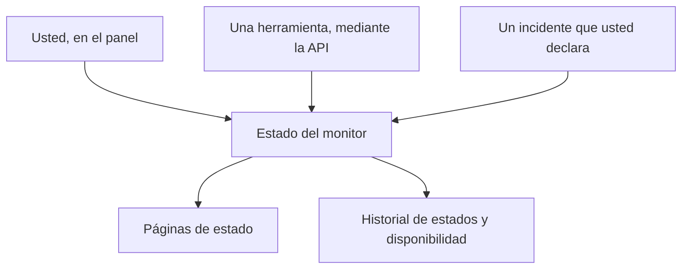

# Monitor manual

Un monitor manual no tiene comprobaciones automáticas: su estado es el que usted establezca, en el panel o mediante la API. Úselo para representar algo que OneUptime no puede comprobar por sí mismo — una dependencia de terceros, un sistema físico, un proceso de negocio — en sus páginas de estado y en sus incidentes.

:::cards
- [Crear uno](#crear-un-monitor-manual): Un paso en el panel.
- [Cambiar su estado](#actualizar-el-estado): En el panel, o desde sus propias herramientas mediante la API.
- [Incidentes y alertas](#incidentes-y-alertas): Declarar un incidente y establecer el estado en el mismo paso.
:::

## Cuándo usar un monitor manual

| Caso de uso | Descripción |
| --- | --- |
| Servicios de terceros | Seguir el estado de servicios externos de los que depende pero que no puede monitorizar directamente. |
| Infraestructura física | Representar hardware o sistemas físicos sin monitorización de red. |
| Procesos de negocio | Seguir procesos no técnicos que afectan al estado del servicio. |
| Estado mediante la API | Dejar que sus propias herramientas establezcan el estado mediante la API de OneUptime. |
| Marcadores en páginas de estado | Mostrar en su página de estado componentes que se gestionan fuera de OneUptime. |

Un proveedor que publica una página de estado no lo necesita: un [monitor de página de estado externa](/docs/monitor/external-status-page-monitor) sigue esa página por usted.

## Cómo funciona

Un monitor manual no tiene intervalo de monitoreo, sondas ni criterios. Su estado se mantiene tal como lo establezca hasta que usted, una herramienta mediante la API o un incidente que declare lo cambie — y el nuevo estado se muestra allí donde aparece el monitor.



Cada cambio es una entrada de la **Cronología de estados** del monitor, así que su disponibilidad y su historial de estados se conservan como los de cualquier otro monitor. Un monitor manual no es un monitor activo, así que en OneUptime Cloud no añade nada a su factura.

## Crear un monitor manual

:::steps
### Empezar un monitor nuevo

Vaya a **Monitores** y haga clic en **Crear monitor**.

### Elegir Manual

En **Tipo de monitor**, haga clic en **Más tipos de monitor** y elija **Manual** en **Otro**.

### Ponerle nombre y crearlo

Introduzca un **Nombre** — y una **Descripción** en **Más campos**, si quiere — y haga clic en **Crear monitor**. Un monitor manual no necesita nada más, así que se crea desde este primer paso.
:::

## Actualizar el estado

### En el panel

:::steps
1. Abra el monitor y haga clic en **Cronología de estados** en su menú lateral.
2. Haga clic en **Crear Evento de estado del monitor**.
3. Elija el **Estado del monitor**. **Comienza en** es ahora; ponga una hora anterior si el cambio ocurrió antes.
4. Haga clic en **Crear Evento de estado del monitor**. El nuevo estado aparece al instante en el monitor y en cada página de estado que lo incluye.
:::

### Mediante la API

Envíe el nuevo estado como un evento de estado del monitor, con una [clave de API](/docs/api-reference/api-reference) de su proyecto en la cabecera `ApiKey`:

```bash
curl -X POST https://oneuptime.com/api/monitor-status-timeline \
  -H "ApiKey: $ONEUPTIME_API_KEY" \
  -H "Content-Type: application/json" \
  -d '{"data": {"monitorId": "<monitor id>", "monitorStatusId": "<monitor status id>"}}'
```

- `monitorId` es el ID del monitor: haga clic en la línea **ID** de su página para copiarlo.
- `monitorStatusId` es el estado que se va a establecer: en **Monitores → Ajustes → Estado del monitor**, elija **Mostrar ID** en la fila de ese estado.
- `startsAt` es opcional. Si se omite, el cambio empieza ahora.
- En una instalación autoalojada, envíe la solicitud a su propio host en lugar de a `oneuptime.com`.

Enviar el estado que el monitor ya tiene se rechaza con `Monitor Status cannot be same as previous status.` y no registra nada, así que una herramienta que informa en cada ejecución puede ignorar esa respuesta.

## Incidentes y alertas

Un monitor manual se elige como cualquier otro allí donde se eligen monitores:

- Declare un incidente y elija el monitor en **Monitores**. Con **Cambiar el estado del monitor a**, declararlo también establece el estado del monitor, y resolverlo devuelve el monitor a operativo, salvo que siga abierto otro incidente sobre él. Consulte [Declarar un incidente](/docs/incidents/declaring-incidents#paso-2-recursos-afectados).
- Cree una alerta sobre él, para un problema que su equipo debe atender sin avisar a sus clientes.
- Añádalo a una página de estado, para mostrar a sus clientes una dependencia que vigila a mano.

## Próximos pasos

:::cards
- [Crear un monitor](/docs/monitor/create-monitor): Los tipos de monitor que comprueban las cosas por usted.
- [Monitor de página de estado externa](/docs/monitor/external-status-page-monitor): Seguir automáticamente la página de estado de un proveedor en su lugar.
- [Visión general de las páginas de estado](/docs/status-pages/index): Mostrar el estado del monitor a sus clientes.
:::
