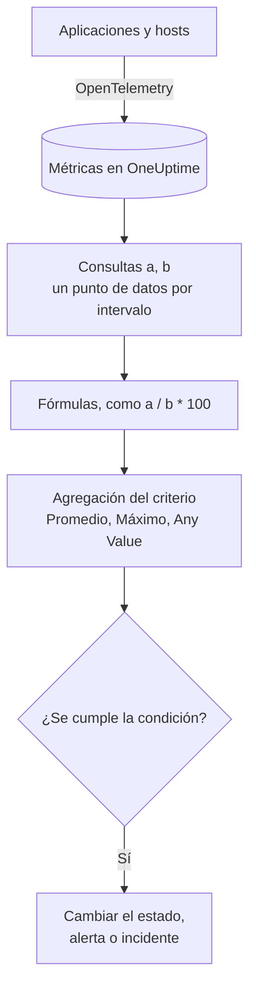

# Monitor de métricas

Un monitor de métricas consulta las métricas que tus aplicaciones y tu infraestructura envían a OneUptime, las combina con fórmulas cuando necesitas una proporción o un total, y compara el resultado con tus criterios a lo largo de un intervalo de tiempo móvil. Úsalo para tasas de solicitudes, proporciones de errores, profundidad de colas, CPU, memoria y disco (cualquier serie numérica), con una alerta por host o por contenedor cuando lo agrupas.

:::cards
- [Crear el monitor](#crear-un-monitor-de-métricas): Consultas, fórmulas, un intervalo de tiempo y criterios.
- [Cómo se evalúa](#cómo-se-evalúa): Puntos de datos, fórmulas y la agregación de los criterios.
- [Ejemplo práctico](#ejemplo-práctico-una-cola-que-crece): Los mismos datos con cada agregación.
- [Alertas por serie](#alertas-por-serie-group-by): Una alerta por host, contenedor o punto de montaje.
:::

## Cómo funciona

Cada minuto, OneUptime ejecuta cada consulta de métricas del monitor sobre su intervalo de tiempo. Una consulta devuelve un punto de datos por intervalo, y las fórmulas combinan las consultas intervalo a intervalo. Después, cada criterio reduce los puntos de datos de la consulta o la fórmula que comprueba (a su promedio, a su máximo o a una prueba de cada punto) y compara el resultado con su umbral.

## Antes de empezar

- Tus aplicaciones o tu infraestructura envían métricas a OneUptime mediante OpenTelemetry. Consulta [OpenTelemetry](/docs/telemetry/open-telemetry).
- Conoce el nombre de la métrica y los atributos por los que quieres filtrar o agrupar. Las listas **Métrica** y **Agrupar por** solo ofrecen nombres y atributos que OneUptime ha recibido.

## Crear un monitor de métricas

:::steps
### Empezar un monitor nuevo

Ve a **Monitores** y haz clic en **Crear monitor**.

### Elegir Metrics

En **Tipo de monitor**, haz clic en **Más tipos de monitor** y elige **Métricas** en **Telemetría**, o escribe `metrics` en el cuadro de búsqueda. Escribe un **Nombre** y haz clic en **Siguiente**.

### Elegir el intervalo de tiempo

En **Configuración del monitor de métricas**, elige un **Intervalo de tiempo**: hasta dónde mira atrás cada evaluación. Empieza en **Past 1 Minute**.

### Añadir las consultas de métricas

En **Seleccionar métricas**, elige una **Métrica** y cómo **Agregar por** ella. Abre **Filtros y agrupación** para filtrar por atributos o para **Agrupar por** uno de ellos. Haz clic en **Añadir métrica** para otra consulta, o en **Añadir fórmula** para combinarlas. El gráfico bajo las consultas muestra una vista previa del intervalo de tiempo, para que veas los valores que comprobarán los criterios.

### Definir los criterios

En **Criterios del monitor**, cada criterio elige la **Métrica** que comprueba (una consulta o una fórmula), su **Agregación**, una **Condición** y un **Umbral**. Consulta [Criterios](#criterios) para ver con qué empieza un monitor nuevo.

### Crear el monitor

Haz clic en **Crear monitor**. El monitor se abre en su página **Vista general**, y su primera evaluación se ejecuta en menos de un minuto.
:::

## Qué consulta

### Consultas de métricas

| Campo | Qué hace | Predeterminado |
| --- | --- | --- |
| **Métrica** | La métrica que se consulta. | Obligatorio |
| **Agregar por** | Cómo se combinan los valores de cada intervalo de tiempo en un punto de datos: Prom., Suma, Mín., Máx., Recuento o un percentil (P50, P75, P90, P95 o P99). | Prom. |
| **Filtrar por atributos** (en **Filtros y agrupación**) | Solo las series cuyos atributos cumplen estas condiciones. | Sin filtro |
| **Agrupar por** (en **Filtros y agrupación**) | Una serie por cada valor único de estos atributos; consulta [Alertas por serie](#alertas-por-serie-group-by). | Una sola serie |

Cada consulta y cada fórmula recibe una variable (`a`, `b`, `c`, etc.) en el orden en que las añades.

### Fórmulas

Una fórmula combina variables de consulta con `+`, `-`, `*`, `/`, `%`, `^` y paréntesis, intervalo a intervalo. Puedes escribir las variables con o sin un `$` delante:

- `a / b * 100`: la parte de `b` que es `a`, como porcentaje
- `a + b`: dos métricas sumadas
- `a - b`: la diferencia entre ellas

### Ventana de tiempo móvil

**Intervalo de tiempo** define hasta dónde mira atrás cada evaluación: **Past 1 Minute**, **Últimos 5 minutos**, **Past 10 Minutes**, **Últimos 15 minutos**, **Últimos 30 minutos**, **Última hora**, **Últimas 2 horas**, **Últimas 3 horas**, **Past 6 Hours**, **Past 12 Hours**, **Último día**, **Últimos 2 días**, **Past 3 Days**, **Past 7 Days**, **Past 14 Days**, **Past 30 Days**, **Past 60 Days**, **Past 90 Days**, **Past 180 Days** o **Past 365 Days**.

Cuanto más largo es el intervalo, más ancho es cada tramo de tiempo, así que un punto de datos representa más tiempo:

| Intervalo de tiempo | Un punto de datos por |
| --- | --- |
| De Past 1 Minute a Últimas 3 horas | minuto |
| Past 6 Hours, Past 12 Hours | 5 minutos |
| Último día | 15 minutos |
| Últimos 2 días, Past 3 Days | 30 minutos |
| Past 7 Days | hora |
| Past 14 Days, Past 30 Days | día |
| De Past 60 Days a Past 180 Days | semana |
| Past 365 Days | mes |

## Cómo se evalúa

- **Cada minuto.** Un monitor de métricas no lo comprueban sondas, así que no tiene intervalo que configurar ni página **Sondas e intervalo**.
- **Primero las consultas, luego las fórmulas.** Cada consulta devuelve un punto de datos por tramo de tiempo del intervalo, según su **Agregar por**. Las fórmulas se calculan para cada tramo a partir de los puntos de datos de las consultas.
- **Después, la agregación del criterio.** Cada criterio reduce los puntos de datos de su **Métrica** a lo que compara con el umbral:

| Agregación | La condición se comprueba con… |
| --- | --- |
| Promedio | el promedio de los puntos de datos |
| Suma | la suma de los puntos de datos |
| Maximum Value | el punto de datos más alto |
| Minimum Value | el punto de datos más bajo |
| All Values | cada punto de datos: todos deben cumplir la condición |
| Any Value | cada punto de datos: basta con que uno la cumpla |

- **Criterios de arriba abajo.** En un monitor sin Group By decide el primer criterio que coincide, así que pon primero el más grave. Un monitor agrupado comprueba todos los criterios para cada serie; consulta [La evaluación de los criterios es distinta](#la-evaluación-de-los-criterios-es-distinta).
- **Sin datos no es cero.** Cuando la consulta no devuelve puntos de datos en el intervalo, un criterio hace lo que dice su ajuste **Si no hay datos**, en **Más campos**: **Ignore** (el predeterminado: el criterio no coincide), **Treat As Zero** o **Disparador**.
- **La caída del propio OneUptime no es silencio.** Mientras el intervalo de tiempo contenga un periodo en el que OneUptime no recibía datos (se estaba reiniciando, actualizando o poniéndose al día), la comprobación espera: el estado no cambia y no se abre ni se resuelve ningún incidente ni alerta, diga lo que diga **Si no hay datos**. Consulta [Cuando OneUptime no recibe datos](/docs/monitor/when-oneuptime-is-not-receiving).

## Criterios

Estos monitores evalúan siempre el **Metric Value**: el valor agregado de la consulta de métricas o la fórmula configurada. El formulario de criterios no tiene selector de tipo de filtro; muestra **Métrica**, **Agregación**, **Condición** y **Umbral**. Cuando la métrica tiene unidad, elige la unidad del umbral a su lado.

| Condición | Coincide cuando el valor está… |
| --- | --- |
| **Greater Than** | por encima del umbral |
| **Greater Than Or Equal To** | en el umbral o por encima |
| **Less Than** | por debajo del umbral |
| **Less Than Or Equal To** | en el umbral o por debajo |
| **Equal To** | exactamente en el umbral |
| **Anomalously High** | por encima del rango esperado para esta hora de la semana |
| **Anomalously Low** | por debajo de ese rango |
| **Anomalous** | fuera de ese rango, en cualquier sentido |

Las condiciones de anomalía no tienen umbral. En su lugar, el formulario muestra **Sensibilidad** (Low, Medium, la predeterminada, o High) y **Ventana de referencia** (14 días, la predeterminada, 28, 60 o 90), y compara cada punto de datos con la referencia de la misma hora de la semana construida con esa ventana. Hasta que esa hora de la semana tenga suficiente historial, el criterio sigue aprendiendo y no genera alertas.

Un monitor de métricas nuevo empieza con dos criterios sobre su primera consulta, ambos con la agregación **Any Value**:

| Criterio | Condición | Efecto |
| --- | --- | --- |
| Check if … is offline | **Equal To** `0` | Pone el monitor fuera de línea y declara un incidente que se resuelve solo |
| Check if … is online | **Greater Than** `0` | Pone el monitor en línea |

> [!NOTE]
> El criterio de fuera de línea se dispara con un valor informado de 0, no con el silencio. Para alertar cuando una métrica deja de llegar, pon su **Si no hay datos** en **Disparador**.

## Ejemplo práctico: una cola que crece

Quieres un incidente cuando la cola de checkout se mantiene profunda. La consulta `a` es el gauge `checkout.queue.depth`, con **Agregar por** Máx., y el **Intervalo de tiempo** es **Últimos 5 minutos**. Una evaluación ve estos cinco puntos de datos de un minuto:

| Minuto | 10:01 | 10:02 | 10:03 | 10:04 | 10:05 |
| --- | --- | --- | --- | --- | --- |
| `a` | 640 | 980 | 1500 | 1620 | 1100 |

Un criterio con **Métrica** `a`, **Condición** **Greater Than** y **Umbral** `1000` da una respuesta distinta con cada **Agregación**:

| Agregación | Comparado con 1000 | ¿Coincide? |
| --- | --- | --- |
| Promedio | 1168 | Sí |
| Suma | 5840 | Sí |
| Maximum Value | 1620 | Sí |
| Minimum Value | 640 | No |
| All Values | 640, 980, 1500, 1620, 1100 | No: dos puntos no superan 1000 |
| Any Value | 640, 980, 1500, 1620, 1100 | Sí: 1500 lo supera |

**Promedio** avisa ante un atasco sostenido e ignora un minuto profundo aislado; **All Values** espera a que cada minuto del intervalo sea profundo; **Any Value** avisa en el primer minuto profundo.

## Alertas por serie (Group By)

**Agrupar por** en una consulta de métricas divide esa consulta en una serie por cada valor único de atributo (una por host, una por contenedor, una por punto de montaje), y un monitor con Group By evalúa cada serie de forma independiente. Ese único ajuste marca la diferencia entre «la flota no está bien» y «`prod-db-01` no está bien».

### Una alerta por grupo

Con Group By en `host.name`, un monitor de uso de disco que vigila cincuenta hosts lanza **una alerta (o un incidente) por cada host que supera el umbral**. El host A que se llena abre su propia alerta; el host B que se llena diez minutos después abre una segunda alerta, independiente, junto a ella.

Sin Group By, el mismo monitor es un único escalar: la consulta reduce todos los hosts a un solo número y el monitor lanza **una sola alerta para todo el monitor**. Mientras esa alerta está abierta, un segundo host que supera el umbral no produce nada (el monitor ya está alertando, así que no hay nada nuevo que lanzar) y el ingeniero de guardia nunca se entera del host B. **Definir Group By es la forma de obtener alertas por host.** Si quieres que te avisen por host, por contenedor o por punto de montaje, defínelo.

### Resolución independiente

Cada alerta por grupo sigue a su propio grupo. Cuando el host A vuelve por debajo del umbral, su alerta se resuelve por su cuenta, y la alerta del host B sigue abierta hasta que el host B se recupere. La recuperación de un grupo nunca cierra la alerta de otro.

### La evaluación de los criterios es distinta

- **Los monitores agrupados evalúan todos los criterios.** Así, distintos niveles de gravedad pueden dispararse en distintos grupos a la vez: con «Critical: mayor que 95» por encima de «Warning: mayor que 80», un host al 96 % abre una alerta crítica mientras que un host al 85 % abre una de advertencia en la misma comprobación. Un host que supera ambos niveles sigue recibiendo exactamente una alerta, la del primer criterio que coincide, así que **ordena los criterios del más grave al menos grave**.
- **Los monitores sin agrupar se detienen en el primer criterio que coincide.** Solo se dispara ese criterio, otra razón para poner el criterio de alerta por encima del de buen estado: un criterio de buen estado amplio colocado primero coincide en casi todas las comprobaciones e impide que el criterio de alerta de debajo llegue a evaluarse.

| Host | Disco usado | Critical (> 95) | Warning (> 80) | Alerta lanzada |
| --- | --- | --- | --- | --- |
| `prod-db-01` | 96 % | Sí | Sí | Critical |
| `prod-db-02` | 85 % | No | Sí | Warning |
| `prod-db-03` | 40 % | No | No | Ninguna |

### Elegir un atributo para agrupar

Agrupa por un atributo que identifique de verdad algo distinto por lo que avisarías a alguien: el atributo de host para una métrica de host de toda la flota, el atributo de contenedor o de pod para una métrica de contenedor, el atributo de punto de montaje o de dispositivo para una métrica de sistema de archivos o de E/S de disco, el atributo de interfaz para una métrica de red. La lista desplegable **Agrupar por** se rellena con los atributos que tu colector envía de verdad, así que elige de la lista en lugar de escribir una clave a mano.

No agrupes una métrica que ya es un único escalar para todo el sistema (un indicador de líder de todo el clúster, una cola pendiente de un planificador o la CPU de un único host en un monitor de un solo host). Agruparla produce exactamente una serie y no cambia nada salvo los títulos de las alertas.

Los valores del atributo de agrupación también están disponibles como [variables de plantilla](/docs/monitor/incident-alert-templating) en el título, la descripción y las notas de remediación de la alerta o el incidente: agrupar por `host.name` permite que el título diga `Disk almost full on {{host.name}}`.

## Solución de problemas

:::details El gráfico muestra que se superó el umbral, pero el monitor no alertó
Comprueba primero la **Agregación** del criterio: **All Values** solo coincide cuando todos los puntos de datos del intervalo superan el umbral, y **Promedio** suaviza un pico breve. Después comprueba que la **Métrica** del criterio sea la consulta o la fórmula que quieres (`a` no es la fórmula `c`) y que el umbral esté en la unidad que crees.
:::

:::details La métrica dejó de llegar y no pasó nada
Un intervalo sin puntos de datos no es un valor de 0. Con **Si no hay datos** en su valor predeterminado, **Ignore**, el criterio no coincide. Ponlo en **Disparador** en **Más campos** del criterio para alertar ante el silencio.
:::

:::details Recibo una sola alerta para toda la flota
La consulta no tiene **Agrupar por**, así que todos los hosts se reducen a un solo número. Agrupa la consulta por el atributo de host, de contenedor o de punto de montaje; consulta [Alertas por serie](#alertas-por-serie-group-by).
:::

:::details Un criterio de anomalía nunca se dispara
Sigue aprendiendo: la hora de la semana con la que compara aún no tiene suficiente historial dentro de la **Ventana de referencia**.
:::

## Próximos pasos

:::cards
- [Plantillas de incidentes y alertas](/docs/monitor/incident-alert-templating): Pon el host y el valor en los títulos de las alertas.
- [Monitor de registros](/docs/monitor/logs-monitor): Alerta sobre el volumen y el contenido de los registros, por grupo.
- [Monitor de hosts](/docs/monitor/host-monitor): Comprobaciones listas de CPU, memoria y disco para tus hosts.
- [OpenTelemetry](/docs/telemetry/open-telemetry): Envía métricas a OneUptime.
:::
