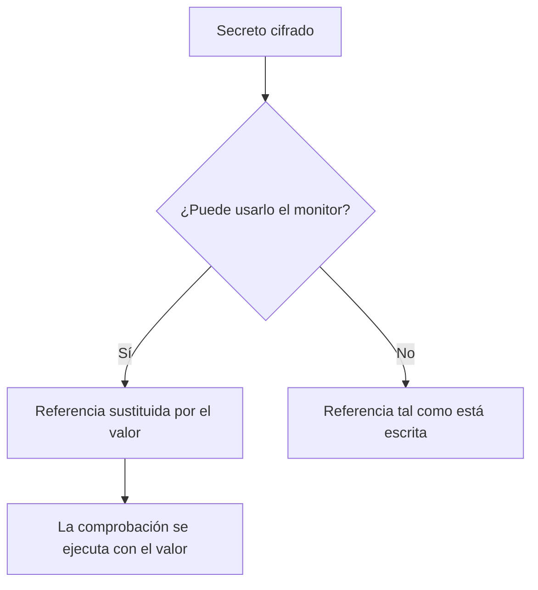

# Secretos del monitor

Los secretos de monitor mantienen fuera del propio monitor las contraseñas, claves de API y tokens que necesitan sus monitores. Usted guarda un valor una vez, cifrado, elige qué monitores pueden usarlo y lo referencia como `{{monitorSecrets.NAME}}` donde el monitor lo necesite.

:::cards
- [Añadir un secreto](#añadir-un-secreto): Guardar un valor y elegir quién puede usarlo.
- [Elegir el acceso](#elegir-qué-monitores-pueden-usar-un-secreto): Todos los monitores, monitores concretos o monitores con etiquetas.
- [Usar un secreto](#usar-un-secreto): Dónde funciona `{{monitorSecrets.NAME}}`.
:::

## Cómo llegan los secretos a un monitor

Un secreto se guarda cifrado y no se vuelve a mostrar después de guardarlo. Antes de entregar un monitor a una sonda, OneUptime sustituye cada referencia que el monitor puede usar por el valor descifrado; una referencia que el monitor no puede usar se queda tal como está escrita.

La sonda que ejecuta la comprobación recibe el valor, así que un monitor que usa un secreto debe ejecutarse en sondas de confianza: las de OneUptime, o una [sonda personalizada](/docs/probe/custom-probe) que gestione usted mismo.

## Antes de empezar

- **El plan Growth o superior**, en OneUptime Cloud. Las instalaciones autoalojadas no tienen planes.
- **Un rol que pueda gestionar secretos**: Project Owner, Project Admin, o un rol personalizado con el permiso Create Monitor Secret.

## Trabajar con secretos

### Añadir un secreto

:::steps
1. Vaya a **Monitores → Ajustes → Secretos** y haga clic en **Crear Secreto de monitor**.
2. Introduzca un **Nombre** y el **Valor del secreto**. El nombre es lo que usted referencia, por ejemplo `ApiKey`. Solo puede contener letras, números, guiones (`-`) y guiones bajos (`_`), y dos secretos de un mismo proyecto no pueden compartirlo.
3. En el paso **Acceso**, elija qué monitores pueden usarlo (consulte la sección siguiente) y haga clic en **Crear Secreto de monitor**.
:::

> [!IMPORTANT]
> Los secretos se cifran y se guardan de forma segura. El valor del secreto no se vuelve a mostrar después de guardarlo — ni en la tabla, ni en el formulario de edición, ni mediante la API. Si pierde el valor, tendrá que obtenerlo de donde lo sacó y volver a establecerlo. Para rotar un secreto, use el botón **Actualizar valor del secreto** de su fila; no necesita eliminarlo y volver a crearlo.

### Elegir qué monitores pueden usar un secreto

Cada secreto tiene una de tres opciones de acceso:

| Opción | Qué monitores pueden usar el secreto | Úsela para |
| --- | --- | --- |
| **Todos los monitores** | Todos los monitores del proyecto, incluidos los que cree más adelante. | Una credencial que comparten muchos monitores. |
| **Monitores específicos** | Solo los monitores que elija. Es la opción predeterminada, y los secretos creados antes de que existieran estas opciones funcionan así. | Una credencial para uno o unos pocos monitores. |
| **Monitores con etiquetas** | Los monitores que tienen al menos una de las etiquetas que elija. Añadir una de esas etiquetas a un monitor le da acceso, y quitar la etiqueta se lo retira la próxima vez que se ejecute el monitor. | Una credencial para un grupo de monitores que cambia con el tiempo. |

Puede cambiar la opción en cualquier momento con **Editar** en la fila del secreto. Solo se conserva la lista de la opción elegida: cambiar a **Todos los monitores** vacía las listas de monitores y de etiquetas del secreto, y cambiar entre **Monitores específicos** y **Monitores con etiquetas** vacía la lista que deja.

Un secreto nunca está disponible para los monitores de otro proyecto.

> [!WARNING]
> Cualquiera que pueda editar un monitor que puede usar un secreto puede enviar ese secreto a cualquier lugar al que se conecte el monitor. Con **Todos los monitores**, eso es cualquiera que pueda crear o editar monitores en el proyecto. Con **Monitores con etiquetas**, incluye también a cualquiera que pueda añadir una de esas etiquetas a un monitor.

En la API, la opción de acceso es el campo `monitorAccess`: `All Monitors`, `Specific Monitors` o `Monitors With Labels`. Los campos `monitors` y `labels` contienen las listas. Un secreto creado sin `monitorAccess` recibe `Specific Monitors`.

### Usar un secreto

Para usar un secreto, escriba `{{monitorSecrets.SECRET_NAME}}` en un campo que admita secretos. Por ejemplo, una cabecera de solicitud `Authorization: Bearer {{monitorSecrets.ApiKey}}` envía el valor del secreto `ApiKey`.

Estos tipos de monitor y campos admiten secretos:

| Tipo de monitor | Campos |
| --- | --- |
| API | La URL, las cabeceras y el cuerpo de la solicitud, y el certificado de cliente, la clave privada y la frase de contraseña (mTLS) |
| Sitio web | La URL, y el certificado de cliente, la clave privada y la frase de contraseña (mTLS) |
| Ping, IP, Puerto, NTP, Certificado SSL | El host o la URL que se comprueba |
| DNS | El nombre de dominio y el servidor DNS |
| DNSSEC, Dominio | El nombre de dominio |
| Consulta SQL | El host, el nombre de la base de datos, el usuario, la contraseña y la consulta |
| Salud de la base de datos | El host, el nombre de la base de datos, el usuario y la contraseña |
| Página de estado externa | La URL de la página de estado |
| Monitor sintético, Custom JavaScript Code | El script |
| Dispositivo de red | La cadena de comunidad SNMP, y las claves de autenticación y de privacidad de SNMPv3 |

Los secretos se rellenan antes de que se ejecute el script de un monitor sintético o de Custom JavaScript Code, así que una referencia como `{{monitorSecrets.ApiKey}}` dentro del script es el valor descifrado cuando se ejecuta.

Si un monitor referencia un secreto que no puede usar, la referencia se queda como está y no se sustituye por el valor.

Cuando prueba un monitor antes de guardarlo, solo se rellenan los secretos disponibles para **Todos los monitores**, porque un monitor nuevo no está en ninguna lista y todavía no tiene etiquetas. Después de guardar el monitor, las pruebas usan todos los secretos que el monitor puede usar.

## Solución de problemas

:::details `{{monitorSecrets.NAME}}` se envía literalmente
El monitor no puede usar el secreto, o el nombre no coincide. Revise la opción de acceso del secreto con **Editar** en su fila, y que el nombre de la referencia es exactamente el nombre del secreto.
:::

:::details Probar un monitor nuevo no rellena el secreto
Antes de guardar un monitor, solo se rellenan los secretos disponibles para **Todos los monitores**. Guarde el monitor y vuelva a probarlo.
:::

:::details Un campo ignora el secreto
Solo los campos de la tabla de arriba admiten secretos. En cualquier otro campo, `{{monitorSecrets.NAME}}` se envía tal como está escrito.
:::

## Próximos pasos

:::cards
- [Monitor de API](/docs/monitor/api-monitor): Enviar un secreto en una cabecera de solicitud.
- [Monitor sintético](/docs/monitor/synthetic-monitor): Usar un secreto dentro de un script de navegador.
- [Monitor de consultas SQL](/docs/monitor/sql-monitor): Mantener cifrada la contraseña de una base de datos.
:::
