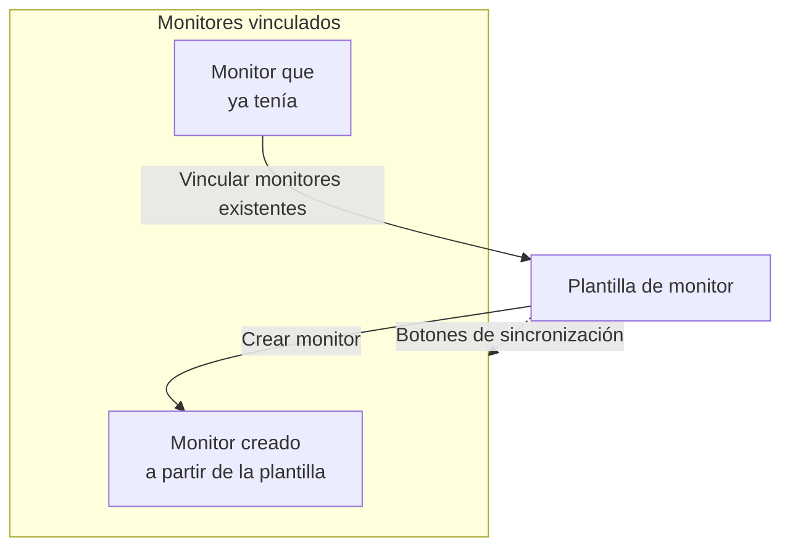

# Plantillas de monitor

Una plantilla de monitor es una configuración de monitor guardada (un tipo, criterios, un intervalo, etiquetas y valores predeterminados de campos personalizados) a partir de la cual crea monitores con un clic. Los monitores creados a partir de ella, o vinculados a ella, siguen conectados: cambie la plantilla y luego sincronice el cambio con todos ellos. Use plantillas cuando muchos monitores deban comportarse igual, como la misma comprobación de salud en cada servicio, o las mismas comprobaciones de API en producción y en staging.

:::cards
- [Crear una plantilla](#crear-una-plantilla): Cuatro pasos, como Crear monitor.
- [Crear monitores a partir de ella](#crear-monitores-a-partir-de-una-plantilla): Un clic, o vincule monitores que ya tiene.
- [Sincronizar cambios](#sincronizar-cambios-con-los-monitores-vinculados): Qué copia cada botón de sincronización.
- [Conservar valores propios de cada monitor](#conservar-valores-propios-de-cada-monitor): Proteger un destino o unos encabezados de una sincronización.
:::

## Cómo funcionan las plantillas

Una plantilla no vigila nada por sí misma. Los monitores se crean a partir de ella, o se vinculan a ella, y la página de la plantilla los lista como **Monitores vinculados**. Cuando cambia la plantilla, nada cambia en esos monitores hasta que sincroniza: cada botón de sincronización copia una parte de la plantilla en cada monitor vinculado, y los campos que protege conservan el valor propio de cada monitor.



## Antes de empezar

- **Un rol que pueda crear plantillas**: Project Owner, Project Admin, Project Member, Monitor Admin o Monitor Member, o un rol personalizado con el permiso Create Monitor Template. Cambiar una plantilla requiere los mismos roles, o el permiso Edit Monitor Template.
- **Permiso para actualizar los monitores vinculados.** Una sincronización escribe en cada monitor vinculado en su nombre, y omite los monitores que sus permisos no cubren.

## Crear una plantilla

:::steps
### Abrir Plantillas

Vaya a **Monitores → Ajustes → Plantillas** y haga clic en **Crear Plantilla de monitor**.

### Poner nombre a la plantilla

En **Información de la plantilla**, introduzca un **Nombre de la plantilla**, como `Production API Health`, y una **Descripción de la plantilla**, y luego haga clic en **Siguiente**.

### Definir los valores predeterminados del monitor

En **Valores predeterminados del monitor**, elija el **Tipo de monitor**, con el mismo selector que Crear monitor. Opcionalmente, introduzca un **Nombre de monitor predeterminado**; si lo deja en blanco, cada monitor recibe el nombre del recurso que vigila. **Descripción de monitor predeterminada** y **Etiquetas** esperan en **Más campos**. Haga clic en **Siguiente**.

### Definir los criterios y el intervalo

En **Criterios**, rellene qué comprobar y los criterios, como en [Crear monitor](/docs/monitor/create-monitor#criterios). La tarjeta **Ajustes de sincronización de la plantilla** de la parte superior le permite proteger campos de las sincronizaciones (consulte [Conservar valores propios de cada monitor](#conservar-valores-propios-de-cada-monitor)). En un tipo de monitor que comprueban las sondas, el último paso, **Intervalo**, pide el **Intervalo de monitoreo**. Haga clic en **Crear Plantilla de monitor** en el último paso.
:::

La plantilla se añade a la lista. Ábrala para ver su página, con una tarjeta para cada parte: **Información de la plantilla**, **Valores predeterminados del monitor**, **Criterios de monitoreo**, **Intervalo de monitoreo** (con **Acuerdo mínimo de sondas**), **Etiquetas**, **Valores predeterminados de campos personalizados** (cuando el proyecto tiene campos personalizados de monitor) y **Monitores vinculados**. Cambia cada parte en su propia tarjeta, por ejemplo con **Editar criterios** o **Editar intervalo**.

## Crear monitores a partir de una plantilla

- **Monitor nuevo.** Haga clic en **Crear monitor** en la fila de la plantilla en la lista, o en **Crear monitor desde plantilla** en su página. **Crear monitor** se abre con el tipo y los ajustes de la plantilla rellenados; cambie lo que necesite y créelo. El monitor nuevo queda vinculado a la plantilla.
- **Monitores que ya tiene.** En **Monitores vinculados**, haga clic en **Vincular monitores existentes** y elíjalos. Conservan sus ajustes hasta que sincroniza.

Los valores definidos en **Valores predeterminados de campos personalizados** se escriben en cada monitor creado a partir de la plantilla, incluidos los monitores que las reglas de importación automática y las políticas de alertas crean a partir de ella.

## Sincronizar cambios con los monitores vinculados

Editar una plantilla solo cambia la plantilla. Para copiar un cambio en los monitores vinculados, use el botón de sincronización de la tarjeta que cambió. Cada botón indica a cuántos monitores llega, como **Sync Criteria to 3 Linked Monitors**, y aparece atenuado mientras no haya nada vinculado. Una sincronización no se puede deshacer.

| Botón | Copia en cada monitor vinculado | Deja sin tocar |
| --- | --- | --- |
| **Sincronizar criterios con los monitores vinculados** | Los criterios y los ajustes del paso, como los destinos y las opciones de la solicitud, excepto los campos protegidos | El intervalo de monitoreo, el acuerdo mínimo de sondas, el nombre, la descripción, las etiquetas y los valores de los campos personalizados |
| **Sincronizar el intervalo con los monitores vinculados** | El intervalo de monitoreo y el acuerdo mínimo de sondas | Los criterios, el nombre, la descripción, las etiquetas y los valores de los campos personalizados |
| **Sincronizar etiquetas con los monitores vinculados** | Las etiquetas, y nada más | Todo lo demás |
| **Sincronizar campos personalizados con los monitores vinculados** | Los campos personalizados para los que la plantilla tiene un valor predeterminado, sustituyendo lo que tenía cada monitor | Los campos personalizados que la plantilla deja en blanco, y todo lo demás |

Para sincronizar un solo monitor, haga clic en **Sincronizar desde la plantilla** en su fila de **Monitores vinculados**. Eso copia los criterios y los ajustes del paso (excepto los campos protegidos), el intervalo de monitoreo, el acuerdo mínimo de sondas y las etiquetas, y deja sin tocar el nombre, la descripción y los valores de los campos personalizados del monitor. **Desvincular de la plantilla** desconecta un monitor; conserva sus ajustes.

Después de una sincronización, un resumen indica cuántos monitores se actualizaron. **Sincronizado parcialmente** significa que algunos monitores vinculados todavía tienen la configuración anterior, normalmente porque sus permisos no los cubren.

## Conservar valores propios de cada monitor

Una sincronización de criterios también copia ajustes del paso como los destinos, los encabezados de la solicitud y los tiempos de espera, a menos que proteja esos campos. Proteja un campo para que cada monitor vinculado conserve su propio valor.

:::steps
### Abrir la plantilla

Vaya a **Monitores → Ajustes → Plantillas** y abra la plantilla.

### Editar sus criterios

En la tarjeta **Criterios de monitoreo**, haga clic en **Editar criterios**.

### Proteger los campos

En **Ajustes de sincronización de la plantilla**, marque **No sincronizar este campo** junto a cada campo que quiera conservar en los monitores vinculados.

### Guardar

Guarde los cambios. La tarjeta **Criterios de monitoreo**, y la confirmación de las dos sincronizaciones de abajo, listan los campos protegidos.

### Sincronizar

Use **Sincronizar criterios con los monitores vinculados**, o **Sincronizar desde la plantilla** en un monitor vinculado concreto.
:::

Por ejemplo, proteja **Monitor destination** y **Request headers** en una plantilla de API. Los monitores de producción y de staging conservan sus propias URL y encabezados, mientras ambos reciben los criterios actualizados de la plantilla y sus demás ajustes no protegidos.

Las opciones disponibles dependen del tipo de monitor. Incluyen destinos y puertos, opciones de solicitud HTTP, conexiones de base de datos, ajustes de DNS, selectores de infraestructura y consultas de telemetría. Las credenciales relacionadas, como un certificado de cliente y su clave privada, se conservan juntas.

### Cómo se comportan las exclusiones

- Los campos marcados conservan el valor actual de cada monitor existente, incluido un valor vacío o sin definir. Los encabezados de la solicitud y otras colecciones se conservan completos.
- Los campos sin marcar siguen sincronizándose desde la plantilla. Desmarque un campo protegido y guarde para copiar su valor de plantilla en la siguiente sincronización.
- Las exclusiones se aplican a las sincronizaciones masivas e individuales. Se guardan en la plantilla, no se eligen por separado en cada sincronización.
- Los monitores nuevos siguen empezando con los valores de campo de la plantilla. Las exclusiones solo afectan a la sincronización de monitores existentes.
- Los criterios siempre se sincronizan. Una sincronización solo de criterios deja sin tocar el intervalo de monitoreo, las etiquetas y otros ajustes del monitor.
- Las plantillas existentes no tienen exclusiones de campos hasta que las configura. Los monitores de dispositivo de red siguen conservando automáticamente su propia vinculación al dispositivo.

En las plantillas con varios pasos, los valores protegidos se emparejan por los ID de paso. Los monitores de un solo paso creados de forma independiente también pueden recibir una plantilla de un solo paso. Si un paso protegido no se puede emparejar, la sincronización se rechaza antes de actualizar ningún monitor, para que un paso nuevo o reordenado no copie por accidente el destino o las credenciales de otro paso.

> [!IMPORTANT]
> Antes de cambiar el tipo de monitor de una plantilla guardada (con **Editar valores predeterminados del monitor**), quite en **Editar criterios** las exclusiones que no se aplican al nuevo tipo. Todas las exclusiones de una plantilla deben existir para su tipo de monitor.

## Configuración por API

Cada paso de plantilla acepta un array `doNotSyncFields` en su objeto `MonitorStep.value`. Para un monitor de API, proteja su destino y toda su colección de encabezados con:

```json title="monitorSteps (excerpt)"
{
  "_type": "MonitorSteps",
  "value": {
    "monitorStepsInstanceArray": [
      {
        "_type": "MonitorStep",
        "value": {
          "id": "<step id>",
          "doNotSyncFields": ["monitorDestination", "requestHeaders"]
        }
      }
    ]
  }
}
```

Omita el array o póngalo en `[]` para sincronizar todos los ajustes de paso admitidos. Los nombres de campo no admitidos y los campos que no se aplican al tipo de monitor de la plantilla se rechazan. El array de la plantilla controla la sincronización; esos metadatos en un monitor vinculado no lo anulan.

:::details Nombres de campo para doNotSyncFields, por tipo de monitor
| Tipo de monitor | Nombres de campo |
| --- | --- |
| Sitio web, API, Ping, IP, Puerto, Certificado SSL, NTP | `monitorDestination`, `requestTimeoutInMs`, `retryCount` |
| Solo API | `requestHeaders`, `requestType`, `requestBody` |
| Sitio web y API | `doNotFollowRedirects`, `allowSelfSignedCertificates`, `tlsClientAuthentication` (el certificado de cliente, la clave y la frase de contraseña juntos) |
| Puerto, NTP | `monitorDestinationPort` |
| Monitor sintético, Custom JavaScript Code | `customCode` |
| Monitor sintético | `browserTypes`, `screenSizeTypes`, `retryCountOnError` |
| DNS | `dnsMonitor.queryName`, `dnsMonitor.recordType`, `dnsMonitor.resolver` (el servidor DNS y el puerto juntos), `dnsMonitor.timeout`, `dnsMonitor.retries` |
| Dominio | `domainMonitor.domainName`, `domainMonitor.lookupMethod`, `domainMonitor.timeout`, `domainMonitor.retries` |
| DNSSEC | `dnssecMonitor.domainName`, `dnssecMonitor.resolvers`, `dnssecMonitor.checkNameserverConsistency`, `dnssecMonitor.signatureExpiryWarningDays`, `dnssecMonitor.timeout`, `dnssecMonitor.retries` |
| Consulta SQL | `sqlMonitor.connection`, `sqlMonitor.connectionTimeoutInMs`, `sqlMonitor.statementTimeoutInMs`, `sqlMonitor.query`, `sqlMonitor.maxRows` |
| Salud de la base de datos | `databaseMonitor.connection`, `databaseMonitor.connectionTimeoutInMs`, `databaseMonitor.statementTimeoutInMs`, `databaseMonitor.enabledMetricGroups` |
| Página de estado externa | `externalStatusPageMonitor.statusPageUrl`, `externalStatusPageMonitor.provider`, `externalStatusPageMonitor.components`, `externalStatusPageMonitor.timeout`, `externalStatusPageMonitor.retries` |
| Registros, Eventos de seguridad, Trazas, IA / LLM, Métricas, Excepciones | `logMonitor`, `securityEventsMonitor`, `traceMonitor`, `llmMonitor`, `metricMonitor`, `exceptionMonitor` (toda la configuración del monitor) |

Los monitores de infraestructura (Kubernetes, Docker Container, Host, Podman Container, Proxmox, Docker Swarm, Ceph, Cabina de almacenamiento, Dispositivo IoT) ofrecen su selector de recursos, filtros (todos salvo Host), consultas de métricas y ventana de tiempo de consulta. Sus nombres aparecen en **Ajustes de sincronización de la plantilla** en una plantilla de ese tipo.
:::

## Solución de problemas

:::details Una sincronización dice «Sincronizado parcialmente»
Algunos monitores vinculados no se actualizaron, normalmente porque sus permisos no los cubren. Pida a alguien que pueda actualizar todos los monitores vinculados que vuelva a ejecutar la sincronización.
:::

:::details Una sincronización falla con «a template step cannot be matched to an existing monitor step»
Un campo protegido no se pudo emparejar con un paso de uno de los monitores, así que la sincronización se detuvo antes de cambiar ninguno. Dé a los pasos de la plantilla los mismos ID que a los pasos de los monitores, o use una plantilla de un solo paso con monitores de un solo paso.
:::

:::details Los botones de sincronización aparecen atenuados
Todavía no hay ningún monitor vinculado a la plantilla. Cree un monitor a partir de ella, o haga clic en **Vincular monitores existentes** en **Monitores vinculados**.
:::

:::details Guardar falla con «Unsupported do not sync field»
Un nombre de `doNotSyncFields` no es un campo del tipo de monitor de la plantilla. Compruébelo con los nombres de campo de arriba.
:::

## Próximos pasos

:::cards
- [Crear un monitor](/docs/monitor/create-monitor): El formulario que rellena una plantilla.
- [Monitor de API](/docs/monitor/api-monitor): Los ajustes que lleva una plantilla de API.
- [Secretos del monitor](/docs/monitor/monitor-secrets): Compartir credenciales entre monitores sin copiarlas.
- [Pasos de monitor de Terraform](/docs/terraform/monitor-steps): Gestionar los monitores y sus pasos como código.
:::
