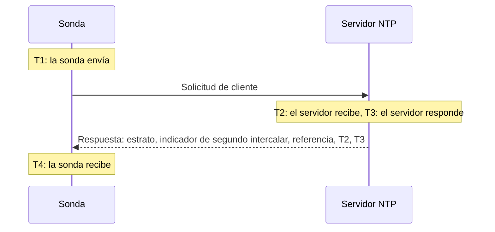

# Monitor de NTP

Un monitor NTP comprueba que un servidor de hora responde en el puerto UDP 123 y da una hora fiable: que está sincronizado, en un estrato razonable, y que su reloj coincide con el de la sonda. Úsalo para los servidores de hora que administras, como un reloj GPS en el centro de datos o los servidores internos con los que se sincronizan tus equipos, y para los servidores públicos de los que dependes.

:::cards
- [Crear el monitor](#crear-un-monitor-ntp): Seis pasos en el panel.
- [Qué lee la comprobación](#qué-lee-la-comprobación): Estrato, desfase del reloj, indicador de segundo intercalar y el resto de la respuesta.
- [Criterios de monitoreo](#criterios-de-monitoreo): Disponibilidad, sincronización, estrato y desfase.
- [Solución de problemas](#solución-de-problemas): Cuando el servidor funciona pero el monitor dice otra cosa.
:::

## Cómo funciona

En cada comprobación, una sonda envía una solicitud de cliente SNTP (NTP versión 4, modo cliente) desde un puerto local aleatorio al puerto UDP del servidor y espera la respuesta. Solo cuenta una respuesta real a esa solicitud: la sonda pone 64 bits aleatorios en la marca de tiempo de envío de la solicitud e ignora cualquier paquete que no los devuelva, que sea más corto que un paquete NTP o que no esté en modo servidor. Una respuesta antigua a una comprobación anterior, o una falsificada, nunca puede hacer que un servidor caído parezca activo.

A partir de las cuatro marcas de tiempo, la sonda calcula el **desfase del reloj**, ((T2 − T1) + (T3 − T4)) / 2: cuánto se aleja el reloj del servidor del de la sonda. Un desfase positivo significa que el servidor va adelantado. La fórmula supone que la solicitud y la respuesta tardan lo mismo, así que un camino mucho más lento en un sentido puede desviar el desfase hasta la mitad del tiempo de ida y vuelta.

> [!NOTE]
> El desfase se mide respecto al propio reloj de la sonda. Las sondas de OneUptime Cloud mantienen sus relojes sincronizados. En una [sonda personalizada](/docs/probe/custom-probe), mantén también sincronizado el reloj del host, con chrony o systemd-timesyncd, o una alerta de desfase puede deberse a la sonda y no al servidor.

A un servidor que responde no se le vuelve a preguntar, aunque responda sin una hora fiable. La falta de respuesta, un puerto rechazado y una búsqueda DNS fallida se reintentan con una nueva solicitud. Cuando el servidor no responde en absoluto, la sonda también traza la ruta hasta él y adjunta lo que encontró como **Ruta de red en el momento del fallo**. Una sonda que ha perdido su propia conexión de red no informa ningún resultado, así que no puede marcar tu servidor como sin conexión.

## Antes de empezar

- **Un rol que pueda crear monitores**: Project Owner, Project Admin, Project Member, Monitor Admin o Monitor Member, o un rol personalizado con el permiso Create Monitor.
- **Una sonda que llegue al puerto UDP 123 del servidor.** Cualquier sonda puede comprobar un servidor de hora público. Para un servidor en una red privada, usa una [sonda personalizada](/docs/probe/custom-probe) dentro de esa red. Un cortafuegos delante del servidor tiene que dejar pasar UDP, no solo TCP, desde las [direcciones IP de las sondas de OneUptime Cloud](/docs/configuration/ip-addresses) o desde tu sonda personalizada.

## Crear un monitor NTP

:::steps
### Empezar un monitor nuevo

Ve a **Monitores** y haz clic en **Crear monitor**. En **Tipo de monitor**, escribe `ntp` en el cuadro de búsqueda y elige **NTP**. También aparece en **Más tipos de monitor**, en el grupo Red.

### Ponerle nombre

Introduce un **Nombre**, como `Servidor de hora GPS`, y haz clic en **Siguiente**.

### Introducir el servidor

En **Servidor NTP**, introduce el nombre de host o la dirección IP del servidor, como `time.example.com` o `192.168.1.10`. La solicitud va al puerto 123. Para usar otro puerto, abre **Más campos** e indica el **Puerto**.

### Probarlo

Haz clic en **Probar monitor**, elige una sonda en **Seleccionar sonda** y haz clic en **Ejecutar prueba**. **Resultado de la prueba del monitor** muestra si el servidor respondió, si está sincronizado, su estrato y cuánto se desvía su reloj.

### Revisar los criterios

**Criterios del monitor** empieza con los [criterios predeterminados](#criterios-predeterminados): sin conexión cuando el servidor no da una hora fiable, en línea cuando la da. Cámbialos si lo necesitas y haz clic en **Siguiente**.

### Elegir sondas y crear

Mantén o cambia las **Sondas** y el **Intervalo de monitoreo** (empieza en **Cada 5 minutos**) y haz clic en **Crear monitor**. Se abre la página del monitor.
:::

## Opciones de configuración

| Campo | Predeterminado | Qué introducir |
| --- | --- | --- |
| **Servidor NTP** | Ninguno | El servidor, como `time.example.com`, `192.168.1.10` o `2001:db8::123`. Introduce solo el host, sin `udp://`. Un puerto escrito después del host, como `time.example.com:1123`, se usa en lugar de **Puerto**. |
| **Puerto** (en **Más campos**) | `123` | El puerto UDP en el que el servidor responde NTP, de `1` a `65535`. Déjalo vacío para `123`. |
| **Tiempo de espera de la solicitud (segundos)** (en **Más campos**) | `5` | Cuánto espera un intento la respuesta, incluida la búsqueda DNS. El máximo es de 60 segundos. |
| **Reintentos en caso de fallo** (en **Más campos**) | Predeterminado de la sonda, normalmente `3` | Cuántas veces reintentar un intento que no obtuvo respuesta. El máximo es 3. |

**Reintentos en caso de fallo** cuenta los reintentos _después_ del primer intento: `0` ejecuta la comprobación una vez y `2` hasta tres veces, con una pausa de un segundo entre intentos. Si se deja en blanco, usa el valor predeterminado de la sonda: 3, salvo que `PROBE_MONITOR_RETRY_LIMIT` de la sonda indique otra cosa.

## Qué lee la comprobación

La página del monitor muestra la última comprobación de cada sonda:

| Campo | Qué significa |
| --- | --- |
| **Sincronizado** | Si el servidor respondió con estrato de 1 a 15, sin la alarma de su indicador de segundo intercalar y con marcas de tiempo reales en su respuesta. |
| **Desfase del reloj** | Cuánto se aleja el reloj del servidor del de la sonda, y en qué sentido. Un servidor sano está a pocos milisegundos. |
| **Estrato** | Cuántos saltos separan al servidor de un reloj de referencia: 1 para un servidor con su propia fuente GPS o atómica, 2 para uno que se sincroniza con un servidor de estrato 1, y así sucesivamente. 16 significa no sincronizado. |
| **Referencia** | Con qué se sincroniza el servidor: un nombre de fuente como `GPS`, `PPS` o `NIST` en el estrato 1, la dirección del servidor superior a partir del estrato 2. |
| **Indicador de segundo intercalar** | 0 cuando no hay ningún segundo intercalar pendiente, 1 o 2 cuando se añadirá o quitará uno al final del día, 3 cuando el servidor indica que su reloj no está sincronizado. |
| **Dispersión raíz** | La estimación del propio servidor de cuánto podría alejarse su hora de la hora real. Crece mientras el servidor no alcanza su fuente. ntpd deja de confiar en un servidor cuando la mitad de su retardo raíz más este valor supera 1,5 segundos. |
| **Retardo raíz** | La ida y vuelta del servidor a su reloj de referencia. |
| **Tiempo de respuesta** | Desde que la sonda envía la solicitud hasta que recibe la respuesta, sin la búsqueda DNS. |
| **Hora del servidor** | El reloj del servidor cuando envió la respuesta. |

Un servidor que se niega a dar la hora envía en su lugar un **kiss-o'-death**: una respuesta de estrato 0 con un código de cuatro letras. Los códigos más comunes son `RATE` (el servidor limita la frecuencia de la sonda), `DENY` y `RSTR` (sus reglas de acceso rechazan la sonda) e `INIT` (todavía no se ha sincronizado). La comprobación muestra el código y cuenta el servidor como que responde, pero no está sincronizado.

## Criterios de monitoreo

Los criterios deciden cuándo el servidor cuenta como en línea, degradado o sin conexión, y si eso declara un incidente o crea una alerta. Cada criterio comprueba uno o más filtros:

| Filtro | Condiciones | Qué comprueba |
| --- | --- | --- |
| **NTP Is Online** | **Verdadero**, **Falso** | Si el servidor respondió a la solicitud de la sonda con una respuesta NTP. Un kiss-o'-death es una respuesta. |
| **NTP Is Synchronized** | **Verdadero**, **Falso** | Si el servidor que respondió da una hora sincronizada. Cuando el servidor no responde, este filtro no se comprueba; usa **NTP Is Online** para eso. |
| **NTP Stratum** | **Greater Than**, **Greater Than Or Equal To**, **Less Than**, **Less Than Or Equal To**, **Equal To**, **Not Equal To** | El estrato del servidor. El 0 de un kiss-o'-death cuenta como 16, no sincronizado. |
| **NTP Clock Offset (in ms)** | **Greater Than**, **Less Than**, **Greater Than Or Equal To**, **Less Than Or Equal To** | Cuánto se aleja el reloj del servidor del de la sonda, en cualquier sentido. |
| **NTP Response Time (in ms)** | **Greater Than**, **Less Than**, **Greater Than Or Equal To**, **Less Than Or Equal To** | Desde la solicitud hasta la respuesta. |
| **NTP Root Dispersion (in ms)** | **Greater Than**, **Less Than**, **Greater Than Or Equal To**, **Less Than Or Equal To** | La estimación del propio servidor de su error máximo. |

Con dos o más filtros, **Condición de coincidencia** decide si deben coincidir **Todos** o basta con **Cualquiera**. Las **Acciones** de un criterio deciden qué hace: cambiar el estado del monitor, crear una alerta, declarar un incidente o cualquier combinación.

### Criterios predeterminados

Un monitor NTP nuevo empieza con dos criterios:

- **Sin conexión** — el servidor no responde, no está sincronizado o su reloj está a `1000` ms o más del de la sonda. El monitor se marca como **Sin conexión** y se crea un incidente llamado "_nombre del monitor_ is not serving good time". Se resuelve solo cuando el servidor vuelve a dar una hora fiable.
- **En línea** — el servidor responde, está sincronizado y su reloj está a menos de `1000` ms del de la sonda. El monitor se marca como **Operativo**.

Los criterios se comprueban de arriba abajo, y el primero que coincide decide lo que pasa. Un servidor que responde con la hora equivocada se trata a propósito como caído: cada cliente que lo sigue tomaría también esa hora.

### Evaluar durante un periodo de tiempo

**Evaluar estos criterios durante un periodo de tiempo** es una casilla debajo de cada filtro NTP. Actívala para juzgar una ventana de comprobaciones pasadas en lugar de la última: elige una agregación en **Evaluar** y una ventana, de 2 a 60 minutos, en **Durante los últimos (en minutos)**. Solo las comprobaciones a las que el servidor respondió tienen estrato, desfase y dispersión raíz, así que una ventana sin respuestas no tiene datos para esos filtros, y **Si no hay datos** decide lo que pasa.

### Criterios de ejemplo

| Objetivo | Filtro | Condición | Valor |
| --- | --- | --- | --- |
| Alertar cuando un servidor GPS pasa a una fuente de red | **NTP Stratum** | **Greater Than** | `1` |
| Alertar cuando el reloj se desvía | **NTP Clock Offset (in ms)** | **Greater Than** | `100` |
| Alertar cuando crece el margen de error del servidor | **NTP Root Dispersion (in ms)** | **Greater Than** | `500` |
| Alertar cuando las respuestas se vuelven lentas | **NTP Response Time (in ms)** | **Greater Than** | `1000` |

## Solución de problemas

:::details El servidor funciona, pero el monitor dice que no respondió
La solicitud o la respuesta se perdió por el camino. Un cortafuegos que permite TCP pero no UDP, una regla `restrict` de ntpd o `allow` de chrony que deja fuera la dirección de la sonda, o un servidor que solo escucha en una interfaz interna producen este síntoma. **Ruta de red en el momento del fallo** muestra hasta dónde llegó la ruta. Deja pasar la sonda, o comprueba el servidor desde una [sonda personalizada](/docs/probe/custom-probe) dentro de la red.
:::

:::details El monitor dice que el servidor rechazó la solicitud
El host respondió que nada escucha en ese puerto UDP (ICMP port unreachable): el servicio NTP está detenido o escucha en otro puerto. Inicia el servicio o pon en **Puerto** el que usa.
:::

:::details El servidor responde con un kiss-o'-death
`RATE` significa que el servidor limita la frecuencia de la sonda. La sonda pregunta una vez por comprobación, así que un **Intervalo de monitoreo** más largo, o una excepción para las direcciones de la sonda en el límite del servidor, lo detiene. `DENY` y `RSTR` significan que las reglas de acceso del servidor rechazan la sonda. `INIT` y `STEP` significan que el servidor aún no se ha sincronizado, lo que es normal durante unos minutos después de arrancar.
:::

:::details Todos los monitores NTP de una sonda muestran un desfase parecido
El reloj desviado es el de la sonda, no el de los servidores. Comprueba que el host de la sonda mantiene su reloj sincronizado o ejecuta los monitores en otra sonda.
:::

:::details El desfase salta entre comprobaciones
La sonda está lejos del servidor o el camino es más lento en un sentido que en el otro. Usa una sonda más cercana al servidor o juzga el desfase durante unos minutos con **Evaluar estos criterios durante un periodo de tiempo** y **Promedio**.
:::

## Próximos pasos

:::cards
- [Monitor de ping](/docs/monitor/ping-monitor): Comprobar que el propio host es accesible.
- [Monitor de puertos](/docs/monitor/port-monitor): Comprobar los servicios TCP del mismo host.
- [Sondas personalizadas](/docs/probe/custom-probe): Comprobar servidores de hora en tu propia red.
- [Plantillas de incidentes y alertas](/docs/monitor/incident-alert-templating): Poner el estrato y el desfase en el título de un incidente.
:::
