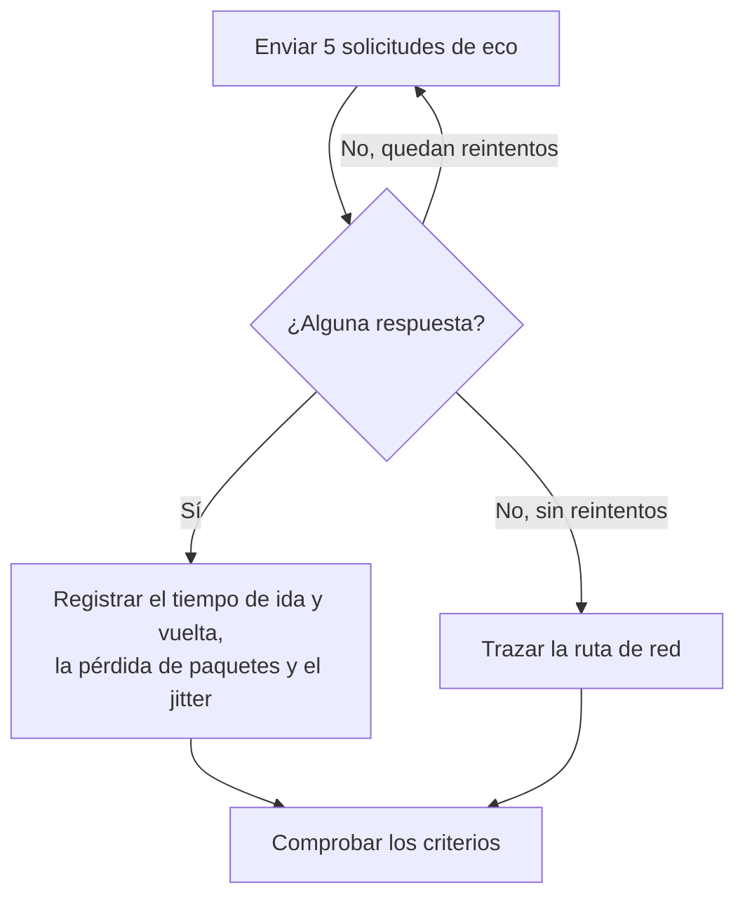

# Monitor de ping

Un monitor de ping comprueba que un host responde al ping (solicitudes de eco ICMP) y mide el tiempo de ida y vuelta, la pérdida de paquetes y el jitter. Úselo para servidores, routers, cortafuegos y otros dispositivos a los que llega por nombre de host o dirección IP.

:::cards
- [Crear el monitor](#crear-un-monitor-de-ping): Seis pasos en el panel.
- [Opciones de configuración](#opciones-de-configuración): El host, el tiempo de espera y los reintentos.
- [Criterios de monitoreo](#criterios-de-monitoreo): Accesibilidad, latencia, pérdida de paquetes y jitter.
- [Solución de problemas](#solución-de-problemas): Cuando el host funciona pero el monitor dice que está sin conexión.
:::

## Cómo funciona

En cada comprobación, una sonda envía cinco solicitudes de eco al host. Si vuelve al menos una respuesta, el host está en línea, y la sonda registra el tiempo medio de ida y vuelta como tiempo de respuesta, junto con la pérdida de paquetes, el jitter y las respuestas más rápida y más lenta. Si no vuelve ninguna respuesta, la sonda lo intenta de nuevo, hasta el número de reintentos que permita. Después, OneUptime pasa el resultado por los criterios del monitor.

Cuando una comprobación falla, la sonda también traza la ruta hasta el host y busca su nombre, y adjunta lo que encontró al resultado como **Ruta de red en el momento del fallo**, para que vea dónde se cortó la ruta.

> [!NOTE]
> Algunos proveedores de hosting bloquean ICMP en las máquinas donde se ejecuta una sonda. Una sonda que no puede enviar pings en absoluto comprueba en su lugar el puerto TCP `80` del host, para que el monitor siga diciendo si el host es accesible. La pérdida de paquetes y el jitter no se miden entonces.

Una sonda que ha perdido su propia conexión de red no informa de ningún resultado, así que no puede marcar su host como sin conexión.

## Antes de empezar

- **Un rol que pueda crear monitores**: Project Owner, Project Admin, Project Member, Monitor Admin o Monitor Member, o un rol personalizado con el permiso Create Monitor.
- **Una sonda que pueda llegar al host**, con ICMP permitido por el camino. Las sondas predeterminadas de su proyecto se eligen para cada monitor nuevo. Si un cortafuegos protege el host, permita las solicitudes de eco ICMP desde las [direcciones IP de las sondas de OneUptime Cloud](/docs/configuration/ip-addresses). Un host en una red privada necesita una [sonda personalizada](/docs/probe/custom-probe) dentro de esa red.

## Crear un monitor de ping

:::steps
### Empezar un monitor nuevo

Vaya a **Monitores** y haga clic en **Crear monitor**. En **Tipo de monitor**, elija **Ping**.

### Ponerle nombre

Introduzca un **Nombre**, como `Core router`, y haga clic en **Siguiente**.

### Introducir el host

En **Nombre de host o dirección IP**, introduzca el nombre de host o la dirección IPv4 o IPv6 a la que hacer ping, como `example.com` o `192.168.1.1`. Introduzca solo el host, sin `http://` ni puerto.

### Probarlo

Haga clic en **Probar monitor**, elija una sonda en **Seleccionar sonda** y haga clic en **Ejecutar prueba**. **Resultado de la prueba del monitor** muestra los tiempos de ida y vuelta y la pérdida de paquetes que vio la sonda.

### Revisar los criterios

**Criterios del monitor** empieza con los [criterios predeterminados](#criterios-predeterminados): sin conexión cuando el host no responde, en línea cuando responde. Cámbielos si lo necesita y haga clic en **Siguiente**.

### Elegir sondas y crear

Conserve o cambie las **Sondas** y el **Intervalo de monitoreo** (empieza en **Cada 5 minutos**), y haga clic en **Crear monitor**. Se abre la página del monitor.
:::

## Opciones de configuración

| Campo | Predeterminado | Qué introducir |
| --- | --- | --- |
| **Nombre de host o dirección IP** | Ninguno | El host al que hacer ping, como `example.com`, `192.168.1.1` o `2001:db8::1`. Un nombre de host se resuelve en cada comprobación, así que el monitor sigue los cambios de DNS. |
| **Tiempo de espera de la solicitud (segundos)** (en **Más campos**) | `60` | Cuánto esperar una respuesta en cada intento. El máximo es de 60 segundos. |
| **Reintentos en caso de fallo** (en **Más campos**) | El predeterminado de la sonda, normalmente `3` | Cuántas veces reintentar un intento fallido. El máximo es 3. |

**Reintentos en caso de fallo** cuenta los reintentos _después_ del primer intento, así que `0` ejecuta la comprobación una vez y `2` hasta tres veces. Si se deja en blanco, usa el valor predeterminado de la sonda: 3, a menos que `PROBE_MONITOR_RETRY_LIMIT` de la sonda indique otra cosa. Cada fallo se reintenta, incluidos los tiempos de espera agotados, con una pausa de un segundo entre intentos. Una comprobación correcta cuyas respuestas tardaron más de 10 segundos también se vuelve a comprobar.

Para vigilar una dirección IP fija y nunca un nombre de host, puede usar en su lugar un [monitor de IP](/docs/monitor/ip-monitor). Ejecuta la misma comprobación.

## Criterios de monitoreo

Los criterios deciden cuándo el host cuenta como en línea, degradado o sin conexión, y si eso declara un incidente o crea una alerta. Cada criterio comprueba uno o más filtros:

| Filtro | Condiciones | Qué comprueba |
| --- | --- | --- |
| **Is Online** | **Verdadero**, **Falso** | Si al menos una solicitud de eco recibió respuesta. |
| **Tiempo de respuesta (en ms)** | **Greater Than**, **Less Than**, **Greater Than Or Equal To**, **Less Than Or Equal To** | El tiempo medio de ida y vuelta de las respuestas. |
| **Packet Loss (in %)** | **Greater Than**, **Less Than**, **Greater Than Or Equal To**, **Less Than Or Equal To** | La parte de las cinco solicitudes de eco que no recibió respuesta. |
| **Jitter (in ms)** | **Greater Than**, **Less Than**, **Greater Than Or Equal To**, **Less Than Or Equal To** | La desviación estándar de los tiempos de ida y vuelta entre los paquetes enviados en una comprobación. |
| **Is Request Timeout** | **Verdadero**, **Falso** | Si el ping agotó el tiempo de espera en todos los intentos. |

Con dos o más filtros, **Condición de coincidencia** decide si deben coincidir **Todos** o basta con **Cualquiera**. Las **Acciones** de un criterio deciden qué hace: cambiar el estado del monitor, crear una alerta, declarar un incidente, o varias de estas cosas.

### Criterios predeterminados

Un monitor de ping nuevo empieza con dos criterios:

- **Sin conexión** — el host no responde a ninguna de las solicitudes de eco, o no es accesible en absoluto, después de todos los reintentos. El monitor se marca como **Sin conexión** y se crea un incidente llamado «_monitor name_ is offline». El incidente se resuelve solo cuando el host vuelve a responder.
- **En línea** — el host responde. El monitor se marca como **Operativo**.

Los criterios se comprueban de arriba abajo, y el primero que coincide decide qué ocurre. Cuando ninguno coincide, el monitor muestra su estado predeterminado: **Operativo**, salvo que elija otro en **Más campos**, debajo de los criterios.

### Evaluar durante un periodo de tiempo

**Evaluar estos criterios durante un periodo de tiempo** es una casilla debajo de un filtro, disponible para **Is Online**, **Tiempo de respuesta (en ms)**, **Packet Loss (in %)** y **Jitter (in ms)**. Actívela para juzgar una ventana de comprobaciones anteriores en lugar de la última: elija una agregación en **Evaluar** y una ventana, de 2 a 60 minutos, en **Durante los últimos (en minutos)**.

| Agregación | Coincide cuando |
| --- | --- |
| **Promedio**, **Suma**, **Maximum Value**, **Minimum Value** | Esa cifra, en la ventana, cumple la condición. Solo filtros numéricos. |
| **All Values** | Cada comprobación de la ventana cumple la condición. |
| **Any Value** | Al menos una comprobación de la ventana cumple la condición. |

**All Values** solo coincide cuando la ventana está realmente cubierta por datos. Un monitor recién creado, o uno cuyas comprobaciones dejaron de registrarse, no tiene historial suficiente para decir nada de los últimos N minutos, así que el criterio espera en lugar de coincidir con la única lectura que tiene. **Any Value** es el ajuste para «avísame en cuanto una sola comprobación supere el umbral» y sigue disparándose de inmediato.

**Si no hay datos** decide qué ocurre mientras la ventana no puede respaldar el criterio:

| Opción | Qué ocurre | Úsela para |
| --- | --- | --- |
| **Ignore** (predeterminado) | El criterio no coincide. | Alertas de umbral normales. |
| **Disparador** | Los datos que faltan cuentan como el problema. | Comprobaciones en las que el silencio es en sí un fallo. |
| **Treat As Zero** | La ventana se compara como un único cero. | Contadores en los que la ausencia de eventos significa realmente cero. |

### Criterios de ejemplo

| Objetivo | Filtro | Condición | Valor |
| --- | --- | --- | --- |
| Sin conexión cuando el host no es accesible | **Is Online** | **Falso** | — |
| Alertar cuando la latencia es alta | **Tiempo de respuesta (en ms)** | **Greater Than** | `200` |
| Marcar el host como degradado en un enlace con pérdidas | **Packet Loss (in %)** | **Greater Than** | `20` |
| Alertar ante una conexión inestable | **Jitter (in ms)** | **Greater Than** | `30` |

Para alertar solo cuando la latencia se mantiene alta, active **Evaluar estos criterios durante un periodo de tiempo** para el filtro de tiempo de respuesta y elija **All Values** durante **5** minutos.

## Solución de problemas

:::details El host funciona, pero el monitor dice que está sin conexión
El host, o un cortafuegos delante de él, no responde a las solicitudes de eco ICMP de la sonda. Muchos servidores y redes en la nube descartan el ping de forma predeterminada. Permita las solicitudes de eco ICMP desde las sondas, o vigile en su lugar un servicio del host con un [monitor de puerto](/docs/monitor/port-monitor). **Ruta de red en el momento del fallo**, en la comprobación fallida, muestra hasta dónde llegó la ruta.
:::

:::details La comprobación falla con «This probe could not resolve» para el host
El servidor DNS de la sonda no conoce el nombre de host. Revise el nombre, o introduzca en su lugar la dirección IP. Un nombre que solo se resuelve dentro de su red necesita allí una [sonda personalizada](/docs/probe/custom-probe).
:::

:::details La pérdida de paquetes y el jitter están vacíos
La sonda que ejecutó la comprobación no puede enviar pings, así que comprobó en su lugar el puerto TCP `80`, que no mide ninguno de los dos. Ejecute el monitor en una sonda que tenga permiso para enviar ICMP.
:::

## Próximos pasos

:::cards
- [Monitor de IP](/docs/monitor/ip-monitor): Vigilar una dirección IPv4 o IPv6 fija.
- [Monitor de puerto](/docs/monitor/port-monitor): Comprobar un servicio del host, no solo el host.
- [Sondas personalizadas](/docs/probe/custom-probe): Hacer ping a hosts de su propia red.
- [Incidentes](/docs/incidents/index): Qué ocurre después de que el monitor declara uno.
:::
