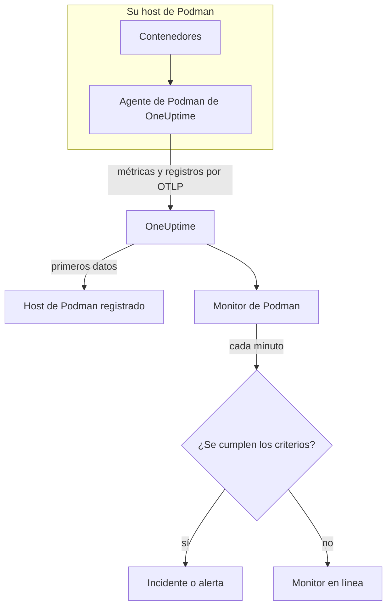

# Monitor de Podman

Un monitor de Podman vigila los contenedores de un host de Podman y le avisa cuando un contenedor se calienta, se queda sin memoria o no deja de reiniciarse. Lee las métricas que el agente de Podman de OneUptime envía desde el host, así que nada se sondea desde fuera: instale el agente y luego cree el monitor a partir de una plantilla o de su propia consulta.

:::cards
- [Crear el monitor](#crear-un-monitor-de-podman): Seis pasos en el panel.
- [Plantillas](#plantillas-de-alerta-listas-para-usar): Cinco alertas listas para usar, un incidente por contenedor.
- [Métricas](#métricas-recopiladas): Qué recopila el agente y qué significa cada métrica.
- [Registros](#registros-recopilados): Los registros de los contenedores y el controlador de registro que necesitan.
:::

## Cómo funciona

El agente de Podman de OneUptime se ejecuta como contenedor en el host. Cada 30 segundos lee las estadísticas de los contenedores a través del socket de API compatible con Docker de Podman, sigue los archivos de registro de los contenedores y envía ambos a OneUptime por OTLP. Los primeros datos de un host lo registran en OneUptime.

Un monitor de Podman está vinculado a un host. Cada minuto ejecuta su consulta sobre las métricas de los contenedores de ese host y compara el resultado con sus criterios.



## Antes de empezar

- **Instale el agente de Podman** en el host. La [guía del agente de Podman](/docs/telemetry/podman-host) explica cómo instalarlo, actualizarlo y comprobarlo. El agente necesita el socket de API de Podman en `/run/podman/podman.sock`.
- **Compruebe que el host está registrado.** Aparece en **Productos → Infraestructura → Podman → Todos los hosts**, con el nombre del `PODMAN_HOST_NAME` del agente, en cuanto llegan sus primeros datos.
- **Para los registros de los contenedores**, ejecute los contenedores con el controlador de registro `k8s-file`. Consulte [Requisito del controlador de registro](#requisito-del-controlador-de-registro).

## Crear un monitor de Podman

:::steps
### Empezar un monitor nuevo

Vaya a **Monitores** y haga clic en **Crear monitor**.

### Elegir Podman Container

En **Tipo de monitor**, haga clic en **Más tipos de monitor** y elija **Podman Container** en **Infraestructura**, o escriba `podman` en el cuadro de búsqueda. Introduzca un **Nombre** – se usa en los títulos de los incidentes y las alertas – y haga clic en **Siguiente**.

### Elegir el host

En **Configuración del monitor de Podman**, elija el host en **Host de Podman**. Cada host que ha enviado datos está en la lista.

### Elegir qué vigilar

Elija una de las tres pestañas:

- **Quick Setup** – haga clic en una [plantilla](#plantillas-de-alerta-listas-para-usar). Fija la métrica, la agregación, el intervalo de tiempo y los umbrales, y sustituye los criterios de abajo por los suyos. Aún puede cambiar el **Intervalo de tiempo**.
- **Custom Metric** – elija una métrica en **Métrica de Podman** y luego fije la **Agregación** y el **Intervalo de tiempo**. **Nombre del contenedor** e **Imagen del contenedor** la restringen a algunos contenedores.
- **Avanzado** – cree usted mismo consultas y fórmulas en **Seleccionar métricas**. Use **Agrupar por** `resource.container.name` para juzgar cada contenedor por separado.

### Revisar los criterios

Abra cada criterio en **Criterios del monitor** y revise su **Métrica**, **Agregación**, **Condición** y **Umbral**. Una plantilla los rellena. Con **Custom Metric** o **Avanzado**, el monitor empieza con los [criterios predeterminados](#criterios-predeterminados), que solo detectan que una métrica cae a cero, así que fije su propio umbral.

### Crear el monitor

Haga clic en **Crear monitor**. OneUptime abre la página del monitor y lo evalúa cada minuto. Los incidentes y alertas que genera también aparecen en las páginas **Incidentes** y **Alertas** del host.
:::

> [!TIP]
> Para configurar varias plantillas a la vez, abra el host desde **Productos → Infraestructura → Podman** y vaya a **Recomendaciones**. Elija las plantillas que quiera, elija a quién se avisa, y OneUptime crea un monitor por plantilla.

## Ajustes del monitor

| Campo | Pestaña | Qué hace |
| --- | --- | --- |
| **Host de Podman** | Todas | Obligatorio. Limita cada consulta al `resource.host.name` del host. OneUptime también añade `resource.container.runtime = podman` a cada consulta. |
| **Métrica de Podman** | Custom Metric | Una métrica del catálogo del agente, agrupada en CPU, memoria, red, E/S de bloques y contenedor. |
| **Nombre del contenedor** | Custom Metric, Avanzado | Opcional. Coincidencia exacta con `resource.container.name`, por ejemplo `my-container`. |
| **Imagen del contenedor** | Custom Metric, Avanzado | Opcional. Coincidencia exacta con `resource.container.image.name`, por ejemplo `nginx:latest`. |
| **Agregación** | Custom Metric | Cómo se combinan las muestras: **Promedio**, **Máximo**, **Mínimo**, **Suma** o **Recuento**. Empieza en la agregación habitual de la métrica. |
| **Intervalo de tiempo** | Todas | La ventana móvil que lee la consulta, de **Past 1 Minute** a **Past 365 Days**. Un monitor nuevo empieza en **Past 1 Minute**; las plantillas fijan la suya. |
| **Seleccionar métricas** | Avanzado | El generador de consultas: **Métrica**, **Agregar por**, **Filtrar por atributos**, **Agrupar por**, además de **Añadir métrica** y **Añadir fórmula** para combinar consultas. |

## Plantillas de alerta listas para usar

**Quick Setup** ofrece cinco plantillas. Cada una crea un monitor completo: una consulta agrupada por `resource.container.name`, un criterio que se dispara y otro que se recupera. Cada contenedor se juzga por separado y recibe su propio incidente y su propia alerta. Los umbrales son puntos de partida que puede editar.

Un criterio solo se dispara cuando la condición se cumple en cada minuto de su ventana, y se recupera un 10 % más allá del umbral para que un valor que oscila en el límite no cambie de estado una y otra vez.

| Plantilla | Gravedad | Vigila | Se dispara cuando | Se recupera cuando |
| --- | --- | --- | --- | --- |
| High Container CPU Usage | Advertencia | `container.cpu.utilization`, Avg por contenedor, últimos 5 minutos | Por encima de 80 (% de un núcleo) | En 72 o menos |
| High Container Memory Usage | Advertencia | `container.memory.percent`, Avg por contenedor, últimos 5 minutos | Por encima del 85 % | En el 76,5 % o menos |
| High Container Restart Count | Crítico | `container.restarts`, Max por contenedor, últimos 5 minutos | Por encima de 5 reinicios en total | 4,5 o menos |
| High Container Process Count | Advertencia | `container.pids.count`, Max por contenedor, últimos 5 minutos | Por encima de 500 | En 450 o menos |
| Container Restarted (Low Uptime) | Crítico | `container.uptime`, Min por contenedor, último 1 minuto | Por debajo de 120 segundos | En 132 segundos o más |

**Gravedad** es la etiqueta que muestra el selector. El incidente y la alerta que crea una plantilla empiezan con la gravedad de incidente y de alerta más alta de su proyecto; cámbielas en los criterios.

Las dos plantillas de porcentaje usan **Promedio**: sus métricas ya son porcentajes por contenedor, así que el promedio de un minuto es la lectura sostenida. El número de reinicios y el número de procesos usan **Máximo**, donde una sola muestra por encima del umbral es la señal.

> [!NOTE]
> `container.cpu.utilization` es el número que imprime `podman stats`: el 100 % es un núcleo de CPU completo, no toda la asignación de CPU del contenedor. Un contenedor con varios núcleos marca bastante más de 100 cuando está sano, así que suba el umbral en esos casos.

> [!NOTE]
> `container.restarts` es un total acumulado que lleva Podman, no un recuento de reinicios en la ventana. Por eso **High Container Restart Count** sigue abierta hasta que se vuelve a crear el contenedor, lo que pone el recuento a cero.

> [!CAUTION]
> `container.uptime` solo existe para los contenedores en ejecución. Un contenedor que se detiene y sigue detenido no envía datos, así que **Container Restarted (Low Uptime)** detecta reinicios y nuevos despliegues, no una parada definitiva. Un contenedor pensado para ejecutarse menos de dos minutos permanece en estado de alerta durante toda su vida.

No hay plantilla de limitación de CPU. Las métricas de limitación que recopila el agente solo crecen, y una alerta de «limitado alguna vez» se dispararía una vez y no se resolvería nunca. Aun así, ambas se recopilan, así que puede graficarlas.

## Métricas recopiladas

El agente usa el receptor `docker_stats` de OpenTelemetry apuntando al socket compatible con Docker de Podman, `/run/podman/podman.sock`, cada 30 segundos. Las métricas de cada contenedor llevan su identidad como atributos de recurso: `resource.container.name`, `resource.container.image.name`, `resource.container.id`, `resource.container.runtime` (`podman`) y `resource.host.name`.

### CPU

| Métrica | Descripción |
| --- | --- |
| `container.cpu.utilization` | Uso de CPU del contenedor, donde el 100 % es un núcleo de CPU completo. |
| `container.cpu.usage.total` | Tiempo de CPU usado desde que se inició el contenedor, en nanosegundos. Un contador de toda la vida útil. |
| `container.cpu.throttling_data.throttled_time` | Nanosegundos que el contenedor ha estado limitado por su límite de CPU. Un contador de toda la vida útil. |
| `container.cpu.throttling_data.throttled_periods` | Periodos de limitación desde que se inició el contenedor. Un contador de toda la vida útil. |

### Memoria

| Métrica | Descripción |
| --- | --- |
| `container.memory.usage.total` | Memoria en uso, en bytes. |
| `container.memory.usage.limit` | Límite de memoria, en bytes. |
| `container.memory.percent` | Uso de memoria como porcentaje del límite del contenedor, o de la memoria del host cuando el contenedor no tiene límite. |

### Red

| Métrica | Descripción |
| --- | --- |
| `container.network.io.usage.rx_bytes` | Bytes recibidos. Un contador de toda la vida útil. |
| `container.network.io.usage.tx_bytes` | Bytes enviados. Un contador de toda la vida útil. |

### E/S de bloques

| Métrica | Descripción |
| --- | --- |
| `container.blockio.io_service_bytes_recursive.read` | Bytes leídos de dispositivos de bloques. |
| `container.blockio.io_service_bytes_recursive.write` | Bytes escritos en dispositivos de bloques. |

### Contenedor

| Métrica | Descripción |
| --- | --- |
| `container.uptime` | Segundos desde que se inició el contenedor. Solo los contenedores en ejecución la informan. |
| `container.restarts` | Veces que se ha reiniciado el contenedor. Un total acumulado. |
| `container.pids.count` | Tareas del contenedor. El controlador pids del cgroup cuenta los hilos además de los procesos. |

La lista **Métrica de Podman** también ofrece `container.cpu.usage.percpu`, `container.memory.rss`, `container.memory.cache` y los contadores de paquetes de red. La configuración del agente que se distribuye no las activa, así que revise la página **Métricas** del host antes de basarse en ellas. `container.cpu.throttling_data.throttled_periods` no está en la lista; consúltela desde **Avanzado**.

## Criterios de monitoreo

Un criterio compara una de las consultas o fórmulas del monitor con un umbral. Los criterios de un monitor de Podman no tienen **Tipo de filtro**: cada regla comprueba el valor de la métrica, con estos campos.

| Campo | Qué hace |
| --- | --- |
| **Métrica** | La consulta o fórmula que se comprueba, por su nombre de variable. |
| **Agregación** | Cómo los valores de la ventana se convierten en una sola respuesta: **Promedio**, **Suma**, **Maximum Value**, **Minimum Value**, **All Values** (cada valor debe coincidir) o **Any Value** (basta con uno). |
| **Condición** | **Greater Than**, **Less Than**, **Greater Than Or Equal To**, **Less Than Or Equal To** o **Equal To**, o una condición de anomalía: **Anomalously High**, **Anomalously Low** o **Anomalous**. |
| **Umbral** | El valor con el que comparar. Junto a él hay una lista de unidades cuando la métrica tiene unidad. No se muestra para las condiciones de anomalía. |
| **Sensibilidad** | Solo condiciones de anomalía. **Bajo** (4σ), **Medio** (3σ, el predeterminado) o **Alto** (2σ). |
| **Ventana de referencia** | Solo condiciones de anomalía. 14 días (el predeterminado), 28, 60 o 90 días de historial. |
| **Si no hay datos** | En **Más campos**. Qué ocurre cuando la ventana no tiene muestras: **Ignore** (el predeterminado), **Treat As Zero** o **Disparador**. |

Las condiciones de anomalía comparan cada valor con la misma hora de la semana en la referencia. Permanecen en un estado «Learning», y no generan nada, hasta que la ventana de referencia contiene suficiente historial.

Cada criterio indica también qué hacer cuando coincide: cambiar el estado del monitor, crear una alerta o declarar un incidente. Los criterios se comprueban de arriba abajo, y el primero que coincide decide.

### Criterios predeterminados

Un monitor que no crea a partir de una plantilla empieza con dos criterios:

| Orden | Criterio | Coincide cuando | Entonces |
| --- | --- | --- | --- |
| 1 | Check if _monitor name_ is offline | Cualquier valor de la primera consulta es `0` | Marca el monitor como **Sin conexión** y declara el incidente «_monitor name_ is offline», que se resuelve solo cuando el monitor se recupera. |
| 2 | Check if _monitor name_ is online | Cualquier valor está por encima de `0` | Marca el monitor como **Operativo**. |

> [!IMPORTANT]
> El silencio no coincide con ninguno de los dos criterios: un host que deja de enviar datos deja el monitor como estaba. Para que se le avise cuando dejen de llegar datos, ponga **Si no hay datos** en **Disparador** en un criterio. El tiempo en que el propio OneUptime no estaba recibiendo nunca cuenta como falta de datos: una comprobación cuya ventana lo contiene espera en su lugar, como explica [Cuando OneUptime no recibe datos](/docs/monitor/when-oneuptime-is-not-receiving).

## Registros recopilados

El agente también sigue el archivo `ctr.log` de cada contenedor y envía cada línea como un registro de OpenTelemetry con:

| Campo | Valor |
| --- | --- |
| `resource.host.name` | El host, de `PODMAN_HOST_NAME`. |
| `resource.container.id` | El ID completo del contenedor. |
| `resource.container.runtime` | Siempre `podman`. |
| `attributes["log.iostream"]` | `stdout` o `stderr`. |
| `severityText` / `severityNumber` | Se lee de una palabra clave de nivel allí donde haya un nivel en la línea (`[ERROR]`, `app.INFO:`, `{"level":"warn"}`, `level=error`). Una línea sin nivel recurre a su flujo: `stderr` es `ERROR`, `stdout` es `INFO`. |
| `body` | La línea que escribió el contenedor. Las líneas que empiezan con un espacio o un corchete de cierre, como las líneas de una traza de pila, se unen a la línea anterior. |
| `time` | La marca de tiempo de Podman para la línea. |

Los registros aparecen en la página **Registros** del host y en la página de cada contenedor.

### Requisito del controlador de registro

El agente lee los archivos que escribe el controlador de registro `k8s-file` de Podman, en `/var/lib/containers/storage/overlay-containers/*/userdata/ctr.log`. Podman con privilegios de root usa `journald` de forma predeterminada, que escribe en el diario de systemd, así que no hay ningún archivo que leer:

| Controlador | Qué ve el agente |
| --- | --- |
| `k8s-file` (o `json-file`, que Podman trata igual) | Cada línea. |
| `journald` | Nada: los registros están en el diario de systemd. |
| `none` | Nada: los registros se descartan. |

Las métricas no dependen del controlador de registro: un host cuyos contenedores usan `journald` sigue informando de métricas; solo su página **Registros** queda vacía.

Compruebe el controlador de un contenedor y el predeterminado de Podman:

```bash
podman inspect <container> --format '{{.HostConfig.LogConfig.Type}}'
podman info --format '{{.Host.LogDriver}}'
```

Cambie a `k8s-file`. Podman fija el controlador de registro de un contenedor cuando se crea el contenedor, así que vuelva a crear cada contenedor después del cambio: un reinicio conserva el controlador anterior.

:::tabs
@tab podman run
Inicie el contenedor con el controlador:

```bash
podman run --log-driver k8s-file ... <image>
```

Para cambiar un contenedor existente, elimínelo y vuelva a ejecutarlo:

```bash
podman rm -f <container>
podman run --log-driver k8s-file ... <image>
```
@tab Podman Compose
Fije el controlador en cada servicio:

```yaml title="docker-compose.yml"
services:
  my-app:
    image: my-app:latest
    logging:
      driver: "k8s-file"
      options:
        max-size: "100m"
```

Luego vuelva a crear el servicio:

```bash
podman compose up -d --force-recreate <service>
```
@tab containers.conf
Haga de `k8s-file` el predeterminado para cada contenedor que se cree después, en `/etc/containers/containers.conf` (con root) o `~/.config/containers/containers.conf` (sin root):

```toml title="containers.conf"
[containers]
log_driver = "k8s-file"
```

Luego elimine y vuelva a crear cada contenedor.
:::

## Solución de problemas

:::details El host no aparece en la lista Host de Podman
Los hosts se registran solos a partir de los datos del agente. Compruebe que el contenedor del agente se está ejecutando, que el socket de API de Podman está habilitado y que el host aparece en **Productos → Infraestructura → Podman → Todos los hosts**. La [guía del agente de Podman](/docs/telemetry/podman-host) incluye las comprobaciones que debe ejecutar en el host.
:::

:::details Llegan métricas, pero la página Registros está vacía
Casi seguro que los contenedores usan `journald`. Cambie a `k8s-file` los contenedores cuyos registros quiera (consulte [Requisito del controlador de registro](#requisito-del-controlador-de-registro)) y vuelva a crearlos.
:::

:::details El agente registra «no files match the configured criteria»
El agente busca `/var/lib/containers/storage/overlay-containers/*/userdata/ctr.log` y no ha encontrado nada. O ningún contenedor del host usa `k8s-file`, o falta o está vacío el montaje de `/var/lib/containers/storage` del agente, o el agente y los contenedores se ejecutan en modos distintos: los contenedores sin root guardan su almacenamiento en un lugar que la ruta con root no cubre, y al revés.
:::

:::details Los datos llegan con un nombre de host incorrecto
OneUptime identifica un host por `resource.host.name`, que el agente toma de `PODMAN_HOST_NAME`. Cambiar `PODMAN_HOST_NAME` después de los primeros datos crea un segundo host en lugar de renombrar el primero, y un monitor sigue vinculado al nombre con el que se creó.
:::

:::details Una alerta de CPU nunca se dispara
Agrupe la consulta por `resource.container.name`, como hace la plantilla **High Container CPU Usage**, para que cada contenedor se juzgue por separado. Un promedio de todos los contenedores de un host ocupado se ve arrastrado a la baja por los inactivos. Recuerde que el 100 % significa un núcleo completo, así que un contenedor al que se permiten varios núcleos necesita un umbral más alto.
:::

:::details La alerta del número de reinicios nunca se resuelve
`container.restarts` es un total acumulado, así que no vuelve a bajar del umbral por sí solo. Corrija la causa y luego vuelva a crear el contenedor para poner el recuento a cero, o suba el umbral.
:::

## Próximos pasos

:::cards
- [Agente de Podman](/docs/telemetry/podman-host): Instalar, actualizar y solucionar problemas del agente que lee este monitor.
- [Monitor de Docker](/docs/monitor/docker-monitor): El mismo monitor para hosts de Docker.
- [Visión general de los incidentes](/docs/incidents/index): Qué ocurre después de que un criterio declare un incidente.
- [Programaciones de guardia](/docs/on-call/schedules): Decidir a quién se avisa cuando un contenedor falla.
:::
