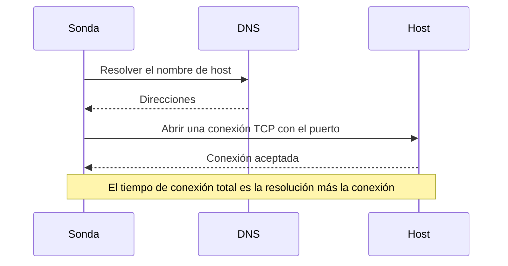

# Monitor de puerto

Un monitor de puerto comprueba que un host acepta conexiones TCP en un puerto, y mide cuánto tarda la conexión. Úselo para servicios que no hablan HTTP, o cuyo HTTP no quiere comprobar: bases de datos, servidores de correo, SSH, brokers de mensajes y similares.

:::cards
- [Crear el monitor](#crear-un-monitor-de-puerto): Seis pasos en el panel.
- [Tiempos de conexión](#tiempos-de-conexión): Qué miden los tiempos de DNS, TCP y total.
- [Criterios de monitoreo](#criterios-de-monitoreo): Accesibilidad y tiempos de conexión.
- [Solución de problemas](#solución-de-problemas): Cuando el servicio funciona pero el monitor dice que está sin conexión.
:::

## Cómo funciona

En cada comprobación, una sonda resuelve el nombre de host, si indicó uno, y abre una conexión TCP con el puerto. El puerto está en línea en cuanto se acepta la conexión; la sonda la cierra entonces sin enviar nada. Una conexión rechazada o que agota el tiempo de espera se vuelve a intentar, hasta el número de reintentos que permita. Después, OneUptime pasa el resultado por los criterios del monitor.

La sonda solo abre conexiones TCP: un servicio que escucha únicamente en UDP, como un agente SNMP, no se puede comprobar con un monitor de puerto.

Cuando una comprobación falla, la sonda también traza la ruta hasta el host y busca su nombre, y adjunta lo que encontró al resultado como **Ruta de red en el momento del fallo**, para que vea dónde se cortó la ruta. Una sonda que ha perdido su propia conexión de red no informa de ningún resultado, así que no puede marcar su servicio como sin conexión.

## Antes de empezar

- **Un rol que pueda crear monitores**: Project Owner, Project Admin, Project Member, Monitor Admin o Monitor Member, o un rol personalizado con el permiso Create Monitor.
- **Una sonda que pueda llegar al puerto.** Las sondas predeterminadas de su proyecto se eligen para cada monitor nuevo. Si un cortafuegos protege el servicio, permita que las [direcciones IP de las sondas de OneUptime Cloud](/docs/configuration/ip-addresses) se conecten al puerto. Un servicio en una red privada, como una base de datos, necesita una [sonda personalizada](/docs/probe/custom-probe) dentro de esa red.

## Crear un monitor de puerto

:::steps
### Empezar un monitor nuevo

Vaya a **Monitores** y haga clic en **Crear monitor**. En **Tipo de monitor**, elija **Puerto**.

### Ponerle nombre

Introduzca un **Nombre**, como `Orders database`, y haga clic en **Siguiente**.

### Introducir el host y el puerto

En **Nombre de host o dirección IP**, introduzca el host en el que está el puerto, como `db.example.com` o `10.0.0.12`. En **Puerto**, introduzca el número de puerto, como `5432`.

### Probarlo

Haga clic en **Probar monitor**, elija una sonda en **Seleccionar sonda** y haga clic en **Ejecutar prueba**. **Resultado de la prueba del monitor** muestra si se abrió la conexión y cuánto tardó cada parte.

### Revisar los criterios

**Criterios del monitor** empieza con los [criterios predeterminados](#criterios-predeterminados): sin conexión cuando el puerto no acepta una conexión, en línea cuando la acepta. Cámbielos si lo necesita y haga clic en **Siguiente**.

### Elegir sondas y crear

Conserve o cambie las **Sondas** y el **Intervalo de monitoreo** (empieza en **Cada 5 minutos**), y haga clic en **Crear monitor**. Se abre la página del monitor.
:::

## Opciones de configuración

| Campo | Predeterminado | Qué introducir |
| --- | --- | --- |
| **Nombre de host o dirección IP** | Ninguno | El host, como `example.com`, `192.168.1.1` o `2001:db8::1`. Introduzca solo el host, sin `http://`. |
| **Puerto** | Ninguno | El puerto TCP al que conectarse, de `1` a `65535`. |
| **Tiempo de espera de la solicitud (segundos)** (en **Más campos**) | `60` | Cuánto puede durar un intento, la resolución DNS y la conexión TCP juntas. El máximo es de 60 segundos. |
| **Reintentos en caso de fallo** (en **Más campos**) | El predeterminado de la sonda, normalmente `3` | Cuántas veces reintentar un intento fallido. El máximo es 3. |

**Reintentos en caso de fallo** cuenta los reintentos _después_ del primer intento, así que `0` ejecuta la comprobación una vez y `2` hasta tres veces. Si se deja en blanco, usa el valor predeterminado de la sonda: 3, a menos que `PROBE_MONITOR_RETRY_LIMIT` de la sonda indique otra cosa. Cada fallo se reintenta, incluidos los tiempos de espera agotados, con una pausa de un segundo entre intentos. Una conexión correcta que tardó más de 10 segundos también se vuelve a comprobar.

Puertos habituales:

| Puerto | Servicio |
| --- | --- |
| `22` | SSH |
| `25` | SMTP |
| `80` | HTTP |
| `443` | HTTPS |
| `3306` | MySQL |
| `5432` | PostgreSQL |
| `6379` | Redis |
| `27017` | MongoDB |

> [!NOTE]
> Muchos proveedores de hosting bloquean el SMTP saliente. En una sonda que no puede enviar pings, que es como una sonda nota que se ejecuta en un proveedor así, una comprobación del puerto `25` que agota el tiempo de espera cuenta como en línea. Para comprobar de forma fiable el puerto `25` de un servidor de correo, ejecute el monitor en una [sonda personalizada](/docs/probe/custom-probe) que tenga permiso para conectarse a él.

## Tiempos de conexión

Para un nombre de host, la sonda mide la comprobación en dos fases:

| Fase | Desde | Hasta |
| --- | --- | --- |
| **Resolución DNS** | El inicio de la comprobación | El primer intento de conexión TCP |
| **Conexión TCP** | El primer intento de conexión TCP | La aceptación de la conexión, incluido el tiempo de alternar entre direcciones IPv6 e IPv4 |

**Tiempo de conexión total (DNS + TCP)** va desde el inicio de la comprobación hasta que se acepta la conexión. También es el tiempo de respuesta del monitor de puerto, así que los criterios, alertas y gráficos existentes que usan el tiempo de respuesta siguen funcionando.

Cuando el destino es una dirección IP, no hay resolución DNS, así que esa fase se omite. Los resultados de comprobaciones anteriores a la medición por fases solo muestran el tiempo de conexión total.

## Criterios de monitoreo

Los criterios deciden cuándo el puerto cuenta como en línea, degradado o sin conexión, y si eso declara un incidente o crea una alerta. Cada criterio comprueba uno o más filtros:

| Filtro | Condiciones | Qué comprueba |
| --- | --- | --- |
| **Is Online** | **Verdadero**, **Falso** | Si el puerto aceptó una conexión. |
| **Tiempo de conexión total (DNS + TCP) (en ms)** | **Greater Than**, **Less Than**, **Greater Than Or Equal To**, **Less Than Or Equal To** | El tiempo de conexión completo, incluida la resolución DNS de un nombre de host. |
| **Port DNS Lookup Time (in ms)** | **Greater Than**, **Less Than**, **Greater Than Or Equal To**, **Less Than Or Equal To** | La resolución DNS antes del primer intento TCP. No tiene valor cuando el destino es una dirección IP. |
| **Port TCP Connect Time (in ms)** | **Greater Than**, **Less Than**, **Greater Than Or Equal To**, **Less Than Or Equal To** | Desde el primer intento TCP hasta que se acepta la conexión, incluida la alternancia entre IPv6 e IPv4. |
| **Is Request Timeout** | **Verdadero**, **Falso** | Si la resolución DNS o la conexión TCP superó el tiempo de espera, en todos los intentos. |

Un criterio de resolución DNS no tiene nada que evaluar cuando el destino es una dirección IP. Para criterios que deben funcionar igual con nombres de host y direcciones IP, use el tiempo total o el tiempo de conexión TCP.

Con dos o más filtros, **Condición de coincidencia** decide si deben coincidir **Todos** o basta con **Cualquiera**. Las **Acciones** de un criterio deciden qué hace: cambiar el estado del monitor, crear una alerta, declarar un incidente, o varias de estas cosas.

### Criterios predeterminados

Un monitor de puerto nuevo empieza con dos criterios:

- **Sin conexión** — el puerto no acepta una conexión, después de todos los reintentos. El monitor se marca como **Sin conexión** y se crea un incidente llamado «_monitor name_ is offline». El incidente se resuelve solo cuando el puerto vuelve a aceptar conexiones.
- **En línea** — el puerto acepta una conexión. El monitor se marca como **Operativo**.

Los criterios se comprueban de arriba abajo, y el primero que coincide decide qué ocurre. Cuando ninguno coincide, el monitor muestra su estado predeterminado: **Operativo**, salvo que elija otro en **Más campos**, debajo de los criterios.

### Evaluar durante un periodo de tiempo

**Evaluar estos criterios durante un periodo de tiempo** es una casilla debajo de un filtro, disponible para **Is Online**, **Tiempo de conexión total (DNS + TCP) (en ms)**, **Port DNS Lookup Time (in ms)** y **Port TCP Connect Time (in ms)**. Actívela para juzgar una ventana de comprobaciones anteriores en lugar de la última: elija una agregación en **Evaluar** y una ventana, de 2 a 60 minutos, en **Durante los últimos (en minutos)**.

| Agregación | Coincide cuando |
| --- | --- |
| **Promedio**, **Suma**, **Maximum Value**, **Minimum Value** | Esa cifra, en la ventana, cumple la condición. Solo filtros numéricos. |
| **All Values** | Cada comprobación de la ventana cumple la condición. |
| **Any Value** | Al menos una comprobación de la ventana cumple la condición. |

**All Values** solo coincide cuando la ventana está realmente cubierta por datos. Un monitor recién creado, o uno cuyas comprobaciones dejaron de registrarse, no tiene historial suficiente para decir nada de los últimos N minutos, así que el criterio espera en lugar de coincidir con la única lectura que tiene. **Any Value** es el ajuste para «avísame en cuanto una sola comprobación supere el umbral» y sigue disparándose de inmediato.

**Si no hay datos** decide qué ocurre mientras la ventana no puede respaldar el criterio:

| Opción | Qué ocurre | Úsela para |
| --- | --- | --- |
| **Ignore** (predeterminado) | El criterio no coincide. | Alertas de umbral normales. |
| **Disparador** | Los datos que faltan cuentan como el problema. | Comprobaciones en las que el silencio es en sí un fallo. |
| **Treat As Zero** | La ventana se compara como un único cero. | Contadores en los que la ausencia de eventos significa realmente cero. |

### Criterios de ejemplo

| Objetivo | Filtro | Condición | Valor |
| --- | --- | --- | --- |
| Sin conexión cuando el puerto está cerrado | **Is Online** | **Falso** | — |
| Alertar cuando la conexión es lenta | **Tiempo de conexión total (DNS + TCP) (en ms)** | **Greater Than** | `500` |
| Marcar el servicio como degradado cuando tarda en conectar | **Tiempo de conexión total (DNS + TCP) (en ms)** | **Greater Than** | `200` |
| Alertar cuando el DNS es lento | **Port DNS Lookup Time (in ms)** | **Greater Than** | `100` |
| Alertar cuando el handshake TCP es lento | **Port TCP Connect Time (in ms)** | **Greater Than** | `250` |

## Solución de problemas

:::details El servicio funciona, pero el monitor dice que está sin conexión
La sonda no pudo abrir una conexión: un cortafuegos la descarta, el servicio solo escucha en una interfaz privada, o el puerto es incorrecto. La causa raíz del incidente, y **Registros de monitoreo** en el monitor, muestran el error, y **Ruta de red en el momento del fallo** muestra hasta dónde llegó la ruta. Deje pasar las sondas por el cortafuegos, o use una [sonda personalizada](/docs/probe/custom-probe) dentro de la red.
:::

:::details El tiempo de resolución DNS siempre está vacío
El destino es una dirección IP, así que no hay nada que resolver. Use en su lugar **Tiempo de conexión total (DNS + TCP) (en ms)** o **Port TCP Connect Time (in ms)**.
:::

:::details Necesito comprobar un servicio UDP
Los monitores de puerto solo abren conexiones TCP. Para un servidor DNS, use un [monitor de DNS](/docs/monitor/dns-monitor), y para un servidor de hora en el puerto UDP 123, un [monitor de NTP](/docs/monitor/ntp-monitor). Ambos envían consultas reales.
:::

## Próximos pasos

:::cards
- [Monitor de ping](/docs/monitor/ping-monitor): Comprobar que el propio host es accesible.
- [Monitor de certificado SSL](/docs/monitor/ssl-certificate-monitor): Comprobar el certificado en un puerto TLS.
- [Monitor de salud de la base de datos](/docs/monitor/database-health-monitor): Ir más allá de un puerto abierto y vigilar la salud de una base de datos.
- [Sondas personalizadas](/docs/probe/custom-probe): Comprobar puertos de su propia red.
:::
