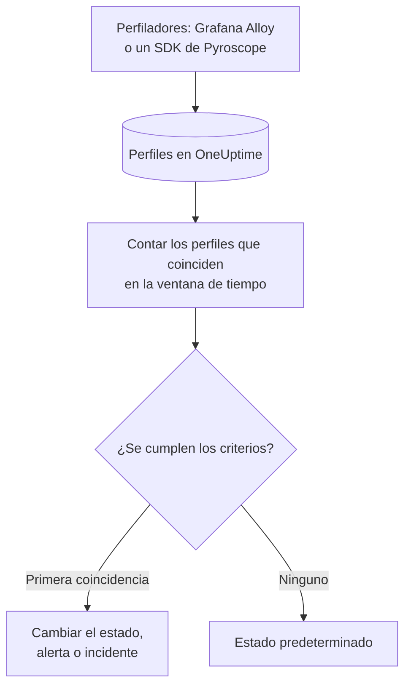

# Monitor de perfiles

Un monitor de perfiles cuenta, en una ventana de tiempo, los perfiles continuos que tus servicios envían a OneUptime y que coinciden con tus filtros (tipo de perfil, servicio, atributos). Cuando el recuento cumple tus criterios, cambia el estado del monitor, crea una alerta o declara un incidente. Su uso principal es darse cuenta de cuándo dejan de llegar datos de perfilado de un servicio.

> [!IMPORTANT]
> **Crear monitor** en el panel no ofrece Profiles: todavía no hay un formulario para sus filtros. Crea un monitor de perfiles mediante la [API](/docs/api-reference/api-reference) o [Terraform](/docs/terraform/monitor-steps), como se describe más abajo. Una vez creado, puedes ver y editar sus criterios en la página **Criterios** del monitor en el panel; sus filtros solo se pueden cambiar mediante la API o Terraform.

:::cards
- [Crear el monitor](#crear-un-monitor-de-perfiles): La configuración que se envía mediante la API o Terraform.
- [Qué consulta](#qué-consulta): Tipos de perfil, servicios, atributos y la ventana.
- [Criterios](#criterios): Las condiciones que puedes usar.
- [Ejemplo práctico](#ejemplo-práctico-los-perfiles-dejan-de-llegar): Sabe cuándo un servicio deja de enviar perfiles.
:::

## Cómo funciona



Cada minuto, OneUptime cuenta los perfiles que coinciden con los filtros del monitor y empezaron dentro de su ventana de tiempo. Compara ese recuento con los criterios del monitor de arriba abajo, y el primer criterio que coincide decide qué pasa. Si no coincide ninguno, el monitor vuelve a su estado predeterminado.

## Antes de empezar

- Tus servicios envían datos de perfilado continuo a OneUptime, mediante Grafana Alloy (eBPF) o un SDK de Pyroscope. Consulta [Perfilado continuo](/docs/telemetry/profiles).
- Tienes una clave de API que puede crear monitores, o el proveedor de Terraform de OneUptime configurado.
- Conoces el ID de cada servicio de telemetría que quieres vigilar y los tipos de perfil que envía, como `cpu`, `wall`, `alloc_objects`, `alloc_space` o `goroutine`.

## Crear un monitor de perfiles

:::steps
### Elegir qué contar

Escribe la configuración `profileMonitor` del paso. Esta cuenta los perfiles de CPU de un servicio durante los últimos cinco minutos:

```json
{
  "profileMonitor": {
    "telemetryServiceIds": [],
    "profileTypes": ["cpu"],
    "profileType": "",
    "attributes": {},
    "lastXSecondsOfProfiles": 300
  }
}
```

Pon el ID del servicio en `telemetryServiceIds`, o deja la lista vacía para contar los perfiles de todos los servicios. [Qué consulta](#qué-consulta) describe cada campo.

### Crear el monitor

Crea un monitor con el tipo `Profiles` y un paso que contenga esta configuración y al menos un criterio, mediante la [API](/docs/api-reference/api-reference) o [Terraform](/docs/terraform/monitor-steps). En Terraform, pasa la configuración como el atributo `profile_monitor` del paso, escrita con `jsonencode()`.

### Comprobarlo en el panel

Abre el monitor desde **Monitores**. Su primera evaluación se ejecuta en menos de un minuto, y su estado cambia en cuanto coincide un criterio.
:::

## Qué consulta

| Campo | Con qué coincide | Predeterminado |
| --- | --- | --- |
| `profileTypes` | Perfiles de cualquiera de estos tipos, comparados exactamente, como `cpu`. | Vacío: todos los tipos |
| `profileType` | Perfiles cuyo tipo contiene este texto, sin distinguir mayúsculas y minúsculas. Cuando está definido, `profileTypes` se ignora. | Vacío |
| `telemetryServiceIds` | Perfiles de cualquiera de estos servicios de telemetría. | Vacío: todos los servicios |
| `entityKeys` | Perfiles de cualquiera de estos hosts, pods, contenedores y otras entidades de infraestructura. | Vacío: todas las entidades |
| `attributes` | Perfiles cuyos atributos tienen estos valores. | Vacío: ninguna condición |
| `lastXSecondsOfProfiles` | Perfiles que empezaron dentro de estos segundos antes de la evaluación. | Ninguno: defínelo siempre, o se cuentan todos los perfiles guardados y el recuento nunca baja a 0 |

Todos los filtros que definas deben coincidir para que un perfil se cuente.

## Cómo se evalúa

- **Cada minuto.** Un monitor de perfiles no lo comprueban sondas, así que no tiene intervalo que configurar ni página **Sondas e intervalo**.
- **Un número por evaluación.** El monitor cuenta los perfiles que coinciden con todos los filtros y empezaron dentro de `lastXSecondsOfProfiles`. Un perfilador sube datos a intervalos regulares, así que deja espacio en la ventana para varias subidas.
- **Sin perfiles, el recuento es 0.** Un servicio cuyo perfilador deja de subir datos produce 0.
- **La caída del propio OneUptime no es silencio.** Mientras la ventana de tiempo contenga un periodo en el que OneUptime no recibía datos (se estaba reiniciando, actualizando o poniéndose al día), la comprobación espera: el estado no cambia y no se abre ni se resuelve ningún incidente ni alerta. Consulta [Cuando OneUptime no recibe datos](/docs/monitor/when-oneuptime-is-not-receiving).
- **Criterios de arriba abajo.** Decide el primer criterio que coincide, así que pon primero el más grave.

Cada cambio de estado, con su motivo, queda registrado en la **Cronología de estados** del monitor.

## Criterios

Los criterios de un monitor de perfiles tienen un único filtro, **Profile Count**: el número de perfiles que coincidieron en la ventana. Compáralo con un valor:

| Condición de filtro | Coincide cuando el recuento de perfiles está… |
| --- | --- |
| **Greater Than** | por encima del valor |
| **Greater Than Or Equal To** | en el valor o por encima |
| **Less Than** | por debajo del valor |
| **Less Than Or Equal To** | en el valor o por debajo |
| **Equal To** | exactamente en el valor |
| **Not Equal To** | en cualquier valor menos ese |

Los recuentos de perfiles no tienen condiciones de anomalía: no hay ninguna referencia con la que compararlos.

## Ejemplo práctico: los perfiles dejan de llegar

El servicio de checkout ejecuta un SDK de Pyroscope que sube perfiles de CPU. Quieres un incidente cuando dejan de llegar durante cinco minutos:

- `profileTypes`: `["cpu"]`, `telemetryServiceIds`: el servicio de checkout, `lastXSecondsOfProfiles`: `300`
- Criterio 1: **Profile Count** **Equal To** `0`: poner el monitor fuera de línea y declarar un incidente
- Criterio 2: **Profile Count** **Greater Than** `0`: poner el monitor en línea

Mientras el SDK sube datos, cada evaluación cuenta algunos perfiles y el criterio 2 mantiene el monitor en línea. Cuando el servicio se despliega sin el SDK, el recuento baja a 0 cinco minutos después de la última subida, coincide el criterio 1 y se declara el incidente. La primera subida tras la corrección vuelve a llevar el recuento por encima de 0, y el incidente se resuelve solo si **Resolver incidente automáticamente** está activado para él.

## Solución de problemas

:::details El monitor cuenta 0, pero en OneUptime aparecen perfiles
Compara los filtros con los perfiles que ves: `profileTypes` debe coincidir exactamente con el tipo, y `telemetryServiceIds` debe contener los ID de servicio correctos. Un `lastXSecondsOfProfiles` corto también puede caer entre dos subidas.
:::

:::details Profiles no aparece en Crear monitor
Es lo esperado: el panel todavía no tiene un formulario para los filtros de un monitor de perfiles. Créalo mediante la API o Terraform, como se describe en [Crear un monitor de perfiles](#crear-un-monitor-de-perfiles).
:::

## Próximos pasos

:::cards
- [Perfilado continuo](/docs/telemetry/profiles): Envía perfiles desde Grafana Alloy o un SDK de Pyroscope.
- [Pasos del monitor](/docs/terraform/monitor-steps): Pasa la configuración del paso desde Terraform.
- [Monitor de trazas](/docs/monitor/traces-monitor): Alerta sobre spans fallidos.
- [Monitor de métricas](/docs/monitor/metrics-monitor): Alerta sobre CPU, memoria y otras métricas.
:::
