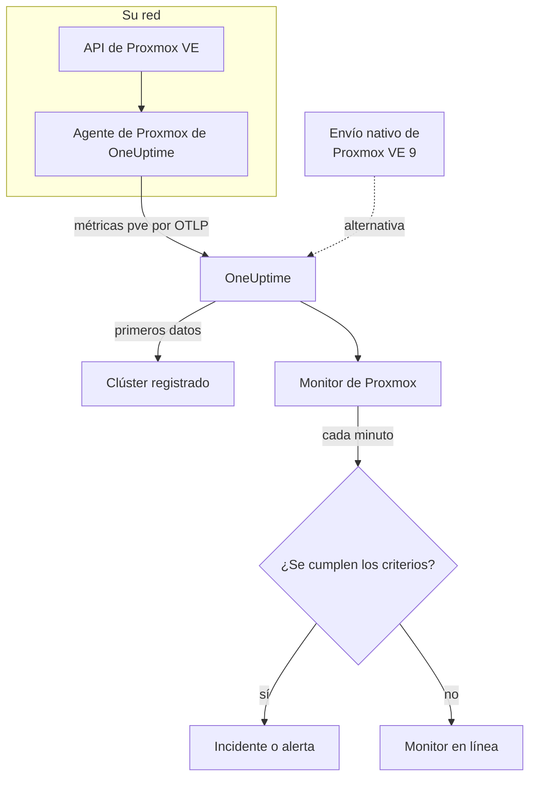

# Monitor de Proxmox

Un monitor de Proxmox vigila un clúster de Proxmox VE – sus nodos, VM y contenedores LXC, su almacenamiento, el estado de HA, la cobertura de los trabajos de copia de seguridad y la replicación del almacenamiento – y le avisa cuando un nodo se queda sin conexión, un invitado se detiene o el almacenamiento se llena. Lee las métricas `pve_*` que recopila el agente de Proxmox de OneUptime, así que nada se sondea desde fuera.

:::cards
- [Crear el monitor](#crear-un-monitor-de-proxmox): Seis pasos en el panel.
- [Plantillas](#plantillas-de-alerta-listas-para-usar): Once alertas listas para usar, un incidente por nodo, invitado o volumen.
- [Identidad de los recursos](#identidad-de-los-recursos): Cómo apuntar a un solo nodo, invitado o volumen de almacenamiento.
- [Métricas](#métricas-recopiladas): Cada serie `pve_*` sobre la que el monitor puede alertar.
:::

## Cómo funciona

El agente de Proxmox de OneUptime se ejecuta en una máquina que puede llegar a la API de Proxmox VE. Cada 30 segundos consulta prometheus-pve-exporter con los recopiladores de clúster y de nodo, etiqueta cada serie con el recurso que describe y envía las métricas a OneUptime por OTLP, marcadas con el nombre del clúster, `proxmox.cluster.name`. Los primeros datos registran el clúster. Proxmox VE 9 y posteriores pueden, en cambio, enviar las métricas de forma nativa, sin instalar nada; consulte [el envío nativo](#el-envío-nativo-de-proxmox-ve).

Un monitor de Proxmox está vinculado a un clúster. Cada minuto ejecuta su consulta sobre las métricas de ese clúster y compara el resultado con sus criterios.

## Antes de empezar

- **Instale el agente de Proxmox** donde pueda llegar a la API de Proxmox VE, con un token de API de solo lectura. La [guía del agente de Proxmox](/docs/telemetry/proxmox) cubre el token, la instalación y el envío nativo.
- **Compruebe que el clúster está registrado.** Aparece en **Productos → Infraestructura → Proxmox → Todos los clústeres**, con el nombre del `PROXMOX_CLUSTER_NAME` del agente, alrededor de un minuto después de la primera consulta.

## Crear un monitor de Proxmox

:::steps
### Empezar un monitor nuevo

Vaya a **Monitores** y haga clic en **Crear monitor**.

### Elegir Proxmox

En **Tipo de monitor**, haga clic en **Más tipos de monitor** y elija **Proxmox** en **Infraestructura**, o escriba `proxmox` en el cuadro de búsqueda. Introduzca un **Nombre** – se usa en los títulos de los incidentes y las alertas – y haga clic en **Siguiente**.

### Elegir el clúster

En **Configuración del monitor de Proxmox**, elija el clúster en **Clúster de Proxmox**. Cada clúster que ha enviado datos está en la lista.

### Elegir qué vigilar

Elija una de las tres pestañas:

- **Quick Setup** – haga clic en una [plantilla](#plantillas-de-alerta-listas-para-usar). Fija las métricas, los filtros, la agregación, el intervalo de tiempo y los umbrales, y sustituye los criterios de abajo por los suyos. Aún puede cambiar el **Intervalo de tiempo**.
- **Custom Metric** – elija una métrica en **Métrica de Proxmox** y luego fije la **Agregación** y el **Intervalo de tiempo**. Los [filtros](#ajustes-del-monitor) la restringen a un tipo de recurso o a un solo recurso.
- **Avanzado** – cree usted mismo consultas y fórmulas en **Seleccionar métricas**, por ejemplo un porcentaje de memoria a partir de `pve_memory_usage_bytes / pve_memory_size_bytes`. Use **Agrupar por** `id` para juzgar cada recurso por separado.

### Revisar los criterios

Abra cada criterio en **Criterios del monitor** y revise su **Métrica**, **Agregación**, **Condición** y **Umbral**. Una plantilla los rellena. Con **Custom Metric** o **Avanzado**, el monitor empieza con los [criterios predeterminados](#criterios-predeterminados), que solo detectan que una métrica cae a cero, así que fije su propio umbral.

### Crear el monitor

Haga clic en **Crear monitor**. OneUptime abre la página del monitor y lo evalúa cada minuto. Los incidentes y alertas que genera también aparecen en las páginas **Incidentes** y **Alertas** del clúster.
:::

> [!TIP]
> Para configurar varias plantillas a la vez, abra el clúster desde **Productos → Infraestructura → Proxmox** y vaya a **Recomendaciones**. Elija las plantillas que quiera, elija a quién se avisa, y OneUptime crea un monitor por plantilla.

## Ajustes del monitor

| Campo | Pestaña | Qué hace |
| --- | --- | --- |
| **Clúster de Proxmox** | Todas | Obligatorio. Limita cada consulta a `resource.proxmox.cluster.name`. |
| **Ámbito del recurso** | Custom Metric, Avanzado | Opcional. **Nodo**, **Invitado (VM / contenedor)**, **Almacenamiento** o **Clúster**: una coincidencia exacta con `pve.scope`. |
| **ID de PVE** | Custom Metric, Avanzado | Opcional. Coincidencia exacta con `pve.id`: un nombre de nodo (`pve1`), un VMID (`100`) o `<node>/<storage>` (`pve1/local`). Combínelo con un ámbito para apuntar a un solo recurso. |
| **Nombre del nodo** | Custom Metric, Avanzado | Opcional. Solo las series propias de un nodo (`pve.scope = node` y `pve.id`). No puede seleccionar los invitados ni el almacenamiento de ese nodo. |
| **ID del invitado** | Custom Metric, Avanzado | Opcional. Coincidencia exacta con la etiqueta `id` sin procesar, como `qemu/100` o `lxc/101`. Cuando se fija, los demás filtros se ignoran. |
| **Métrica de Proxmox** | Custom Metric | Una métrica del [catálogo](#métricas-recopiladas). |
| **Agregación** | Custom Metric | Cómo se combinan las muestras: **Promedio**, **Máximo**, **Mínimo**, **Suma** o **Recuento**. Empieza en la agregación habitual de la métrica. |
| **Intervalo de tiempo** | Todas | La ventana móvil que lee la consulta, de **Past 1 Minute** a **Past 365 Days**. Un monitor nuevo empieza en **Past 1 Minute**; las plantillas fijan la suya. |
| **Seleccionar métricas** | Avanzado | El generador de consultas: **Métrica**, **Agregar por**, **Filtrar por atributos**, **Agrupar por**, además de **Añadir métrica** y **Añadir fórmula** para combinar consultas. |

## Identidad de los recursos

Cada serie lleva una etiqueta de punto de datos `id` que nombra el recurso de Proxmox al que pertenece:

| Valor de `id` | Recurso |
| --- | --- |
| `node/<name>` | Un nodo del clúster, por ejemplo `node/pve1`. |
| `qemu/<vmid>` | Una máquina virtual QEMU, por ejemplo `qemu/100`. |
| `lxc/<vmid>` | Un contenedor LXC, por ejemplo `lxc/101`. |
| `storage/<node>/<storage>` | Un volumen de almacenamiento en un nodo, por ejemplo `storage/pve1/local`. |

Dos excepciones: las series de replicación (`pve_replication_*`) llevan el id del **trabajo** de replicación en `id` (por ejemplo `100-0`), y `pve_not_backed_up_total`, de todo el clúster, no tiene ningún `id`.

Los filtros comparan por igualdad, no por prefijo, así que el agente también divide `id` en tres atributos por los que puede filtrar. Las plantillas se basan en ellos:

| Atributo | Valores | Para `qemu/100` |
| --- | --- | --- |
| `pve.scope` | `node`, `guest`, `storage`, `cluster` (`qemu` y `lxc` son ambos `guest`) | `guest` |
| `pve.type` | `node`, `qemu`, `lxc`, `storage` | `qemu` |
| `pve.id` | Todo lo que sigue a la primera `/` de `id` (`pve1`, `100`, `pve1/local`) | `100` |

Filtre por `pve.scope` o `pve.type` para un tipo de recurso, por `pve.id` o `id` para un solo recurso, y agrupe por `id` para juzgar cada recurso por separado.

## Plantillas de alerta listas para usar

**Quick Setup** ofrece 11 plantillas. Cada una crea un monitor completo: consultas, filtros de atributos, una agrupación, un criterio que se dispara y otro que se recupera. La mayoría agrupan por `id`, así que cada nodo, invitado, volumen o trabajo recibe su propio incidente y su propia alerta. Los umbrales son puntos de partida que puede editar.

Las plantillas leen los últimos 5 minutos salvo que la tabla diga lo contrario. Un criterio solo se dispara cuando la condición se cumple en cada minuto de su ventana, y un criterio de umbral se recupera un 10 % más allá de su umbral para que un valor que oscila en el límite no cambie de estado una y otra vez.

| Plantilla | Gravedad | Vigila | Se dispara cuando | Se recupera cuando |
| --- | --- | --- | --- | --- |
| Node Offline | Crítico | `pve_up` para `pve.scope = node`, Min por `id` | Por debajo de 1 | En 1 |
| Guest Down | Advertencia | `pve_up` y `pve_onboot_status` para `pve.scope = guest`, Min por `id` | `pve_up` está por debajo de 1 mientras `pve_onboot_status` es 1 | `pve_up` vuelve a 1, o se desactiva el inicio al arrancar |
| Cluster Quorum at Risk | Crítico | `pve_up` ÷ `pve_node_info` × 100 para `pve.scope = node` (ambos Suma): la proporción de nodos en línea | 50 % o menos | Por encima del 55 % |
| High Node CPU Usage | Advertencia | `pve_cpu_usage_ratio` para `pve.scope = node`, Avg por `id` | Por encima de 0,9 (el 90 % de los núcleos del nodo) | En 0,81 o menos |
| High Node Memory Usage | Advertencia | `pve_memory_usage_bytes` ÷ `pve_memory_size_bytes` × 100 para `pve.scope = node`, por `id` | Por encima del 85 % | En el 76,5 % o menos |
| High Guest CPU Usage | Advertencia | `pve_cpu_usage_ratio` para `pve.scope = guest`, Avg por `id`, últimos 15 minutos | Por encima de 0,95 (el 95 % de sus vCPU) durante los 15 minutos | En 0,855 o menos |
| Storage Near Full | Advertencia | `pve_disk_usage_bytes` ÷ `pve_disk_size_bytes` × 100 para `pve.scope = storage`, por `id` | Por encima del 85 % | En el 76,5 % o menos |
| Container Root Disk Near Full | Advertencia | La misma proporción de disco para `pve.type = lxc`, por `id` | Por encima del 90 % | En el 81 % o menos |
| HA Resource in Error State | Crítico | `pve_ha_state` para `state = error`, Max por `id` | Por encima de 0 | En 0 |
| Guest Not Backed Up | Advertencia | `pve_not_backed_up_total`, Max (una sola serie para todo el clúster) | Por encima de 0 | En 0 |
| Replication Failing | Crítico | `pve_replication_failed_syncs`, Max por `id` (el id del trabajo) | Por encima de 0 | En 0 |

**Gravedad** es la etiqueta que muestra el selector. El incidente y la alerta que crea una plantilla empiezan con la gravedad de incidente y de alerta más alta de su proyecto; cámbielas en los criterios.

- **Las plantillas de caída usan Mínimo**, así que una sola consulta en la que el recurso estaba caído las dispara en lugar de quedar oculta por las consultas en las que funcionaba.
- **Guest Down** solo mira los invitados configurados para iniciarse al arrancar, así que un invitado que detuvo a propósito nunca avisa a nadie.
- **Cluster Quorum at Risk** es una aproximación: pve-exporter no tiene ninguna métrica de corosync, así que cuenta los nodos en línea.
- **High Guest CPU Usage** es más alto y más lento que la plantilla de nodos: se espera que un invitado use sus vCPU, así que solo avisa uno que nunca baja.
- **Las fórmulas de proporción** toman la **Suma** de ambos lados. Ambos proceden de la misma consulta, así que el resultado es un porcentaje real.
- **Container Root Disk Near Full** deja fuera las VM QEMU: su uso de disco marca 0 sin el agente invitado de QEMU.
- **Guest Not Backed Up** solo cubre la pertenencia a trabajos de copia de seguridad. pve-exporter no indica si las copias se ejecutaron ni si tuvieron éxito; agrupe `pve_not_backed_up_info` por `id` para listar los invitados.
- **La obsolescencia de la replicación** (ahora menos la última sincronización) no puede generar alertas, porque los criterios no tienen aritmética de tiempo. La página **Vista general** del clúster la muestra; alerte con **Replication Failing** en su lugar.

### El envío nativo de Proxmox VE

Proxmox VE 9 y posteriores pueden enviar métricas mediante su servidor de métricas OpenTelemetry integrado, sin instalar nada; consulte la [guía del agente de Proxmox](/docs/telemetry/proxmox). OneUptime convierte ese envío en las mismas series `pve_*`, así que el catálogo y las plantillas de CPU, memoria y almacenamiento funcionan con él.

**Node Offline** y **Cluster Quorum at Risk** también funcionan: cada nodo envía solo su propio estado, así que un nodo que deja de informar aparece como caído (`pve_up` = 0) según los nodos que siguen vivos; consulte [Cuando un nodo deja de informar](/docs/telemetry/proxmox#when-a-node-stops-reporting). **Guest Down**, **HA Resource in Error State**, **Guest Not Backed Up** y **Replication Failing** necesitan datos que solo recopila el agente.

## Métricas recopiladas

El agente consulta prometheus-pve-exporter cada 30 segundos con los recopiladores de clúster y de nodo, lo que también cubre los recopiladores `backup-info` y `replication` del exportador (ambos activados de forma predeterminada).

### Disponibilidad

| Métrica | Unidad | Descripción |
| --- | --- | --- |
| `pve_up` | — | 1 cuando el nodo o el invitado está activo o en ejecución, 0 en caso contrario. |
| `pve_uptime_seconds` | seconds | Tiempo de actividad del nodo o del invitado. |
| `pve_version_info` | count | La versión de Proxmox VE, en sus etiquetas. Siempre 1. |

### Nodo

| Métrica | Unidad | Descripción |
| --- | --- | --- |
| `pve_node_info` | count | Metadatos del nodo, siempre 1. Súmela para contar los nodos que informan. |
| `pve_cpu_usage_ratio` | ratio | CPU en uso como proporción de 0 a 1 de la CPU disponible. |
| `pve_cpu_usage_limit` | cores | CPU disponible, en núcleos. Para un invitado, sus vCPU. |
| `pve_memory_usage_bytes` | bytes | Memoria en uso. |
| `pve_memory_size_bytes` | bytes | Memoria total. |

Las series de CPU y memoria también se informan para cada invitado, en los id `qemu/*` y `lxc/*`.

### Invitado

| Métrica | Unidad | Descripción |
| --- | --- | --- |
| `pve_guest_info` | count | Metadatos del invitado (nombre, nodo, tipo `qemu` o `lxc`) en las etiquetas. Siempre 1. |
| `pve_network_receive_bytes` | bytes | Bytes recibidos por el invitado. Un contador de toda la vida útil. |
| `pve_network_transmit_bytes` | bytes | Bytes enviados por el invitado. Un contador de toda la vida útil. |
| `pve_disk_read_bytes` | bytes | Bytes leídos del disco por el invitado. Un contador de toda la vida útil. |
| `pve_disk_write_bytes` | bytes | Bytes escritos en el disco por el invitado. Un contador de toda la vida útil. |
| `pve_onboot_status` | count | 1 cuando el invitado se inicia al arrancar el nodo. Un invitado detenido con este ajuste suele ser una caída no planificada. |

### Almacenamiento

| Métrica | Unidad | Descripción |
| --- | --- | --- |
| `pve_disk_usage_bytes` | bytes | Bytes usados en el disco o el almacenamiento. Para un invitado QEMU marca 0 salvo que esté instalado el agente invitado de QEMU. |
| `pve_disk_size_bytes` | bytes | Tamaño total del disco o del almacenamiento. |
| `pve_storage_info` | count | Metadatos del almacenamiento, siempre 1. Súmela para contar los volúmenes de almacenamiento. |

### HA

| Métrica | Unidad | Descripción |
| --- | --- | --- |
| `pve_ha_state` | — | Una serie por estado de HA (`started`, `stopped`, `error`, …) para cada recurso de HA, a 1 en su estado actual. Filtre por la etiqueta `state` para alertar sobre un estado. |

### Copia de seguridad

Proceden del recopilador `backup-info` del exportador, a nivel de clúster. Solo informan de la cobertura de los **trabajos** de copia de seguridad:

| Métrica | Unidad | Descripción |
| --- | --- | --- |
| `pve_not_backed_up_total` | count | Invitados que no están en ningún trabajo de copia de seguridad. Una sola serie para todo el clúster, sin `id`. |
| `pve_not_backed_up_info` | count | Una serie por invitado no cubierto, siempre 1, etiquetada con el `id` del invitado. Desaparece cuando el invitado se une a un trabajo de copia de seguridad. |

### Replicación

Proceden del recopilador `replication` del exportador, a nivel de nodo. Las series solo existen cuando el clúster tiene trabajos de replicación, y llevan el id del trabajo en `id`:

| Métrica | Unidad | Descripción |
| --- | --- | --- |
| `pve_replication_failed_syncs` | count | Intentos de sincronización fallidos seguidos. Por encima de 0, la réplica se está quedando obsoleta. |
| `pve_replication_duration_seconds` | seconds | Cuánto duró la última sincronización. |
| `pve_replication_last_sync_timestamp_seconds` | seconds | Hora Unix de la última sincronización **correcta**. |
| `pve_replication_last_try_timestamp_seconds` | seconds | Hora Unix del último **intento**. Si es más reciente que la última sincronización, el último intento falló. |
| `pve_replication_next_sync_timestamp_seconds` | seconds | Hora Unix de la próxima sincronización programada. |
| `pve_replication_info` | count | Metadatos del trabajo – tipo, origen, destino, invitado – en las etiquetas. Siempre 1. |

## Criterios de monitoreo

Un criterio compara una de las consultas o fórmulas del monitor con un umbral. Los criterios de un monitor de Proxmox no tienen **Tipo de filtro**: cada regla comprueba el valor de la métrica, con estos campos.

| Campo | Qué hace |
| --- | --- |
| **Métrica** | La consulta o fórmula que se comprueba, por su nombre de variable. |
| **Agregación** | Cómo los valores de la ventana se convierten en una sola respuesta: **Promedio**, **Suma**, **Maximum Value**, **Minimum Value**, **All Values** (cada valor debe coincidir) o **Any Value** (basta con uno). |
| **Condición** | **Greater Than**, **Less Than**, **Greater Than Or Equal To**, **Less Than Or Equal To** o **Equal To**, o una condición de anomalía: **Anomalously High**, **Anomalously Low** o **Anomalous**. |
| **Umbral** | El valor con el que comparar. Junto a él hay una lista de unidades cuando la métrica tiene unidad. No se muestra para las condiciones de anomalía. |
| **Sensibilidad** | Solo condiciones de anomalía. **Bajo** (4σ), **Medio** (3σ, el predeterminado) o **Alto** (2σ). |
| **Ventana de referencia** | Solo condiciones de anomalía. 14 días (el predeterminado), 28, 60 o 90 días de historial. |
| **Si no hay datos** | En **Más campos**. Qué ocurre cuando la ventana no tiene muestras: **Ignore** (el predeterminado), **Treat As Zero** o **Disparador**. |

Las condiciones de anomalía comparan cada valor con la misma hora de la semana en la referencia. Permanecen en un estado «Learning», y no generan nada, hasta que la ventana de referencia contiene suficiente historial.

Cada criterio indica también qué hacer cuando coincide: cambiar el estado del monitor, crear una alerta o declarar un incidente. Los criterios se comprueban de arriba abajo, y el primero que coincide decide.

### Criterios predeterminados

Un monitor que no crea a partir de una plantilla empieza con dos criterios:

| Orden | Criterio | Coincide cuando | Entonces |
| --- | --- | --- | --- |
| 1 | Check if _monitor name_ is offline | Cualquier valor de la primera consulta es `0` | Marca el monitor como **Sin conexión** y declara el incidente «_monitor name_ is offline», que se resuelve solo cuando el monitor se recupera. |
| 2 | Check if _monitor name_ is online | Cualquier valor está por encima de `0` | Marca el monitor como **Operativo**. |

> [!IMPORTANT]
> El silencio no coincide con ninguno de los dos criterios: un clúster que deja de enviar datos deja el monitor como estaba. Para que se le avise cuando dejen de llegar datos, ponga **Si no hay datos** en **Disparador** en un criterio. El tiempo en que el propio OneUptime no estaba recibiendo nunca cuenta como falta de datos: una comprobación cuya ventana lo contiene espera en su lugar, como explica [Cuando OneUptime no recibe datos](/docs/monitor/when-oneuptime-is-not-receiving).

## Solución de problemas

:::details El clúster no aparece en la lista Clúster de Proxmox
Los clústeres se registran solos a partir de los datos del agente. Compruebe que el agente se está ejecutando y enviando datos (consulte la [guía del agente de Proxmox](/docs/telemetry/proxmox)) y que `PROXMOX_CLUSTER_NAME` está definido.
:::

:::details Faltan las métricas de los invitados
Las series de los invitados proceden del recopilador de clúster del exportador, que la configuración que se distribuye activa con el parámetro de consulta `cluster=1`. Si cambió la configuración del recopilador, restáurela.
:::

:::details High Node CPU Usage nunca se dispara
La plantilla promedia `pve_cpu_usage_ratio` por `id`, así que cada nodo se comprueba por separado. Si creó su propia consulta, agrúpela por `id`: un promedio de todos los nodos se ve arrastrado a la baja por los inactivos.
:::

:::details Node Offline sigue disparándose por un nodo que quitó del clúster
Con el envío nativo de Proxmox VE, un nodo retirado del clúster parece igual que uno caído: dejó de informar, así que los nodos que siguen vivos lo siguen dando por caído. Abra la página del nodo y haga clic en **Quitar nodo**: el nodo desaparece y su alerta se resuelve. Si no, permanece Sin conexión hasta 7 días. El agente no tiene este problema: pregunta al clúster, que ya no incluye el nodo.
:::

:::details Faltan las métricas de copia de seguridad o de replicación
`pve_not_backed_up_*` procede del recopilador `backup-info` del exportador y `pve_replication_*` de su recopilador `replication`. Ambos están activados de forma predeterminada y cubiertos por los parámetros de consulta `cluster=1` y `node=1` de la configuración que se distribuye. Si ejecuta su propio exportador, compruebe que no los haya desactivado. `pve_replication_*` solo existe cuando el clúster tiene trabajos de replicación del almacenamiento.
:::

:::details Los contadores como pve_network_receive_bytes solo crecen
Las series de E/S de red y de disco son contadores de toda la vida útil, y los criterios comparan valores sin procesar: no hay operador de tasa, y **Convertir a tasa por segundo** en el generador de consultas solo cambia el gráfico. Grafíquelas como tasa, o alerte sobre su crecimiento con una fórmula, como una consulta de **Máximo** menos una de **Mínimo** del mismo contador.
:::

## Próximos pasos

:::cards
- [Agente de Proxmox](/docs/telemetry/proxmox): Instalar el agente o configurar el envío nativo.
- [Monitor de Ceph](/docs/monitor/ceph-monitor): Vigilar el almacenamiento Ceph detrás de un clúster de Proxmox.
- [Monitor de VMware](/docs/monitor/vmware-monitor): El mismo tipo de monitor para vSphere.
- [Visión general de los incidentes](/docs/incidents/index): Qué ocurre después de que un criterio declare un incidente.
:::
