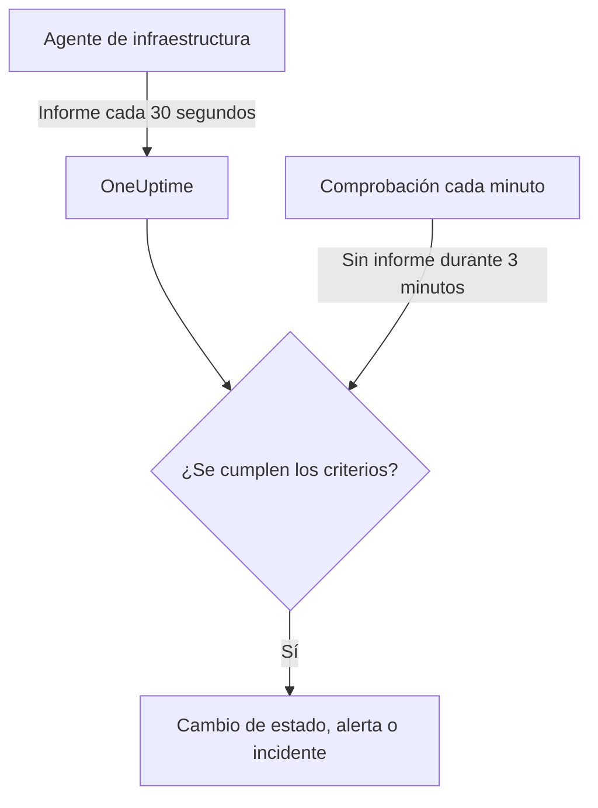

# Monitor de servidor / VM

Un monitor de servidor / VM vigila una máquina a través del agente de infraestructura de OneUptime (`oneuptime-infrastructure-agent`), un pequeño servicio que informa a OneUptime cada 30 segundos de la CPU, la memoria, los discos, la carga, la red y los procesos en ejecución. Esta página muestra cómo conectar el agente a un monitor de servidor / VM, qué informa el agente y cómo escribir los criterios que deciden cuándo el servidor está en línea o sin conexión.

> [!IMPORTANT]
> **Crear monitor** ya no ofrece **Server / VM**. Los monitores de servidor / VM que ya tiene siguen funcionando, y todo lo que hay en esta página se aplica a ellos. Para vigilar un servidor nuevo, cree en su lugar un [monitor de host](/docs/monitor/host-monitor): alerta sobre las métricas de host que envía el [colector OpenTelemetry en el host](/docs/telemetry/host-otel-collector).

:::cards
- [Conectar el agente](#conectar-el-agente): Instalarlo, darle la clave secreta del monitor e iniciarlo.
- [Qué informa el agente](#qué-informa-el-agente): CPU, memoria, discos, carga, red y procesos.
- [Criterios de monitoreo](#criterios-de-monitoreo): Decidir cuándo el servidor cuenta como en línea o sin conexión.
- [Solución de problemas](#solución-de-problemas): El agente no informa, o el monitor nunca pasa a sin conexión.
:::

## Cómo funciona

El agente se ejecuta como servicio del sistema. Cada 30 segundos recopila un informe y lo envía a su URL de OneUptime, firmado con la clave secreta del monitor. OneUptime guarda los valores como métricas del monitor y comprueba el informe con los criterios del monitor.

El silencio se comprueba por separado. Cada minuto, OneUptime vuelve a evaluar los criterios **Is Online** de cada monitor de servidor / VM que no ha informado durante 3 minutos o más, y un servidor en silencio durante más tiempo del que permiten sus criterios (3 minutos de forma predeterminada) cuenta como sin conexión. Un monitor sin criterios **Is Online** nunca se marca como sin conexión solo porque el agente se haya quedado callado. Solo cuenta para ese silencio el tiempo en que OneUptime estaba recibiendo: el tiempo en que el propio OneUptime se reiniciaba, se actualizaba o se ponía al día no cuenta, como explica [Cuando OneUptime no recibe datos](/docs/monitor/when-oneuptime-is-not-receiving).



## Antes de empezar

- Un monitor de servidor / VM en su proyecto.
- Permiso para editar monitores. La clave secreta, y los comandos de configuración que la contienen, solo se muestran a quienes pueden editar monitores.
- Acceso root (Linux, macOS) o de administrador (Windows) en el servidor. El agente se instala como servicio del sistema.
- HTTPS saliente desde el servidor hasta su URL de OneUptime, directamente o a través de un proxy HTTP.

## Conectar el agente

Los comandos de abajo usan `https://oneuptime.com` y `YOUR_SECRET_KEY`. Los comandos de configuración del propio monitor ya incluyen su URL de OneUptime y la clave secreta del monitor, así que cópielos del monitor cuando pueda.

:::steps
### Abrir los comandos de configuración del monitor

Vaya a **Monitores**, abra el monitor de servidor / VM y seleccione **Documentación**. Las tarjetas **Configura tu monitor de servidor (Linux/Mac)** y **Configura tu monitor de servidor (Windows)** contienen los comandos de este monitor. Hasta que el agente informe por primera vez, la **Vista general** del monitor también los muestra.

### Instalar el agente

:::tabs
@tab Linux
```bash
curl -sSL https://oneuptime.com/docs/static/scripts/infrastructure-agent/install.sh | sudo bash
```
@tab macOS
```bash
curl -sSL https://oneuptime.com/docs/static/scripts/infrastructure-agent/install.sh | sudo bash
```
@tab Windows
1. Descargue el agente desde la [última versión en GitHub](https://github.com/OneUptime/oneuptime/releases/latest): `oneuptime-infrastructure-agent_windows_amd64.zip` para x64, o `oneuptime-infrastructure-agent_windows_arm64.zip` para ARM64.
2. Extraiga el archivo ZIP. Contiene `oneuptime-infrastructure-agent.exe`.
3. Abra el **Símbolo del sistema** como administrador en la carpeta en la que lo extrajo.
:::

El script de instalación descarga la última versión para su sistema operativo y su procesador (x86-64 o ARM64) y coloca el binario `oneuptime-infrastructure-agent` en `$HOME/bin`. En una instalación autoalojada, el script se sirve desde su propia URL de OneUptime.

### Conectarlo al monitor

:::tabs
@tab Linux
```bash
sudo oneuptime-infrastructure-agent configure --secret-key=YOUR_SECRET_KEY --oneuptime-url=https://oneuptime.com
```
@tab macOS
```bash
sudo oneuptime-infrastructure-agent configure --secret-key=YOUR_SECRET_KEY --oneuptime-url=https://oneuptime.com
```
@tab Windows
```shell
oneuptime-infrastructure-agent configure --secret-key=YOUR_SECRET_KEY --oneuptime-url=https://oneuptime.com
```
:::

`configure` guarda la clave secreta y la URL en el archivo de configuración del agente e instala el agente como servicio del sistema. Ambas opciones son obligatorias. En una instalación autoalojada, sustituya `https://oneuptime.com` por su propia URL.

Si el servidor accede a internet a través de un proxy, añada `--proxy-url`:

```bash
sudo oneuptime-infrastructure-agent configure --proxy-url=http://proxy.example.com:8080 --secret-key=YOUR_SECRET_KEY --oneuptime-url=https://oneuptime.com
```

### Iniciar el agente

:::tabs
@tab Linux
```bash
sudo oneuptime-infrastructure-agent start
```
@tab macOS
```bash
sudo oneuptime-infrastructure-agent start
```
@tab Windows
```shell
oneuptime-infrastructure-agent start
```
:::

Al iniciarse, el agente comprueba la clave secreta con OneUptime y envía su primer informe de inmediato.

### Comprobar que informa

Ejecute `sudo oneuptime-infrastructure-agent status` (sin `sudo` en Windows): muestra `Service is running`. En OneUptime, la **Vista general** del monitor deja de mostrar los comandos de configuración en cuanto llega el primer informe, y su pestaña **Métricas** empieza a mostrar gráficos del servidor.
:::

## Referencia del agente

### Comandos

| Comando | Qué hace |
| --- | --- |
| `configure --secret-key=<key> --oneuptime-url=<url>` | Guarda la configuración e instala el agente como servicio del sistema. Añada `--proxy-url=<url>` para enviar los informes a través de un proxy. |
| `start` | Inicia el servicio. Se niega a iniciarse hasta que se haya ejecutado `configure`. |
| `stop` | Detiene el servicio. |
| `restart` | Reinicia el servicio. |
| `status` | Indica si el servicio está en ejecución o detenido. |
| `logs` | Muestra las últimas 100 líneas del registro del agente. `-n <lines>` muestra otro número de líneas, y `-f` sigue las nuevas. |
| `uninstall` | Elimina el servicio y borra el archivo de configuración del agente. |
| `help` | Enumera los comandos. |

Ejecútelos con `sudo` en Linux y macOS, y desde un **Símbolo del sistema** de administrador en Windows. Para cambiar la clave secreta, la URL o el proxy de un agente ya configurado, ejecute `stop` y `uninstall`, y luego `configure` y `start` de nuevo.

### Archivos

| Archivo | Linux y macOS | Windows |
| --- | --- | --- |
| Configuración | `/etc/oneuptime-infrastructure-agent/config.json` | `%PROGRAMDATA%\oneuptime-infrastructure-agent\config.json` |
| Registro | `/var/log/oneuptime-infrastructure-agent/oneuptime-infrastructure-agent.log` | `%PROGRAMDATA%\oneuptime-infrastructure-agent\oneuptime-infrastructure-agent.log` |

Cuando el agente no puede escribir en estos directorios, usa `~/.oneuptime-infrastructure-agent/` en su lugar. Las variables de entorno `ONEUPTIME_AGENT_CONFIG_PATH` y `ONEUPTIME_AGENT_LOG_PATH` establecen cualquiera de las dos rutas de forma explícita.

## Qué informa el agente

Cada informe lleva el nombre de host del servidor y:

| Área | Qué se informa |
| --- | --- |
| CPU | Uso en %, número de núcleos, uso por núcleo y tiempo en user, system, idle, espera de E/S, steal, nice, IRQ e IRQ por software |
| Memoria | Memoria total, usada, libre y disponible, búferes y caché, uso en %, y swap total, usado, libre y uso en % |
| Discos | Para cada disco montado: ruta de montaje, dispositivo, sistema de archivos, espacio total, usado y libre, uso en %, bytes y operaciones leídos y escritos, y tiempo de E/S |
| Carga | Promedios de carga de 1, 5 y 15 minutos |
| Red | Para cada interfaz: bytes y paquetes enviados y recibidos, errores y descartes de entrada y salida; además de las conexiones establecidas y en escucha |
| Host | Sistema operativo, plataforma y versión, versión y arquitectura del kernel, tiempo de actividad, hora de arranque, virtualización y número de procesos |
| Procesos | Cada proceso en ejecución: nombre, PID, comando, CPU en %, memoria, estado, hilos, usuario y hora de inicio |

Los valores que el sistema operativo no proporciona se omiten. La pestaña **Métricas** del monitor muestra gráficos de disponibilidad, CPU, memoria, uso y E/S de disco, promedios de carga, swap, tráfico y errores de red, conexiones, tiempo de actividad y número de procesos.

## Criterios de monitoreo

Los criterios deciden cuándo el monitor está en línea, degradado o sin conexión, y cuándo abre una alerta o un incidente. Cada filtro de un criterio tiene un **Tipo de filtro**, una **Condición de filtro** y, en la mayoría de los tipos, un valor.

| Tipo de filtro | Qué comprueba | Condiciones de filtro |
| --- | --- | --- |
| Is Online | Si el agente ha informado recientemente (en los últimos 3 minutos, de forma predeterminada) | Verdadero, Falso |
| CPU Usage (in %) | Uso global de la CPU | Greater Than, Less Than, Greater Than Or Equal To, Less Than Or Equal To |
| Memory Usage (in %) | Memoria en uso | Igual que la CPU |
| Disk Usage (in %) | Uso del disco indicado en **Ruta del disco** | Igual que la CPU |
| Swap Usage (in %) | Swap en uso | Igual que la CPU |
| CPU IO Wait (in %) | Parte del tiempo de CPU dedicada a esperar E/S | Igual que la CPU |
| Load Average (1 minute) | Promedio de carga del último minuto | Igual que la CPU |
| Load Average (5 minute) | Promedio de carga de los últimos 5 minutos | Igual que la CPU |
| Load Average (15 minute) | Promedio de carga de los últimos 15 minutos | Igual que la CPU |
| Server Process Name | Si se está ejecutando un proceso con este nombre (sin distinguir mayúsculas) | Is Executing, Is Not Executing |
| Server Process Command | Si se está ejecutando un proceso con exactamente esta línea de comandos (sin distinguir mayúsculas) | Is Executing, Is Not Executing |
| Server Process PID | Si se está ejecutando un proceso con este PID | Is Executing, Is Not Executing |

**Ruta del disco** admite un punto de montaje o un dispositivo, como `/`, `/mnt/data`, `C:\` o `/dev/sda1`; si se deja vacía, es `/`. Introduzca `*` para comprobar cada disco que informa el agente: cada disco que supera el umbral recibe su propia alerta, de modo que un segundo disco que se llena no queda oculto tras la alerta abierta del primero.

### Evaluar durante un periodo de tiempo

**Evaluar estos criterios durante un periodo de tiempo** es una casilla aparte en el formulario de criterios, no una condición de filtro. Está disponible para **Is Online** y para cada tipo de filtro numérico. Actívela para comparar un agregado – elegido en **Evaluar** (Promedio, Suma, Maximum Value, Minimum Value, All Values, Any Value) sobre la ventana fijada en **Durante los últimos (en minutos)** – en lugar del valor de la última comprobación. En un filtro **Is Online**, la ventana es el tiempo que el agente puede estar en silencio antes de que el servidor cuente como sin conexión.

**All Values** solo coincide cuando la ventana está realmente cubierta por datos. Un monitor recién creado, o uno cuyas comprobaciones dejaron de registrarse, no tiene historial suficiente para decir nada de los últimos N minutos, así que el criterio espera en lugar de coincidir con la única lectura que tiene. **Any Value** es el ajuste para «avíseme en cuanto una sola comprobación supere el umbral» y sigue disparándose de inmediato.

**Si no hay datos** controla qué ocurre mientras la ventana no puede respaldar el criterio:

| Si no hay datos | Comportamiento | Úselo para |
| --- | --- | --- |
| **Ignore** (predeterminado) | El criterio no coincide. | Alertas de umbral habituales. |
| **Disparador** | Los datos que faltan se tratan como el problema. | Comprobaciones de tipo heartbeat, en las que el silencio es en sí un fallo. |
| **Treat As Zero** | La ventana se compara como un único cero. | Contadores, en los que «sin eventos» significa realmente cero. |

> [!TIP]
> La CPU y la carga tienen picos breves todo el tiempo. Evalúelas durante unos minutos con **Promedio** o **All Values** en lugar de alertar por un solo informe.

### Criterios de ejemplo

| Objetivo | Tipo de filtro | Condición de filtro | Valor |
| --- | --- | --- | --- |
| Marcar el servidor como sin conexión cuando el agente deja de informar | Is Online | Falso | — |
| Alertar cuando el uso de CPU supera el 90 % | CPU Usage (in %) | Greater Than | `90` |
| Alertar cuando el disco raíz está lleno en más del 85 % | Disk Usage (in %), **Ruta del disco** `/` | Greater Than | `85` |
| Alertar por cualquier disco lleno en más del 85 %, una alerta por disco | Disk Usage (in %), **Ruta del disco** `*` | Greater Than | `85` |
| Alertar cuando el uso de memoria supera el 80 % | Memory Usage (in %) | Greater Than | `80` |
| Alertar cuando nginx deja de ejecutarse | Server Process Name | Is Not Executing | `nginx` |

## Solución de problemas

:::details El agente no informa
- Compruebe que el servicio se está ejecutando: `sudo oneuptime-infrastructure-agent status`.
- Lea su registro: `sudo oneuptime-infrastructure-agent logs -n 50`. Una línea `Metrics successfully pushed to OneUptime server` significa que los informes llegan.
- El agente comprueba la clave secreta al iniciarse y se cierra si OneUptime la rechaza, registrando `Secret key is invalid`. Compare la clave con la de la página **Ajustes** del monitor, en **Restablecer clave secreta del monitor de servidor**.
- Asegúrese de que el servidor puede llegar a su URL de OneUptime por HTTPS y de que ningún cortafuegos bloquea las conexiones salientes.
:::

:::details `sudo` indica que no encuentra el comando
El script de instalación coloca el binario en el `$HOME/bin` del usuario con el que se ejecutó, e imprime el directorio que usó. Ejecute el agente por su ruta completa, por ejemplo `sudo /root/bin/oneuptime-infrastructure-agent configure ...`. Para instalarlo en un directorio de la ruta del sistema, pase `-b` al script:

```bash
curl -sSL https://oneuptime.com/docs/static/scripts/infrastructure-agent/install.sh | sudo bash -s -- -b /usr/local/bin
```
:::

:::details `start` indica que no encuentra la configuración del servicio
`configure` no se ha ejecutado, o `uninstall` eliminó su configuración. Ejecute `configure` con la clave secreta y la URL, y luego `start`.
:::

:::details El monitor nunca pasa a sin conexión cuando el servidor está caído
Solo un criterio **Is Online** marca un servidor en silencio como sin conexión. Añada uno con la **Condición de filtro** en **Falso** y elija el estado de monitor que aplica.
:::

:::details Los informes no pasan por el proxy
- Compruebe la URL y el puerto del proxy pasados a `--proxy-url`.
- Asegúrese de que el proxy permite conexiones a su URL de OneUptime.
- Para cambiar el proxy, ejecute `stop` y `uninstall`, luego `configure` con la nueva `--proxy-url`, y `start`.
:::

## Próximos pasos

:::cards
- [Monitor de hosts](/docs/monitor/host-monitor): El monitor para servidores nuevos, basado en métricas de host de OpenTelemetry.
- [Colector OpenTelemetry en el host](/docs/telemetry/host-otel-collector): Enviar métricas y registros de host desde Linux, macOS y Windows.
- [Plantillas de incidentes y alertas](/docs/monitor/incident-alert-templating): Incluir detalles de CPU, memoria, disco y procesos en los títulos de los incidentes.
:::
