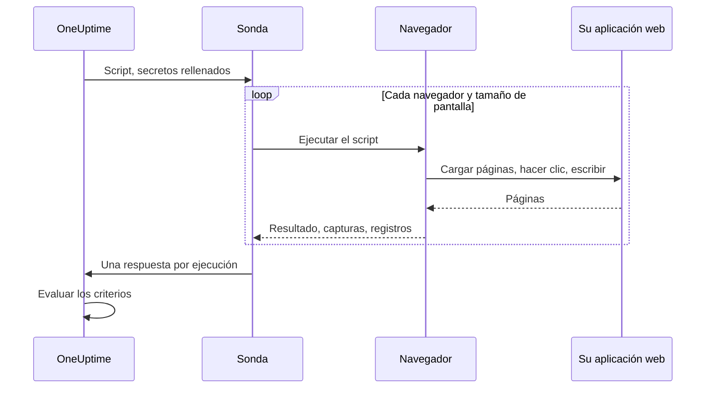

# Monitor sintético

Un monitor sintético maneja su aplicación web en un navegador real, de forma programada, con un script de Playwright que usted escribe: abre páginas, rellena formularios y recorre un trayecto de usuario, y falla cuando el trayecto falla. Úselo para detectar las averías que una comprobación de disponibilidad no ve: un inicio de sesión que ya no funciona, un botón de pago que no hace nada, un panel que nunca termina de cargar.

:::cards
- [Crear el monitor](#crear-un-monitor-sintético): Escriba un script y elija navegadores y tamaños de pantalla.
- [Escribir el script](#escribir-el-script): Un recorrido de inicio de sesión listo para usar como punto de partida.
- [Capturas de pantalla](#capturas-de-pantalla): Vea cómo se veía la página cuando falló una ejecución.
- [Qué puede usar el script](#módulos-disponibles-en-el-script): Playwright, HTTP, criptografía y métricas.
:::

## Cómo funciona

En cada comprobación, una sonda ejecuta su script una vez por cada navegador y tamaño de pantalla que haya elegido, uno tras otro. Cada ejecución arranca un navegador nuevo, sin cookies ni almacenamiento de ejecuciones anteriores; el script maneja su página, toma capturas de pantalla y devuelve un resultado o lanza un error. La sonda informa de cada ejecución, y OneUptime evalúa sus criterios con ellas.



| Tipo de pantalla | Ventana gráfica |
| --- | --- |
| Mobile | 360 × 640 |
| Tablet | 1024 × 768 |
| Desktop | 1920 × 1080 |

Los navegadores son Chromium y Firefox.

## Antes de empezar

- Una **sonda** que alcance su aplicación web. Use una [sonda personalizada](/docs/probe/custom-probe) para una aplicación dentro de su red. La imagen Docker de la sonda incluye Chromium y Firefox; una sonda que se ejecuta fuera de Docker los necesita instalados.
- Cualquier contraseña o token que necesite el recorrido, guardado como [secreto de monitor](/docs/monitor/monitor-secrets).

## Crear un monitor sintético

:::steps
### Empezar un monitor nuevo

Vaya a **Monitores** y haga clic en **Crear monitor**. En **Tipo de monitor**, haga clic en **Más tipos de monitor** y elija **Monitor sintético** en **Synthetic Monitoring**, o escriba `playwright` en el cuadro de búsqueda. Introduzca un **Nombre** y haga clic en **Siguiente**.

### Añadir el script

Escriba su script en el editor **Código de Playwright**. Parta del [ejemplo de abajo](#escribir-el-script).

### Elegir navegadores y tamaños de pantalla

Marque los navegadores en **Tipo de navegador** y los tamaños en **Tipo de pantalla**. El script se ejecuta una vez por cada combinación, así que dos navegadores y tres tamaños suman seis ejecuciones por comprobación. En **Más campos**, **Número de reintentos en caso de error** reintenta una ejecución fallida hasta 5 veces.

### Probarlo

Haga clic en **Probar monitor** para ejecutar el script una vez desde una sonda, y revise el resultado, los registros y las capturas de pantalla de cada ejecución.

### Revisar los criterios

El monitor empieza con dos criterios: queda sin conexión, y declara un incidente, cuando falla una ejecución, y en línea cuando no falla ninguna. Cámbielos o añada los suyos —consulte [Criterios](#criterios)— y haga clic en **Siguiente**.

### Elegir sondas y crear

Seleccione las **Sondas** y un **Intervalo de monitoreo** —a los monitores sintéticos se les ofrecen intervalos de 5 minutos o más— y haga clic en **Crear monitor**.
:::

## Escribir el script

El script es el cuerpo de una función `async`. `page` es una página compatible con Playwright que ya está abierta; manéjela, devuelva un resultado con `return` y haga fallar la ejecución con `throw` (o dejando que una llamada de Playwright agote su tiempo). Este ejemplo inicia sesión y comprueba que el panel se carga:

```javascript title="Synthetic monitor script"
await page.goto("https://app.example.com/login");
screenshots["login-page"] = await page.screenshot();

await page.fill("#email", "monitoring@example.com");
await page.fill("#password", "{{monitorSecrets.AppPassword}}");
await page.click("button[type=submit]");

// Fails the run if the dashboard does not appear within 10 seconds.
await page.waitForSelector(".dashboard", { timeout: 10000 });
screenshots["dashboard"] = await page.screenshot();

console.log(`Signed in on ${browserType}, ${screenSizeType}`);

return {
  data: { title: await page.title() },
};
```

| Para | Haga esto | Lo que registra OneUptime |
| --- | --- | --- |
| Informar de un resultado | `return { data: ... }` | El **Resultado** de la ejecución. Solo se conserva `data`. |
| Hacer fallar la ejecución | `throw new Error("...")`, o dejar que una espera agote su tiempo | El **Error de script** de la ejecución. |
| Conservar pruebas | `screenshots["name"] = await page.screenshot()` | Una captura de pantalla, que se conserva aunque la ejecución falle. |
| Dejar un rastro | `console.log(...)` | Los mensajes de registro de la ejecución. |

Para ver las ejecuciones, abra la **Vista general** del monitor: la tarjeta **Resumen del monitor** tiene un bloque por navegador y tamaño de pantalla, y **Mostrar más detalles** muestra las capturas de pantalla de cada ejecución.

### Uso de Playwright

Usamos Playwright para simular las interacciones de los usuarios. El valor `page` es una fachada segura y compatible con Playwright para la página creada para esta ejecución. Están disponibles los métodos habituales de `Page`, `Locator`, `Frame`, `ElementHandle`, `JSHandle`, `Request`, `Response`, del teclado, del ratón y del contexto del navegador. Esto incluye la navegación, los localizadores, los clics, la introducción de datos en formularios, la evaluación en la página, las ventanas emergentes, las páginas adicionales, la inspección de respuestas y las capturas de pantalla. Puede llegar al contexto del navegador de la ejecución con `page.context()`, por ejemplo para abrir una página nueva o gestionar una ventana emergente.

Los scripts sintéticos no se ejecutan en el proceso Node.js de la sonda. Los valores cruzan la frontera de ejecución como datos copiados o como capacidades opacas limitadas a la ejecución, así que algunas API de Playwright funcionan de otra forma o no funcionan:

| No disponible | Use en su lugar |
| --- | --- |
| Métodos para lanzar o conectar navegadores, sesiones CDP, enrutamiento de solicitudes, vinculaciones expuestas, campos privados de Playwright y cualquier opción que lea o escriba una ruta del sistema de archivos del host. Por tanto, `page.context().browser()` no está disponible. | La página y el contexto del navegador que se le proporcionan. |
| Escuchadores de eventos (`page.on(...)`, `page.once(...)`): llamarlos falla con un error claro. | `page.waitForEvent(...)` para diálogos y ventanas emergentes, o esperas de respuestas y solicitudes con coincidencias por cadena o expresión regular. |
| Predicados en forma de función para los métodos de espera de eventos, solicitudes, respuestas y URL. | Coincidencias por cadena o expresión regular, localizadores o sondeo explícito. |
| Los accesores síncronos de marcos (`page.frames()`, `page.mainFrame()`, `page.frame(...)`). | `page.frameLocator(...)` para los iframes. |
| `page.request.*` | El global `axios` para las solicitudes HTTP. |
| Capturas de página completa y salida en PDF. | Capturas de la ventana gráfica, que mantienen el comportamiento de pruebas de fallos descrito más abajo. |

`page.waitForNavigation(...)`, `page.setDefaultTimeout(...)` y `page.setDefaultNavigationTimeout(...)` son compatibles. `page.waitForEvent(...)` espera `dialog`, `domcontentloaded`, `load`, `popup`, `request`, `requestfailed`, `requestfinished` y `response`. Las funciones de evaluación que se pasan a métodos como `page.evaluate()` se ejecutan en la página del navegador monitoreada, nunca en el proceso de la sonda. Cada ejecución puede usar hasta ocho páginas.

Los permisos del navegador se limitan a geolocalización y notificaciones. El portapapeles, la cámara, el micrófono, MIDI, las fuentes locales y otros permisos de dispositivos del host no están disponibles para los scripts de monitor.

### Qué devuelve el script

Los datos que devuelve el script se serializan a JSON antes de guardarse: en objetos y arrays simples, `NaN` e `Infinity` pasan a ser `null`, las propiedades `undefined` y las funciones se eliminan, y los objetos `Date` pasan a ser cadenas ISO, igual que con `JSON.stringify`. Las instancias de clases y otros objetos no simples se eliminan por completo. Un `BigInt` pasa a ser una cadena. Un resultado circular, anidado más de 30 niveles o mayor de 5 MB hace fallar la ejecución.

### Alertar sobre los datos devueltos

Lo que el script devuelve como `data` es el **Result Value** del monitor, que un criterio puede comparar. Cuando `data` es un objeto o un array, rellene **Ruta del campo (opcional)** en el filtro Result Value para comparar uno de sus campos; por ejemplo, `status`, `timings.loadTime` o `errors[0].message`. El filtro se comprueba con los datos de cada navegador y tamaño de pantalla en los que se ejecuta el monitor, y coincide cuando coincide cualquiera de ellos. Consulte [Alertar sobre los datos devueltos](/docs/monitor/custom-code-monitor#alertar-sobre-los-datos-devueltos) para ver cómo funcionan las rutas y las condiciones.

## Capturas de pantalla

En el contexto del script hay disponible un objeto `screenshots` declarado de antemano. Asígnele capturas de pantalla en cualquier punto del script: estas capturas se conservan **aunque el script lance un error** (incluidos los fallos de aserción, los tiempos de espera agotados o los errores inesperados), para que vea exactamente cómo se veía la página cuando falló la ejecución. Las capturas aparecen en el panel de OneUptime para esa ejecución concreta del monitor.

```javascript
// Capture screenshots via the `screenshots` side-channel — they are preserved on both success and failure.

await page.goto("https://app.example.com/login");
screenshots["login-page"] = await page.screenshot();

await page.fill("#email", "user@example.com");
await page.fill("#password", "wrong");
await page.click("button[type=submit]");

// If the next assertion throws, the `login-page` screenshot above is still captured.
await page.waitForSelector(".dashboard", { timeout: 5000 });

screenshots["dashboard"] = await page.screenshot();

return {
  data: "Login succeeded",
};
```

Una ejecución conserva hasta 20 capturas de pantalla, cada una de hasta 10 MB y 50 MB en total. Una captura también puede mostrarse en el incidente o la alerta que abre una ejecución fallida (en su página y en los correos sobre ella) si la coloca en la descripción de incidente o de alerta del monitor. Consulte [Mostrar una captura de pantalla](/docs/monitor/incident-alert-templating#monitores-sintéticos).

:::details Devolver capturas de pantalla (método heredado)
Por compatibilidad con versiones anteriores, también puede devolver capturas de pantalla desde el script como parte del valor de retorno. Las capturas devueltas así **solo** se conservan cuando el script termina con normalidad: se pierden si el script lanza un error. Prefiera el canal lateral descrito arriba cuando quiera pruebas de los fallos.

```javascript
// Legacy pattern — screenshots only captured on successful return.
const screenshots = {};
screenshots["screenshot-name"] = await page.screenshot();

return {
  data: "Hello World",
  screenshots: screenshots,
};
```
:::

## Usar secretos de monitor

Haga referencia a un secreto con `{{monitorSecrets.NAME}}` en cualquier parte del script. OneUptime sustituye la referencia por el valor del secreto, como texto sin formato, antes de que el script llegue a la sonda. Así que ponga el secreto entre comillas para usarlo como cadena, y déjelo sin comillas para usarlo como número o booleano:

```javascript
// Used as a string: wrap it in quotes.
const password = "{{monitorSecrets.AppPassword}}";

// Used as a number or a boolean: leave it bare.
const retryLimit = {{monitorSecrets.RetryLimit}};
const verbose = {{monitorSecrets.Verbose}};
```

Para crear un secreto y elegir qué monitores pueden usarlo, consulte [Secretos del monitor](/docs/monitor/monitor-secrets).

## Métricas personalizadas

Puede capturar métricas personalizadas desde su script con la función `oneuptime.captureMetric()`. Estas métricas se guardan en OneUptime y se pueden graficar en paneles con el explorador de métricas.

```javascript
oneuptime.captureMetric(name, value, attributes);
```

| Parámetro | Tipo | Descripción |
| --- | --- | --- |
| `name` | string, obligatorio | El nombre de la métrica (p. ej., `"dashboard.load.time"`). Se guarda automáticamente con el prefijo `custom.monitor.`. |
| `value` | number, obligatorio | El valor numérico de la métrica. |
| `attributes` | object, opcional | Pares clave-valor para aportar contexto. |

### Ejemplo

```javascript
await page.goto("https://app.example.com");

const startTime = Date.now();
await page.waitForSelector("#dashboard-loaded");
const loadTime = Date.now() - startTime;

// Capture page load time, tagged with this run's browser and screen size
oneuptime.captureMetric("dashboard.load.time", loadTime, {
  page: "dashboard",
  browser: browserType,
  screen: screenSizeType,
});

screenshots["dashboard"] = await page.screenshot();

return {
  data: { loadTime },
};
```

Una vez capturadas, estas métricas aparecen en el explorador de métricas con nombres como `custom.monitor.dashboard.load.time`, y en la página **Métricas** del monitor, bajo **Métricas personalizadas**. OneUptime añade el monitor y la sonda a cada punto de datos; para filtrar por navegador o tamaño de pantalla, páselos como atributos, como hace el ejemplo.

Una ejecución puede capturar como máximo 100 métricas, solo con valores numéricos, y OneUptime conserva como máximo 100 por comprobación, sumando todas sus ejecuciones. Como en un monitor Custom Code, algunos nombres de atributo están [reservados](/docs/monitor/custom-code-monitor#claves-de-atributo-reservadas) y se descartan si un script los define.

## Criterios

| Tipo de filtro | Qué comprueba |
| --- | --- |
| **Error** | El error que lanzó una ejecución, si lo hubo. |
| **Result Value** | Los `data` que devolvió una ejecución. |
| **Tiempo de ejecución (en ms)** | Cuánto tardó una ejecución. |
| **Tipo de navegador** | El navegador que usó una ejecución: **Equal To** o **Not Equal To**. |
| **Screen Size** | El tamaño de pantalla que usó una ejecución: **Equal To** o **Not Equal To**. |

Cada filtro se comprueba en cada ejecución, y coincide cuando coincide una sola ejecución. Los filtros se comprueban por separado, no ejecución por ejecución: **Error** Is Not Empty junto con **Tipo de navegador** Equal To `Firefox` coincide cuando falló cualquier ejecución y una de las ejecuciones usó Firefox, no solo cuando falló la ejecución de Firefox. Para vigilar un navegador por separado, dele su propio monitor.

En las plantillas de incidentes y alertas, cada ejecución está en `{{syntheticResponses}}`: consulte [Plantillas de incidentes y alertas](/docs/monitor/incident-alert-templating#monitores-sintéticos).

## Módulos disponibles en el script

| Nombre | Qué es |
| --- | --- |
| `page` | Una fachada segura y compatible con Playwright para interactuar con el navegador. Puede llegar al contexto del navegador de la ejecución con `page.context()` para crear páginas o gestionar ventanas emergentes, pero no están disponibles el lanzamiento o la conexión de navegadores, CDP, el enrutamiento, las vinculaciones, los campos privados ni las opciones con rutas del host. |
| `screenshots` | Un objeto declarado de antemano al que se asignan capturas de pantalla (p. ej., `screenshots['login-page'] = await page.screenshot()`). Las capturas asignadas aquí se conservan aunque el script lance un error después. |
| `browserType` | El navegador de esta ejecución: `Chromium` o `Firefox`. |
| `screenSizeType` | El tamaño de pantalla de esta ejecución: `Mobile`, `Tablet` o `Desktop`. |
| `axios` | Un cliente HTTP basado en promesas que admite axios invocable más `request`, `get`, `head`, `options`, `post`, `put`, `patch`, `delete` y `create`. El cuerpo de una solicitud puede tener hasta 1 MB y una respuesta hasta 5 MB; sigue hasta 5 redirecciones y agota el tiempo tras 30 segundos como máximo. No están disponibles los transportes, adaptadores, sockets, agentes ni las sustituciones de proxy personalizados. |
| `crypto` | Una implementación para workers de navegador de hashes SHA-256, HMAC-SHA-256, `randomBytes`, `randomInt` y `randomUUID`. |
| `console` | `console.log`, `info`, `warn` y `error`. Los mensajes se conservan con cada ejecución. |
| `oneuptime.captureMetric` | Captura una métrica personalizada. Consulte [Métricas personalizadas](#métricas-personalizadas). |
| `http` | Una fachada de compatibilidad con búfer, solo de cliente, que admite `request`, `get` y `Agent`. |
| `https` | El equivalente HTTPS de la fachada `http` solo de cliente. |
| `Buffer`, `setTimeout`, `setInterval` | Y sus funciones `clear`. |

El script se ejecuta en un worker de navegador, no en Node.js, y no puede abrir sus propias conexiones de red: `fetch`, `XMLHttpRequest` y `WebSocket` están bloqueados. Use `axios` para las solicitudes HTTP.

## Límites

| Límite | Predeterminado | Ajuste de la sonda |
| --- | --- | --- |
| Tiempo límite del script | 60 segundos. Los workers que agotan el tiempo y todos los descendientes del navegador se terminan. | `PROBE_SYNTHETIC_MONITOR_SCRIPT_TIMEOUT_IN_MS` |
| Memoria de todo el árbol de procesos de una ejecución | 1,5 GiB | `PROBE_SYNTHETIC_MONITOR_MAX_PROCESS_TREE_RSS_BYTES` |
| Almacenamiento grabable del navegador | 256 MiB | `PROBE_SYNTHETIC_MONITOR_MAX_DISK_BYTES` |
| Ejecuciones simultáneas en una sonda | 4 | `PROBE_SYNTHETIC_MONITOR_MAX_CONCURRENCY` |
| Páginas por ejecución | 8 | — |

Superar el límite de memoria o de almacenamiento termina esa ejecución y elimina su perfil temporal. Los ajustes de la sonda se aplican a las sondas autoalojadas; el chart de Helm define los mismos valores por sonda (por ejemplo, `syntheticMonitorScriptTimeoutInMs`).

Los navegadores vienen dentro de la imagen Docker de la sonda, así que una sonda autoalojada recibe navegadores más nuevos cuando actualiza su imagen.

## Solución de problemas

:::details Una ejecución falla, pero no sé por qué
Asigne capturas de pantalla al objeto `screenshots` antes de cada paso arriesgado. Se conservan aunque la ejecución falle, y muestran cómo se veía la página en ese punto.
:::

:::details `page.on(...)` lanza un error
Los escuchadores de eventos no pueden cruzar la frontera de aislamiento. Use `page.waitForEvent(...)` para diálogos y ventanas emergentes, o una espera de respuesta o de solicitud con una coincidencia por cadena o expresión regular.
:::

:::details La ejecución agota el tiempo
Espere elementos concretos con `page.waitForSelector(...)` y un `timeout` más corto que el límite del propio script, para que la ejecución falle en el paso lento con un error claro.
:::

:::details Una sonda autoalojada dice que no encuentra el ejecutable del navegador
La sonda se está ejecutando fuera de su imagen Docker, sin Chromium ni Firefox instalados. Ejecute la imagen de la sonda, o instale los navegadores en esa máquina.
:::

## Próximos pasos

:::cards
- [Monitor de código personalizado](/docs/monitor/custom-code-monitor): Compruebe API con un script, sin navegador.
- [Mostrar una captura de pantalla](/docs/monitor/incident-alert-templating#monitores-sintéticos): Ponga la captura de la ejecución fallida en el incidente.
- [Secretos del monitor](/docs/monitor/monitor-secrets): Mantenga las credenciales fuera de su script.
:::
