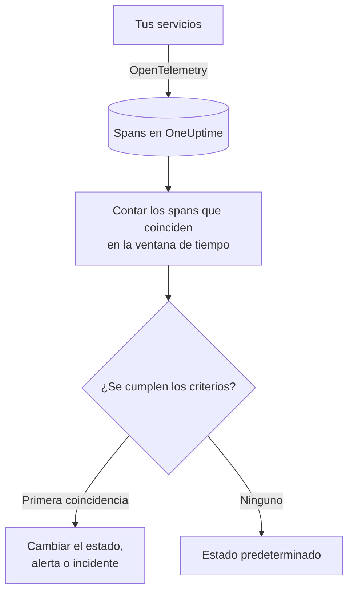

# Monitor de trazas

Un monitor de trazas cuenta, en una ventana de tiempo, los spans que tus servicios envían a OneUptime y que coinciden con tus filtros (nombre del span, estado, servicio, atributos). Cuando el recuento cumple tus criterios, cambia el estado del monitor, crea una alerta o declara un incidente. Úsalo para alertar sobre solicitudes fallidas a un endpoint, un pico de spans con error o un servicio que ha dejado de enviar trazas.

:::cards
- [Crear el monitor](#crear-un-monitor-de-trazas): Elige qué spans contar y cuándo alertar.
- [Códigos de estado de span](#códigos-de-estado-de-span): Qué significan OK, ERROR y UNSET, y por cuál filtrar.
- [Cómo se evalúa](#cómo-se-evalúa): La ventana de tiempo, el recuento y el ciclo de un minuto.
- [Criterios](#criterios): Umbrales, detección de anomalías y los valores predeterminados.
:::

## Cómo funciona

Cada minuto, OneUptime cuenta los spans que coinciden con los filtros del monitor y empezaron dentro de su ventana de tiempo. Compara ese recuento con los criterios del monitor de arriba abajo, y el primer criterio que coincide decide qué pasa. Si no coincide ninguno, el monitor vuelve a su estado predeterminado.

## Antes de empezar

- Tus servicios envían trazas a OneUptime mediante OpenTelemetry. Consulta [OpenTelemetry](/docs/telemetry/open-telemetry).
- Busca en el explorador de trazas el nombre exacto del span que quieres vigilar: los nombres de los spans los fija tu instrumentación, por ejemplo `POST /api/checkout` o `GET`.

## Crear un monitor de trazas

:::steps
### Empezar un monitor nuevo

Ve a **Monitores** y haz clic en **Crear monitor**.

### Elegir Traces

En **Tipo de monitor**, haz clic en **Más tipos de monitor** y elige **Trazas** en **Telemetría**, o escribe `traces` en el cuadro de búsqueda. Escribe un **Nombre** y haz clic en **Siguiente**.

### Elegir los spans que se cuentan

En **Configuración del monitor de trazas**, rellena **Nombre del span**, **Trazas del monitor durante (tiempo)** y **Filtrar por estado de span**. Un filtro que dejas vacío coincide con todos los spans. **Vista previa de spans**, bajo los filtros, muestra los spans con los que coinciden ahora mismo.

### Acotarlos (opcional)

Abre **Más campos** para filtrar por servicio de telemetría, entidad de infraestructura o atributo.

### Definir los criterios

La tarjeta **Criterios del monitor** empieza con dos criterios: fuera de línea, con un incidente, cuando no coincide ningún span; en línea cuando coincide al menos uno. Cámbialos según lo que quieras alertar; consulta [Criterios](#criterios).

### Crear el monitor

Haz clic en **Crear monitor**. El monitor se abre en su página **Vista general**, y su primera evaluación se ejecuta en menos de un minuto.
:::

> [!TIP]
> Para enterarte de cuándo una función de IA responde mal (respuestas fallidas, rechazadas, cortadas, vacías, marcadas o lentas), elige en su lugar **IA / LLM** en **Telemetría**. Ese monitor lee por ti las llamadas de IA de tus trazas, sin filtros de span que escribir. Consulta [Observabilidad de IA / LLM](/docs/telemetry/ai-llm-observability#entérate-cuando-la-ia-responde-mal).

## Qué consulta

| Campo | Con qué coincide | Predeterminado |
| --- | --- | --- |
| **Nombre del span** | Spans cuyo nombre contiene este texto, sin distinguir mayúsculas y minúsculas. | Vacío: todos los spans |
| **Trazas del monitor durante (tiempo)** | Spans que empezaron en los últimos 5 segundos hasta las últimas 24 horas. | **Último minuto** |
| **Filtrar por estado de span** | Spans con cualquiera de los estados elegidos: **Sin establecer**, **Correcto** o **Error**. | Vacío: todos los estados |
| **Filtrar por servicio de telemetría** (en **Más campos**) | Spans de cualquiera de los servicios elegidos. | Vacío: todos los servicios |
| **Filtrar por entidad de infraestructura** (en **Más campos**) | Spans de cualquiera de los hosts, pods, contenedores y otras entidades elegidos. | Vacío: todas las entidades |
| **Filtrar por atributos** (en **Más campos**) | Spans cuyos atributos cumplen todas las condiciones. Cada condición tiene su propio operador, como «es igual a» o «contiene». | Vacío: ninguna condición |

Todos los filtros que definas deben coincidir para que un span se cuente.

### Códigos de estado de span

- **OK**: La operación se marcó explícitamente como exitosa, ya sea desde el código de la aplicación o mediante un pipeline de trazas
- **ERROR**: La operación encontró un error
- **UNSET**: No se estableció ningún estado de error. Es el estado predeterminado de OpenTelemetry

UNSET no significa que falten datos. La instrumentación de OpenTelemetry establece ERROR cuando una operación falla y deja los spans exitosos en UNSET, por lo que en un servicio en buen estado la mayoría de los spans son UNSET. OneUptime los muestra en verde como «Unset (no error)». Registrar una excepción no cambia el estado de un span, por lo que un span en UNSET aún puede tener excepciones; se muestran junto con el span. Para alertar sobre fallos, filtra por ERROR. Para contar todos los spans que no fallaron, selecciona tanto OK como UNSET.

Si quieres que las solicitudes exitosas se muestren como OK, añade un pipeline de trazas en **Trazas > Ajustes > Canalizaciones** con la condición de filtro **Estado = Sin establecer** y un **Reasignador de estado** que asigne al estado Correcto (1) los valores de `http.response.status_code`, como `200`.

## Cómo se evalúa

- **Cada minuto.** Un monitor de trazas no lo comprueban sondas, así que no tiene intervalo que configurar ni página **Sondas e intervalo**.
- **Un número por evaluación.** El monitor cuenta los spans que coinciden con todos los filtros y empezaron dentro de **Trazas del monitor durante (tiempo)** antes de la evaluación. Con **Últimos 5 minutos**, cada evaluación mira cinco minutos atrás, así que las ventanas de evaluaciones consecutivas se solapan.
- **Sin spans, el recuento es 0.** Un servicio que deja de enviar trazas produce 0, que es lo que busca el criterio de fuera de línea predeterminado.
- **La caída del propio OneUptime no es silencio.** Mientras la ventana de tiempo contenga un periodo en el que OneUptime no recibía datos (se estaba reiniciando, actualizando o poniéndose al día), la comprobación espera: el estado no cambia y no se abre ni se resuelve ningún incidente ni alerta. Consulta [Cuando OneUptime no recibe datos](/docs/monitor/when-oneuptime-is-not-receiving).
- **Criterios de arriba abajo.** Decide el primer criterio que coincide, así que pon primero el más grave.

Cada cambio de estado, con su motivo, queda registrado en la **Cronología de estados** del monitor.

## Criterios

Los criterios de un monitor de trazas tienen un único **Tipo de filtro**: **Span Count**, el número de spans que coincidieron en la ventana. Elige una **Condición de filtro** y, para una condición de umbral, un **Valor**.

| Condición de filtro | Coincide cuando el recuento de spans está… |
| --- | --- |
| **Greater Than** | por encima del valor |
| **Greater Than Or Equal To** | en el valor o por encima |
| **Less Than** | por debajo del valor |
| **Less Than Or Equal To** | en el valor o por debajo |
| **Equal To** | exactamente en el valor |
| **Anomalously High** | por encima del rango esperado para esta hora de la semana |
| **Anomalously Low** | por debajo de ese rango |
| **Anomalous** | fuera de ese rango, en cualquier sentido |

Las condiciones de anomalía no llevan **Valor**. Elige una **Sensibilidad** (Low, Medium, la predeterminada, o High) y una **Ventana de referencia** de 14 (la predeterminada), 28, 60 o 90 días. OneUptime convierte el recuento en una tasa por minuto y la compara con la misma hora de la semana a lo largo de esa ventana. La referencia solo abarca los servicios y los estados de span del monitor: sus filtros de nombre de span y de atributos no forman parte de ella. Hasta que esa hora de la semana tenga suficiente historial, el criterio sigue aprendiendo y no se dispara.

Un monitor de trazas nuevo empieza con estos criterios:

| Criterio | Filtro | Efecto |
| --- | --- | --- |
| Check if … is offline | **Span Count** **Equal To** `0` | Pone el monitor fuera de línea y declara un incidente que se resuelve solo |
| Check if … is online | **Span Count** **Greater Than** `0` | Pone el monitor en línea |

## Ejemplo práctico: solicitudes de checkout fallidas

En cinco minutos, el servicio de checkout registra 1200 spans llamados `POST /api/checkout`: 1150 UNSET, 20 OK y 30 ERROR. El mismo monitor cuenta números muy distintos según **Filtrar por estado de span**:

| Filtrar por estado de span | Span Count | Qué mide |
| --- | --- | --- |
| **Error** | 30 | Las solicitudes que fallaron |
| **Correcto** | 20 | Solo las solicitudes que tu código marcó como exitosas |
| **Sin establecer** y **Correcto** | 1170 | Todas las solicitudes que no fallaron |
| Vacío | 1200 | Todas las solicitudes |

Para que te avisen cuando fallen más de 10 solicitudes de checkout en cinco minutos:

- **Nombre del span**: `POST /api/checkout`
- **Trazas del monitor durante (tiempo)**: **Últimos 5 minutos**
- **Filtrar por estado de span**: **Error**
- Criterio 1: **Span Count** **Greater Than** `10`: poner el monitor fuera de línea y declarar un incidente
- Criterio 2: **Span Count** **Less Than Or Equal To** `10`: poner el monitor en línea

Con 30 solicitudes fallidas, coincide el criterio 1 y se declara el incidente. Cuando pasan cinco minutos con 10 fallos o menos, coincide el criterio 2, el monitor vuelve a estar en línea y el incidente se resuelve solo.

## Solución de problemas

:::details El monitor no cuenta ningún span para mi endpoint
**Nombre del span** se compara con el nombre del span, y la instrumentación suele nombrar los spans de servidor por la ruta (`POST /api/checkout`) o solo por el método (`GET`). Busca el nombre exacto en el explorador de trazas. Después abre la página **Criterios** del monitor (en **Configuración**) y haz clic en **Editar criterios de monitoreo**: **Vista previa de spans** muestra con qué coinciden los filtros ahora mismo.
:::

:::details Las solicitudes exitosas no se cuentan cuando filtro por Correcto
La mayoría de las instrumentaciones dejan los spans exitosos en UNSET, no en OK; consulta [Códigos de estado de span](#códigos-de-estado-de-span). Selecciona tanto **Sin establecer** como **Correcto**, o añade el pipeline de trazas que se describe ahí.
:::

:::details Un span tiene una excepción pero no se cuenta como error
Registrar una excepción no cambia el estado de un span. Filtra por **Error**, o usa un [monitor de excepciones](/docs/monitor/exceptions-monitor) para alertar sobre las propias excepciones.
:::

:::details Un criterio de anomalía nunca se dispara
Sigue aprendiendo: la hora de la semana con la que compara aún no tiene suficiente historial dentro de la **Ventana de referencia**.
:::

## Próximos pasos

:::cards
- [Monitor de excepciones](/docs/monitor/exceptions-monitor): Alerta sobre las excepciones que registran tus servicios.
- [Monitor de registros](/docs/monitor/logs-monitor): Alerta sobre el volumen y el contenido de los registros.
- [Sintaxis de búsqueda](/docs/telemetry/search-syntax): Encuentra nombres y estados de spans en el explorador de trazas.
- [Plantillas de incidentes y alertas](/docs/monitor/incident-alert-templating): Escribe títulos y descripciones de alerta útiles.
:::
