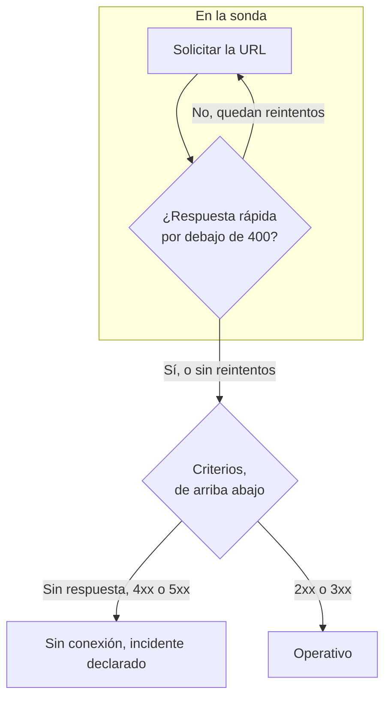

# Monitor de sitio web

Un monitor de sitio web comprueba que una página web responde. En cada comprobación, una sonda solicita la URL de la página, y el monitor pasa a sin conexión y declara un incidente cuando la página no responde o responde con un error. Para llamar a un endpoint con un método, encabezados o un cuerpo, use en su lugar un [monitor de API](/docs/monitor/api-monitor).

:::cards
- [Crear el monitor](#crear-un-monitor-de-sitio-web): Seis pasos en el panel.
- [Opciones de configuración](#opciones-de-configuración): Marcadores de URL, redirecciones, certificados, tiempos de espera y reintentos.
- [Criterios de monitoreo](#criterios-de-monitoreo): Qué cuenta como disponible o caído, desde el principio.
- [Solución de problemas](#solución-de-problemas): Cuando el monitor y su navegador no coinciden.
:::

## Cómo funciona

En cada comprobación, una sonda solicita la URL, sigue las redirecciones y registra lo que volvió: el código de estado, el tiempo de respuesta, los encabezados y, cuando un criterio lo necesita, el cuerpo. Una solicitud que falla, agota el tiempo de espera, responde con un estado `4xx` o `5xx`, o tarda más de 10 segundos se vuelve a intentar, hasta el número de reintentos que permita. Después, OneUptime pasa el resultado por los criterios del monitor.



Cuando ninguno de los criterios del monitor lee el cuerpo de la respuesta (un filtro **Cuerpo de la respuesta** o **JavaScript Expression**), la sonda envía una solicitud `HEAD` en lugar de un `GET`, y la repite como `GET` si el servidor rechaza `HEAD`. Los registros de acceso de su servidor pueden mostrar cualquiera de las dos.

Una sonda que ha perdido su propia conexión de red no informa de ningún resultado, así que no puede marcar su sitio como sin conexión.

## Antes de empezar

- **Un rol que pueda crear monitores**: Project Owner, Project Admin, Project Member, Monitor Admin o Monitor Member, o un rol personalizado con el permiso Create Monitor.
- **Una sonda que pueda llegar al sitio.** Las sondas predeterminadas de su proyecto se eligen para cada monitor nuevo. Si un cortafuegos protege el sitio, permita las [direcciones IP de las sondas de OneUptime Cloud](/docs/configuration/ip-addresses). Un sitio en una red privada necesita una [sonda personalizada](/docs/probe/custom-probe) dentro de esa red, con permiso para llegar a direcciones privadas: consulte [Acceso a red privada](/docs/self-hosted/private-network-access).

## Crear un monitor de sitio web

:::steps
### Empezar un monitor nuevo

Vaya a **Monitores** y haga clic en **Crear monitor**. En **Tipo de monitor**, elija **Sitio web**.

### Ponerle nombre

Introduzca un **Nombre**, como `Marketing site`, y haga clic en **Siguiente**.

### Introducir la URL

En **URL del sitio web**, introduzca la dirección completa de la página, incluido `https://`, como `https://example.com`. Para cambiar las redirecciones, los certificados, el tiempo de espera o los reintentos, abra **Más campos** debajo (consulte [Opciones de configuración](#opciones-de-configuración)).

### Probarlo

Haga clic en **Probar monitor**, elija una sonda en **Seleccionar sonda** y haga clic en **Ejecutar prueba**. **Resultado de la prueba del monitor** muestra lo que recibió la sonda.

### Revisar los criterios

**Criterios del monitor** empieza con los [criterios predeterminados](#criterios-predeterminados): sin conexión cuando el sitio no responde o responde con un error, en línea con cualquier estado `2xx` o `3xx`. Cámbielos si lo necesita y haga clic en **Siguiente**.

### Elegir sondas y crear

Conserve o cambie las **Sondas** y el **Intervalo de monitoreo** (empieza en **Cada 5 minutos**), y haga clic en **Crear monitor**. Se abre la página del monitor.
:::

## Opciones de configuración

### URL del sitio web

La página que se comprueba, como URL completa con su esquema: `https://example.com`, `https://example.com/pricing` o `http://example.com:8080/health`. Puede poner un [secreto de monitor](/docs/monitor/monitor-secrets) en la URL como `{{monitorSecrets.NAME}}`, por ejemplo un token en la cadena de consulta.

### Marcadores de URL dinámicos

Cuando un CDN o un proxy de caché está delante del sitio, una sonda puede recibir la respuesta de la caché en lugar de su servidor. Para saltarse la caché, añada un marcador a la URL; la sonda lo sustituye por un valor nuevo en cada comprobación.

| Marcador | Se sustituye por | Valor de ejemplo |
| --- | --- | --- |
| `{{timestamp}}` | La hora Unix actual, en segundos | `1719500000` |
| `{{random}}` | Una cadena aleatoria y única de 32 caracteres hexadecimales | `3f2b8c1d9e7a4b6c8d0e1f2a3b4c5d6e` |

Una URL con un marcador:

```text
https://example.com/health?cb={{timestamp}}
```

Lo que la sonda solicita en dos comprobaciones separadas por cinco minutos:

```text
https://example.com/health?cb=1719500000
https://example.com/health?cb=1719500300
```

Use `{{random}}` de la misma manera: `https://example.com/health?nocache={{random}}`.

### Más campos

Estos ajustes están plegados en **Más campos**, debajo de la URL. El encabezado plegado los enumera y muestra cuáles ha cambiado.

| Campo | Predeterminado | Qué hace |
| --- | --- | --- |
| **No seguir redirecciones** | Desactivado | Juzgar la primera respuesta en lugar de seguir las redirecciones. Consulte [más abajo](#no-seguir-redirecciones). |
| **Permitir certificados autofirmados** | Desactivado | Omitir la validación del certificado TLS para el propio nombre de host del monitor. |
| **Usar certificado de cliente (mTLS)** | Desactivado | Presentar un certificado de cliente y una clave privada. Consulte [Certificado de cliente (mTLS)](#certificado-de-cliente-mtls). |
| **Tiempo de espera de la solicitud (segundos)** | `60` | Cuánto esperar cada intento. El máximo es de 60 segundos. |
| **Reintentos en caso de fallo** | El predeterminado de la sonda, normalmente `3` | Cuántas veces reintentar un intento fallido. El máximo es 3. Consulte [Reintentos y tiempos de espera](#reintentos-y-tiempos-de-espera). |

#### No seguir redirecciones

De forma predeterminada, la sonda sigue las redirecciones (`301`, `302`, `303`, `307` y `308`), hasta 10, y juzga la página en la que termina. Active **No seguir redirecciones** para juzgar en su lugar la propia respuesta de redirección, por ejemplo para comprobar que `http://` redirige a `https://`. Los [criterios predeterminados](#criterios-predeterminados) cuentan una respuesta de redirección como en línea.

**Permitir certificados autofirmados** sigue las redirecciones que se quedan en el propio nombre de host del monitor. Una redirección a otro nombre de host se verifica como siempre.

#### Certificado de cliente (mTLS)

Si el sitio exige TLS mutuo, active **Usar certificado de cliente (mTLS)** y rellene:

| Campo | Qué introducir |
| --- | --- |
| **Certificado de cliente (PEM)** | El certificado de cliente codificado en PEM que se presenta. |
| **Clave privada de cliente (PEM)** | La clave privada correspondiente, codificada en PEM. |
| **Frase de contraseña de la clave privada de cliente** | Opcional. La frase de contraseña, solo si la clave privada está cifrada. |

Equivale a las opciones `--cert` y `--key` de curl:

```bash
curl --cert client.crt --key client.key https://example.com/health
```

Para mantener la clave fuera de los ajustes del monitor, guarde el certificado y la clave como [secretos de monitor](/docs/monitor/monitor-secrets) e introduzca `{{monitorSecrets.NAME}}` en estos campos. Los secretos se rellenan en el servidor, y sus valores nunca aparecen en el panel.

El certificado de cliente solo se presenta mientras la solicitud se mantiene en el origen de la URL del monitor (el mismo esquema, host y puerto). Tras una redirección a otro origen, la sonda continúa sin él.

#### Reintentos y tiempos de espera

**Reintentos en caso de fallo** cuenta los reintentos _después_ del primer intento, así que `0` ejecuta la comprobación una vez y `2` hasta tres veces. Si se deja en blanco, usa el valor predeterminado de la sonda: 3, a menos que `PROBE_MONITOR_RETRY_LIMIT` de la sonda indique otra cosa. La sonda espera un segundo entre intentos, y cada intento recibe el **Tiempo de espera de la solicitud (segundos)** completo.

Estos fallos se reintentan: errores de conexión, tiempos de espera agotados, respuestas `4xx` y `5xx`, y respuestas más lentas que 10 segundos. Estos no, porque reintentar no los cambia: una URL no válida o bloqueada, más de 10 redirecciones y una respuesta de más de 512 KiB.

## Criterios de monitoreo

Los criterios deciden cuándo el sitio web cuenta como en línea, degradado o sin conexión, y si eso declara un incidente o crea una alerta. Cada criterio comprueba uno o más filtros:

| Filtro | Condiciones | Qué comprueba |
| --- | --- | --- |
| **Is Online** | **Verdadero**, **Falso** | Si el sitio respondió, sea cual sea el código de estado. |
| **Código de estado de respuesta** | **Equal To**, **Not Equal To**, **Greater Than**, **Less Than**, **Greater Than Or Equal To**, **Less Than Or Equal To** | El código de estado HTTP. |
| **Tiempo de respuesta (en ms)** | **Greater Than**, **Less Than**, **Greater Than Or Equal To**, **Less Than Or Equal To** | Cuánto tardó la solicitud, redirecciones incluidas. |
| **Cuerpo de la respuesta** | **Contiene**, **Not Contains** | Texto en el cuerpo de la respuesta. La coincidencia distingue mayúsculas y minúsculas. |
| **Response Header** | **Contiene**, **Not Contains** | Si la respuesta tiene un encabezado con este nombre. Escriba el nombre en minúsculas, como `x-cache`. |
| **Response Header Value** | **Contiene**, **Not Contains** | Si un encabezado tiene exactamente este valor, comparado en minúsculas, como `no-store`. |
| **JavaScript Expression** | **Evaluates To True** | Una expresión sobre la respuesta. Consulte [Expresiones JavaScript](/docs/monitor/javascript-expression). |
| **Is Request Timeout** | **Verdadero**, **Falso** | Si la solicitud agotó el tiempo de espera en todos los intentos. |

**Añadir criterios** añade un criterio que ya lleva el nombre de su filtro, por ejemplo _Response Time (in ms) is above 3000_. El nombre cambia con los filtros hasta que escribe uno propio. La descripción es opcional: para añadirla, abra los **Ajustes** del criterio.

Con dos o más filtros, **Condición de coincidencia** decide si deben coincidir **Todos** o basta con **Cualquiera**. Las **Acciones** de un criterio deciden qué hace: cambiar el estado del monitor, crear una alerta, declarar un incidente, o varias de estas cosas.

### Criterios predeterminados

Un monitor de sitio web nuevo empieza con dos criterios, así que funciona sin cambiar nada:

- **Sin conexión** — el sitio web no responde, o responde con un código de estado de `400` o superior (o inferior a `200`). El monitor se marca como **Sin conexión** y se crea un incidente. El incidente se resuelve solo cuando el sitio web vuelve.
- **En línea** — el sitio web responde con cualquier código de estado `2xx` o `3xx`, como `200`, `204` o `301`. El monitor se marca como **Operativo**.

En la lista de criterios llevan el nombre del monitor: _Check if (name) is offline_ y _Check if (name) is online_.

Así que una página que responde `204 No Content`, o una redirección que vigila con **No seguir redirecciones** activado, cuenta como disponible. Si para usted solo un código de estado significa que está sano, cambie ambos criterios en la página **Configuración → Criterios** del monitor: por ejemplo **Código de estado de respuesta** / **Equal To** / `200` en el criterio en línea y **Not Equal To** / `200` en el de sin conexión, en lugar de los dos filtros de código de estado que tiene cada uno.

Los criterios se comprueban de arriba abajo, y el primero que coincide decide qué ocurre.

Cuando ninguno coincide, el monitor vuelve a su estado predeterminado: **Operativo**, salvo que elija otro en **Más campos**, debajo de los criterios. El encabezado plegado de **Más campos** muestra qué estado es.

Los monitores creados antes de que OneUptime cambiara estos valores predeterminados conservan los criterios con los que se crearon, que solo cuentan `200` como en línea. Los monitores creados mediante la API o Terraform usan los criterios que usted envía.

### Evaluar durante un periodo de tiempo

**Evaluar estos criterios durante un periodo de tiempo** es una casilla debajo de un filtro, disponible para **Is Online**, **Código de estado de respuesta** y **Tiempo de respuesta (en ms)**. Actívela para juzgar una ventana de comprobaciones anteriores en lugar de la última: elija una agregación en **Evaluar** y una ventana, de 2 a 60 minutos, en **Durante los últimos (en minutos)**.

| Agregación | Coincide cuando |
| --- | --- |
| **Promedio**, **Suma**, **Maximum Value**, **Minimum Value** | Esa cifra, en la ventana, cumple la condición. Solo filtros numéricos. |
| **All Values** | Cada comprobación de la ventana cumple la condición. |
| **Any Value** | Al menos una comprobación de la ventana cumple la condición. |

**All Values** solo coincide cuando la ventana está realmente cubierta por datos. Un monitor recién creado, o uno cuyas comprobaciones dejaron de registrarse, no tiene historial suficiente para decir nada de los últimos N minutos, así que el criterio espera en lugar de coincidir con la única lectura que tiene. **Any Value** es el ajuste para «avísame en cuanto una sola comprobación supere el umbral» y sigue disparándose de inmediato.

**Si no hay datos** decide qué ocurre mientras la ventana no puede respaldar el criterio:

| Opción | Qué ocurre | Úsela para |
| --- | --- | --- |
| **Ignore** (predeterminado) | El criterio no coincide. | Alertas de umbral normales. |
| **Disparador** | Los datos que faltan cuentan como el problema. | Comprobaciones en las que el silencio es en sí un fallo. |
| **Treat As Zero** | La ventana se compara como un único cero. | Contadores en los que la ausencia de eventos significa realmente cero. |

### Criterios de ejemplo

| Objetivo | Filtro | Condición | Valor |
| --- | --- | --- | --- |
| Marcar el sitio como degradado cuando es lento | **Tiempo de respuesta (en ms)** | **Greater Than** | `3000` |
| Detectar una página de error servida con `200` | **Cuerpo de la respuesta** | **Not Contains** | `Welcome` |
| Comprobar que hay un encabezado del CDN | **Response Header** | **Contiene** | `x-cache` |
| Aceptar solo `200` como sano | **Código de estado de respuesta** | **Equal To** | `200` |

## Solución de problemas

:::details El monitor está sin conexión, pero el sitio carga en mi navegador
La sonda recibió una respuesta distinta a la de su navegador. La causa raíz del incidente, y **Registros de monitoreo** en el monitor, muestran lo que vio la sonda. Causas habituales:

- Un cortafuegos o un filtro de bots bloquea las sondas. Permita las [direcciones IP de las sondas de OneUptime Cloud](/docs/configuration/ip-addresses).
- El sitio solo es accesible en su red. Use una [sonda personalizada](/docs/probe/custom-probe) dentro de ella.
- El certificado es autofirmado o de una autoridad privada. Active **Permitir certificados autofirmados**, o vigile el certificado por separado con un [monitor de certificado SSL](/docs/monitor/ssl-certificate-monitor).
:::

:::details La comprobación falla con «Remote response exceeded the allowed size.»
La sonda lee como máximo 512 KiB de una respuesta, y esta página es más grande. Apunte el monitor a una página más pequeña, como un endpoint de salud, o quite los filtros **Cuerpo de la respuesta** y **JavaScript Expression** para que la sonda solo necesite los encabezados.
:::

:::details La comprobación falla con «Monitor target exceeded 10 redirects.»
La URL redirige más de 10 veces, normalmente en bucle. Abra la URL con `curl -IL` para ver la cadena, y apunte el monitor a la página en la que debería terminar la cadena.
:::

:::details La comprobación falla con un mensaje sobre una dirección de red privada
La URL se resuelve en una dirección privada, y la sonda que ejecutó la comprobación no tiene permiso para llegar a direcciones privadas. En una sonda autoalojada, actívelo con `PROBE_ALLOW_PRIVATE_NETWORK_MONITORS`: consulte [Acceso a red privada](/docs/self-hosted/private-network-access).
:::

## Próximos pasos

:::cards
- [Monitor de API](/docs/monitor/api-monitor): Llamar a un endpoint con un método, encabezados y un cuerpo.
- [Monitor de certificado SSL](/docs/monitor/ssl-certificate-monitor): Recibir un aviso antes de que caduque el certificado del sitio.
- [Secretos del monitor](/docs/monitor/monitor-secrets): Mantener tokens y claves fuera de los ajustes del monitor.
- [Incidentes](/docs/incidents/index): Qué ocurre después de que el monitor declara uno.
:::
