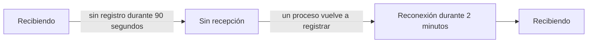

# Cuando OneUptime no recibe datos

Mientras OneUptime se reinicia, se actualiza o procesa un atraso, nada de lo que envían sus agentes, colectores, sondas y emisores de heartbeat puede llegar a sus monitores. OneUptime registra cuándo ocurre eso y nunca cuenta ese tiempo en contra de un servidor, un host ni ningún otro recurso: ese tiempo no se monitoreó, así que no es tiempo de inactividad.

## Cómo funciona

Cada proceso de OneUptime que recibe datos registra cada 30 segundos que está recibiendo, siempre que pueda llegar a las bases de datos donde guarda los datos. OneUptime deja fuera tres tipos de tiempo:

- Sin recepción: ningún proceso registró nada durante más de 90 segundos. OneUptime estaba detenido, reiniciándose o actualizándose, o no podía llegar a una de sus bases de datos.
- Reconexión: los primeros 2 minutos después de que OneUptime vuelve a recibir, mientras los agentes se reconectan y envían lo que guardaron.
- Puesta al día: mientras la cola de datos pendientes de procesar lleva más de un minuto de atraso, el tiempo desde los datos más antiguos que aún esperan en ella.



Un reinicio que dura menos de 90 segundos no es una interrupción: los colectores vuelven a enviar lo que no pudieron entregar.

## Qué cambia durante ese tiempo

| Dónde | Qué hace OneUptime |
| --- | --- |
| Monitores de servidor / VM | **Is Online** solo cuenta los minutos en que OneUptime estaba recibiendo: de forma predeterminada, un servidor está fuera de línea tras 3 minutos de silencio que OneUptime podría haber oído. |
| Monitores de solicitudes entrantes y de correos entrantes | **Recieved In Minutes** y **Not Recieved In Minutes** solo cuentan los minutos en que OneUptime estaba recibiendo. Cuando se cumple uno de esos criterios, su motivo indica cuántos de esos minutos se dejaron fuera. |
| Monitores de host, Kubernetes, Docker, métricas, registros, trazas y los demás monitores que leen telemetría | Una comprobación cuya ventana contiene tiempo sin recepción espera hasta que ese tiempo salga de la ventana, y nunca más de 15 minutos después de que terminó. Hasta entonces no cambia nada: ningún cambio de estado, y no se abre ni se resuelve ningún incidente ni alerta. Mientras la cola lleva atraso, una comprobación lee hasta donde está la cola en lugar de hasta ahora. |
| Hosts, clústeres y el resto del inventario | Un recurso pasa a **Desconectado** solo después de que su umbral de silencio, 15 minutos para la mayoría, transcurra mientras OneUptime estaba recibiendo. |
| Sondas y agentes de IA | Pasan a **Desconectado** tras 3 minutos de silencio mientras OneUptime estaba recibiendo. |
| Gráficos de **Disponibilidad** de hosts, hosts de Docker y Podman y clústeres de Kubernetes | Ese tiempo se sombrea como **No monitoreado**, y la línea se corta ahí en lugar de caer a caído. La insignia de tiempo de actividad deja fuera ese tiempo; un intervalo con datos sigue contando como activo. |
| Tiempo de actividad de las páginas de estado y SLO | Ambos se calculan a partir de los estados de los monitores: sin un cambio de estado falso, no hay tiempo de inactividad falso. |

> [!NOTE]
> Dejar tiempo fuera no es rellenarlo. Un recurso nunca se muestra como activo durante un tiempo en que OneUptime no podía oírlo: ese tiempo simplemente no se juzga. En cuanto OneUptime vuelve a recibir, un recurso que de verdad está caído se juzga desde ese momento por lo que envía, o deja de enviar.

## Instalaciones autoalojadas

### Al arrancar

Mientras un proceso de OneUptime arranca, responde a toda solicitud, salvo a sus comprobaciones de estado, con `503 Service Unavailable` y `Retry-After: 5`, y un navegador recibe una página que se recarga sola. Los colectores y SDK de OpenTelemetry vuelven a enviar una solicitud así en lugar de descartar los datos. `/status/ready` falla hasta que el proceso está listo, de modo que Kubernetes no le envía tráfico antes.

### Réplicas worker

Un proceso solo registra que OneUptime está recibiendo cuando el tráfico entrante puede llegar a él. Si ejecuta réplicas que solo procesan colas, sin un ingress delante, establezca `RECEIVES_INGRESS_TRAFFIC` en `false` en ellas. De lo contrario, siguen registrando mientras todas las réplicas que reciben tráfico están caídas, y esa interrupción vuelve a contar en contra de sus recursos. El chart de Helm ya lo establece en sus pods worker, y un único contenedor de OneUptime no necesita nada.

```yaml title="Contenedor worker"
env:
  - name: RECEIVES_INGRESS_TRAFFIC
    value: "false"
```

### Qué se registra

OneUptime empieza a llevar este registro cuando actualiza a una versión que lo incluye; el tiempo anterior se juzga como siempre. Mientras ningún proceso registra que está recibiendo, el tiempo desde el último registro se trata como una interrupción durante una hora como máximo; después, el silencio vuelve a contar, así que un registro que dejó de escribirse no puede ocultar por mucho tiempo una caída de sus recursos. Los registros se conservan 400 días, y cuando OneUptime no puede leerlos, juzga el silencio como si hubiera estado recibiendo todo el tiempo.

## Próximos pasos

:::cards
- [Monitor de hosts](/docs/monitor/host-monitor): Alertar sobre las métricas de un host.
- [Monitor de servidor / VM](/docs/monitor/server-monitor): Saber cuándo el agente de un servidor deja de informar.
- [Monitor de solicitudes entrantes](/docs/monitor/incoming-request-monitor): Convertir un heartbeat en un interruptor de hombre muerto.
- [Actualización](/docs/installation/upgrading): Actualizar una instalación autoalojada.
:::
