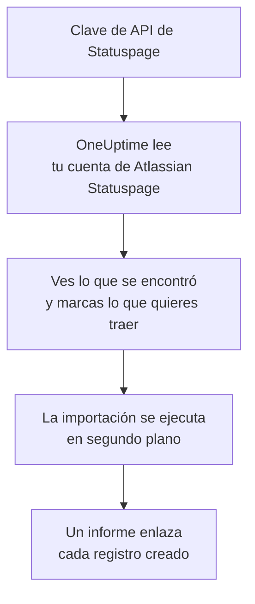

# Migrar desde Atlassian Statuspage

**Importar desde otra herramienta** trae tus páginas de Atlassian Statuspage a OneUptime en pocos minutos. Con una clave de API de Statuspage, OneUptime lee tus páginas, sus componentes y grupos y sus suscriptores por correo electrónico, te muestra lo que encontró y crea lo que marques. No se cambia nada en Statuspage.

:::cards
- [Importa tu cuenta](#importa-tu-cuenta-de-atlassian-statuspage): Crea una clave, lee tu cuenta y marca lo que quieres traer.
- [Qué se trae](#qué-se-trae): En qué se convierte en OneUptime cada página, componente y suscriptor de Statuspage.
- [Completa el cambio](#completa-el-cambio): Qué hacer cuando termina la importación.
:::

## Cómo funciona

- **La clave se usa una sola vez.** Se guarda cifrada mientras OneUptime lee tu cuenta y se elimina en cuanto termina la lectura, haya funcionado o no. Nunca se vuelve a mostrar ni se escribe en un registro.
- **OneUptime solo lee.** Solo llama a la API de Atlassian Statuspage: `api.statuspage.io`. Hace una solicitud por segundo, el máximo que Statuspage permite a una clave. Cuando Atlassian Statuspage le pide que vaya más despacio, espera y vuelve a intentarlo.
- **No se crea nada hasta que inicias la importación.** La vista previa muestra, para cada elemento, si es nuevo, si ya está en OneUptime (y se usa tal cual), si lo trajo una importación anterior o por qué no se puede traer.
- **Volver a ejecutarla nunca crea nada dos veces.** OneUptime recuerda lo que trajo cada importación, por su ID de Atlassian Statuspage. Vuelve a ejecutarla después de añadir páginas o componentes en Atlassian Statuspage y solo se crearán los nuevos.

## Antes de empezar

- **Un proyecto de OneUptime y el derecho a crear lo que traes.** Los propietarios y administradores del proyecto pueden traerlo todo. Otros roles también pueden ejecutar una importación y traer los tipos de registros que pueden crear. Lo demás se muestra como no traído, con el motivo.
- **Una clave de API de Statuspage.** Solo un propietario de la cuenta puede crearla. La importación nunca escribe en Statuspage y lee cada página que la clave puede ver.
- **Espacio para tus páginas, en OneUptime Cloud.** Tu plan tiene espacio para un número de páginas de estado y suscriptores. Lo que no cabe se muestra como no traído. Los componentes se convierten en monitores manuales, que son gratuitos.

## Importa tu cuenta de Atlassian Statuspage

:::steps
### Crea una clave de API en Statuspage
En Statuspage, selecciona tu avatar abajo a la izquierda y luego **API info**. Selecciona **Create key**, llámala `OneUptime import` y cópiala.

### Abre la página de importación
En OneUptime, ve a **Ajustes del proyecto** > **Importar desde otra herramienta** y selecciona **Atlassian Statuspage**.

### Conecta Atlassian Statuspage
Pega la clave en **Clave de API de Atlassian Statuspage** y selecciona **Leer mi cuenta de Atlassian Statuspage**. Una cuenta grande tarda unos minutos, y puedes salir de la página mientras se lee.

### Marca lo que quieres traer
La vista previa muestra lo que se encontró, con una sección por tipo. Todo lo que se crearía empieza marcado, salvo los suscriptores. Debajo de cada elemento, OneUptime indica lo que no se traerá exactamente igual. Cuando una página de estado marcada muestra un monitor que dejaste sin marcar, lo indica, y **Marcarlos también** lo marca. Para traer suscriptores, márcalos y confirma debajo que aceptaron recibir tus actualizaciones y que puedes trasladarlos. No se envía ningún correo.

### Inicia la importación
Selecciona **Iniciar la importación**. La importación se ejecuta en segundo plano: puedes salir de la página, y el informe te espera allí.
:::

El informe cuenta lo que se creó y no se trajo, y muestra cada elemento con un enlace al registro en el que se convirtió, primero los fallos. Las importaciones anteriores aparecen en **Importaciones anteriores** en la misma página.

## Qué se trae

| En Atlassian Statuspage | En OneUptime | Cómo |
| --- | --- | --- |
| Components | Monitores manuales | Cada componente se convierte en un monitor manual que muestra la página de estado. Nada lo comprueba: tú defines su estado en OneUptime, como hacías en Statuspage. Un grupo de componentes se convierte en un grupo de la página. |
| Pages | Páginas de estado | Cada página se trae con su nombre y descripción, sus componentes en sus grupos, y la disponibilidad y el historial de los componentes que destaca. Una página que solo algunas personas pueden ver se trae como privada. |
| Email subscribers | Suscriptores de la página de estado | Los suscriptores por correo electrónico confirmados se traen cuando confirmas que puedes trasladarlos, y siguen los mismos componentes. No se envía ningún correo, y cada actualización que reciban de OneUptime incluye un enlace para darse de baja. |

Los componentes se traen como operativos. La vista previa nombra cada uno que ahora no está operativo en Statuspage, para que definas su estado después de la importación.

## Qué no se trae

- **Los incidentes, el mantenimiento programado y su historial.** Un incidente en OneUptime es un registro vivo que avisa a las personas, así que los pasados se quedan en Statuspage.
- **Los suscriptores por SMS, webhook, Slack o Microsoft Teams.** La vista previa los cuenta. Solo se traen los suscriptores por correo electrónico.
- **Las plantillas de incidentes y las métricas del sistema.** Añade en OneUptime lo que todavía necesites.
- **El dominio propio y la marca de una página de estado.** En OneUptime, añade el dominio en **Dominios personalizados** y el logotipo en **Marca**.

## Límites

Una importación crea como máximo 2.000 registros: como máximo 1.000 monitores y 50 páginas de estado. Los suscriptores no cuentan para ese total: una importación trae como máximo 5.000 suscriptores. Lo que supera un límite se muestra como no traído. Vuelve a ejecutar la importación para traer el resto.

En OneUptime Cloud, las páginas de estado y los suscriptores que no caben en tu plan se muestran como no traídos, con lo que necesitan.

Una vista previa se guarda un día. Solo la persona que leyó la cuenta puede marcar elementos e iniciarla. Los propietarios y administradores del proyecto ven el progreso y el informe de cada importación.

## Completa el cambio

:::steps
### Revisa tus páginas de estado
En **Páginas de estado**, abre cada página y compárala con la de Statuspage. Cada componente es un monitor manual: cambia su estado en OneUptime cuando algo cambie.

### Apunta la dirección de tu página de estado a OneUptime
En **Páginas de estado**, abre la página, añade tu dominio en **Dominios personalizados** y luego cambia su registro DNS. Así tus visitantes y suscriptores llegarán a la nueva página.

### Desactiva tu página en Atlassian Statuspage
Cuando tu dominio apunte a OneUptime, cierra la página en Statuspage para que sus suscriptores no reciban dos avisos.
:::

## Solución de problemas

:::details Atlassian Statuspage no aceptó la clave de API
Comprueba que copiaste la clave completa y que la creó un propietario de la cuenta en **API info**. Una clave pertenece a una organización de Statuspage y solo lee sus páginas. Después selecciona **Volver a intentar**.
:::

:::details Los suscriptores no se pueden traer
Marca la casilla de debajo que confirma que aceptaron recibir tus actualizaciones y que puedes trasladarlos: **Iniciar la importación** la espera. Los suscriptores que nunca confirmaron su suscripción en Statuspage se quedan allí.
:::

:::details Algunos elementos no se pueden marcar
Cada uno indica el motivo: un nombre que el proyecto ya tiene, algo que trajo una importación anterior, o un registro que no tienes permiso para crear o que tu plan no incluye.
:::

## Próximos pasos

:::cards
- [Visión general de las páginas de estado](/docs/status-pages/index): Qué muestra una página de estado y quién puede verla.
- [Suscriptores y anuncios](/docs/status-pages/subscribers): Cómo se enteran los suscriptores de los incidentes.
- [Monitor manual](/docs/monitor/manual-monitor): Un monitor cuyo estado defines tú.
:::
