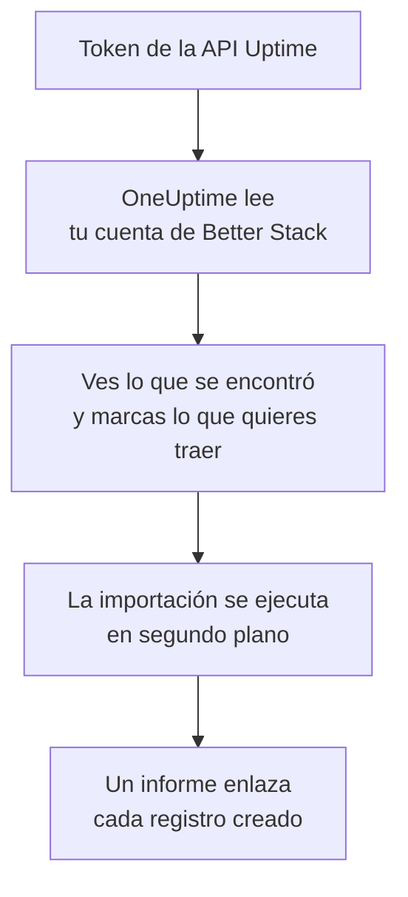

# Migrar desde Better Stack

**Importar desde otra herramienta** trae tus monitores Uptime, latidos y páginas de estado de Better Stack a OneUptime en pocos minutos. Con un token de la API Uptime de Better Stack, OneUptime lee tus monitores, latidos, páginas de estado y sus suscriptores por correo electrónico, te muestra lo que encontró y crea lo que marques. No se cambia nada en Better Stack.

:::cards
- [Importa tu cuenta](#importa-tu-cuenta-de-better-stack): Crea un token, lee tu cuenta y marca lo que quieres traer.
- [Qué se trae](#qué-se-trae): En qué se convierte en OneUptime cada monitor, latido y página de estado de Better Stack.
- [Completa el cambio](#completa-el-cambio): Qué hacer cuando termina la importación.
:::

## Cómo funciona

- **La clave se usa una sola vez.** Se guarda cifrada mientras OneUptime lee tu cuenta y se elimina en cuanto termina la lectura, haya funcionado o no. Nunca se vuelve a mostrar ni se escribe en un registro.
- **OneUptime solo lee.** Solo llama a la API de Better Stack: `incidents.betterstack.com`. Cuando Better Stack le pide que vaya más despacio, espera y vuelve a intentarlo.
- **No se crea nada hasta que inicias la importación.** La vista previa muestra, para cada elemento, si es nuevo, si ya está en OneUptime (y se usa tal cual), si lo trajo una importación anterior o por qué no se puede traer.
- **Volver a ejecutarla nunca crea nada dos veces.** OneUptime recuerda lo que trajo cada importación, por su ID de Better Stack. Vuelve a ejecutarla después de añadir monitores o latidos en Better Stack y solo se crearán los nuevos.

## Antes de empezar

- **Un proyecto de OneUptime y el derecho a crear lo que traes.** Los propietarios y administradores del proyecto pueden traerlo todo. Otros roles también pueden ejecutar una importación y traer los tipos de registros que pueden crear. Lo demás se muestra como no traído, con el motivo.
- **Un token de la API Uptime de Better Stack.** Usa un token Uptime de equipo: lee los monitores, latidos y páginas de estado de ese equipo. La importación nunca escribe en Better Stack.
- **Un método de pago, en OneUptime Cloud.** Los monitores que hacen comprobaciones se cobran según su uso, incluso en el plan Free, así que añade uno en **Ajustes del proyecto** > **Facturación** antes de importar. Sin él, esos monitores se muestran como no traídos.

## Importa tu cuenta de Better Stack

:::steps
### Crea un token de API en Better Stack
En Better Stack, ve a **API tokens** > **Team-based tokens** y selecciona tu equipo. En **Uptime API tokens**, crea un token llamado `OneUptime import` y cópialo.

### Abre la página de importación
En OneUptime, ve a **Ajustes del proyecto** > **Importar desde otra herramienta** y selecciona **Better Stack**.

### Conecta Better Stack
Pega el token en **Clave de API de Better Stack** y selecciona **Leer mi cuenta de Better Stack**. Una cuenta grande tarda unos minutos, y puedes salir de la página mientras se lee.

### Marca lo que quieres traer
La vista previa muestra lo que se encontró, con una sección por tipo. Todo lo que se crearía empieza marcado, salvo los monitores en pausa, que se traen en pausa si los marcas, y los suscriptores. Debajo de cada elemento, OneUptime indica lo que no se traerá exactamente igual. Cuando una página de estado marcada muestra un monitor que dejaste sin marcar, lo indica, y **Marcarlos también** lo marca. Para traer suscriptores, márcalos y confirma debajo que aceptaron recibir tus actualizaciones y que puedes trasladarlos. No se envía ningún correo.

### Inicia la importación
Selecciona **Iniciar la importación**. La importación se ejecuta en segundo plano: puedes salir de la página, y el informe te espera allí.
:::

El informe cuenta lo que se creó y no se trajo, y muestra cada elemento con un enlace al registro en el que se convirtió, primero los fallos. Las importaciones anteriores aparecen en **Importaciones anteriores** en la misma página.

## Qué se trae

| En Better Stack | En OneUptime | Cómo |
| --- | --- | --- |
| Monitors and heartbeats | Monitores | Cada monitor se convierte en un monitor del mismo tipo, con la misma dirección, intervalo y tiempo de espera. Cada latido se convierte en un monitor de solicitudes entrantes. |
| Status pages | Páginas de estado | Cada página se trae con sus secciones como grupos y los monitores y latidos que muestra. Un elemento que sigues a mano se convierte en un monitor manual. Una página con contraseña o lista de IP permitidas se trae como privada. |
| Email subscribers | Suscriptores de la página de estado | Los suscriptores por correo electrónico confirmados se traen cuando confirmas que puedes trasladarlos, y siguen los mismos recursos. No se envía ningún correo, y cada actualización que reciban de OneUptime incluye un enlace para darse de baja. |

- **Los monitores status, expected status code, keyword y keyword absence** se convierten en monitores de sitio web, o en monitores de API cuando envían otro método, encabezados o un cuerpo JSON. Un monitor status está disponible con cualquier respuesta 2xx, y uno expected status code con los códigos que indica.
- **Los monitores de ping y TCP** se convierten en monitores de ping y de puerto. **Los monitores SMTP, POP e IMAP** se convierten en monitores de puerto en su puerto: OneUptime comprueba que el puerto responde, no la conversación de correo.
- **Los monitores DNS** se convierten en monitores DNS del nombre que consultan, preguntando al mismo servidor.
- **Los latidos** se convierten en monitores de solicitudes entrantes, que caen cuando no llega ninguna solicitud durante el periodo y el margen de gracia. Cada uno tiene una dirección nueva en OneUptime.
- **Los avisos de caducidad SSL.** Un monitor que avisa antes de que caduque su certificado recibe también un monitor de certificado SSL, con su nombre, que avisa con los mismos días de antelación.

Cada monitor se comprueba desde las sondas de tu proyecto, como uno que creas tú. Un intervalo que OneUptime no ofrece se convierte en el más cercano que ofrece, y un tiempo de espera de más de un minuto, en un minuto. La vista previa indica cuándo cambia alguno de los dos.

## Qué no se trae

- **El historial de disponibilidad, los tiempos de respuesta y los incidentes.** OneUptime empieza a comprobar cuando termina la importación.
- **Los contactos de alerta y las integraciones.** Elige a quién se avisa en OneUptime, como se describe en [Completa el cambio](#completa-el-cambio).
- **Las contraseñas y los encabezados que pueden contener un secreto.** Un monitor que inicia sesión, o que envía un encabezado `Authorization`, de cookie o de token, se trae sin él: añádelo con un [secreto de monitor](/docs/monitor/monitor-secrets).
- **Los monitores UDP y Playwright.** OneUptime no tiene ningún monitor que haga lo mismo, y la vista previa nombra cada uno.
- **Los suscriptores que nunca confirmaron su suscripción.** Se quedan en Better Stack.
- **Lo que muestra una página de estado además de monitores, latidos y elementos seguidos a mano.** La vista previa nombra cada uno.
- **El dominio propio y la marca de una página de estado.** En OneUptime, añade el dominio en **Dominios personalizados** y el logotipo en **Marca**.

## Límites

Una importación crea como máximo 2.000 registros: como máximo 1.000 monitores y 50 páginas de estado. Los suscriptores no cuentan para ese total: una importación trae como máximo 5.000 suscriptores. Lo que supera un límite se muestra como no traído. Vuelve a ejecutar la importación para traer el resto.

En OneUptime Cloud, los monitores que hacen comprobaciones necesitan un método de pago, y lo que no cabe en tu plan se muestra como no traído, con lo que necesita.

Una vista previa se guarda un día. Solo la persona que leyó la cuenta puede marcar elementos e iniciarla. Los propietarios y administradores del proyecto ven el progreso y el informe de cada importación.

## Completa el cambio

:::steps
### Revisa tus monitores
Abre cada uno en **Monitores** y revisa sus primeros resultados. Un monitor de latido tiene una dirección nueva: apunta a ella la tarea que lo llama.

### Elige a quién se avisa
Añade propietarios a tus monitores, o una política de guardia en **Guardia** > **Políticas de guardia** a los incidentes que abren, para que las personas adecuadas se enteren cuando algo falle.

### Apunta la dirección de tu página de estado a OneUptime
En **Páginas de estado**, abre la página, añade tu dominio en **Dominios personalizados** y luego cambia su registro DNS. Así tus visitantes y suscriptores llegarán a la nueva página.

### Desactiva las comprobaciones en Better Stack
Cuando OneUptime compruebe lo mismo, pausa las comprobaciones en Better Stack para que nadie reciba dos avisos.
:::

## Solución de problemas

:::details Better Stack no aceptó la clave de API
Comprueba que copiaste el token completo y que es el token del equipo de **Uptime API tokens**, no uno de Telemetry. Después selecciona **Volver a intentar**.
:::

:::details Un monitor se muestra como no traído
Indica el motivo: un tipo de monitor que OneUptime no tiene, una dirección que OneUptime no puede leer, o un proyecto sin espacio o sin método de pago para él. Un monitor que OneUptime ya ejecuta, con el mismo nombre, tipo y dirección, se usa tal cual.
:::

:::details Algunos elementos no se pueden marcar
Cada uno indica el motivo: un nombre que el proyecto ya tiene, algo que trajo una importación anterior, o un registro que no tienes permiso para crear o que tu plan no incluye.
:::

## Próximos pasos

:::cards
- [Monitor de solicitudes entrantes](/docs/monitor/incoming-request-monitor): Cómo funciona un latido en OneUptime.
- [Visión general de las páginas de estado](/docs/status-pages/index): Qué muestra una página de estado y quién puede verla.
- [Migrar desde UptimeRobot](/docs/moving-to-oneuptime/uptimerobot): Trae tus comprobaciones desde UptimeRobot.
:::
