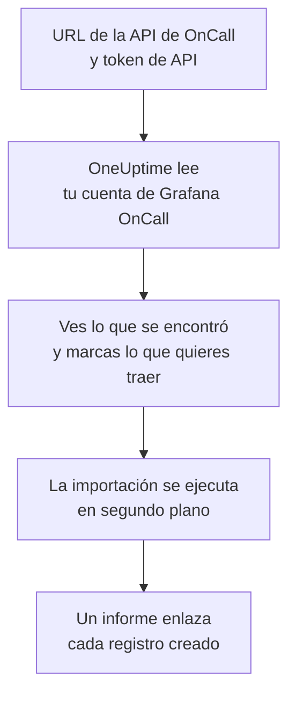

# Migrar desde Grafana OnCall

Grafana Labs archivó la versión de código abierto de Grafana OnCall en marzo de 2026, y en Grafana Cloud sigue como parte de Grafana Cloud IRM. Esté donde esté la tuya, **Importar desde otra herramienta** trae tu configuración de guardias a OneUptime en pocos minutos. Con la URL de la API de OnCall y un token de API, OneUptime lee tus usuarios, equipos, programaciones y cadenas de escalado, te muestra lo que encontró y crea lo que marques. No se cambia nada en Grafana OnCall.

:::cards
- [Importa tu cuenta](#importa-tu-cuenta-de-grafana-oncall): Crea un token, lee tu cuenta y marca lo que quieres traer.
- [Qué se trae](#qué-se-trae): En qué se convierte cada registro de Grafana OnCall en OneUptime.
- [Completa el cambio](#completa-el-cambio): Qué hacer cuando termina la importación.
:::

## Cómo funciona

- **El token se usa una sola vez.** Se guarda cifrado, junto con la URL de la API, mientras OneUptime lee tu cuenta y se elimina en cuanto termina la lectura, haya funcionado o no. Nunca se vuelve a mostrar ni se escribe en un registro.
- **OneUptime solo lee, y solo de la dirección que indicas.** Solo llama a la URL de la API de OnCall que pegas, como máximo una vez por segundo, lo que se mantiene dentro del límite de Grafana OnCall de 300 solicitudes por token en cinco minutos. Cuando Grafana OnCall le pide que vaya más despacio, espera y vuelve a intentarlo.
- **La dirección se comprueba antes de cada solicitud.** OneUptime nunca llama a la máquina en la que se ejecuta ni a un servicio de metadatos de la nube, y nunca sigue una redirección. En OneUptime Cloud, además, la dirección debe ser pública y empezar por `https://`. Un OneUptime autoalojado también puede leer un Grafana OnCall de tu propia red, salvo que su administrador lo haya desactivado, como se describe en [Private Network Access](/docs/self-hosted/private-network-access).
- **No se crea nada hasta que inicias la importación.** La vista previa muestra, para cada elemento, si es nuevo, si ya está en OneUptime (y se usa tal cual), si lo trajo una importación anterior o por qué no se puede traer.
- **Volver a ejecutarla nunca crea nada dos veces.** OneUptime recuerda lo que trajo cada importación, por su ID de Grafana OnCall. Vuelve a ejecutarla después de añadir personas o programaciones en Grafana OnCall y solo se crearán las nuevas.

## Antes de empezar

- **Un proyecto de OneUptime y el derecho a crear lo que traes.** Los propietarios y administradores del proyecto pueden traerlo todo. Otros roles también pueden ejecutar una importación y traer los tipos de registros que pueden crear. Lo demás se muestra como no traído, con el motivo.
- **Un token de API de Grafana OnCall.** Usa un token de API de OnCall, no el token de una cuenta de servicio de Grafana. La importación nunca escribe en Grafana OnCall. Elimina el token cuando termine la importación.
- **La URL de la API de OnCall.** Los ajustes de OnCall la muestran junto a los tokens de API. En Grafana Cloud tiene un aspecto como `https://oncall-prod-us-central-0.grafana.net/oncall`. En tu propia instalación, es la dirección de tu motor de OnCall.

## Importa tu cuenta de Grafana OnCall

:::steps
### Crea un token de API en Grafana OnCall
En Grafana, abre **OnCall** > **Settings**. En Grafana Cloud, abre **IRM** > **Settings** > **Admin & API**. Copia la URL de la API de OnCall que aparece allí. En **API tokens**, crea un token llamado `OneUptime import` y cópialo.

### Abre la página de importación
En OneUptime, ve a **Ajustes del proyecto** > **Importar desde otra herramienta** y selecciona **Grafana OnCall**.

### Conecta Grafana OnCall
Pega la dirección en **URL de la API de Grafana OnCall** y el token en **Clave de API de Grafana OnCall**, y selecciona **Leer mi cuenta de Grafana OnCall**. Una cuenta grande tarda unos minutos, y puedes salir de la página mientras se lee.

### Marca lo que quieres traer
La vista previa muestra lo que se encontró, con una sección por tipo. Todo lo que se crearía empieza marcado, salvo las personas que no están en ningún equipo, programación ni cadena de escalado. Debajo de cada elemento, OneUptime indica lo que no se traerá exactamente igual. Cuando un elemento marcado usa algo que dejaste sin marcar, lo indica, y **Marcarlos también** lo marca.

### Inicia la importación
Si se va a invitar a personas, elige en **Invitar a las personas nuevas a** el equipo al que se unen. Después selecciona **Iniciar la importación**. La importación se ejecuta en segundo plano: puedes salir de la página, y el informe te espera allí.
:::

El informe cuenta lo que se creó, se invitó y no se trajo, y muestra cada elemento con un enlace al registro en el que se convirtió, primero los fallos. Las importaciones anteriores aparecen en **Importaciones anteriores** en la misma página.

## Qué se trae

| En Grafana OnCall | En OneUptime | Cómo |
| --- | --- | --- |
| Usuarios | Miembros del proyecto | Se emparejan por dirección de correo. Quien aún no esté en el proyecto recibe una invitación al equipo que elijas. |
| Equipos | Equipos | Se crean con sus miembros. Un equipo cuyo nombre ya tiene el proyecto se usa tal cual, y sus miembros no se tocan. |
| Programaciones | Programaciones de guardia | Cada rotación se convierte en una capa con las mismas personas, el mismo inicio, el mismo traspaso y las mismas horas de guardia, en la zona horaria de la programación, propiedad del equipo de la programación. Una rotación en una capa superior sigue teniendo prioridad sobre las de debajo. |
| Cadenas de escalado | Políticas de guardia | Los pasos que notifican a personas, a un equipo o a quien está de guardia en una programación se convierten en reglas de escalado, y un paso de espera se convierte en la espera antes de la siguiente regla. Un paso que repite la cadena pasa a ser las repeticiones de la política. |

Las rotaciones de una misma capa que están de guardia a la vez, y una rotación que pone a varias personas de guardia a la vez, se convierten cada una en una programación de OneUptime, porque una programación de OneUptime tiene una sola persona de guardia a la vez. Cada política de guardia que avisaba a la programación las avisa a todas.

## Qué no se trae

- **Los grupos de alertas y su historial.** OneUptime empieza con tu configuración, no con tus alertas pasadas.
- **Las integraciones, rutas y webhooks salientes.** Dirige tus monitores y fuentes de alertas a OneUptime, como se describe en [Completa el cambio](#completa-el-cambio).
- **Las sustituciones, los turnos únicos y las rotaciones que ya terminaron.** Añade en OneUptime, después de la importación, las sustituciones que todavía necesites.
- **Los turnos de un enlace de calendario.** Una programación cuyos turnos vienen de un enlace iCal se trae sin capas, así que añádelas en OneUptime.
- **Las reglas de notificación de cada persona.** Cada persona elige cómo recibir los avisos en sus propios **Ajustes de usuario** cuando acepta la invitación.
- **Los pasos que no tienen un equivalente exacto en OneUptime.** Un paso que notifica a un grupo de usuarios o a un canal de Slack, llama a un webhook, declara un incidente o resuelve la alerta se deja fuera. Un paso que notifica a las personas de una en una avisa a todas a la vez, un paso que solo continúa a ciertas horas o con cierto número de alertas continúa siempre, y la vista previa indica qué cambia.

## Límites

Una importación crea como máximo 2.000 registros: como máximo 500 personas, 200 equipos, 200 programaciones de guardia y 200 políticas de guardia. Lo que supera un límite se muestra como no traído. Vuelve a ejecutar la importación para traer el resto.

En OneUptime Cloud, los registros que tu plan no incluye se muestran como no traídos, con el plan que necesitan.

Una vista previa se guarda un día. Solo la persona que leyó la cuenta puede marcar elementos e iniciarla. Los propietarios y administradores del proyecto ven el progreso y el informe de cada importación.

## Completa el cambio

:::steps
### Revisa las programaciones de guardia
Abre cada programación en **Guardia** > **Programaciones de guardia** y comprueba quién está de guardia ahora y quién va después.

### Asegúrate de que se pueda avisar a todos
Las personas invitadas aceptan su invitación y luego añaden un número de teléfono, una dirección de correo o la aplicación móvil para recibir los avisos. **Guardia** > **Preparación** muestra a quién todavía no se puede localizar.

### Envía tus alertas a OneUptime
Dirige tus monitores y las herramientas que generan alertas a OneUptime, y avísate una vez para probarlo.

### Desactiva los avisos en Grafana OnCall
Cuando OneUptime avise a las personas correctas, desactiva las notificaciones en Grafana OnCall para que nadie reciba dos avisos.
:::

## Solución de problemas

:::details Grafana OnCall no aceptó la clave de API
Comprueba que copiaste el token entero, que es un token de API de OnCall y no el token de una cuenta de servicio de Grafana, y que la URL de la API es la que aparece a su lado. Después selecciona **Volver a intentar**.
:::

:::details OneUptime no llamó a la URL de la API
Pega la URL de la API de OnCall exactamente como la muestran los ajustes de OnCall. En OneUptime Cloud, debe empezar por `https://` y ser accesible desde Internet. Un OneUptime autoalojado también puede llegar a una dirección de tu propia red, salvo que su administrador lo haya desactivado, pero nunca a una de la máquina en la que se ejecuta OneUptime.
:::

:::details Falta un tipo de registro en la vista previa
El token no pudo leerlo, y la vista previa lo indica arriba. Un token lee lo que puede ver la persona que lo creó, así que créalo como administrador de Grafana OnCall y vuelve a leer la cuenta.
:::

:::details Algunos elementos no se pueden marcar
Cada uno indica el motivo: un nombre que el proyecto ya tiene, algo que trajo una importación anterior, o un registro que no tienes permiso para crear o que tu plan no incluye.
:::

## Próximos pasos

:::cards
- [Programaciones de guardia](/docs/on-call/schedules): Capas, restricciones y traspasos.
- [Reglas de escalado](/docs/on-call/escalation-rules): Cómo avisan las políticas de guardia a las personas.
- [Migrar desde PagerDuty](/docs/moving-to-oneuptime/pagerduty): Trae un equipo desde PagerDuty.
:::
