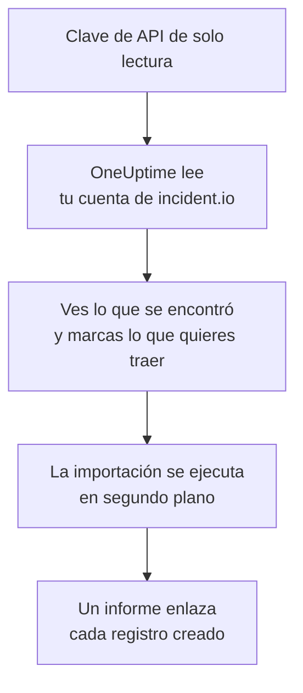

# Migrar desde incident.io

**Importar desde otra herramienta** trae tu configuración de incident.io a OneUptime en pocos minutos. Con una clave de API de incident.io de solo lectura, OneUptime lee tus usuarios, equipos, programaciones, rutas de escalado, servicios y ajustes de incidentes, te muestra lo que encontró y crea lo que marques. No se cambia nada en incident.io.

:::cards
- [Importa tu cuenta](#importa-tu-cuenta-de-incidentio): Crea una clave, lee tu cuenta y marca lo que quieres traer.
- [Qué se trae](#qué-se-trae): En qué se convierte cada registro de incident.io en OneUptime.
- [Completa el cambio](#completa-el-cambio): Qué hacer cuando termina la importación.
:::

## Cómo funciona

- **La clave se usa una sola vez.** Se guarda cifrada mientras OneUptime lee tu cuenta y se elimina en cuanto termina la lectura, haya funcionado o no. Nunca se vuelve a mostrar ni se escribe en un registro.
- **OneUptime solo lee.** Solo llama a la API de incident.io, `api.incident.io`. Cuando incident.io le pide que vaya más despacio, espera y vuelve a intentarlo.
- **No se crea nada hasta que inicias la importación.** La vista previa muestra, para cada elemento, si es nuevo, si ya está en OneUptime (y se usa tal cual), si lo trajo una importación anterior o por qué no se puede traer.
- **Volver a ejecutarla nunca crea nada dos veces.** OneUptime recuerda lo que trajo cada importación, por su ID de incident.io. Vuelve a ejecutarla después de añadir personas o programaciones en incident.io y solo se crearán las nuevas.

## Antes de empezar

- **Un proyecto de OneUptime y el derecho a crear lo que traes.** Los propietarios y administradores del proyecto pueden traerlo todo. Otros roles también pueden ejecutar una importación y traer los tipos de registros que pueden crear. Lo demás se muestra como no traído, con el motivo.
- **Una clave de API de incident.io que solo puede ver datos.** La importación nunca escribe en incident.io, así que la clave no necesita permiso para crear, editar ni gestionar nada.

## Importa tu cuenta de incident.io

:::steps
### Crea una clave de API en incident.io
En incident.io, ve a **Settings** > **API keys** y selecciona **Add new**. Llámala `OneUptime import`, dale solo permisos para ver datos, ninguno para crear, editar o gestionar, y copia la clave.

### Abre la página de importación
En OneUptime, ve a **Ajustes del proyecto** > **Importar desde otra herramienta** y selecciona **incident.io**.

### Conecta incident.io
Pega la clave en **Clave de API de incident.io** y selecciona **Leer mi cuenta de incident.io**. Una cuenta grande tarda unos minutos, y puedes salir de la página mientras se lee.

### Marca lo que quieres traer
La vista previa muestra lo que se encontró, con una sección por tipo. Todo lo que se crearía empieza marcado, salvo las personas que no están en ningún equipo, programación ni ruta de escalado. Debajo de cada elemento, OneUptime indica lo que no se traerá exactamente igual. Cuando un elemento marcado usa algo que dejaste sin marcar, lo indica, y **Marcarlos también** lo marca.

### Inicia la importación
Si se va a invitar a personas, elige en **Invitar a las personas nuevas a** el equipo al que se unen. Después selecciona **Iniciar la importación**. La importación se ejecuta en segundo plano: puedes salir de la página, y el informe te espera allí.
:::

El informe cuenta lo que se creó, se invitó y no se trajo, y muestra cada elemento con un enlace al registro en el que se convirtió, primero los fallos. Las importaciones anteriores aparecen en **Importaciones anteriores** en la misma página.

## Qué se trae

| En incident.io | En OneUptime | Cómo |
| --- | --- | --- |
| Usuarios | Miembros del proyecto | Se emparejan por dirección de correo. Quien aún no esté en el proyecto recibe una invitación al equipo que elijas. Los usuarios desactivados no se traen. |
| Equipos | Equipos | Se crean con sus miembros. Un equipo cuyo nombre ya tiene el proyecto se usa tal cual, y sus miembros no se tocan. |
| Programaciones | Programaciones de guardia | Cada rotación se convierte en una capa con las mismas personas, el mismo inicio, la misma duración de turno y el mismo horario laboral, en la zona horaria de la programación. Se trae la versión de la rotación vigente ahora. |
| Rutas de escalado | Políticas de guardia | Cada nivel se convierte en una regla de escalado que avisa a las mismas programaciones, usuarios y equipos, tras la misma espera. Una repetición pasa a ser las repeticiones de la política, y de una bifurcación se trae la primera ruta. |
| Servicios del catálogo | Servicios | Las entradas de tus tipos de catálogo de la categoría de servicio, creadas en el catálogo de servicios. Las entradas archivadas se omiten. |
| Gravedades | Gravedades de incidente | Se crean en su orden de incident.io, la más grave primero. Una gravedad cuyo nombre ya tiene el proyecto se usa tal cual. |
| Estados | Estados de incidente | Un estado de triaje equivale al estado en el que OneUptime empieza los incidentes, y un estado cerrado al estado en el que se resuelven. Los estados activos y en pausa se crean entre Reconocido y Resuelto. |
| Roles de incidente | Roles de incidente | El rol principal equivale al Comandante de incidente de OneUptime, y los demás roles se crean. OneUptime registra quién declaró cada incidente, así que el rol de informante no hace falta. |
| Campos personalizados | Campos personalizados de incidente | Los campos de selección única pasan a ser listas desplegables, los de selección múltiple listas desplegables de selección múltiple, los de texto y enlace texto, y los numéricos números, con sus opciones. |

Una rotación con varias personas de guardia a la vez se convierte en una programación de OneUptime por cada persona de guardia, porque una programación de OneUptime tiene una sola persona de guardia a la vez. Cada política de guardia que avisaba a la programación las avisa a todas.

## Qué no se trae

- **Los incidentes, las alertas y su historial.** OneUptime empieza con tu configuración, no con tus incidentes pasados.
- **Los workflows, páginas de estado, rutas de alertas e integraciones.** Dirige tus monitores y fuentes de alertas a OneUptime, como se describe en [Completa el cambio](#completa-el-cambio).
- **Los campos personalizados cuyas opciones vienen del catálogo,** y los estados para los que OneUptime no tiene equivalente: declined, merged, canceled y learning.
- **Las sustituciones de las programaciones y los cambios en una rotación programados para más adelante.** La vista previa nombra cada cambio programado, para que lo hagas en OneUptime cuando llegue el momento.
- **Los pasos de escalado sin equivalente exacto en OneUptime.** Un paso que publica en un canal de Slack o Microsoft Teams se omite, porque en OneUptime eso lo hacen las reglas de notificación del espacio de trabajo, igual que un paso que deriva a otra ruta de escalado. Un paso que avisa a quien está de guardia a continuación se trae como lo más parecido que tiene OneUptime, y la vista previa indica qué cambia.

## Límites

Una importación crea como máximo 2.000 registros: como máximo 500 personas, 200 equipos, 200 programaciones de guardia, 200 políticas de guardia, 500 servicios, 100 campos personalizados de incidente y 25 de cada uno de estos: gravedades, estados y roles de incidente. Lo que supera un límite se muestra como no traído. Vuelve a ejecutar la importación para traer el resto.

En OneUptime Cloud, los registros que tu plan no incluye se muestran como no traídos, con el plan que necesitan.

Una vista previa se guarda un día. Solo la persona que leyó la cuenta puede marcar elementos e iniciarla. Los propietarios y administradores del proyecto ven el progreso y el informe de cada importación.

## Completa el cambio

:::steps
### Revisa las programaciones de guardia
Abre cada programación en **Guardia** > **Programaciones de guardia** y comprueba quién está de guardia ahora y quién va después.

### Asegúrate de que se pueda avisar a todos
Las personas invitadas aceptan su invitación y luego añaden un número de teléfono, una dirección de correo o la aplicación móvil para recibir los avisos. **Guardia** > **Preparación** muestra a quién todavía no se puede localizar.

### Envía tus alertas a OneUptime
Dirige tus monitores y las herramientas que generan alertas a OneUptime, y avísate una vez para probarlo.

### Desactiva los avisos en incident.io
Cuando OneUptime avise a las personas correctas, desactiva las notificaciones en incident.io para que nadie reciba dos avisos.
:::

## Solución de problemas

:::details incident.io no aceptó la clave de API
Comprueba que copiaste la clave entera y que no se eliminó en **Settings** > **API keys**. Después selecciona **Volver a intentar**.
:::

:::details Falta un tipo de registro en la vista previa
La clave no pudo leerlo, y la vista previa lo indica arriba. Dale a la clave permiso para ver ese tipo de datos y vuelve a leer la cuenta.
:::

:::details Algunos elementos no se pueden marcar
Cada uno indica el motivo: un usuario desactivado, un nombre que el proyecto ya tiene, algo que trajo una importación anterior, o un registro que no tienes permiso para crear o que tu plan no incluye.
:::

## Próximos pasos

:::cards
- [Programaciones de guardia](/docs/on-call/schedules): Capas, restricciones y traspasos.
- [Estados y gravedades de incidente](/docs/incidents/states-and-severities): Los estados y gravedades por los que pasan los incidentes.
- [Migrar desde Opsgenie](/docs/moving-to-oneuptime/opsgenie): Trae un equipo desde Opsgenie.
:::
