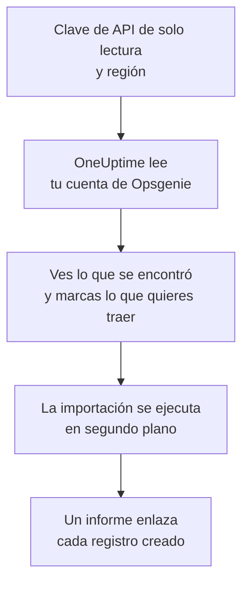

# Migrar desde Opsgenie

Atlassian va a retirar Opsgenie: dejó de venderlo en junio de 2025 y su soporte termina en abril de 2027. OneUptime es un nuevo hogar para tu equipo de guardia, e **Importar desde otra herramienta** lo trae en pocos minutos. Con una clave de API de Opsgenie de solo lectura, OneUptime lee tus usuarios, equipos, programaciones, escalados y servicios, te muestra lo que encontró y crea lo que marques. No se cambia nada en Opsgenie.

:::cards
- [Importa tu cuenta](#importa-tu-cuenta-de-opsgenie): Crea una clave, lee tu cuenta y marca lo que quieres traer.
- [Qué se trae](#qué-se-trae): En qué se convierte cada registro de Opsgenie en OneUptime.
- [Completa el cambio](#completa-el-cambio): Qué hacer cuando termina la importación.
:::

## Cómo funciona

- **La clave se usa una sola vez.** Se guarda cifrada mientras OneUptime lee tu cuenta y se elimina en cuanto termina la lectura, haya funcionado o no. Nunca se vuelve a mostrar ni se escribe en un registro.
- **OneUptime solo lee.** Solo llama a la API de Opsgenie: `api.opsgenie.com`, o `api.eu.opsgenie.com` para una cuenta en Europa. Cuando Opsgenie le pide que vaya más despacio, espera y vuelve a intentarlo.
- **No se crea nada hasta que inicias la importación.** La vista previa muestra, para cada elemento, si es nuevo, si ya está en OneUptime (y se usa tal cual), si lo trajo una importación anterior o por qué no se puede traer.
- **Volver a ejecutarla nunca crea nada dos veces.** OneUptime recuerda lo que trajo cada importación, por su ID de Opsgenie. Vuelve a ejecutarla después de añadir personas o programaciones en Opsgenie y solo se crearán las nuevas.

## Antes de empezar

- **Un proyecto de OneUptime y el derecho a crear lo que traes.** Los propietarios y administradores del proyecto pueden traerlo todo. Otros roles también pueden ejecutar una importación y traer los tipos de registros que pueden crear. Lo demás se muestra como no traído, con el motivo.
- **Una clave de API de Opsgenie con los permisos Read y Configuration access.** Configuration access es lo que permite a una clave leer usuarios, equipos, programaciones y escalados. La importación nunca escribe en Opsgenie.
- **Tu región de Opsgenie.** Si inicias sesión en `app.eu.opsgenie.com`, tu cuenta está en Europa. Si no, está en Estados Unidos.

## Importa tu cuenta de Opsgenie

:::steps
### Crea una clave de API en Opsgenie
En Opsgenie, ve a **Settings** > **API key management** y selecciona **Add new API key**. Llámala `OneUptime import`, dale solo **Read** y **Configuration access**, y copia la clave.

### Abre la página de importación
En OneUptime, ve a **Ajustes del proyecto** > **Importar desde otra herramienta** y selecciona **Opsgenie**.

### Conecta Opsgenie
En **¿Dónde está tu cuenta de Opsgenie?**, elige **Estados Unidos** o **Europa**. Pega la clave en **Clave de API de Opsgenie** y selecciona **Leer mi cuenta de Opsgenie**. Una cuenta grande tarda unos minutos, y puedes salir de la página mientras se lee.

### Marca lo que quieres traer
La vista previa muestra lo que se encontró, con una sección por tipo. Todo lo que se crearía empieza marcado, salvo las programaciones desactivadas en Opsgenie y las personas que no están en ningún equipo, programación ni escalado. Debajo de cada elemento, OneUptime indica lo que no se traerá exactamente igual. Cuando un elemento marcado usa algo que dejaste sin marcar, lo indica, y **Marcarlos también** lo marca.

### Inicia la importación
Si se va a invitar a personas, elige en **Invitar a las personas nuevas a** el equipo al que se unen. Después selecciona **Iniciar la importación**. La importación se ejecuta en segundo plano: puedes salir de la página, y el informe te espera allí.
:::

El informe cuenta lo que se creó, se invitó y no se trajo, y muestra cada elemento con un enlace al registro en el que se convirtió, primero los fallos. Las importaciones anteriores aparecen en **Importaciones anteriores** en la misma página.

## Qué se trae

| En Opsgenie | En OneUptime | Cómo |
| --- | --- | --- |
| Usuarios | Miembros del proyecto | Se emparejan por dirección de correo. Quien aún no esté en el proyecto recibe una invitación al equipo que elijas. Los usuarios bloqueados no se traen. |
| Equipos | Equipos | Se crean con sus miembros. Un equipo cuyo nombre ya tiene el proyecto se usa tal cual, y sus miembros no se tocan. |
| Programaciones | Programaciones de guardia | Cada rotación se convierte en una capa con las mismas personas, el mismo inicio, la misma duración de turno y la misma restricción horaria, en la zona horaria de la programación, propiedad del equipo de la programación. |
| Escalados | Políticas de guardia | Cada regla se convierte en una regla de escalado que avisa a la misma programación, usuario o equipo. Las reglas con el mismo retraso avisan juntas, y la espera antes de la siguiente regla de escalado es la diferencia entre los retrasos. Las repeticiones del escalado pasan a ser las repeticiones de la política. |
| Servicios | Servicios | Se crean en el catálogo de servicios, propiedad de su equipo. |

Una programación cuyas rotaciones ponen a dos personas de guardia a la vez se convierte en una programación de OneUptime por rotación, porque una programación de OneUptime tiene una sola persona de guardia a la vez. Cada política de guardia que avisaba a la programación las avisa a todas.

## Qué no se trae

- **Las alertas, los incidentes y su historial.** OneUptime empieza con tu configuración, no con tus alertas pasadas.
- **Las integraciones, heartbeats, políticas de alerta y reglas de enrutamiento.** Dirige tus monitores y fuentes de alertas a OneUptime, como se describe en [Completa el cambio](#completa-el-cambio).
- **Las sustituciones de las programaciones y las rotaciones que ya terminaron.** Añade en OneUptime, después de la importación, las sustituciones que todavía necesites.
- **Las reglas de notificación de cada persona.** Cada persona elige cómo recibir los avisos en sus propios **Ajustes de usuario** cuando acepta la invitación.
- **Los pasos que no tienen un equivalente exacto en OneUptime.** Una regla que avisa a quien está de guardia a continuación, o a los administradores de un equipo, se trae como lo más parecido que tiene OneUptime, y la vista previa indica qué cambia.

## Límites

Una importación crea como máximo 2.000 registros: como máximo 500 personas, 200 equipos, 200 programaciones de guardia, 200 políticas de guardia y 500 servicios. Lo que supera un límite se muestra como no traído. Vuelve a ejecutar la importación para traer el resto.

En OneUptime Cloud, los registros que tu plan no incluye se muestran como no traídos, con el plan que necesitan.

Una vista previa se guarda un día. Solo la persona que leyó la cuenta puede marcar elementos e iniciarla. Los propietarios y administradores del proyecto ven el progreso y el informe de cada importación.

## Completa el cambio

:::steps
### Revisa las programaciones de guardia
Abre cada programación en **Guardia** > **Programaciones de guardia** y comprueba quién está de guardia ahora y quién va después.

### Asegúrate de que se pueda avisar a todos
Las personas invitadas aceptan su invitación y luego añaden un número de teléfono, una dirección de correo o la aplicación móvil para recibir los avisos. **Guardia** > **Preparación** muestra a quién todavía no se puede localizar.

### Envía tus alertas a OneUptime
Dirige tus monitores y las herramientas que generan alertas a OneUptime, y avísate una vez para probarlo.

### Desactiva los avisos en Opsgenie
Cuando OneUptime avise a las personas correctas, desactiva las notificaciones en Opsgenie para que nadie reciba dos avisos.
:::

## Solución de problemas

:::details Opsgenie no aceptó la clave de API
Comprueba que copiaste la clave entera, que es una clave de **API key management** y no la clave de una integración, que tiene **Read** y **Configuration access**, y que elegiste la región de tu cuenta. Después selecciona **Volver a intentar**.
:::

:::details Falta un tipo de registro en la vista previa
La clave no pudo leerlo, y la vista previa lo indica arriba. Dale **Configuration access** a la clave y vuelve a leer la cuenta.
:::

:::details Algunos elementos no se pueden marcar
Cada uno indica el motivo: un usuario bloqueado, un nombre que el proyecto ya tiene, algo que trajo una importación anterior, o un registro que no tienes permiso para crear o que tu plan no incluye.
:::

## Próximos pasos

:::cards
- [Programaciones de guardia](/docs/on-call/schedules): Capas, restricciones y traspasos.
- [Reglas de escalado](/docs/on-call/escalation-rules): Cómo avisan las políticas de guardia a las personas.
- [Migrar desde incident.io](/docs/moving-to-oneuptime/incident-io): Trae un equipo desde incident.io.
:::
