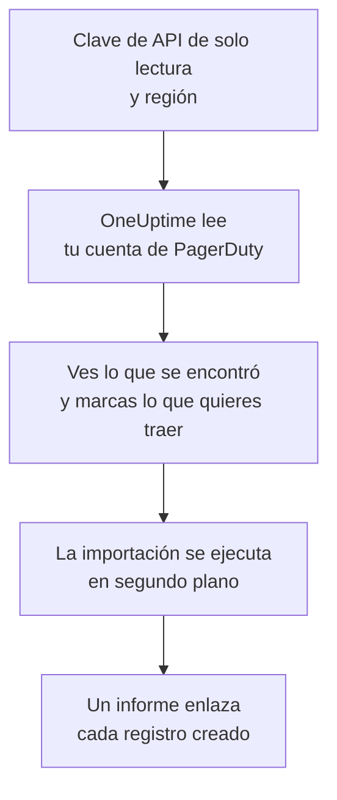

# Migrar desde PagerDuty

**Importar desde otra herramienta** trae tu configuración de PagerDuty a OneUptime en pocos minutos. Con una clave de API de PagerDuty de solo lectura, OneUptime lee tus usuarios, equipos, programaciones, políticas de escalado y servicios, te muestra lo que encontró y crea lo que marques. No se cambia nada en PagerDuty.

:::cards
- [Importa tu cuenta](#importa-tu-cuenta-de-pagerduty): Crea una clave, lee tu cuenta y marca lo que quieres traer.
- [Qué se trae](#qué-se-trae): En qué se convierte cada registro de PagerDuty en OneUptime.
- [Completa el cambio](#completa-el-cambio): Qué hacer cuando termina la importación.
:::

## Cómo funciona

- **La clave se usa una sola vez.** Se guarda cifrada mientras OneUptime lee tu cuenta y se elimina en cuanto termina la lectura, haya funcionado o no. Nunca se vuelve a mostrar ni se escribe en un registro.
- **OneUptime solo lee.** Solo llama a la API REST de PagerDuty: `api.pagerduty.com`, o `api.eu.pagerduty.com` para una cuenta en Europa. Cuando PagerDuty le pide que vaya más despacio, espera y vuelve a intentarlo.
- **No se crea nada hasta que inicias la importación.** La vista previa muestra, para cada elemento, si es nuevo, si ya está en OneUptime (y se usa tal cual), si lo trajo una importación anterior o por qué no se puede traer.
- **Volver a ejecutarla nunca crea nada dos veces.** OneUptime recuerda lo que trajo cada importación, por su ID de PagerDuty. Vuelve a ejecutarla después de añadir personas o programaciones en PagerDuty y solo se crearán las nuevas.

## Antes de empezar

- **Un proyecto de OneUptime y el derecho a crear lo que traes.** Los propietarios y administradores del proyecto pueden traerlo todo. Otros roles también pueden ejecutar una importación y traer los tipos de registros que pueden crear. Lo demás se muestra como no traído, con el motivo.
- **Una clave de API REST de PagerDuty de solo lectura.** Los administradores y propietarios de la cuenta de PagerDuty pueden crearla. La importación nunca escribe en PagerDuty, así que a la clave le basta con acceso de lectura.
- **Tu región de PagerDuty.** Si inicias sesión en una dirección que termina en `eu.pagerduty.com`, tu cuenta está en Europa. Si no, está en Estados Unidos.

## Importa tu cuenta de PagerDuty

:::steps
### Crea una clave de API en PagerDuty
En PagerDuty, ve a **Integrations** > **Developer Tools** > **API Access Keys** y selecciona **Create New API Key**. Descríbela como `OneUptime import`, marca **Read-only API Key**, selecciona **Create Key** y copia la clave.

### Abre la página de importación
En OneUptime, ve a **Ajustes del proyecto** > **Importar desde otra herramienta** y selecciona **PagerDuty**.

### Conecta PagerDuty
En **¿Dónde está tu cuenta de PagerDuty?**, elige **Estados Unidos** o **Europa**. Pega la clave en **Clave de API de PagerDuty** y selecciona **Leer mi cuenta de PagerDuty**. Una cuenta grande tarda unos minutos, y puedes salir de la página mientras se lee.

### Marca lo que quieres traer
La vista previa muestra lo que se encontró, con una sección por tipo. Todo lo que se crearía empieza marcado, salvo los servicios desactivados en PagerDuty y las personas que no están en ningún equipo, programación ni política de escalado. Debajo de cada elemento, OneUptime indica lo que no se traerá exactamente igual. Cuando un elemento marcado usa algo que dejaste sin marcar, lo indica, y **Marcarlos también** lo marca.

### Inicia la importación
Si se va a invitar a personas, elige en **Invitar a las personas nuevas a** el equipo al que se unen. Después selecciona **Iniciar la importación**. La importación se ejecuta en segundo plano: puedes salir de la página, y el informe te espera allí.
:::

El informe cuenta lo que se creó, se invitó y no se trajo, y muestra cada elemento con un enlace al registro en el que se convirtió, primero los fallos. Las importaciones anteriores aparecen en **Importaciones anteriores** en la misma página.

## Qué se trae

| En PagerDuty | En OneUptime | Cómo |
| --- | --- | --- |
| Usuarios | Miembros del proyecto | Se emparejan por dirección de correo. Quien aún no esté en el proyecto recibe una invitación al equipo que elijas. |
| Equipos | Equipos | Se crean con sus miembros. Un equipo cuyo nombre ya tiene el proyecto se usa tal cual, y sus miembros no se tocan. |
| Programaciones | Programaciones de guardia | Cada capa se convierte en una capa con las mismas personas, el mismo inicio, la misma duración de turno y las mismas restricciones, en la zona horaria de la programación, propiedad del equipo de la programación. Las capas mantienen su orden, así que una capa superior sigue teniendo prioridad sobre las de debajo. |
| Políticas de escalado | Políticas de guardia | Cada regla de escalado se convierte en una regla de escalado que avisa a las mismas programaciones y usuarios, y escala tras el mismo retraso. Las repeticiones de la política pasan a ser las repeticiones de la política de guardia. |
| Servicios | Servicios | Se crean en el catálogo de servicios, propiedad de su equipo. Un servicio desactivado en PagerDuty empieza sin marcar. |

Una programación de PagerDuty sigue siendo una sola programación de OneUptime: sus capas tienen prioridad unas sobre otras igual que en PagerDuty. Una capa cuyos turnos no duran un número entero de horas se trae con los turnos redondeados a la hora, y la vista previa lo indica.

## Qué no se trae

- **Los incidentes, las alertas y su historial.** OneUptime empieza con tu configuración, no con tus incidentes pasados.
- **Las integraciones, Event Orchestrations, Incident Workflows y páginas de estado.** Dirige tus monitores y fuentes de alertas a OneUptime, como se describe en [Completa el cambio](#completa-el-cambio).
- **Las sustituciones de las programaciones y las capas que ya terminaron.** Añade en OneUptime, después de la importación, las sustituciones que todavía necesites.
- **Las programaciones basadas en turnos.** La importación lee las programaciones por capas de PagerDuty, no sus programaciones más recientes basadas en turnos (shift-based schedules). Si tu cuenta tiene alguna, la vista previa lo indica arriba, y una regla de escalado que avisa a una de ellas se trae sin ella. Créalas en OneUptime.
- **Las reglas de notificación de cada persona.** Cada persona elige cómo recibir los avisos en sus propios **Ajustes de usuario** cuando acepta la invitación.
- **Las reglas que no tienen un equivalente exacto en OneUptime.** Una regla de escalado que asigna a sus personas por turnos (round robin) avisa a todas a la vez en OneUptime, y la vista previa indica qué cambia.

## Límites

Una importación crea como máximo 2.000 registros: como máximo 500 personas, 200 equipos, 200 programaciones de guardia, 200 políticas de guardia y 500 servicios. Lo que supera un límite se muestra como no traído. Vuelve a ejecutar la importación para traer el resto.

En OneUptime Cloud, los registros que tu plan no incluye se muestran como no traídos, con el plan que necesitan.

Una vista previa se guarda un día. Solo la persona que leyó la cuenta puede marcar elementos e iniciarla. Los propietarios y administradores del proyecto ven el progreso y el informe de cada importación.

## Completa el cambio

:::steps
### Revisa las programaciones de guardia
Abre cada programación en **Guardia** > **Programaciones de guardia** y comprueba quién está de guardia ahora y quién va después.

### Asegúrate de que se pueda avisar a todos
Las personas invitadas aceptan su invitación y luego añaden un número de teléfono, una dirección de correo o la aplicación móvil para recibir los avisos. **Guardia** > **Preparación** muestra a quién todavía no se puede localizar.

### Envía tus alertas a OneUptime
Dirige tus monitores y las herramientas que generan alertas a OneUptime, y avísate una vez para probarlo.

### Desactiva los avisos en PagerDuty
Cuando OneUptime avise a las personas correctas, desactiva las notificaciones en PagerDuty para que nadie reciba dos avisos.
:::

## Solución de problemas

:::details PagerDuty no aceptó la clave de API
Comprueba que copiaste la clave entera, que es una clave de API REST de **API Access Keys** y no una clave de integración, y que elegiste la región de tu cuenta. Después selecciona **Volver a intentar**.
:::

:::details Falta un tipo de registro en la vista previa
La clave no pudo leerlo, y la vista previa lo indica arriba. Algunos tipos solo existen en los planes de PagerDuty que los incluyen, por ejemplo los equipos. Vuelve a leer la cuenta con una clave que pueda leerlos.
:::

:::details Algunos elementos no se pueden marcar
Cada uno indica el motivo: un nombre que el proyecto ya tiene, algo que trajo una importación anterior, o un registro que no tienes permiso para crear o que tu plan no incluye.
:::

## Próximos pasos

:::cards
- [Programaciones de guardia](/docs/on-call/schedules): Capas, restricciones y traspasos.
- [Reglas de escalado](/docs/on-call/escalation-rules): Cómo avisan las políticas de guardia a las personas.
- [Migrar desde Opsgenie](/docs/moving-to-oneuptime/opsgenie): Trae un equipo desde Opsgenie.
:::
