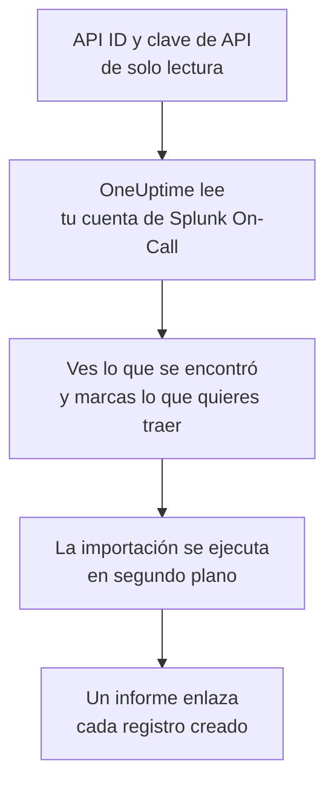

# Migrar desde Splunk On-Call

**Importar desde otra herramienta** trae tu configuración de Splunk On-Call (antes VictorOps) a OneUptime en pocos minutos. Con tu API ID y una clave de API de solo lectura, OneUptime lee tus usuarios, equipos, rotaciones y políticas de escalado, te muestra lo que encontró y crea lo que marques. No se cambia nada en Splunk On-Call.

:::cards
- [Importa tu cuenta](#importa-tu-cuenta-de-splunk-on-call): Crea una clave, lee tu cuenta y marca lo que quieres traer.
- [Qué se trae](#qué-se-trae): En qué se convierte cada registro de Splunk On-Call en OneUptime.
- [Completa el cambio](#completa-el-cambio): Qué hacer cuando termina la importación.
:::

## Cómo funciona

- **La clave se usa una sola vez.** Se guarda cifrada, junto con el API ID, mientras OneUptime lee tu cuenta y se elimina en cuanto termina la lectura, haya funcionado o no. Nunca se vuelve a mostrar ni se escribe en un registro.
- **OneUptime solo lee.** Solo llama a la API de Splunk On-Call, `api.victorops.com`. Splunk On-Call responde a cada tipo de solicitud como máximo dos veces por segundo, así que OneUptime mantiene ese ritmo, y cuando Splunk On-Call le pide que vaya más despacio, espera y vuelve a intentarlo.
- **No se crea nada hasta que inicias la importación.** La vista previa muestra, para cada elemento, si es nuevo, si ya está en OneUptime (y se usa tal cual), si lo trajo una importación anterior o por qué no se puede traer.
- **Volver a ejecutarla nunca crea nada dos veces.** OneUptime recuerda lo que trajo cada importación, por su ID de Splunk On-Call. Vuelve a ejecutarla después de añadir personas o rotaciones en Splunk On-Call y solo se crearán las nuevas.

## Antes de empezar

- **Un proyecto de OneUptime y el derecho a crear lo que traes.** Los propietarios y administradores del proyecto pueden traerlo todo. Otros roles también pueden ejecutar una importación y traer los tipos de registros que pueden crear. Lo demás se muestra como no traído, con el motivo.
- **Tu API ID de Splunk On-Call y una clave de API de solo lectura.** Ambos están en **Integrations** > **API** en Splunk On-Call. La importación nunca escribe en Splunk On-Call, así que basta con una clave de solo lectura.

## Importa tu cuenta de Splunk On-Call

:::steps
### Crea una clave de API en Splunk On-Call
En Splunk On-Call, ve a **Integrations** > **API**. Tu API ID aparece encima de tus claves de API. Crea una clave de API nueva llamada `OneUptime import`, marca **Read-only** y copia el API ID y la clave.

### Abre la página de importación
En OneUptime, ve a **Ajustes del proyecto** > **Importar desde otra herramienta** y selecciona **Splunk On-Call**.

### Conecta Splunk On-Call
Pega el API ID en **API ID de Splunk On-Call** y la clave en **Clave de API de Splunk On-Call**, y selecciona **Leer mi cuenta de Splunk On-Call**. Una cuenta grande tarda unos minutos, y puedes salir de la página mientras se lee.

### Marca lo que quieres traer
La vista previa muestra lo que se encontró, con una sección por tipo. Todo lo que se crearía empieza marcado, salvo las personas que no están en ningún equipo, rotación ni política de escalado. Debajo de cada elemento, OneUptime indica lo que no se traerá exactamente igual. Cuando un elemento marcado usa algo que dejaste sin marcar, lo indica, y **Marcarlos también** lo marca.

### Inicia la importación
Si se va a invitar a personas, elige en **Invitar a las personas nuevas a** el equipo al que se unen. Después selecciona **Iniciar la importación**. La importación se ejecuta en segundo plano: puedes salir de la página, y el informe te espera allí.
:::

El informe cuenta lo que se creó, se invitó y no se trajo, y muestra cada elemento con un enlace al registro en el que se convirtió, primero los fallos. Las importaciones anteriores aparecen en **Importaciones anteriores** en la misma página.

## Qué se trae

| En Splunk On-Call | En OneUptime | Cómo |
| --- | --- | --- |
| Usuarios | Miembros del proyecto | Se emparejan por dirección de correo. Quien aún no esté en el proyecto recibe una invitación al equipo que elijas. |
| Equipos | Equipos | Se crean con sus miembros. Un equipo cuyo nombre ya tiene el proyecto se usa tal cual, y sus miembros no se tocan. |
| Rotaciones | Programaciones de guardia | Cada rotación se convierte en una programación propiedad de su equipo, y cada uno de sus turnos en una capa con las mismas personas, el mismo inicio, el mismo traspaso y los mismos días y horas de guardia. Quien está de guardia ahora en Splunk On-Call lo está también en OneUptime. |
| Políticas de escalado | Políticas de guardia | Propiedad del equipo de la política. Cada paso se convierte en una regla de escalado que avisa a las mismas rotaciones y usuarios. El tiempo de espera de un paso se convierte en la espera anterior a él, y los pasos sin espera entre ellos avisan juntos. |

Los turnos de una rotación que están de guardia a la vez se convierten cada uno en una programación de OneUptime, porque una programación de OneUptime tiene una sola persona de guardia a la vez. Cada política de guardia que avisaba a la rotación las avisa a todas. La programación conserva la zona horaria del primer turno de la rotación, y un turno definido en otra zona horaria tiene sus horas convertidas a ella.

## Qué no se trae

- **Los incidentes, las alertas y su historial.** OneUptime empieza con tu configuración, no con tus incidentes pasados.
- **Las integraciones, routing keys y reglas de alerta.** Dirige tus monitores y fuentes de alertas a OneUptime, como se describe en [Completa el cambio](#completa-el-cambio).
- **Las sustituciones programadas.** Añade en OneUptime, después de la importación, las sustituciones que todavía necesites.
- **La política de avisos de cada persona.** Cada persona elige cómo recibir los avisos en sus propios **Ajustes de usuario** cuando acepta la invitación.
- **Los pasos que no tienen un equivalente exacto en OneUptime.** Un paso que llama a un webhook o deriva a otra política de escalado se deja fuera, igual que un paso que envía un correo a una dirección que no es de ninguna de las personas que se traen. Un paso que avisa a quien está de guardia a continuación, o a quien lo estuvo antes, avisa a quien está de guardia ahora, y la vista previa indica qué cambia.

## Límites

Una importación crea como máximo 2.000 registros: como máximo 500 personas, 200 equipos, 200 programaciones de guardia y 200 políticas de guardia. Lo que supera un límite se muestra como no traído. Vuelve a ejecutar la importación para traer el resto.

En OneUptime Cloud, los registros que tu plan no incluye se muestran como no traídos, con el plan que necesitan.

Una vista previa se guarda un día. Solo la persona que leyó la cuenta puede marcar elementos e iniciarla. Los propietarios y administradores del proyecto ven el progreso y el informe de cada importación.

## Completa el cambio

:::steps
### Revisa las programaciones de guardia
Abre cada programación en **Guardia** > **Programaciones de guardia** y comprueba quién está de guardia ahora y quién va después.

### Asegúrate de que se pueda avisar a todos
Las personas invitadas aceptan su invitación y luego añaden un número de teléfono, una dirección de correo o la aplicación móvil para recibir los avisos. **Guardia** > **Preparación** muestra a quién todavía no se puede localizar.

### Envía tus alertas a OneUptime
Dirige tus monitores y las herramientas que generan alertas a OneUptime, y avísate una vez para probarlo.

### Desactiva los avisos en Splunk On-Call
Cuando OneUptime avise a las personas correctas, desactiva las notificaciones en Splunk On-Call para que nadie reciba dos avisos.
:::

## Solución de problemas

:::details Splunk On-Call no aceptó el API ID y la clave de API
Comprueba que copiaste el API ID y la clave entera desde **Integrations** > **API**, y que la clave no se ha eliminado allí. Después selecciona **Volver a intentar**.
:::

:::details Falta un tipo de registro en la vista previa
La clave no pudo leerlo, y la vista previa lo indica arriba. Revisa la clave en **Integrations** > **API** y vuelve a leer la cuenta.
:::

:::details Algunos elementos no se pueden marcar
Cada uno indica el motivo: un nombre que el proyecto ya tiene, algo que trajo una importación anterior, o un registro que no tienes permiso para crear o que tu plan no incluye.
:::

## Próximos pasos

:::cards
- [Programaciones de guardia](/docs/on-call/schedules): Capas, restricciones y traspasos.
- [Reglas de escalado](/docs/on-call/escalation-rules): Cómo avisan las políticas de guardia a las personas.
- [Migrar desde PagerDuty](/docs/moving-to-oneuptime/pagerduty): Trae un equipo desde PagerDuty.
:::
