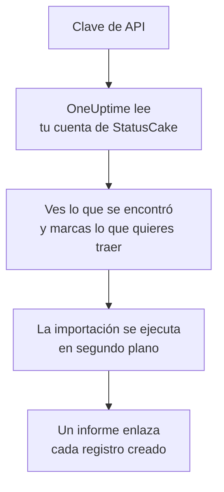

# Migrar desde StatusCake

**Importar desde otra herramienta** trae tus comprobaciones de StatusCake a OneUptime en pocos minutos. Con una clave de API de StatusCake, OneUptime lee tus comprobaciones de disponibilidad, SSL y latido, te muestra lo que encontró y crea lo que marques. No se cambia nada en StatusCake.

:::cards
- [Importa tu cuenta](#importa-tu-cuenta-de-statuscake): Crea una clave, lee tu cuenta y marca lo que quieres traer.
- [Qué se trae](#qué-se-trae): En qué monitor de OneUptime se convierte cada comprobación de StatusCake.
- [Completa el cambio](#completa-el-cambio): Qué hacer cuando termina la importación.
:::

## Cómo funciona

- **La clave se usa una sola vez.** Se guarda cifrada mientras OneUptime lee tu cuenta y se elimina en cuanto termina la lectura, haya funcionado o no. Nunca se vuelve a mostrar ni se escribe en un registro.
- **OneUptime solo lee.** Solo llama a la API de StatusCake: `api.statuscake.com`. Hace una solicitud por segundo, lo que respeta las 60 por minuto que StatusCake permite a una cuenta Free. Cuando StatusCake le pide que vaya más despacio, espera y vuelve a intentarlo.
- **No se crea nada hasta que inicias la importación.** La vista previa muestra, para cada elemento, si es nuevo, si ya está en OneUptime (y se usa tal cual), si lo trajo una importación anterior o por qué no se puede traer.
- **Volver a ejecutarla nunca crea nada dos veces.** OneUptime recuerda lo que trajo cada importación, por su ID de StatusCake. Vuelve a ejecutarla después de añadir comprobaciones en StatusCake y solo se crearán los nuevos.

## Antes de empezar

- **Un proyecto de OneUptime y el derecho a crear lo que traes.** Los propietarios y administradores del proyecto pueden traerlo todo. Otros roles también pueden ejecutar una importación y traer los tipos de registros que pueden crear. Lo demás se muestra como no traído, con el motivo.
- **Una clave de API de StatusCake.** La importación nunca escribe en StatusCake.
- **Un método de pago, en OneUptime Cloud.** Los monitores que hacen comprobaciones se cobran según su uso, incluso en el plan Free, así que añade uno en **Ajustes del proyecto** > **Facturación** antes de importar. Sin él, esos monitores se muestran como no traídos.

## Importa tu cuenta de StatusCake

:::steps
### Crea una clave de API en StatusCake
En StatusCake, abre el panel de tu cuenta y ve a **API Keys**. Crea una clave llamada `OneUptime import` y cópiala.

### Abre la página de importación
En OneUptime, ve a **Ajustes del proyecto** > **Importar desde otra herramienta** y selecciona **StatusCake**.

### Conecta StatusCake
Pega la clave en **Clave de API de StatusCake** y selecciona **Leer mi cuenta de StatusCake**. Una cuenta grande tarda unos minutos, y puedes salir de la página mientras se lee.

### Marca lo que quieres traer
La vista previa muestra lo que se encontró, con una sección por tipo. Todo lo que se crearía empieza marcado, salvo las comprobaciones en pausa en StatusCake, que se traen en pausa si las marcas. Debajo de cada elemento, OneUptime indica lo que no se traerá exactamente igual.

### Inicia la importación
Selecciona **Iniciar la importación**. La importación se ejecuta en segundo plano: puedes salir de la página, y el informe te espera allí.
:::

El informe cuenta lo que se creó y no se trajo, y muestra cada elemento con un enlace al registro en el que se convirtió, primero los fallos. Las importaciones anteriores aparecen en **Importaciones anteriores** en la misma página.

## Qué se trae

| En StatusCake | En OneUptime | Cómo |
| --- | --- | --- |
| Uptime, SSL and heartbeat checks | Monitores | Cada comprobación se convierte en un monitor del mismo tipo, con la misma dirección, intervalo, tiempo de espera y el texto que una página debe, o no debe, contener. |

- **Las comprobaciones HTTP y HEAD** se convierten en monitores de sitio web, o en monitores de API cuando envían datos o encabezados. StatusCake indica los códigos de estado que generan una alerta: cualquier otro código cuenta como disponible también en OneUptime.
- **Las comprobaciones de ping y TCP** se convierten en monitores de ping y de puerto. **Las comprobaciones SMTP y SSH** se convierten en monitores de puerto en su puerto: OneUptime comprueba que el puerto responde, no la conversación en él.
- **Las comprobaciones DNS** se convierten en monitores DNS que preguntan al mismo servidor.
- **Las comprobaciones SSL** se convierten en monitores de certificado SSL que avisan con la misma antelación que la primera alerta. Una comprobación de disponibilidad con alertas SSL también recibe uno.
- **Las comprobaciones de latido** se convierten en monitores de solicitudes entrantes, que caen cuando no llega ninguna solicitud durante el periodo. Cada uno tiene una dirección nueva en OneUptime.

Cada monitor se comprueba desde las sondas de tu proyecto, como uno que creas tú. Un intervalo que OneUptime no ofrece se convierte en el más cercano que ofrece, y un tiempo de espera de más de un minuto, en un minuto. La vista previa indica cuándo cambia alguno de los dos.

## Qué no se trae

- **El historial de disponibilidad, los tiempos de respuesta y los incidentes.** OneUptime empieza a comprobar cuando termina la importación.
- **Los contactos de alerta y las integraciones.** Elige a quién se avisa en OneUptime, como se describe en [Completa el cambio](#completa-el-cambio).
- **Las contraseñas y los encabezados que pueden contener un secreto.** Un monitor que inicia sesión, o que envía un encabezado `Authorization`, de cookie o de token, se trae sin él: añádelo con un [secreto de monitor](/docs/monitor/monitor-secrets).
- **Las direcciones que espera una comprobación DNS.** Añádelas como criterios en OneUptime.
- **Las comprobaciones de velocidad de página, de dominio y de servidor.** OneUptime tiene su propio [monitor de dominio](/docs/monitor/domain-monitor) y su monitorización de servidores, que puedes configurar en su lugar.
- **Las ventanas de mantenimiento.** La vista previa las cuenta: prográmalas como mantenimiento programado en OneUptime.

## Límites

Una importación crea como máximo 2.000 registros, y como máximo 1.000 monitores. Lo que supera un límite se muestra como no traído. Vuelve a ejecutar la importación para traer el resto.

En OneUptime Cloud, los monitores que hacen comprobaciones necesitan un método de pago, y lo que no cabe en tu plan se muestra como no traído, con lo que necesita.

Una vista previa se guarda un día. Solo la persona que leyó la cuenta puede marcar elementos e iniciarla. Los propietarios y administradores del proyecto ven el progreso y el informe de cada importación.

## Completa el cambio

:::steps
### Revisa tus monitores
Abre cada uno en **Monitores** y revisa sus primeros resultados. Un monitor de latido tiene una dirección nueva: apunta a ella la tarea que lo llama.

### Elige a quién se avisa
Añade propietarios a tus monitores, o una política de guardia en **Guardia** > **Políticas de guardia** a los incidentes que abren, para que las personas adecuadas se enteren cuando algo falle.

### Desactiva las comprobaciones en StatusCake
Cuando OneUptime compruebe lo mismo, pausa las comprobaciones en StatusCake para que nadie reciba dos avisos.
:::

## Solución de problemas

:::details StatusCake no aceptó la clave de API
Comprueba que copiaste la clave completa de **API Keys** y que no se ha eliminado. Después selecciona **Volver a intentar**.
:::

:::details Un monitor se muestra como no traído
Indica el motivo: un tipo de monitor que OneUptime no tiene, una dirección que OneUptime no puede leer, o un proyecto sin espacio o sin método de pago para él. Un monitor que OneUptime ya ejecuta, con el mismo nombre, tipo y dirección, se usa tal cual.
:::

:::details Algunos elementos no se pueden marcar
Cada uno indica el motivo: un nombre que el proyecto ya tiene, algo que trajo una importación anterior, o un registro que no tienes permiso para crear o que tu plan no incluye.
:::

## Próximos pasos

:::cards
- [Monitor de sitio web](/docs/monitor/website-monitor): Qué comprueba un monitor de sitio web y cómo.
- [Monitor de certificado SSL](/docs/monitor/ssl-certificate-monitor): Cómo avisa OneUptime antes de que caduque un certificado.
- [Migrar desde Uptime Kuma](/docs/moving-to-oneuptime/uptime-kuma): Trae tus comprobaciones desde Uptime Kuma.
:::
