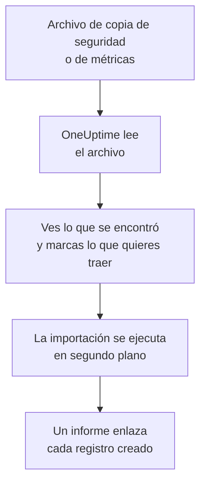

# Migrar desde Uptime Kuma

Uptime Kuma se ejecuta en tus propias máquinas, así que **Importar desde otra herramienta** lo lee desde un archivo en lugar de con una clave: la copia de seguridad que exporta Uptime Kuma 1, o la página de métricas que ofrece cualquier versión. OneUptime lee tus monitores de ese archivo, te muestra lo que encontró y crea lo que marques. No se cambia nada en Uptime Kuma.

:::cards
- [Importa tus monitores](#importa-tus-monitores-de-uptime-kuma): Guarda el archivo, léelo y marca lo que quieres traer.
- [Qué se trae](#qué-se-trae): En qué se convierte en OneUptime cada monitor de Uptime Kuma.
- [Completa el cambio](#completa-el-cambio): Qué hacer cuando termina la importación.
:::

## Cómo funciona

- **El archivo se lee una sola vez.** OneUptime lo lee mientras se sube, para encontrar tus monitores, y nunca lo guarda. Las contraseñas, tokens y claves push que contiene nunca se copian.
- **OneUptime nunca se conecta a Uptime Kuma.** Todo sale del archivo. Un archivo que no es una copia de seguridad ni una página de métricas de Uptime Kuma se rechaza, con el motivo.
- **No se crea nada hasta que inicias la importación.** La vista previa muestra, para cada elemento, si es nuevo, si ya está en OneUptime (y se usa tal cual), si lo trajo una importación anterior o por qué no se puede traer.
- **Volver a ejecutarla nunca crea nada dos veces.** OneUptime recuerda lo que trajo cada importación, por su ID de Uptime Kuma. Lee un archivo más reciente después de añadir monitores y solo se crearán los nuevos.

## Antes de empezar

- **Un proyecto de OneUptime y el derecho a crear lo que traes.** Los propietarios y administradores del proyecto pueden traerlo todo. Otros roles también pueden ejecutar una importación y traer los tipos de registros que pueden crear. Lo demás se muestra como no traído, con el motivo.
- **Un archivo de Uptime Kuma.** En Uptime Kuma 1, la copia de seguridad JSON contiene cada monitor con sus ajustes. Uptime Kuma 2 no tiene copia de seguridad, así que guarda su página de métricas: indica el nombre, el tipo y la dirección de cada monitor, pero no cada cuánto se comprueba ni qué busca.
- **Un método de pago, en OneUptime Cloud.** Los monitores que hacen comprobaciones se cobran según su uso, incluso en el plan Free, así que añade uno en **Ajustes del proyecto** > **Facturación** antes de importar. Sin él, esos monitores se muestran como no traídos.

## Importa tus monitores de Uptime Kuma

:::steps
### Guarda el archivo en Uptime Kuma
En Uptime Kuma 1, ve a **Settings** > **Backup** y selecciona **Export**. En Uptime Kuma 2, añade una clave en **Settings** > **API Keys**, abre `/metrics` en tu Uptime Kuma, inicia sesión sin nombre de usuario y con la clave como contraseña, y guarda la página como archivo de texto.

### Abre la página de importación
En OneUptime, ve a **Ajustes del proyecto** > **Importar desde otra herramienta** y selecciona **Uptime Kuma**.

### Lee el archivo
En **Archivo de copia de seguridad o de métricas de Uptime Kuma**, selecciona **Elegir archivo**, elige el archivo que guardaste y selecciona **Leer el archivo**. OneUptime lo lee al instante y muestra lo que encontró.

### Marca lo que quieres traer
La vista previa muestra lo que se encontró, con una sección por tipo. Todo lo que se crearía empieza marcado, salvo los monitores en pausa en Uptime Kuma, que se traen en pausa si los marcas. Debajo de cada elemento, OneUptime indica lo que no se traerá exactamente igual.

### Inicia la importación
Selecciona **Iniciar la importación**. La importación se ejecuta en segundo plano: puedes salir de la página, y el informe te espera allí.
:::

El informe cuenta lo que se creó y no se trajo, y muestra cada elemento con un enlace al registro en el que se convirtió, primero los fallos. Las importaciones anteriores aparecen en **Importaciones anteriores** en la misma página.

## Qué se trae

| En Uptime Kuma | En OneUptime | Cómo |
| --- | --- | --- |
| Monitors | Monitores | Desde una copia de seguridad, cada monitor se convierte en un monitor del mismo tipo, con la misma dirección, intervalo, tiempo de espera y códigos de estado que cuentan como disponible. Desde la página de métricas, cada uno se trae con una comprobación cada cinco minutos: revisa cada uno después de la importación. |

- **Los monitores HTTP(S) y de palabra clave** se convierten en monitores de sitio web, o en monitores de API cuando envían otro método, encabezados o un cuerpo JSON, con la palabra clave donde debe estar.
- **Los monitores de consulta JSON** se convierten en monitores de API, sin la consulta: añádela como criterio en OneUptime.
- **Los monitores de ping, de puerto y DNS** se convierten en monitores de ping, de puerto y DNS.
- **Los monitores push** se convierten en monitores de solicitudes entrantes, que caen cuando no llega ninguna solicitud durante el intervalo y sus reintentos. Cada uno tiene una dirección nueva en OneUptime.
- **Los monitores manuales** siguen siendo monitores manuales. **Los grupos** son carpetas, así que sus monitores se traen por separado.
- **La caducidad de certificados.** Un monitor que avisa antes de que caduque su certificado recibe también un monitor de certificado SSL, con su nombre.

Cada monitor se comprueba desde las sondas de tu proyecto, como uno que creas tú. Un intervalo que OneUptime no ofrece se convierte en el más cercano que ofrece, y un tiempo de espera de más de un minuto, en un minuto. La vista previa indica cuándo cambia alguno de los dos.

## Qué no se trae

- **El historial de disponibilidad, los tiempos de respuesta y los incidentes.** OneUptime empieza a comprobar cuando termina la importación.
- **Las notificaciones.** Elige a quién se avisa en OneUptime, como se describe en [Completa el cambio](#completa-el-cambio).
- **Las contraseñas y los encabezados que pueden contener un secreto.** Un monitor que inicia sesión, o que envía un encabezado `Authorization`, de cookie o de token, se trae sin él: añádelo con un [secreto de monitor](/docs/monitor/monitor-secrets).
- **Los monitores invertidos**, que cuentan como disponibles cuando su comprobación falla. OneUptime no tiene ningún monitor que haga eso.
- **Los monitores de Docker, bases de datos, servidores de juegos, MQTT y otros sin equivalente en OneUptime.** La vista previa nombra cada uno.
- **Las páginas de estado y el mantenimiento.** Crea en OneUptime las páginas de estado que necesites y muestra en ellas los monitores importados.

## Límites

Una importación crea como máximo 2.000 registros, y como máximo 1.000 monitores. Un archivo puede tener como máximo 10 MB. Lo que supera un límite se muestra como no traído. Vuelve a ejecutar la importación para traer el resto.

En OneUptime Cloud, los monitores que hacen comprobaciones necesitan un método de pago, y lo que no cabe en tu plan se muestra como no traído, con lo que necesita.

Una vista previa se guarda un día. Solo la persona que leyó el archivo puede marcar elementos e iniciarla. Los propietarios y administradores del proyecto ven el progreso y el informe de cada importación.

## Completa el cambio

:::steps
### Revisa tus monitores
Abre cada uno en **Monitores** y revisa sus primeros resultados. Un monitor de latido tiene una dirección nueva: apunta a ella la tarea que lo llama.

### Elige a quién se avisa
Añade propietarios a tus monitores, o una política de guardia en **Guardia** > **Políticas de guardia** a los incidentes que abren, para que las personas adecuadas se enteren cuando algo falle.

### Desactiva las comprobaciones en Uptime Kuma
Cuando OneUptime compruebe lo mismo, pausa las comprobaciones en Uptime Kuma para que nadie reciba dos avisos.
:::

## Solución de problemas

:::details Se rechazó el archivo
OneUptime indica el motivo: un archivo de más de 10 MB, uno que no es JSON válido, o uno que no es ni una copia de seguridad ni la página de métricas de Uptime Kuma. Vuelve a exportar la copia de seguridad, o vuelve a guardar `/metrics` como texto sin formato, y elígelo de nuevo.
:::

:::details Un monitor se muestra como no traído
Indica el motivo: un tipo de monitor que OneUptime no tiene, una dirección que OneUptime no puede leer, o un proyecto sin espacio o sin método de pago para él. Un monitor que OneUptime ya ejecuta, con el mismo nombre, tipo y dirección, se usa tal cual.
:::

:::details Algunos elementos no se pueden marcar
Cada uno indica el motivo: un nombre que el proyecto ya tiene, algo que trajo una importación anterior, o un registro que no tienes permiso para crear o que tu plan no incluye.
:::

## Próximos pasos

:::cards
- [Monitor de sitio web](/docs/monitor/website-monitor): Qué comprueba un monitor de sitio web y cómo.
- [Monitor de solicitudes entrantes](/docs/monitor/incoming-request-monitor): Cómo funciona un latido en OneUptime.
- [Migrar desde UptimeRobot](/docs/moving-to-oneuptime/uptimerobot): Trae tus comprobaciones desde UptimeRobot.
:::
