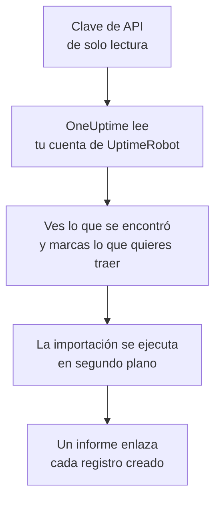

# Migrar desde UptimeRobot

**Importar desde otra herramienta** trae tus monitores y páginas de estado de UptimeRobot a OneUptime en pocos minutos. Con una clave de API de UptimeRobot de solo lectura, OneUptime lee tus monitores y páginas de estado públicas, te muestra lo que encontró y crea lo que marques. No se cambia nada en UptimeRobot.

:::cards
- [Importa tu cuenta](#importa-tu-cuenta-de-uptimerobot): Crea una clave, lee tu cuenta y marca lo que quieres traer.
- [Qué se trae](#qué-se-trae): En qué se convierte en OneUptime cada monitor y página de estado de UptimeRobot.
- [Completa el cambio](#completa-el-cambio): Qué hacer cuando termina la importación.
:::

## Cómo funciona

- **La clave se usa una sola vez.** Se guarda cifrada mientras OneUptime lee tu cuenta y se elimina en cuanto termina la lectura, haya funcionado o no. Nunca se vuelve a mostrar ni se escribe en un registro.
- **OneUptime solo lee.** Solo llama a la API de UptimeRobot: `api.uptimerobot.com`. Hace una solicitud cada seis segundos, lo que respeta las diez por minuto que UptimeRobot permite a una cuenta Free, así que una cuenta grande tarda unos minutos. Cuando UptimeRobot le pide que vaya más despacio, espera y vuelve a intentarlo.
- **No se crea nada hasta que inicias la importación.** La vista previa muestra, para cada elemento, si es nuevo, si ya está en OneUptime (y se usa tal cual), si lo trajo una importación anterior o por qué no se puede traer.
- **Volver a ejecutarla nunca crea nada dos veces.** OneUptime recuerda lo que trajo cada importación, por su ID de UptimeRobot. Vuelve a ejecutarla después de añadir monitores en UptimeRobot y solo se crearán los nuevos.

## Antes de empezar

- **Un proyecto de OneUptime y el derecho a crear lo que traes.** Los propietarios y administradores del proyecto pueden traerlo todo. Otros roles también pueden ejecutar una importación y traer los tipos de registros que pueden crear. Lo demás se muestra como no traído, con el motivo.
- **Una clave de API de UptimeRobot.** Basta con la Read-only API key: la importación nunca escribe en UptimeRobot. La Main API key también sirve, pero una clave de un solo monitor solo lee ese monitor.
- **Un método de pago, en OneUptime Cloud.** Los monitores que hacen comprobaciones se cobran según su uso, incluso en el plan Free, así que añade uno en **Ajustes del proyecto** > **Facturación** antes de importar. Sin él, esos monitores se muestran como no traídos.

## Importa tu cuenta de UptimeRobot

:::steps
### Crea una clave de API en UptimeRobot
En UptimeRobot, ve a **Integrations & API** > **API**. Crea una **Read-only API key** o copia la que ya tienes.

### Abre la página de importación
En OneUptime, ve a **Ajustes del proyecto** > **Importar desde otra herramienta** y selecciona **UptimeRobot**.

### Conecta UptimeRobot
Pega la clave en **Clave de API de UptimeRobot** y selecciona **Leer mi cuenta de UptimeRobot**. Una cuenta grande tarda unos minutos, y puedes salir de la página mientras se lee.

### Marca lo que quieres traer
La vista previa muestra lo que se encontró, con una sección por tipo. Todo lo que se crearía empieza marcado, salvo los monitores en pausa en UptimeRobot, que se traen en pausa si los marcas. Debajo de cada elemento, OneUptime indica lo que no se traerá exactamente igual. Cuando una página de estado marcada muestra un monitor que dejaste sin marcar, lo indica, y **Marcarlos también** lo marca.

### Inicia la importación
Selecciona **Iniciar la importación**. La importación se ejecuta en segundo plano: puedes salir de la página, y el informe te espera allí.
:::

El informe cuenta lo que se creó y no se trajo, y muestra cada elemento con un enlace al registro en el que se convirtió, primero los fallos. Las importaciones anteriores aparecen en **Importaciones anteriores** en la misma página.

## Qué se trae

| En UptimeRobot | En OneUptime | Cómo |
| --- | --- | --- |
| Monitors | Monitores | Cada monitor se convierte en un monitor del mismo tipo, con la misma dirección, intervalo y tiempo de espera, y los mismos códigos de estado que cuentan como disponible. |
| Public status pages | Páginas de estado | Cada página muestra los mismos monitores: los que nombra, los que tienen sus etiquetas o todos, con la disponibilidad y las barras de historial como las mostraba. Una página con contraseña se trae como privada. |

- **Los monitores HTTP(S) y de palabra clave** se convierten en monitores de sitio web, o en monitores de API cuando envían otro método, encabezados o un cuerpo JSON. Un monitor de palabra clave cae cuando su palabra clave aparece o falta, como en UptimeRobot, y la busca exactamente, mayúsculas incluidas.
- **Los monitores de ping y de puerto** se convierten en monitores de ping y de puerto.
- **Los monitores de latido** se convierten en monitores de solicitudes entrantes, que caen cuando no llega ninguna solicitud durante el intervalo y el periodo de gracia. Cada uno tiene una dirección nueva en OneUptime.
- **Los monitores DNS y de API** se convierten en monitores DNS y de API.
- **Los recordatorios de caducidad SSL.** Un monitor que avisa antes de que caduque su certificado recibe también un monitor de certificado SSL, con su nombre, que avisa con los mismos días de antelación.

Cada monitor se comprueba desde las sondas de tu proyecto, como uno que creas tú. Un intervalo que OneUptime no ofrece se convierte en el más cercano que ofrece, y un tiempo de espera de más de un minuto, en un minuto. La vista previa indica cuándo cambia alguno de los dos.

## Qué no se trae

- **El historial de disponibilidad, los tiempos de respuesta y los incidentes.** OneUptime empieza a comprobar cuando termina la importación.
- **Los contactos de alerta y las integraciones.** Elige a quién se avisa en OneUptime, como se describe en [Completa el cambio](#completa-el-cambio).
- **Las contraseñas y los encabezados que pueden contener un secreto.** Un monitor que inicia sesión, o que envía un encabezado `Authorization`, de cookie o de token, se trae sin él: añádelo con un [secreto de monitor](/docs/monitor/monitor-secrets).
- **Los monitores UDP, de comparación visual y de dependencia.** OneUptime no tiene ningún monitor que haga lo mismo, y la vista previa nombra cada uno.
- **Los monitores de puerto que alertan mientras el puerto está abierto.** Funcionan al revés que los monitores de puerto de OneUptime.
- **Las respuestas que espera un monitor DNS y las aserciones de un monitor de API.** Añádelas como criterios en OneUptime.
- **Las ventanas de mantenimiento.** La vista previa las cuenta: prográmalas como mantenimiento programado en OneUptime.
- **El dominio propio y la marca de una página de estado.** En OneUptime, añade el dominio en **Dominios personalizados** y el logotipo en **Marca**.

## Límites

Una importación crea como máximo 2.000 registros: como máximo 1.000 monitores y 50 páginas de estado. Lo que supera un límite se muestra como no traído. Vuelve a ejecutar la importación para traer el resto.

En OneUptime Cloud, los monitores que hacen comprobaciones necesitan un método de pago, y lo que no cabe en tu plan se muestra como no traído, con lo que necesita.

Una vista previa se guarda un día. Solo la persona que leyó la cuenta puede marcar elementos e iniciarla. Los propietarios y administradores del proyecto ven el progreso y el informe de cada importación.

## Completa el cambio

:::steps
### Revisa tus monitores
Abre cada uno en **Monitores** y revisa sus primeros resultados. Un monitor de latido tiene una dirección nueva: apunta a ella la tarea que lo llama.

### Elige a quién se avisa
Añade propietarios a tus monitores, o una política de guardia en **Guardia** > **Políticas de guardia** a los incidentes que abren, para que las personas adecuadas se enteren cuando algo falle.

### Apunta la dirección de tu página de estado a OneUptime
En **Páginas de estado**, abre la página, añade tu dominio en **Dominios personalizados** y luego cambia su registro DNS. Así tus visitantes y suscriptores llegarán a la nueva página.

### Desactiva las comprobaciones en UptimeRobot
Cuando OneUptime compruebe lo mismo, pausa las comprobaciones en UptimeRobot para que nadie reciba dos avisos.
:::

## Solución de problemas

:::details UptimeRobot no aceptó la clave de API
Comprueba que copiaste la clave completa y que es la Read-only o la Main API key de la cuenta, de **Integrations & API**, no una clave de un solo monitor. Después selecciona **Volver a intentar**.
:::

:::details Un monitor se muestra como no traído
Indica el motivo: un tipo de monitor que OneUptime no tiene, una dirección que OneUptime no puede leer, o un proyecto sin espacio o sin método de pago para él. Un monitor que OneUptime ya ejecuta, con el mismo nombre, tipo y dirección, se usa tal cual.
:::

:::details Algunos elementos no se pueden marcar
Cada uno indica el motivo: un nombre que el proyecto ya tiene, algo que trajo una importación anterior, o un registro que no tienes permiso para crear o que tu plan no incluye.
:::

## Próximos pasos

:::cards
- [Monitor de sitio web](/docs/monitor/website-monitor): Qué comprueba un monitor de sitio web y cómo.
- [Monitor de solicitudes entrantes](/docs/monitor/incoming-request-monitor): Cómo funciona un latido en OneUptime.
- [Migrar desde Pingdom](/docs/moving-to-oneuptime/pingdom): Trae tus comprobaciones desde Pingdom.
:::
