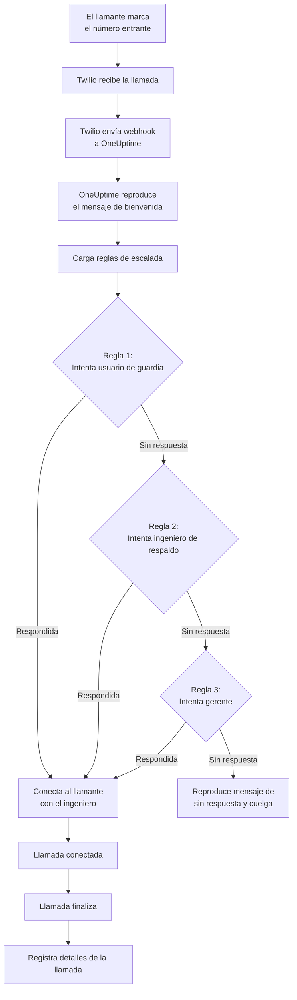
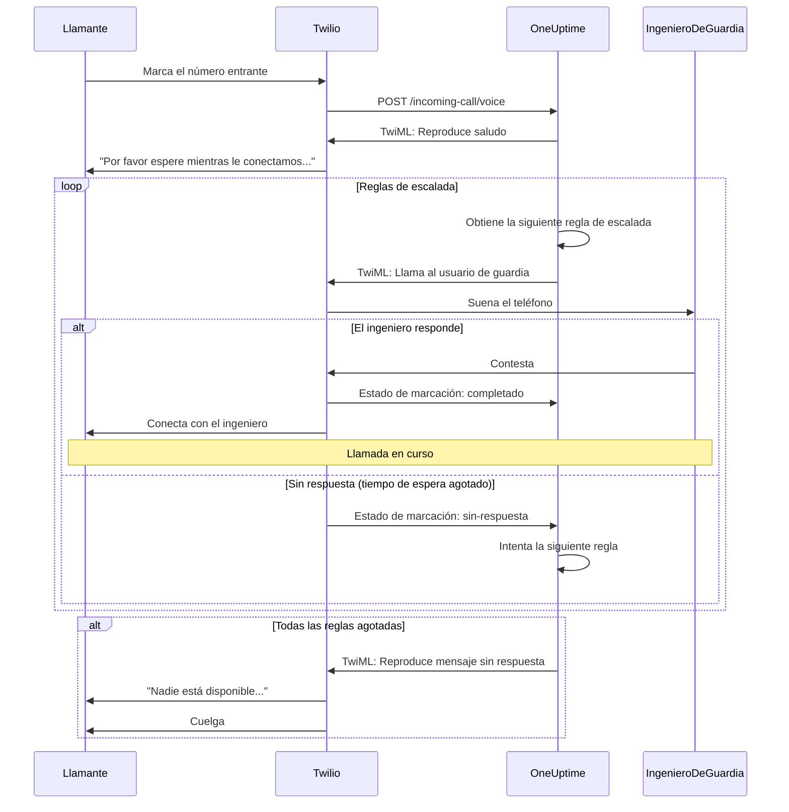
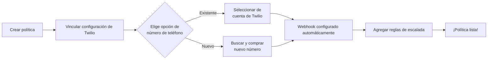
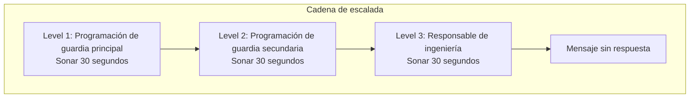

# Política de llamadas entrantes (Integración con Twilio)

Las Políticas de llamadas entrantes permiten que los llamantes externos lleguen a tus ingenieros de guardia marcando un número de teléfono dedicado. Cuando alguien llama, OneUptime enruta la llamada a través de tus reglas de escalada configuradas hasta que un ingeniero responde.

## Cómo funciona

## Flujo de enrutamiento de llamadas

## Prerrequisitos

- Una cuenta de Twilio: créala en [https://www.twilio.com](https://www.twilio.com)
- Tu SID de cuenta y token de autenticación de Twilio
- Acceso a tu instancia auto-alojada de OneUptime

## Información general

La función de Política de llamadas entrantes funciona mediante:

1. Recibir llamadas entrantes en un número de teléfono de Twilio
2. Reproducir un mensaje de bienvenida personalizable
3. Enrutar la llamada a través de reglas de escalada (programaciones de guardia o personas)
4. Conectar al llamante con el primer ingeniero de guardia disponible
5. Escalar a la siguiente regla si nadie responde

Dado que estás auto-alojando OneUptime, necesitarás configurar tu propia cuenta de Twilio. Esto te da control total sobre tus números de teléfono y facturación.

## Paso 1: Crear una cuenta de Twilio

1. Ve a [https://www.twilio.com](https://www.twilio.com) y regístrate para obtener una cuenta
2. Completa el proceso de verificación
3. Anota tu **SID de cuenta** y **Token de autenticación** desde el panel de Twilio

## Paso 2: Configurar la configuración de llamadas/SMS en OneUptime

1. Inicia sesión en tu panel de OneUptime
2. Ve a **Ajustes del proyecto** > **Notificaciones** > **Ajustes de Notificación**
3. En **Configuración de Twilio**, haz clic en **Crear configuración de Twilio**
4. Completa los siguientes campos:
   - **Nombre**: Un nombre descriptivo (por ejemplo, "Configuración de Twilio para producción")
   - **Descripción**: Descripción opcional
   - **SID de cuenta de Twilio**: Tu SID de cuenta de Twilio (comienza con `AC`)
   - **Token de autenticación de Twilio**: Tu token de autenticación de Twilio
   - **Número de teléfono principal de Twilio**: Un número de teléfono de tu cuenta de Twilio para llamadas salientes
   - **Establecer como predeterminado del proyecto**: activado en la primera configuración de Twilio del proyecto, así que los SMS y las llamadas a los miembros del proyecto también pasan por esta cuenta. Desactívalo si esta cuenta es solo para llamadas entrantes.
5. Haz clic en **Guardar**

## Paso 3: Crear una Política de llamadas entrantes

1. Ve a **Guardia** > **Políticas de Llamadas Entrantes**
2. Haz clic en **Crear política de llamadas entrantes**
3. Completa los siguientes campos:
   - **Nombre**: Un nombre descriptivo (por ejemplo, "Línea de soporte")
   - **Descripción**: Descripción opcional
4. Haz clic en **Guardar**

## Paso 4: Vincular la configuración de Twilio a la política

1. Abre tu Política de llamadas entrantes recién creada
2. En la tarjeta **Enrutamiento de número de teléfono**, busca el **Paso 2: Vincular configuración de Twilio**
3. Haz clic en **Seleccionar configuración de Twilio** y elige la configuración que creaste en el Paso 2
4. Guarda la selección

## Paso 5: Configurar un número de teléfono

Tienes dos opciones para configurar un número de teléfono:

### Opción A: Usar un número de teléfono de Twilio existente

Si ya tienes números de teléfono en tu cuenta de Twilio:

1. En la tarjeta **Número de teléfono**, haz clic en **Usar número existente**
2. OneUptime obtendrá todos los números de teléfono de tu cuenta de Twilio
3. Selecciona el número de teléfono que deseas usar
4. Haz clic en **Usar este** para asignarlo a la política

> **Nota**: Si el número de teléfono ya tiene un webhook configurado, se actualizará para apuntar a OneUptime.

### Opción B: Comprar un nuevo número de teléfono

Para comprar un nuevo número de teléfono directamente desde OneUptime:

1. En la tarjeta **Número de teléfono**, haz clic en **Comprar nuevo número**
2. Selecciona un **País** del menú desplegable
3. Opcionalmente, ingresa un **Código de área** (por ejemplo, 415 para San Francisco)
4. Opcionalmente, ingresa los dígitos que el número debe **Contener** (por ejemplo, 555)
5. Haz clic en **Buscar** para encontrar los números disponibles
6. Selecciona un número de teléfono de los resultados
7. Haz clic en **Comprar** para adquirir el número

¡El número de teléfono se comprará de tu cuenta de Twilio y el webhook se **configurará automáticamente**, sin necesidad de configuración manual!

## Paso 6: Configurar las reglas de escalada

Las reglas de escalado deciden a quién se llama cuando alguien marca el número de la política, de arriba abajo en la lista:

1. Abre tu política de llamadas entrantes
2. Ve a la pestaña **Reglas de escalado**
3. Haz clic en **Añadir regla de escalado**
4. Completa la regla. Es un solo paso:
   - **A quién llamar**: una programación de guardia o una persona. Una programación hace sonar el teléfono de quien esté de guardia en ella cuando llega la llamada. Las personas son los miembros de tu proyecto.
   - **Duración del timbre (en segundos)**: cuánto tiempo suena su teléfono antes de que la llamada pase a la siguiente regla. Empieza en 30 segundos, y Twilio acepta de 5 a 600.
   - **Nombre** y **Descripción** son opcionales y están en **Más campos**. Una regla sin nombre se muestra según su lugar en la lista: **Level 1**, **Level 2**.
5. Guárdala y añade una regla por cada programación o persona que se deba probar después

Las reglas se llaman de arriba abajo en la lista, y una regla nueva se añade al final. Para cambiar el orden, arrastra una regla por el asa de su esquina superior izquierda; con el teclado, enfoca el asa, pulsa Espacio, muévela con las flechas y vuelve a pulsar Espacio.

> **Ojo con el buzón de voz**: mantén la **Duración del timbre** por debajo del tiempo que tarda el teléfono de la persona en enviar una llamada no contestada al buzón de voz. Si el buzón contesta antes, quien llama queda conectado a él y la llamada no pasa a la siguiente regla. Twilio añade unos segundos propios a cada timbre.

### Ejemplo de regla de escalada

| Nivel   | A quién llamar                          | Duración del timbre |
| ------- | --------------------------------------- | ------------------- |
| Level 1 | Programación de guardia principal       | 30 segundos         |
| Level 2 | Programación de guardia secundaria      | 30 segundos         |
| Level 3 | Responsable de ingeniería (una persona) | 30 segundos         |

## Paso 7: Configurar mensajes de voz (opcional)

Personaliza los mensajes que escuchan los llamantes:

1. Abre tu Política de llamadas entrantes
2. Ve a **Ajustes**
3. Configura:
   - **Mensaje de bienvenida**: Reproducido cuando se responde la llamada
   - **Mensaje de sin respuesta**: Reproducido cuando fallan todas las reglas de escalada
   - **Mensaje de nadie disponible**: Reproducido cuando nadie está de guardia

## Opciones de configuración

### Ajustes de la política

| Ajuste                             | Descripción                                           | Predeterminado                                                                 |
| ---------------------------------- | ----------------------------------------------------- | ------------------------------------------------------------------------------ |
| Mensaje de bienvenida              | Mensaje TTS reproducido cuando se responde la llamada | "Por favor espere mientras le conectamos con el ingeniero de guardia."         |
| Mensaje sin respuesta              | Mensaje cuando fallan todas las reglas de escalada    | "Nadie está disponible. Por favor intente de nuevo más tarde."                 |
| Mensaje sin nadie disponible       | Mensaje cuando nadie está de guardia                  | "Lo sentimos, pero actualmente no hay ningún ingeniero de guardia disponible." |
| Repetir política si nadie responde | Reiniciar desde la primera regla si todas fallan      | Deshabilitado                                                                  |
| Veces de repetición de la política | Número máximo de intentos de repetición               | 1                                                                              |

### Ajustes de la regla de escalada

| Ajuste                            | Descripción                                                                                                                                                       |
| --------------------------------- | ----------------------------------------------------------------------------------------------------------------------------------------------------------------- |
| A quién llamar                    | Una programación de guardia, que llama a quien esté de guardia en ella, o una persona. Cada regla llama a una de ellas                                            |
| Duración del timbre (en segundos) | Cuánto tiempo suena el teléfono antes de que la llamada pase a la siguiente regla (predeterminado: 30; de 5 a 600)                                               |
| Nombre y Descripción              | Opcionales, en Más campos. Una regla sin nombre se muestra como Level 1, Level 2, etc., según su lugar en la lista                                                 |
| Orden                             | El lugar de la regla en la lista: las reglas se llaman de arriba abajo. Se cambia arrastrando las reglas; mediante la API, una regla nueva sin orden va al final |

Mediante la API, una regla indica `onCallDutyPolicyScheduleId` o `userId` (uno de los dos, nunca ambos) y `escalateAfterSeconds`: la duración del timbre, 30 si se omite.

## Ver registros de llamadas

Para ver el historial de llamadas entrantes:

1. Ve a **Guardia** > **Políticas de Llamadas Entrantes**
2. Haz clic en tu política
3. Ve a la pestaña **Registros de Llamadas**

Los registros muestran:

- Número de teléfono del llamante
- Estado de la llamada (Completada, Sin respuesta, Fallida, etc.)
- Quién respondió la llamada
- Duración de la llamada
- Marca de tiempo

## Configuración del número de teléfono del usuario

Para que los usuarios puedan recibir llamadas entrantes, deben tener un número de teléfono verificado:

1. Los usuarios van a **Ajustes de usuario** > **Métodos de Notificación**
2. Agregan un número de teléfono en **Números de llamadas entrantes**
3. Verifican el número de teléfono mediante código SMS

Solo los usuarios con números de teléfono verificados pueden ser contactados a través de las reglas de escalada.

## Liberar un número de teléfono

Si ya no necesitas un número de teléfono:

1. Abre tu Política de llamadas entrantes
2. En la tarjeta **Número de teléfono**, haz clic en **Liberar número**
3. Confirma la liberación

> **Advertencia**: Los números liberados se devuelven a Twilio y puede que no estén disponibles para volver a comprarse.

## Solución de problemas

### Las llamadas no se reciben

- Verifica que la configuración de Twilio esté correctamente vinculada a la política
- Comprueba que tu instancia de OneUptime sea accesible desde internet
- Verifica que el SID de cuenta y el token de autenticación de Twilio sean correctos
- Revisa los registros de errores en la consola de Twilio

### Las llamadas no se conectan con los ingenieros

- Verifica que los usuarios tengan números de teléfono verificados en su configuración de notificaciones
- Comprueba que las reglas de escalada estén correctamente configuradas
- Asegúrate de que los horarios de guardia tengan usuarios asignados para el momento actual
- Verifica que la política esté habilitada
- Si las llamadas acaban en el buzón de voz de un ingeniero, ajusta la **Duración del timbre** de la regla por debajo del tiempo que tarda su teléfono en pasar al buzón de voz

### Problemas de calidad de audio

- Asegúrate de que tu servidor tenga conectividad a internet estable
- Revisa la página de estado de Twilio para ver si hay problemas en curso
- Verifica que los números de teléfono estén en el formato correcto (formato E.164: +15551234567)

## Consideraciones de seguridad

- Mantén tu token de autenticación de Twilio seguro y nunca lo expongas públicamente
- Usa HTTPS para tu instancia de OneUptime
- OneUptime valida las firmas de los webhooks para asegurarse de que las solicitudes vengan de Twilio
- Considera restringir qué números de teléfono pueden llamar a tus políticas de llamadas entrantes

## Soporte

Para problemas con la función de Política de llamadas entrantes, por favor:

1. Revisa los registros de errores en la consola de Twilio
2. Revisa los registros del servidor de OneUptime
3. Contacta con soporte en [hello@oneuptime.com](mailto:hello@oneuptime.com)
