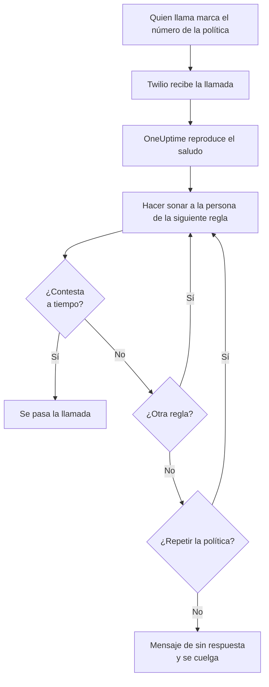
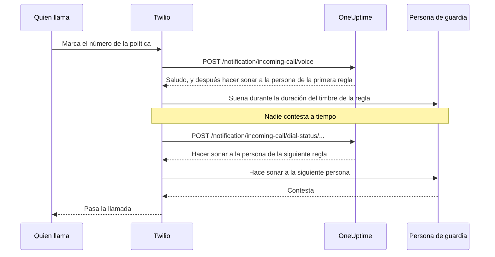

# Política de llamadas entrantes

Una política de llamadas entrantes da a tu equipo un número de teléfono que contacta con quien esté de guardia. Cuando alguien llama, OneUptime hace sonar, una tras otra, a las personas de las reglas de escalado de la política hasta que alguien contesta, y pasa la llamada. Los números y las llamadas funcionan con tu propia cuenta de Twilio.

:::cards
- [Configura una política](#configura-una-política): De tu cuenta de Twilio a una llamada de prueba, en siete pasos.
- [Cómo se enruta una llamada](#cómo-se-enruta-una-llamada): A quién suena, durante cuánto tiempo y qué oye quien llama.
- [Llamadas perdidas](#llamadas-perdidas): A quién se avisa y cómo reaccionar a ellas en un flujo de trabajo.
- [Solución de problemas](#solución-de-problemas): Llamadas que nunca llegan o que nunca contactan con nadie.
:::

## Antes de empezar

| Necesitas | Por qué |
| --- | --- |
| Una cuenta de Twilio, con su Account SID y su Auth Token | Los números y las llamadas de la política funcionan con ella, y Twilio se los cobra. |
| El plan **Growth**, en OneUptime Cloud | Un proyecto lo necesita para tener su propia configuración de Twilio. |
| Un servidor de OneUptime al que Twilio pueda llegar, si lo alojas tú | Twilio envía cada llamada a `https://<your host>/notification/incoming-call/voice`. |
| **SMS** activado en el proyecto | El número de cada persona se verifica con un código enviado por SMS. |
| Un número verificado para cada persona | Una regla solo hace sonar a quienes añadieron y verificaron un número para llamadas entrantes en el proyecto. |

## Configura una política

:::steps
### Añade tu cuenta de Twilio

Ve a **Ajustes del proyecto** > **Notificaciones** > **Ajustes de notificaciones**. En la tarjeta **Configuración de Twilio**, haz clic en **Crear configuración de Twilio** y rellena el formulario:

- **Nombre** y **Descripción**: para qué es la cuenta, por ejemplo «Línea de soporte».
- **SID de cuenta de Twilio**: de la consola de Twilio. Empieza por `AC`.
- **Token de autenticación de Twilio**: de la consola de Twilio.
- **Número de teléfono principal de Twilio**: un número de esa cuenta, para los SMS y las llamadas que envía.
- **Números de teléfono secundarios de Twilio**: opcional. Números que envían en lugar del principal a los destinatarios de su país.
- **Establecer como predeterminado del proyecto**: activado para la primera configuración de Twilio del proyecto, de modo que los SMS y las llamadas a los miembros del proyecto también pasen por esta cuenta. Desactívalo si esta cuenta es solo para llamadas entrantes.

### Crea la política

Ve a **Guardia** > **Políticas de llamadas entrantes** y haz clic en **Crear Política de llamadas entrantes**. Ponle un **Nombre**, por ejemplo «Línea de soporte», y, si quieres, una **Descripción** y **Etiquetas**. Después ábrela desde la lista.

### Elige la cuenta de Twilio

La **Vista general** de la política muestra una tarjeta **Configuración** con tres pasos numerados. En el primero, haz clic en **Seleccionar**, elige la cuenta en **Configuración de Twilio** y haz clic en **Guardar**.

### Añade un número de teléfono

En el segundo paso, haz clic en **Añadir número de teléfono**. Elige **Usar un número de teléfono existente** para traer un número que tu cuenta de Twilio ya tiene, o **Reservar nuevo número de teléfono** para conseguir uno nuevo. OneUptime apunta el número hacia sí mismo, así que no hay nada que configurar en Twilio. Consulta [Números de teléfono](#números-de-teléfono).

### Añade reglas de escalado

En el tercer paso, haz clic en **Administrar reglas**. Añade una regla por cada programación de guardia o persona a la que hacer sonar, en el orden en que deben sonar. Consulta [Reglas de escalado](#reglas-de-escalado).

### Verifica el número de cada persona

Cada persona a la que una regla puede hacer sonar añade y verifica su propio número para llamadas entrantes. Consulta [Números de las personas de guardia](#números-de-las-personas-de-guardia).

### Llama al número

Cuando los tres pasos están hechos, la tarjeta pasa a ser **Números de teléfono y configuración de Twilio**. Llama al número desde cualquier teléfono y abre después los **Registros de llamadas** de la política para ver a quién sonó.
:::

## Cómo se enruta una llamada

1. Twilio envía la llamada a OneUptime, que lee el **Mensaje de bienvenida** de la política.
2. OneUptime hace sonar a la persona que nombra la primera regla de escalado: esa persona, o quien esté de guardia en ese momento en la programación de guardia de la regla, sustituciones de usuario incluidas. Su teléfono muestra el número de la política como llamante.
3. Si contesta dentro de la **Duración del timbre** de la regla, se pasa la llamada, y el registro de llamadas guarda quién contestó.
4. Si no, quien llama oye «Connecting you to the next available engineer.», y suena la persona de la siguiente regla.
5. Después de la última regla, la política vuelve a empezar por la primera si **Repetir política si nadie responde** está activado, tantas veces como indique **Veces de repetición de la política**. Si no, quien llama oye el **Mensaje de sin respuesta**, y la llamada termina.

Una regla se salta, sin hacer sonar a nadie, cuando ahora mismo no hay nadie a quien llamar para ella: su programación no tiene a nadie de guardia, la persona no tiene un número verificado para llamadas entrantes en este proyecto o ya no es miembro del proyecto. Cuando ninguna regla tiene a alguien a quien hacer sonar, quien llama oye el **Mensaje de nadie disponible**. Una política desactivada responde a cada llamada con «Sorry, this service is currently disabled.» y cuelga.

OneUptime comprueba la firma de Twilio en cada petición con el Auth Token de la configuración de Twilio, y rechaza la petición que no puede verificar.

> [!TIP]
> Guarda el número de la política como contacto en tu teléfono, por ejemplo «Línea de soporte», para reconocer una llamada enrutada cuando suene.

## Reglas de escalado

Las reglas de escalado deciden a quién suena cuando alguien llama al número de la política, de arriba abajo en la lista. Abre la política, elige **Reglas de escalado** en su menú lateral y haz clic en **Añadir regla de escalado**. Una regla es un solo paso corto:

- **A quién llamar**: una programación de guardia o una sola persona. Una programación hace sonar a quien esté de guardia en ella cuando entra la llamada. Las personas son los miembros de tu proyecto.
- **Duración del timbre (en segundos)**: cuánto tiempo suena su teléfono antes de que la llamada pase a la siguiente regla. Empieza en 20 segundos, y Twilio acepta de 5 a 600.
- **Nombre** y **Descripción** son opcionales, en **Más campos**. Una regla sin nombre aparece según su lugar en la lista: **Level 1**, **Level 2**.

Las reglas se llaman de arriba abajo en la lista, y una regla nueva se añade al final. Para cambiar el orden, arrastra una regla por el asa de su esquina superior izquierda. Con el teclado, pon el foco en el asa, pulsa Espacio, muévela con las flechas y vuelve a pulsar Espacio.

> [!WARNING]
> **Cuidado con el buzón de voz**: mantén la **Duración del timbre** por debajo del tiempo que tarda el teléfono de la persona en enviar una llamada sin contestar al buzón de voz. Si su buzón contesta primero, quien llama queda conectado con él y la llamada no pasa a la siguiente regla. Twilio añade unos segundos propios a cada timbre. Por eso una regla nueva empieza en 20 segundos. Las reglas añadidas cuando el valor por defecto era de 30 segundos conservan sus 30: si sus llamadas acaban en el buzón de voz, baja la **Duración del timbre** de esas reglas.

Por ejemplo, tres reglas que prueban dos rotaciones y después a una responsable:

| Nivel | A quién llamar | Duración del timbre |
| --- | --- | --- |
| Level 1 | Programación de guardia principal | 20 segundos |
| Level 2 | Programación de guardia secundaria | 20 segundos |
| Level 3 | Responsable de ingeniería (una persona) | 20 segundos |

## Números de teléfono

Una política puede tener varios números, y todos hacen sonar las mismas reglas. Cada número pertenece a una sola política. Añádelos con **Añadir número de teléfono** en la **Vista general** de la política:

:::tabs
@tab Usar un número que ya tienes
1. Haz clic en **Añadir número de teléfono** y después en **Usar un número de teléfono existente**. OneUptime lista los números de la cuenta de Twilio de la política.
2. Haz clic en **Seleccionar** junto al número y después en **Asignar número**.

Un número cuyas llamadas ya van a otro sitio lo indica con «Currently has a webhook configured». Asignarlo envía sus llamadas a OneUptime en su lugar.
@tab Reservar un número nuevo
1. Haz clic en **Añadir número de teléfono**, después en **Reservar nuevo número de teléfono** y en **Buscar números**.
2. Elige un **País**. Si quieres, rellena **Código de área (opcional)**, por ejemplo 415, o **Contiene (opcional)** con dígitos que deba contener el número. Haz clic en **Buscar**: se listan hasta 10 números locales.
3. Haz clic en **Reservar** junto a un número y confirma con **Reservar**. Twilio cobra el número a tu cuenta de Twilio.
:::

OneUptime configura el webhook de voz del número en `https://<your host>/notification/incoming-call/voice`, construido a partir de `HOST` y `HTTP_PROTOCOL` en una instalación autoalojada. Para pasar una política a otra cuenta de Twilio, libera primero sus números: la cuenta solo puede cambiar mientras la política no tiene ninguno.

Para liberar un número, haz clic en **Liberar** junto a él y confirma con **Liberar número**.

> [!CAUTION]
> Liberar un número lo devuelve a Twilio, aunque lo hayas traído con **Usar un número de teléfono existente**, y puede que no lo recuperes. Eliminar una política, o la configuración de Twilio que usa, también libera sus números.

## Números de las personas de guardia

Una regla hace sonar a una persona en el número que verificó para llamadas entrantes en este proyecto, y se salta a quien no tenga ninguno. Cada persona añade el suyo:

:::steps
1. Abre **Ajustes de usuario** > **Política de llamadas entrantes** > **Números de teléfono entrantes**. **Política de llamadas entrantes** es una sección del menú lateral que empieza plegada.
2. En la tarjeta **Números de teléfono para enrutamiento de llamadas entrantes**, haz clic en **Añadir Número de teléfono para enrutamiento de llamadas entrantes** y escribe el número con su prefijo de país, por ejemplo `+15551234567`.
3. Escribe el código de 6 dígitos que OneUptime le envía por SMS en **Código de verificación** y haz clic en **Verificar**. **Send a new code** envía otro.
:::

Cada persona puede tener un número verificado por proyecto. Para cambiarlo, elimina primero el número antiguo. Estos números son distintos de los números de teléfono de **Métodos de notificación**, que usan los avisos de guardia.

Los números para llamadas entrantes se verifican por SMS, así que primero el proyecto debe tener **SMS** activado. Un propietario del proyecto o alguien con el rol **Billing Admin** o el permiso **Manage Billing** lo activa en la tarjeta **Canales de notificación** de **Ajustes del proyecto > Notificaciones > Ajustes de notificaciones**.

## Mensajes de voz y ajustes de la política

Abre la política y elige **Ajustes** en **Avanzado** en su menú lateral. **Editar mensajes** en la tarjeta **Mensajes de voz** cambia lo que oyen quienes llaman; **Editar ajustes de la política** en la tarjeta **Ajustes de la política** cambia el resto.

| Ajuste | Qué hace | En una política nueva |
| --- | --- | --- |
| **Mensaje de bienvenida** | Se lee cuando se contesta la llamada, antes de que suene la primera persona. | "Please wait while we connect you to the on-call engineer." |
| **Mensaje de sin respuesta** | Se lee cuando se han probado todas las reglas y nadie ha contestado. | "No one is available. Please try again later." |
| **Mensaje de nadie disponible** | Se lee cuando ninguna regla tiene a alguien a quien hacer sonar. | "We are sorry, but no on-call engineer is currently available. Please try again later or contact support." |
| **Habilitado** | Una política desactivada rechaza todas las llamadas. | Activado |
| **Repetir política si nadie responde** | Después de la última regla, volver a empezar por la primera. | Desactivado |
| **Veces de repetición de la política** | Cuántas veces volver a empezar. | 1 |

Twilio lee los mensajes con una voz sintética, así que escríbelos como quieras que suenen.

## Registros de llamadas

Cada llamada aparece en la página **Registros de llamadas** de la política, en **Registros** en su menú lateral: el **Llamante**, el **Número llamado**, su **Estado**, quién la contestó (**Respondida por**), la **Duración** y cuándo empezó (**Iniciado en**). Haz clic en **View Timeline** en una llamada para ver su **Cronología de llamadas**: cada persona a la que sonó, en qué número y cómo terminó cada intento.

| Estado | Qué pasó |
| --- | --- |
| **Iniciado**, **Sonando**, **Escalado** | La llamada sigue en curso: entró, está sonando un teléfono o pasó a una regla posterior. |
| **Completado** | Alguien contestó y se pasó la llamada. |
| **Sin respuesta** | Se probaron todas las reglas de escalado y nadie contestó. Quien llamó oyó tu **Mensaje de sin respuesta**. |
| **El llamante colgó** | Quien llamaba colgó mientras sonaba el teléfono de una persona. |
| **Fallido** | No se pudo hacer sonar a nadie: ninguna regla de escalado tenía a una persona de guardia con un número verificado para llamadas entrantes (quien llamó oyó tu **Mensaje de nadie disponible**), o la política está desactivada. |

## Llamadas perdidas

Una llamada se pierde cuando termina sin contactar con nadie: su estado es **Sin respuesta**, **El llamante colgó** o **Fallido**.

### A quién se avisa

Cuando se pierde una llamada, OneUptime avisa a los propietarios de la política: los usuarios y los miembros de los equipos añadidos en la página **Propietarios** de la política. Si la política no tiene propietarios, se avisa en su lugar a los propietarios del proyecto.

El aviso dice quién llamó, qué número marcó, por qué nadie contestó, y a quién sonó y cómo terminó cada intento. Enlaza la llamada en el registro de llamadas.

Los propietarios reciben un correo por defecto. Cada persona puede elegir otros canales (SMS, llamada, push y más) o desactivarlo en **Ajustes de usuario** > **Ajustes de notificaciones**, en **De guardia** > **Políticas de llamadas entrantes** > **Llamada perdida**.

### Reacciona a las llamadas perdidas en un flujo de trabajo

Los registros de llamadas entrantes están disponibles como disparadores de flujos de trabajo:

- **On Create Incoming Call Log** se ejecuta cuando entra una llamada.
- **On Update Incoming Call Log** se ejecuta a medida que avanza la llamada. La actualización que define **Ended At** es el final de la llamada.

Para actuar solo sobre las llamadas perdidas, por ejemplo para publicarlas en Slack o Microsoft Teams o abrir una incidencia:

:::steps
1. Añade el disparador **On Update Incoming Call Log**. Pon **Listen on** en **Ended At** y selecciona los campos que quieras usar, como **Status**, **Caller Phone Number** y **Routing Phone Number**.
2. Añade un paso **If / Else**. Comprueba el **Status** del disparador, con la comparación **is not equal to** y `Completed`.
3. Conecta tus pasos al puerto **Yes**.
:::

Un flujo de trabajo puede leer registros de llamadas con **Find One** y **Find Many**, pero no puede crearlos ni cambiarlos.

## Quién puede añadir y liberar números de teléfono

Los números de teléfono de una política siguen los mismos roles que la propia política:

- **Buscar números** - buscar en Twilio un número que reservar, o listar los números que ya tiene tu cuenta de Twilio - necesita permiso para leer las políticas de llamadas entrantes y para leer las configuraciones de llamadas y SMS, porque lee tu cuenta de Twilio a través de una de ellas. **Project Owner**, **Project Admin**, **Project Member**, **Viewer**, **Settings Admin**, **Settings Member** y **Settings Viewer** tienen ambos. En un rol personalizado, son **Read Incoming Call Policy** y **Read Call and SMS**.
- **Reservar un número, usar uno existente y liberar uno** necesitan permiso para editar las políticas de llamadas entrantes: **Project Owner**, **Project Admin**, **Project Member**, **Settings Admin** y **Settings Member**, o **Edit Incoming Call Policy** en un rol personalizado. Cambian los números de una política que puedes editar: con un rol limitado a ciertas etiquetas, las políticas que llevan esas etiquetas.

Un bloqueo de equipo sin etiquetas sobre uno de estos permisos lo retira. Para cualquier otra persona, **Añadir número de teléfono** y **Liberar** siguen en la página, bloqueados, y su descripción emergente dice qué necesitan. La API rechaza su petición con una frase que dice qué necesita: "Looking up phone numbers needs permission to read incoming call policies and call and SMS settings." o "Adding or releasing a phone number needs permission to edit incoming call policies." Reservar un número se cobra a tu propia cuenta de Twilio, no a tu saldo de OneUptime, así que no necesita permiso de facturación.

## Crear políticas con la API o Terraform

| Recurso | Ruta de la API |
| --- | --- |
| Políticas de llamadas entrantes | `/api/incoming-call-policy` |
| Sus reglas de escalado | `/api/incoming-call-policy-escalation-rule` |
| Sus números de teléfono, solo lectura | `/api/incoming-call-policy-phone-number` |
| Registros de llamadas, solo lectura | `/api/incoming-call-log` |

Una regla creada mediante la API sin `escalateAfterSeconds` suena durante 20 segundos, y lo mismo una que Terraform crea sin `escalate_after_seconds`.

### Ajustes de una regla de escalado

| Ajuste | Campo de la API | Qué contiene |
| --- | --- | --- |
| A quién llamar | `onCallDutyPolicyScheduleId` o `userId` | Uno de los dos, nunca ambos: la programación cuya persona de guardia suena, o la persona. |
| Duración del timbre (en segundos) | `escalateAfterSeconds` | Cuánto tiempo suena el teléfono antes de que la llamada siga (por defecto: 20; de 5 a 600). |
| Nombre y Descripción | `name`, `description` | Opcionales. Una regla sin nombre aparece como Level 1, Level 2 y así sucesivamente, según su lugar en la lista. |
| Orden | `order` | Dónde está la regla en la lista: las reglas se llaman de arriba abajo. Una regla nueva sin orden va al final. |

## Solución de problemas

:::details Las llamadas no llegan a OneUptime
- En la consola de Twilio, abre el número: **A call comes in** debe ser el webhook `https://<your host>/notification/incoming-call/voice`, con HTTP POST. OneUptime lo configura al añadir el número, a partir de `HOST` y `HTTP_PROTOCOL`. Si han cambiado desde entonces, corrige el webhook en Twilio.
- Un OneUptime autoalojado debe ser accesible desde Internet por https. El registro de llamadas del número en la consola de Twilio, y el **Debugger** de Twilio, muestran lo que respondió OneUptime.
- Una respuesta `403` significa que la firma de la petición no cuadró. Comprueba que la configuración de Twilio tiene el **Token de autenticación de Twilio** actual de la cuenta, y que un proxy delante de OneUptime transmite el host y el esquema a los que llamó Twilio (`X-Forwarded-Host` y `X-Forwarded-Proto`).
:::

:::details La llamada se contesta, pero no suena a nadie
El registro de llamadas dice **Fallido**. Comprueba que la política está **Habilitado**, que la programación de guardia de cada regla tiene a alguien de guardia ahora mismo y que las personas a las que hacen sonar las reglas tienen un número verificado en **Ajustes de usuario** > **Política de llamadas entrantes** > **Números de teléfono entrantes**, en este proyecto. Las reglas solo hacen sonar a miembros del proyecto.
:::

:::details Las llamadas acaban en el buzón de voz
Si las llamadas acaban en el buzón de voz de una persona, pon la **Duración del timbre** de la regla por debajo del tiempo que tarda su teléfono en pasar al buzón. Un buzón que contesta cuenta como respuesta, y la llamada se queda ahí.
:::

:::details No se puede reservar un número nuevo
En muchos países, Twilio necesita un paquete regulatorio (regulatory bundle) aprobado antes de vender números locales, y algunos números necesitan saldo positivo en Twilio. Configúralo en la consola de Twilio, o consigue allí el número y añádelo con **Usar un número de teléfono existente**.
:::

:::details No se puede cambiar la cuenta de Twilio de la política
La cuenta solo puede cambiar mientras la política no tiene números de teléfono: la página dice «Remove all phone numbers to change». Liberar los números los devuelve a Twilio, así que planifica el cambio antes.
:::

:::details No llega el código para el número de una persona
El SMS debe estar activado en el proyecto. En OneUptime Cloud, un proyecto sin su propia configuración de Twilio predeterminada paga los SMS con su saldo, que debe superar 1 USD. Los códigos pueden tardar un minuto en llegar; haz clic en **Send a new code** para enviar otro, y **Ajustes del proyecto** > **Notificaciones** > **Registros de notificación** muestra qué pasó con él.
:::

## Próximos pasos

:::cards
- [Reglas de escalado](/docs/on-call/escalation-rules): Cómo una política de guardia avisa a las personas, nivel a nivel.
- [Programaciones de guardia](/docs/on-call/schedules): Construye las rotaciones a las que llaman tus reglas.
- [Flujos de trabajo](/docs/workflows/index): Reacciona a las llamadas perdidas: publícalas en un canal o abre una incidencia.
- [Integración de SMS y voz de Twilio](/docs/self-hosted/twilio-integration): Configura Twilio para una instalación autoalojada.
:::
