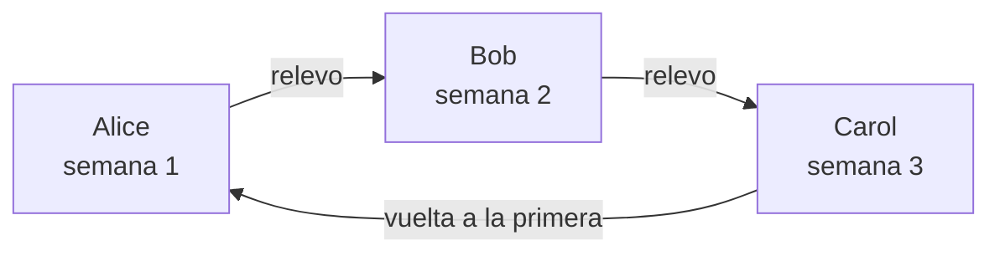
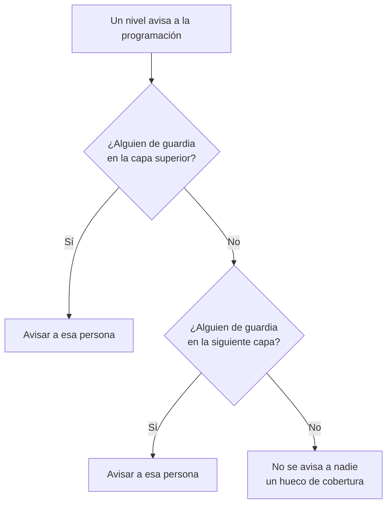

# Programaciones de guardia

Una programación de guardia decide quién está de guardia en cada momento. Las personas se turnan en ella: cada una está de guardia durante un tiempo y luego toma el relevo la siguiente. Añade una programación a las reglas de escalado de una política de guardia, y la política avisa a quien esté de guardia en ella cuando se ejecuta ese nivel.

> [!NOTE]
> En OneUptime Cloud, las programaciones de guardia están en el plan **Growth** y superiores. Una programación que un proyecto aún tiene sigue avisando a las personas que contiene, a través de las reglas de escalado que la nombran, después de que termine una prueba de Growth o baje el plan. Por eso, por debajo de **Growth**, la página **Programaciones de guardia** muestra la nota del plan con las programaciones que siguen configuradas debajo, donde puedes eliminarlas. Crear o cambiar una programación necesita **Growth**.

:::cards
- [Quiénes se turnan](#quiénes-se-turnan): Crea una programación con su primera rotación.
- [Capas](#capas): Apila rotaciones, limita las horas de guardia y añade cobertura de respaldo.
- [API y Terraform](#crear-programaciones-con-la-api-o-terraform): Crea programaciones y sus rotaciones como código.
:::

## Quiénes se turnan

Cuando creas una programación en la página **Programaciones de guardia**, el formulario pide su **Nombre** y **¿Quiénes se turnan?**. Las personas que elijas forman la primera capa de la programación, **Layer 1**, de guardia las 24 horas.

:::steps
1. Ve a **Guardia** > **Programaciones de guardia** y haz clic en **Crear programación de guardia**.
2. Escribe un **Nombre**.
3. En **¿Quiénes se turnan?**, haz clic en **Añadir usuario** y elige a las personas, en el orden en que se turnan.
4. Si quieres, abre **Más campos** para cambiar cuánto dura cada turno, la zona horaria, la descripción o las etiquetas.
5. Haz clic en **Crear programación de guardia**. La nueva programación se abre después en su página **Capas**, donde puedes cambiar la rotación o añadir más capas.
:::

Las personas se turnan de una en una, y la primera está de guardia en cuanto se crea la programación:



**¿Quiénes se turnan?** es opcional. Si lo dejas vacío, la programación empieza sin capas: no pone a nadie de guardia hasta que añadas una capa en su página **Capas**. La pregunta solo se hace a quienes pueden añadir capas.

Todo lo demás espera en **Más campos**, plegado hasta que lo abras:

| Campo | Qué hace |
| --- | --- |
| **Cada turno dura** | **1 día**, **1 semana**, **2 semanas** o **1 mes**, y **1 semana** si no lo cambias. Se pregunta en cuanto alguien se turna. Cada persona está de guardia ese tiempo y luego toma el relevo la siguiente, a la hora del día en que se creó la programación. |
| **Zona horaria** | La zona horaria en la que se guardan las horas de relevo y las horas de guardia. Empieza con la tuya. |
| **Descripción** | Notas sobre la programación. |
| **Etiquetas** | Etiquetas para encontrar y agrupar la programación. |

Mientras alguien se turna y no se cambia nada en **Más campos**, su encabezado plegado dice lo que pasará: cada persona está de guardia una semana y luego toma el relevo la siguiente.

## Capas

La rotación de una programación se compone de capas, en su página **Capas**. Las capas se leen de arriba abajo: la capa más alta con alguien de guardia es la que avisa, así que pon la rotación principal arriba y la cobertura de respaldo debajo.



**Añadir capa** añade una capa que empieza como la primera: de guardia desde ahora, cada persona durante una semana, las 24 horas. Despliega una capa para añadirle personas y para cambiar cuándo empieza, cada cuánto hace el relevo, cuándo hace el primer relevo y las horas en que está de guardia:

| Campo | Qué define |
| --- | --- |
| **Nombre de la capa** | Lo que cubre la capa, por ejemplo «Principal entre semana». |
| **La rotación empieza el** | La fecha y hora en que empieza la rotación de la capa. |
| **Rotar cada** | Cada cuánto pasa la guardia a la siguiente persona de la capa. |
| **Hora del primer relevo** | El primer relevo a la siguiente persona, en el inicio o después. Los relevos posteriores siguen cada intervalo de rotación. |
| **Restricciones** | Las horas en que la capa está de guardia: **Sin restricciones**, **Horas específicas del día** u **Horas específicas de la semana**, en la zona horaria de la programación. Fuera de ellas, toman el relevo las capas inferiores. |

Para cambiar qué capa va primero, usa **Subir capa (mayor prioridad)** o **Bajar capa (menor prioridad)** en el menú de una capa.

Cada persona conserva un mismo color en todas partes, para que puedas seguirla de un vistazo: en cada capa, en la programación final y sus sustituciones, y en la **Cronología de la programación**.

## Crear programaciones con la API o Terraform

Las programaciones de guardia son el recurso `/api/on-call-duty-policy-schedule`; sus capas y las personas que contienen son los recursos `/api/on-call-duty-schedule-layer` y `/api/on-call-duty-schedule-layer-user`.

- Crear una programación con `firstLayerUsers` (una lista de identificadores de usuario, en el orden en que se turnan) en sus `miscDataProps` le da su primera capa, como hace el panel: **Layer 1**, de guardia desde ahora, las 24 horas. `firstLayerRotation` indica cuánto dura cada turno, como una rotación del tipo `{"_type": "Recurring", "value": {"intervalType": "Week", "intervalCount": 1}}`; sin ella, una semana. Cada usuario debe ser miembro del proyecto y quien llama debe poder crear capas; si no, la programación no se crea.
- Una programación creada sin ellos no tiene capas, como antes; el recurso de programaciones de Terraform no los envía.
- Una capa creada sin `rotation` hace el relevo a diario, como siempre.

```bash
curl -X POST https://oneuptime.com/api/on-call-duty-policy-schedule \
  -H "apikey: $ONEUPTIME_API_KEY" \
  -H "Content-Type: application/json" \
  -d '{
    "data": {
      "projectId": "<project-id>",
      "name": "Primary on-call",
      "timezone": "Europe/Berlin"
    },
    "miscDataProps": {
      "firstLayerUsers": ["<user-id-1>", "<user-id-2>", "<user-id-3>"],
      "firstLayerRotation": {"_type": "Recurring", "value": {"intervalType": "Week", "intervalCount": 1}}
    }
  }'
```

## Próximos pasos

:::cards
- [Reglas de escalado](/docs/on-call/escalation-rules): Haz que un nivel de una política de guardia avise a esta programación.
- [Línea de tiempo de guardias](/docs/on-call/schedule-timeline): Ve todas las programaciones lado a lado, con sus huecos de cobertura.
- [Feeds de calendario](/docs/on-call/calendar-feeds): Lleva los turnos a Google Calendar, Outlook o el Calendario de Apple.
:::
