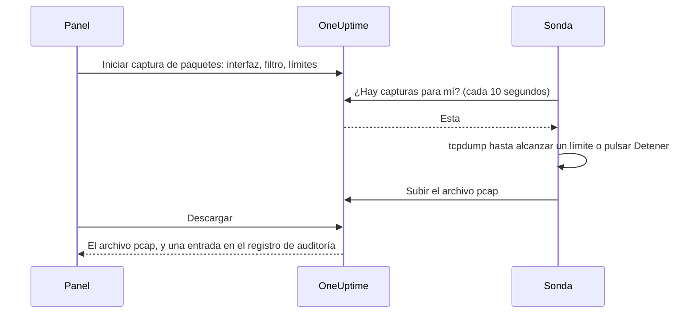

# Captura de paquetes

Captura el tráfico que ve una de tus sondas directamente desde el panel y abre el archivo en Wireshark. La sonda ya está en la red que estás diagnosticando: no hay VPN que abrir ni host de salto en el que iniciar sesión.

Las capturas están desactivadas en cada sonda hasta que quien la ejecuta las activa, y solo se ejecutan en las sondas propias de tu proyecto.

:::cards
- [Cómo funciona](#cómo-funciona): Desde «Iniciar captura de paquetes» hasta un archivo en Wireshark.
- [Activar la captura de paquetes](#activar-la-captura-de-paquetes): Lo que configura quien ejecuta la sonda, para Docker, Docker Compose y Kubernetes.
- [Iniciar una captura](#iniciar-una-captura): Elige una interfaz, limítala a lo que necesitas y descarga el archivo.
- [Referencia](#referencia): Límites, filtros, permisos, el registro de auditoría y cuánto tiempo se conservan los archivos.
- [Solución de problemas](#solución-de-problemas): Qué significa el mensaje de una captura que falló.
:::

## Cómo funciona



1. **Iniciar.** Alguien con permiso para iniciar capturas elige la interfaz de la sonda, un filtro y los límites, y hace clic en **Iniciar captura**. OneUptime comprueba el filtro y los límites frente a lo que permite la sonda antes de guardar la captura.
2. **Recoger.** La sonda pide trabajo a OneUptime cada diez segundos, igual que pide sus monitores. Toma la captura e inicia `tcpdump`.
3. **Capturar.** La captura se detiene en el primero de sus límites: su duración, su límite de paquetes o su tamaño de archivo. **Detener** la termina antes y conserva lo que ha capturado.
4. **Subir.** La sonda sube el archivo pcap. OneUptime lo guarda como archivo privado del proyecto.
5. **Descargar.** La captura muestra **Completado** con un botón **Descargar**. El archivo se abre en Wireshark, tcpdump o cualquier otra herramienta que lea archivos pcap.

## Antes de empezar

- **Una sonda propia de tu proyecto.** Las sondas globales transportan el tráfico de otros proyectos, así que nunca capturan. Para instalar una sonda propia, consulta [Sondas personalizadas](/docs/probe/custom-probe).
- **Una sonda de esta versión o posterior.** Las sondas anteriores no informan de en qué pueden capturar.
- **Los permisos adecuados.** Iniciar y detener una captura requiere **Start Packet Capture**, y descargar un archivo, **Download Packet Capture**. Los propietarios y administradores del proyecto tienen ambos. Consulta [Permisos](#permisos).
- **Un puerto replicado, para el tráfico que no llega a la sonda.** Una sonda solo ve el tráfico de las interfaces de su propio host. Para capturar el tráfico entre otros dispositivos, replica su puerto del switch (SPAN) en una interfaz libre del host de la sonda.

## Activar la captura de paquetes

Quien ejecuta la sonda activa las capturas donde la sonda se ejecuta: el panel no puede, por diseño. La sonda necesita tres cosas:

| Ajuste | Por qué |
| --- | --- |
| `PROBE_PACKET_CAPTURE_ENABLED=true` | Activa las capturas. Cualquier otro valor, o ninguno, las deja desactivadas. |
| Red del host | Permite a la sonda ver las propias interfaces del host y un puerto replicado. Sin ella, la sonda solo ve la red de su contenedor. |
| La capacidad `NET_RAW` | Permite capturar a tcpdump. Docker la concede por defecto. El estándar Pod Security «restricted» de Kubernetes la quita, así que añádela. |

:::tabs
@tab Docker
```bash
docker run --name oneuptime-probe --network host \
  --cap-add NET_RAW \
  -e PROBE_KEY=<probe-key> \
  -e PROBE_ID=<probe-id> \
  -e ONEUPTIME_URL=https://oneuptime.com \
  -e PROBE_PACKET_CAPTURE_ENABLED=true \
  -d oneuptime/probe:release
```
@tab Docker Compose
```yaml
services:
  oneuptime-probe:
    image: oneuptime/probe:release
    container_name: oneuptime-probe
    network_mode: host
    cap_add:
      - NET_RAW
    environment:
      - PROBE_KEY=<probe-key>
      - PROBE_ID=<probe-id>
      - ONEUPTIME_URL=https://oneuptime.com
      - PROBE_PACKET_CAPTURE_ENABLED=true
    restart: always
```
@tab Kubernetes
```yaml
apiVersion: apps/v1
kind: Deployment
metadata:
  name: oneuptime-probe
spec:
  selector:
    matchLabels:
      app: oneuptime-probe
  template:
    metadata:
      labels:
        app: oneuptime-probe
    spec:
      hostNetwork: true
      dnsPolicy: ClusterFirstWithHostNet
      containers:
        - name: oneuptime-probe
          image: oneuptime/probe:release
          securityContext:
            capabilities:
              add: ["NET_RAW"]
          env:
            - name: PROBE_KEY
              value: "<probe-key>"
            - name: PROBE_ID
              value: "<probe-id>"
            - name: ONEUPTIME_URL
              value: "https://oneuptime.com"
            - name: PROBE_PACKET_CAPTURE_ENABLED
              value: "true"
```
:::

Al arrancar, el registro de la sonda dice `Packet capture is on: captures of up to 30 minutes and 25 MB can be started on this probe from the dashboard.` En menos de un minuto, la página de la sonda en el panel ofrece **Iniciar captura de paquetes**.

Para fijar en esta sonda un tope más bajo que el que respeta toda sonda, añade cualquiera de estas variables:

| Variable | Valor por defecto | Qué hace |
| --- | --- | --- |
| `PROBE_PACKET_CAPTURE_MAX_DURATION_IN_SECONDS` | `1800` | La captura más larga que ejecuta esta sonda, de 5 a 1800 segundos. |
| `PROBE_PACKET_CAPTURE_MAX_FILE_SIZE_IN_MB` | `25` | El archivo de captura más grande que genera esta sonda, de 1 a 25 MB. |

> [!NOTE]
> Las sondas que trae una instalación autoalojada de OneUptime, con Docker Compose o el chart de Helm, son sondas globales, así que nunca capturan. Ejecuta una sonda personalizada en la red en la que quieras capturar.

## Iniciar una captura

:::steps
### Abre la sonda o el dispositivo

Abre **Monitores → Ajustes → Sondas** y haz clic en tu sonda: su tarjeta **Capturas de paquetes** lista sus capturas. O abre un dispositivo de red y ve a su página **Tráfico**: allí las capturas se ejecutan en la propia sonda del dispositivo y empiezan filtradas por su dirección.

### Haz clic en Iniciar captura de paquetes

El formulario dice qué contiene una captura antes de que inicies una: las contraseñas, los tokens y los datos personales que pasan por la red acaban en el archivo.

### Elige la interfaz

**Todas las interfaces (any)** captura en todas las interfaces de la sonda. Elige la interfaz a la que un switch replica el tráfico cuando captures tráfico replicado.

### Elige qué paquetes

Rellena **Host o red**, **Puerto** y **Protocolo** para acotar la captura, o déjalos vacíos para conservar todos los paquetes. El formulario muestra el filtro que forman, como `host 10.0.0.5 and tcp port 443`. Haz clic en **Escribir un filtro BPF en su lugar** para escribir el tuyo.

### Revisa los límites

**Más campos** contiene **Duración**, **Límite de paquetes** y **Límite de tamaño del archivo (MB)**. Su resumen dice cuándo se detiene la captura: `Se detiene tras 1 minuto, 100.000 paquetes o 10 MB, lo que ocurra primero.`

### Haz clic en Iniciar captura

La captura muestra **Pendiente** hasta que la sonda la recoge, y luego **En ejecución**, con su avance. Haz clic en **Detener** para terminarla antes.
:::

Cuando la captura muestre **Completado**, haz clic en **Descargar** y abre el archivo `.pcap` en Wireshark. Una captura en **Todas las interfaces (any)** es una «Linux cooked capture», que Wireshark lee como cualquier otra.

## Referencia

### Límites

| Límite | Valor por defecto | Rango |
| --- | --- | --- |
| Duración | 1 minuto | De 5 segundos a 30 minutos |
| Límite de paquetes | 100.000 | De 1 a 1.000.000 |
| Límite de tamaño del archivo | 10 MB | De 1 a 25 MB |

- Una captura se detiene en el primer límite que alcanza. Un archivo que llega a su límite de tamaño se corta tras el último paquete completo, así que siempre se abre.
- Una sonda ejecuta como máximo 2 capturas a la vez.
- Una captura que la sonda no recoge en 5 minutos falla, y lo dice.
- La sonda vuelve a aplicar estos límites a cada captura, y también los suyos, más bajos.

### Filtros

Los campos del formulario forman un [filtro BPF](https://www.tcpdump.org/manpages/pcap-filter.7.html), el lenguaje de filtros de captura de tcpdump y Wireshark:

| Host o red | Puerto | Protocolo | Filtro |
| --- | --- | --- | --- |
| `10.0.0.5` | | Cualquier protocolo | `host 10.0.0.5` |
| `10.0.0.0/24` | `443` | TCP | `net 10.0.0.0/24 and tcp port 443` |
| | `5060` | UDP | `udp port 5060` |
| | `8000-8080` | Cualquier protocolo | `portrange 8000-8080` |
| `10.0.0.5` | | ICMP | `host 10.0.0.5 and (icmp or icmp6)` |

Un filtro que escribas tú es una línea de 500 caracteres como máximo, hecha de letras, números, espacios y `. : / ( ) [ ] ! & | < > = + - * % ^ _`. OneUptime lo comprueba antes de guardarlo y tcpdump lo compila en la sonda. La sonda se lo pasa a tcpdump como un único argumento, nunca a través de un shell.

### Permisos

| Permiso | Permite | Quién lo tiene por defecto |
| --- | --- | --- |
| **Start Packet Capture** | Iniciar capturas y detenerlas | Project Owner, Project Admin |
| **Download Packet Capture** | Descargar archivos de captura | Project Owner, Project Admin |
| **Delete Packet Capture** | Eliminar capturas y sus archivos | Project Owner, Project Admin |
| **Read Packet Capture** | Ver las capturas: cuándo se ejecutaron, en qué sonda y con qué filtro | Project Owner, Project Admin, Project Member, Viewer |

Para dar a un equipo **Start Packet Capture** o **Download Packet Capture**, ábrelo en **Ajustes → Equipos** y añade el permiso en su página **Permisos**. Consulta [Permisos](/docs/permissions/index).

### Registro de auditoría y privacidad

- Iniciar una captura queda registrado en el registro de auditoría como un **Create** de la **Packet Capture**, y eliminarla como un **Delete**. Cada descarga queda registrada como un **Download**, con quién descargó qué captura.
- El archivo es un archivo privado del proyecto. Solo el botón **Descargar**, con **Download Packet Capture**, lo entrega.
- Las capturas y sus archivos se eliminan 7 días después de iniciarse. Eliminar una captura elimina su archivo en el acto.

## Solución de problemas

:::details «La captura de paquetes está desactivada en esta sonda»
La sonda se ejecuta sin `PROBE_PACKET_CAPTURE_ENABLED=true`. Reiníciala con los ajustes de [Activar la captura de paquetes](#activar-la-captura-de-paquetes).
:::

:::details "The probe is not allowed to capture packets on eth0"
tcpdump no pudo abrir la interfaz. Da al contenedor de la sonda la capacidad `NET_RAW`: `--cap-add NET_RAW` con Docker, `cap_add` con Docker Compose, `securityContext.capabilities.add` con Kubernetes.
:::

:::details "The interface does not exist on the probe"
La interfaz desapareció desde que la sonda la informó por última vez, o la sonda se ejecuta sin la red del host y solo ve las interfaces de su contenedor. Ejecútala con la red del host y vuelve a elegir la interfaz.
:::

:::details "tcpdump could not use the filter"
tcpdump no pudo compilar el filtro. El mensaje trae las palabras del propio tcpdump, como `syntax error`. Revisa el filtro con el [manual de pcap-filter](https://www.tcpdump.org/manpages/pcap-filter.7.html).
:::

:::details "The probe did not pick up this capture within 5 minutes"
La sonda está desconectada, o se desactivó la captura de paquetes en ella después de iniciar la captura. Revisa el **Estado de conexión** de la sonda y su registro.
:::

:::details «Ningún paquete coincidió con el filtro.»
La captura se ejecutó y nada en la interfaz coincidió con el filtro. Comprueba que el tráfico pasa por esta interfaz: el tráfico entre otros dispositivos solo llega a la sonda a través de un puerto replicado.
:::

:::details "This probe is already running 2 packet captures"
Una sonda ejecuta 2 capturas a la vez. Espera a que termine una, o detén una, y vuelve a iniciar la tuya.
:::

## Próximos pasos

:::cards
- [Sondas personalizadas](/docs/probe/custom-probe): Instala una sonda en la red en la que quieras capturar.
- [Monitor de dispositivos de red](/docs/monitor/network-device-monitor): Supervisa los dispositivos cuyo tráfico capturas.
- [Permisos](/docs/permissions/index): Da a un equipo los permisos de captura de paquetes.
:::
