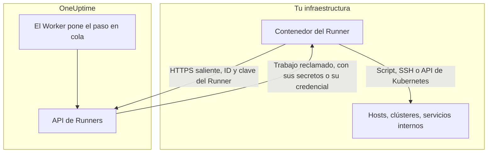
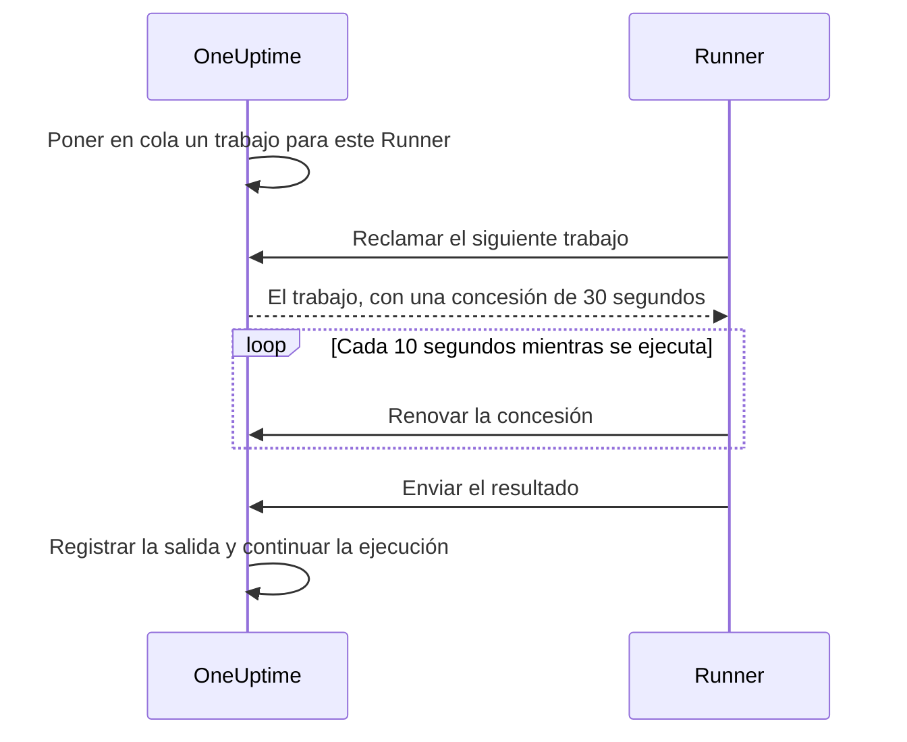

# Agentes de runbook

Un **agente de runbook**, llamado **Runner** en el panel, es un pequeño proceso autoalojado que ejecuta los pasos JavaScript, Bash, SSH y Kubernetes de tus runbooks **dentro de tu propia infraestructura**. El Worker de OneUptime nunca ejecuta tus scripts: los pone en cola, y el Runner que eligió quien escribió el paso reclama cada uno, lo ejecuta y devuelve el resultado. Esta página es para quien instala y opera Runners.

:::cards
- [Instalar un Runner](#instalar-un-runner): Del panel a un contenedor conectado, en cinco pasos.
- [Apuntar un paso a un Runner](#apuntar-un-paso-a-un-runner): Vincular un paso al Runner que debe ejecutarlo.
- [Tiempos de espera](#tiempos-de-espera): Tiempos de espera de reclamación y de ejecución, y cómo interactúan.
- [Variables de entorno](#variables-de-entorno): Lo que lee el contenedor al arrancar.
:::

## Cómo funciona



1. Creas un Runner en OneUptime. OneUptime genera un ID y una clave secreta para él.
2. Ejecutas el contenedor del Runner en un host de tu infraestructura, con ese ID, esa clave y la URL de tu OneUptime.
3. El Runner pide trabajo a OneUptime cada 5 segundos e informa de que está vivo cada 60 segundos.
4. Cuando escribes un paso JavaScript, Bash, SSH o Kubernetes, eliges el Runner en una lista desplegable. El paso queda vinculado a ese Runner.
5. Cuando el paso se ejecuta, el Worker pone en cola un trabajo con `targetAgentId` apuntando a ese Runner. Solo ese Runner puede reclamarlo.
6. El Runner ejecuta el trabajo localmente — `bash -c <script>` para Bash, un sandbox `isolated-vm` para JavaScript, una conexión SSH o una llamada al servidor de API del clúster con la credencial del paso —, captura el resultado y lo devuelve. El Worker reanuda el runbook con el resultado.

El Runner solo necesita **HTTPS saliente** hacia tu instancia de OneUptime. No acepta conexiones entrantes.

Lo único que guarda un Runner es su ID y su clave. Todo lo demás lo recibe con el trabajo que reclama: un script, con los [secretos de runbook](/docs/runbooks/credentials#secretos-para-scripts) que tiene asignados ya insertados, o la [credencial](/docs/runbooks/credentials) que nombra un paso SSH o Kubernetes. Por eso cualquiera que tenga la clave de un Runner puede actuar como ese Runner: trata la clave como las credenciales que tiene asignadas.

## Por qué los scripts se ejecutan en un Runner

Ejecutar scripts en el Worker de OneUptime tenía dos problemas:

- **Límite de confianza.** Cualquiera que pudiera escribir un runbook podía ejecutar código en el Worker, con acceso a todo lo que el Worker alcanzaba.
- **Alcance.** La mayoría de los pasos útiles actúan sobre _tu_ infraestructura («reinicia este servicio», «busca un registro en nuestra base de datos interna»), no sobre la de OneUptime.

Con los Runners, esos pasos se ejecutan en un host que tú controlas, y tú decides lo que ese host puede hacer. Los pasos de solicitud HTTP y de IA siguen ejecutándose en el Worker, porque no necesitan nada de tu red.

## Antes de empezar

- **Un host con Docker** dentro de tu infraestructura, que llegue a la URL de tu OneUptime por HTTPS y a los sistemas sobre los que actúan tus pasos.
- **Un rol que cree Runners.** Project Owner, Project Admin, Project Member y Runbook Admin pueden crear uno. Solo un Project Owner, un Project Admin o un Runbook Admin pueden ver la clave de un Runner, que incluye el comando de instalación.

## Instalar un Runner

### 1. Crear el registro del agente

Ve a **Runbooks → Agentes de runbook** y crea un agente nuevo. Haz clic en **Crear Runner** y completa sus dos pasos:

| Campo | Paso | Notas |
| --- | --- | --- |
| **Nombre** | **Runner** | Un nombre claro, normalmente dónde se ejecuta y a qué llega, como `prod-eu-west-1`. Es lo que eliges al escribir un paso. |
| **Descripción** | **Runner** | Opcional. Una frase sobre a qué llega este host. |
| **Etiquetas** | **Runner** (en **Más campos**) | Opcional. |
| **Ejecuta runbooks** | **Capacidades** | Activado por defecto. Permite a este Runner tomar pasos de runbook. |
| **Ejecuta correcciones de código con IA** | **Capacidades** | Desactivado por defecto. Le permite abrir pull requests de corrección de código con IA; consulta [Fix Tasks](/docs/ai/ai-agent). |
| **Ejecuta comandos de remediación con IA** | **Capacidades** | Desactivado por defecto. Permite que la remediación automática con IA ejecute en él comandos comprobados por una política. Activarlo en un Runner que tiene credenciales SSH requiere permiso para leer las credenciales de runbook; consulta [Runners que ejecutan los comandos de OneUptime AI](/docs/runbooks/credentials#runners-que-ejecutan-los-comandos-de-oneuptime-ai). |

Un Runner aplica un cambio de sus capacidades en su siguiente heartbeat; no hace falta reiniciarlo.

### 2. Copiar el comando de instalación

En la fila del Runner, haz clic en **Mostrar instrucciones de configuración**. El diálogo **Configuración del agente de runbook** muestra un comando `docker run` con el ID y la clave de este Runner ya incluidos. El mismo comando está en la página del Runner, en **Instrucciones de configuración**.

Solo un Project Owner, un Project Admin o un Runbook Admin pueden leer la clave. Los demás ven «No tienes permiso para ver la clave de este agente de runbook» en lugar del comando.

### 3. Ejecutarlo en un host de tu infraestructura

Ejecuta el comando en un host de tu entorno que pueda:

- llegar a tu instancia de OneUptime por HTTPS, y
- hacer lo que tus pasos necesitan, como llegar a otros hosts por SSH, llamar al servidor de API de un clúster o hablar con una base de datos.

```bash
docker run --name oneuptime-runner --restart unless-stopped \
  -e ONEUPTIME_RUNNER_ID=<runner-id> \
  -e ONEUPTIME_RUNNER_KEY=<runner-key> \
  -e ONEUPTIME_URL=https://oneuptime.yourdomain.com \
  -d oneuptime/runner:release
```

### 4. Comprobar que el agente está conectado

Vuelve a **Runbooks → Agentes de runbook**. Menos de un minuto después de que arranque el contenedor, el **Estado** del Runner debería decir **Conectado**, con un **Visto por última vez** reciente. En la página del Runner, la tarjeta **Estado del agente de runbook** muestra su **Versión del agente de runbook** y su **Host**. Si se queda en **Nunca conectado** o **Desconectado**, consulta [Solución de problemas](#solución-de-problemas).

### 5. Mantener el agente actualizado

Cuando un agente ejecuta una versión más antigua que tu OneUptime, aparece un signo de advertencia junto a su **Versión del agente de runbook** en su página. Selecciónalo para ver cómo actualizarlo: descarga la imagen nueva y elimina el contenedor, y después vuelve a ejecutar el comando de instalación del paso 2. Un agente que instaló el chart del agente de Kubernetes se actualiza con el chart.

```bash
docker pull oneuptime/runner:release
docker rm -f oneuptime-runner
```

## Apuntar un paso a un Runner

:::steps
### Añadir un paso que se ejecute en un Runner

En los **Pasos** de tu runbook, añade un paso JavaScript, Bash, SSH o Kubernetes.

### Elegir el Runner

La lista desplegable **Runner** del paso muestra cada Runner del proyecto y si está conectado. Si el proyecto aún no tiene ninguno, el paso lo indica y te lleva a **Runbooks › Runners**.

### Guardar los pasos

Haz clic en **Guardar pasos**. Cuando una ejecución llega al paso, el Worker pone en cola un trabajo para el ID de ese Runner, y solo ese Runner puede reclamarlo.
:::

Bash se ejecuta con `bash -c`. JavaScript se ejecuta en un sandbox `isolated-vm` en el Runner, sin acceso al sistema de archivos ni a los procesos; puede llamar a API HTTP públicas con `axios`, pero no a direcciones de una red privada. Los pasos SSH y Kubernetes usan la [credencial](/docs/runbooks/credentials) que nombra el paso, que debe estar asignada al mismo Runner.

¿Necesitas más de un Runner? Créalos y apunta cada paso al que corresponda. Para tener redundancia, ejecuta un segundo Runner y reparte los pasos entre ambos, o mantén un runbook de respaldo cuyos pasos apunten al otro Runner.

## Notas de operación

### Tiempos de espera

Dos tiempos de espera se aplican a cada paso que se ejecuta en un Runner:

| Tiempo de espera | Predeterminado | Qué controla |
| --- | --- | --- |
| **Tiempo de espera de reclamación** | 2 minutos | Cuánto espera el Worker a que el Runner elegido reclame el trabajo. Si el Runner no lo toma a tiempo, el paso falla por tiempo agotado y el runbook sigue (o se detiene, según **Continuar en caso de error**). |
| **Tiempo de espera de ejecución** | 30 segundos | Cuánto deja el Runner que se ejecute el paso antes de detenerlo. Bash recibe `SIGKILL`; el sandbox de JavaScript se destruye. |

Ambos se configuran por paso. Abre **Runbooks › tu runbook › Pasos**, despliega el paso y ajusta **Tiempo de espera de ejecución** y **Tiempo de espera de reclamación** (en segundos) en sus ajustes. Deja un campo vacío para usar el predeterminado. Cada uno acepta de 1 segundo a 1 hora; los valores fuera de ese rango se ajustan al límite al ejecutarse el paso.

La ventana de espera total del Worker es `claim timeout + execution timeout + a few seconds`. Elige valores que encajen con el paso.

Dos cosas a tener en cuenta si bajas el tiempo de espera de reclamación:

- El Runner pide trabajo en un ciclo de sondeo (`ONEUPTIME_RUNNER_POLL_INTERVAL_MS`, 5 segundos por defecto). Un tiempo de espera de reclamación más corto que un ciclo puede agotarse antes de que un Runner perfectamente sano haya visto siquiera el trabajo, y el paso falla con el mismo mensaje que provoca un Runner desconectado.
- Un Runner ejecuta un trabajo a la vez por defecto (`ONEUPTIME_RUNNER_CONCURRENCY`). Mientras un paso largo lo ocupa, los demás pasos que apuntan al mismo Runner agotan sus propios tiempos de reclamación. Si subes un tiempo de ejecución a minutos, sube también el tiempo de reclamación de los pasos que comparten ese Runner, o dales otro Runner.

### Concesión y heartbeat



Cuando un Runner reclama un trabajo, obtiene una concesión corta (30 segundos por defecto). Mientras el paso se ejecuta, el Runner renueva la concesión cada 10 segundos. Si el Runner muere o pierde la red a mitad de un script, la concesión vence y el Worker marca el trabajo como `TimedOut` en lugar de esperar para siempre.

Los procesos hijos de Bash **no** se cancelan automáticamente cuando vence la concesión (también se deja terminar un sandbox de JavaScript, si alguna vez termina), pero el Worker deja de esperarlos y el Runner no puede enviar un resultado una vez que otra reclamación ha tomado el relevo. Diseña scripts que se puedan volver a ejecutar sin riesgo si te importa que se ejecuten exactamente una vez.

### Si el Worker de OneUptime se reinicia a mitad de un paso

Una ejecución de runbook se ejecuta en un único Worker de principio a fin, así que un despliegue o un fallo puede interrumpirla mientras hay un paso en curso. Lo que pasa después depende de si la ejecución se retoma:

- **Se reanuda.** El Worker que la retoma encuentra el trabajo que tu paso ya creó y **se vuelve a enganchar a él**. Espera a ese trabajo en lugar de enviar a tu Runner una segunda copia del script. Si el Runner ya había terminado, se usa el resultado registrado tal cual. Un paso se envía a un Runner como mucho una vez por ejecución.
- **No se reanuda.** Si la ejecución nunca se retoma, un barrido la marca como `Failed` cuando supera la ventana de reclamación y ejecución configurada para su paso actual, con un mensaje que nombra ese paso. Una ejecución nunca se queda colgada en `Running`.

Lo único que esto no puede decirte es hasta dónde llegó un script antes de que el Worker desapareciera. Un paso que estaba a mitad de ejecución se notifica como fallido con una nota de que puede haberse ejecutado en parte: comprueba el sistema de destino antes de volver a ejecutar el runbook.

### Ningún agente conectado

Si el Runner elegido está desconectado cuando se ejecuta el paso, el trabajo espera como `Pending` hasta que vence el tiempo de reclamación, y entonces el paso falla con "No runbook agent picked up this step before the wait window expired." La página **Agentes de runbook** es donde confirmas la cobertura antes de ejecutar un runbook en una situación real.

### Límite de salida

stdout y stderr juntos tienen un límite de **50 KB** por paso. La salida más larga se corta con una marca. Si necesitas un registro completo, escríbelo desde el script en tu almacén de logs o en un almacenamiento de objetos y muestra la URL con `echo`.

### Cancelación

Cancelar una ejecución de runbook, desde la página de la ejecución o la API, marca de inmediato todos sus trabajos `Pending`, `Claimed` y `Running` como `Cancelled`. Un Runner que ya está a mitad de un script termina su trabajo, pero el servidor no acepta su resultado y no se envía ningún paso posterior del runbook.

### Concurrencia

Cada Runner ejecuta un trabajo a la vez por defecto. Para permitir más, define `ONEUPTIME_RUNNER_CONCURRENCY` en el contenedor, pero recuerda que el Runner comparte el host con todo lo demás que se ejecuta allí.

## Variables de entorno

El Runner lee estas variables al arrancar:

| Variable | Obligatoria | Predeterminado | Notas |
| --- | --- | --- | --- |
| `ONEUPTIME_URL` | sí | — | URL base de tu instancia de OneUptime, como `https://oneuptime.yourdomain.com`. |
| `ONEUPTIME_RUNNER_ID` | sí | — | El ID del Runner, de su comando de instalación. |
| `ONEUPTIME_RUNNER_KEY` | sí | — | La clave secreta del Runner, de su comando de instalación. |
| `ONEUPTIME_RUNNER_POLL_INTERVAL_MS` | no | `5000` | Con qué frecuencia pide el Runner trabajos nuevos. Un valor inferior a `1000` vuelve al predeterminado. |
| `ONEUPTIME_RUNNER_HEARTBEAT_INTERVAL_MS` | no | `60000` | Con qué frecuencia informa el Runner de que está vivo. Un valor inferior a `5000` vuelve al predeterminado. |
| `ONEUPTIME_RUNNER_JOB_HEARTBEAT_INTERVAL_MS` | no | `10000` | Con qué frecuencia renueva el Runner la concesión de un trabajo en curso. Un valor inferior a `1000` vuelve al predeterminado. |
| `ONEUPTIME_RUNNER_CONCURRENCY` | no | `1` | Número máximo de trabajos simultáneos en este Runner. |
| `ONEUPTIME_RUNNER_ENABLE_RUNBOOKS` | no | — | Ponlo a `false` para que este Runner deje de tomar pasos de runbook, diga lo que diga el panel. Solo puede desactivar la capacidad. |
| `ONEUPTIME_RUNNER_ENABLE_CODE_FIXES` | no | — | Ponlo a `false` para que este Runner deje de tomar correcciones de código con IA, diga lo que diga el panel. |
| `ONEUPTIME_RUNNER_ENABLE_AI_COMMANDS` | no | — | Ponlo a `false` para que este Runner deje de ejecutar comandos de remediación con IA, diga lo que diga el panel. |

## Rotar la clave de un agente

Si una clave se filtra, restablécela. La clave antigua deja de funcionar de inmediato.

:::steps
### Restablecer la clave

Abre el Runner desde **Runbooks → Agentes de runbook**, haz clic en **Restablecer clave del agente de runbook** y confirma. El Runner deja de conectarse hasta que tenga la clave nueva.

### Ejecutar el contenedor con la clave nueva

Copia el comando nuevo de las **Instrucciones de configuración** del Runner, elimina el contenedor antiguo y ejecuta el comando nuevo en el mismo host:

```bash
docker rm -f oneuptime-runner
```

### Comprobar que se vuelve a conectar

En **Runbooks → Agentes de runbook**, el **Estado** del Runner vuelve a **Conectado** en menos de un minuto.
:::

## Permisos

La gestión de agentes está en el grupo de permisos de Runbooks existente:

- `CreateRunner`, `EditRunner`, `DeleteRunner`, `ReadRunner` — gestionar los registros de los agentes.
- `RunbookAdmin`, `RunbookMember`, `RunbookViewer` (roles) — `RunbookAdmin` construye runbooks, sus reglas y los Runners en los que se ejecutan, y los ejecuta. `RunbookMember` abre runbooks y sus ejecuciones y los ejecuta — inicia una ejecución, completa u omite sus pasos y la cancela —, pero no crea, cambia ni elimina ningún runbook ni Runner. `RunbookViewer` lee runbooks y sus ejecuciones y no ejecuta nada. `RunbookAdmin` reúne todos los permisos granulares anteriores.

Desencadenar un runbook (y con ello enviar sus pasos a los Runners) requiere un rol que ejecute runbooks — `ProjectOwner`, `ProjectAdmin`, `ProjectMember`, `RunbookAdmin` o `RunbookMember` — o `CreateRunbookExecution`; completar, omitir o cancelar una ejecución también acepta `EditRunbookExecution`. Un rol solo ejecuta los runbooks a los que llega su alcance.

La clave de un Runner solo la pueden leer los Project Owners, los Project Admins y los Runbook Admins.

## API del agente

Para los curiosos: el Runner usa estos endpoints, montados en `/runner-ingest`. La ruta anterior a la fusión, `/runbook-agent-ingest`, se sigue sirviendo para los agentes que aún no se han vuelto a desplegar, así que actualizar el servidor no los rompe. Se autentican con el ID y la clave del Runner en el cuerpo JSON (`agentId` y `agentKey`), o en los encabezados `x-agent-id` y `x-agent-key`.

| Endpoint | Para qué sirve |
| --- | --- |
| `POST /heartbeat` | Señal de vida. Actualiza la última vez visto, la versión y la información del host del Runner, y devuelve las capacidades que el proyecto le concedió. |
| `POST /claim-next-job` | Reclamar de forma atómica el trabajo `Pending` más antiguo dirigido al ID de este Runner. Devuelve `{ job: null }` cuando no hay nada que hacer. |
| `POST /job/:jobId/heartbeat` | Renovar la concesión del trabajo. Devuelve 404 cuando la concesión ha vencido o el trabajo ha terminado. |
| `POST /job/:jobId/result` | Enviar el resultado final. Se ignora si la concesión ya ha pasado a otro. |
| `POST /disconnect` | Desconectarse en un apagado limpio. |

No deberías tener que llamarlos a mano: el Runner incluido lo hace. Están documentados aquí para que puedas construir tu propio agente si tienes una restricción a la que el nuestro no se adapta.

## Solución de problemas

:::details El Runner se queda en Nunca conectado o Desconectado
- Revisa los logs del contenedor con `docker logs oneuptime-runner` en busca de errores de autenticación o de red.
- Comprueba que el host llega a la URL de tu OneUptime, por ejemplo con `curl`.
- Comprueba que el ID y la clave se copiaron sin espacios, y que `ONEUPTIME_URL` es la dirección con la que abres OneUptime.

**Nunca conectado** significa que el Runner nunca ha informado. **Desconectado** significa que sí lo hizo, pero no en los últimos 5 minutos.
:::

:::details Los pasos fallan con "No runbook agent picked up this step before the wait window expired."
El Runner del paso no reclamó el trabajo dentro de su tiempo de reclamación. Comprueba que el Runner está **Conectado**, que **Ejecuta runbooks** está activado para él y que no está ocupado con un paso largo: ejecuta un trabajo a la vez salvo que subas `ONEUPTIME_RUNNER_CONCURRENCY`. Un tiempo de reclamación más corto que el intervalo de sondeo falla igual.
:::

:::details Los pasos fallan con "The runbook agent stopped responding while this step was running."
El Runner reclamó el trabajo y luego dejó de renovar su concesión: se cayó, se reinició o perdió la red. Comprueba que está conectado y después comprueba el sistema de destino antes de volver a ejecutar el runbook.
:::

:::details El Runner registra "No capability is enabled"
Todas las capacidades están desactivadas para este Runner. Activa **Ejecuta runbooks** en la página del Runner en OneUptime. Lo aplica en su siguiente heartbeat.
:::

## Siguientes pasos

:::cards
- [Crear un runbook](/docs/runbooks/authoring): Escribir los pasos que se ejecutan en tu Runner.
- [Credenciales de runbook](/docs/runbooks/credentials): Dar a los pasos SSH y Kubernetes acceso gestionado.
- [Configuración y seguridad de runbooks](/docs/runbooks/configuration): Límites, permisos y endurecimiento.
:::
