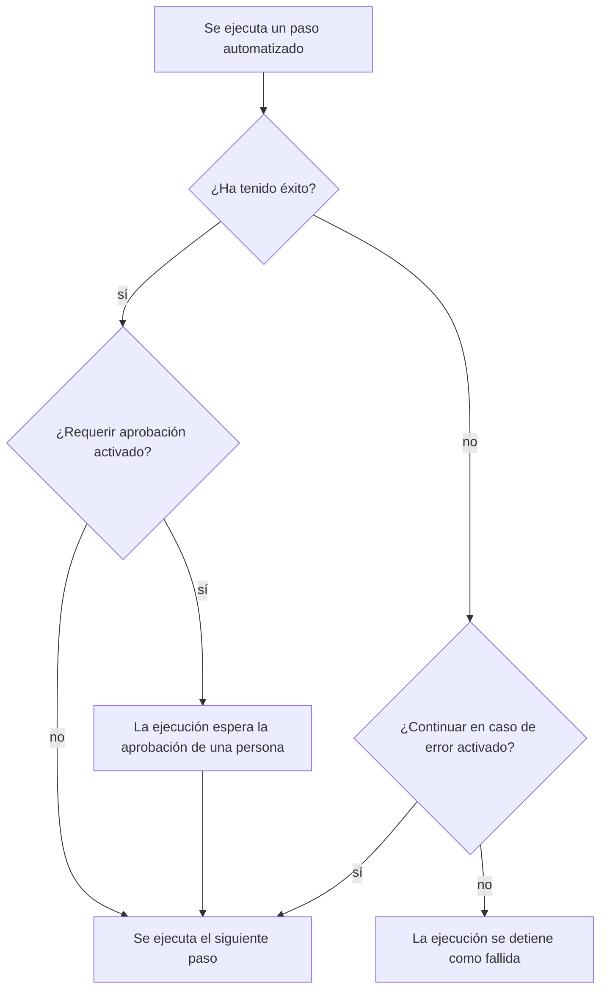

# Crear un runbook

Un runbook se escribe como una lista ordenada de pasos en su página **Pasos**. Esta página muestra cómo crear un runbook, cómo configurar cada uno de los siete tipos de paso y cómo los fallos y las aprobaciones cambian el curso de una ejecución.

:::cards
- [Crear un runbook nuevo](#crear-un-runbook-nuevo): De un runbook vacío a pasos guardados.
- [Tipos de paso](#tipos-de-paso): Manual, JavaScript, HTTP request, Bash, SSH, Kubernetes y AI.
- [Gestión de fallos y aprobaciones](#gestión-de-fallos-y-aprobaciones): Qué pasa después de que un paso falla o tiene éxito.
- [Un ejemplo completo](#un-ejemplo-completo): Un failover de base de datos en cinco pasos.
:::

## Antes de empezar

- **Un rol que escriba runbooks.** Project Owner, Project Admin y Runbook Admin crean runbooks y guardan sus pasos. Con permisos granulares necesitas **Create Runbook** y **Edit Runbook**. Consulta [Permisos](/docs/runbooks/configuration#permisos).
- **Un Runner, para los pasos JavaScript, Bash, SSH y Kubernetes.** Estos pasos se ejecutan en un [Runner](/docs/runbooks/agents) dentro de tu propia infraestructura, nunca en el Worker de OneUptime. Instala uno primero.
- **Una credencial, para los pasos SSH y Kubernetes, y permiso para leerla.** Consulta [Credenciales de runbook](/docs/runbooks/credentials). Un paso solo puede nombrar una credencial si puedes leer las credenciales de runbook: Project Owner, Project Admin o **Read Runbook Credential**. Runbook Admin no lo incluye.
- **Un proveedor de LLM, para los pasos de IA.** Consulta [Proveedores de LLM](/docs/ai/llm-provider).

## Crear un runbook nuevo

:::steps
### Abrir Runbooks

Abre **Productos → Runbooks**. Runbooks está en el grupo **Paneles y automatización**.

### Crear el runbook

Haz clic en **Crear Runbook**, escribe un **Nombre** y, si quieres, una **Descripción** de para qué sirve el runbook. En **Más campos** están el interruptor **Habilitado**, activado por defecto, y las **Etiquetas**. El nuevo runbook aparece en la lista: ábrelo.

### Añadir pasos

Ve a **Pasos**. En **Inicia tu runbook**, elige el tipo del primer paso; debajo del último paso, **Añadir otro paso** ofrece los mismos siete tipos. Cada paso se abre con su **Título**, su **Descripción** (en Markdown, visible para quien responde) y los ajustes de su tipo. En cuanto el runbook tiene un paso, **Añadir paso**, en la parte superior de la tarjeta, añade un paso Manual.

### Ordenar los pasos

Los pasos se ejecutan **en orden**. Para cambiar el orden, arrastra un paso por el asa situada a la izquierda de su cabecera; con el teclado, pon el foco en el asa, pulsa Espacio, mueve el paso con las flechas y vuelve a pulsar Espacio.

### Guardar los pasos

Haz clic en **Guardar pasos**. Hasta entonces, el editor muestra **Cambios sin guardar**. Una vez guardado, ves **Guardado** y el runbook está listo para [ejecutarse](/docs/runbooks/running).
:::

## Anatomía de un paso

Cada paso tiene estos campos:

| Campo | Para qué sirve |
| --- | --- |
| **Título** | Una etiqueta corta, visible en la lista de pasos y en cada ejecución. |
| **Descripción** | Contexto opcional para quien responde, en Markdown. En un paso Manual es la instrucción que esa persona lee. |
| **Continuar en caso de error** | Solo pasos automatizados. Si está activado, un paso que falla no detiene la ejecución: el siguiente paso se ejecuta igualmente. |
| **Requerir aprobación** | Solo pasos automatizados. Si está activado, el runbook se pausa después de este paso y espera a que una persona apruebe antes de ejecutar el siguiente. El interruptor dice **Requerir aprobación antes de ejecutar el siguiente paso**. |
| Ajustes propios del tipo | El script, la URL, el Runner, la credencial o la indicación. Consulta [Tipos de paso](#tipos-de-paso). |

## Tipos de paso

| Tipo | Se ejecuta en | Necesita |
| --- | --- | --- |
| [Manual](#manual) | Una persona | Nada |
| [JavaScript](#javascript) | Un Runner | Un Runner |
| [HTTP request](#http-request) | El Worker de OneUptime | Nada |
| [Bash](#bash) | Un Runner | Un Runner |
| [SSH](#ssh) | Un Runner | Un Runner y una credencial SSH |
| [Kubernetes](#kubernetes) | Un Runner | Un Runner y una credencial de Kubernetes |
| [AI](#ai) | El Worker de OneUptime | Un proveedor de LLM |

### Manual

Un elemento de lista de comprobación para una persona. La ejecución se pausa al llegar a un paso Manual y se queda en `WaitingForManualStep` (**Esperándote**) hasta que alguien hace clic en **Marcar como completado** u **Omitir**. Una ejecución que espera a una persona nunca caduca.

Úsalo para lo que solo una persona puede comprobar o hacer: «Confirmar en el panel del balanceador de carga que el tráfico se ha movido a la región secundaria».

### JavaScript

Un fragmento de JavaScript que se ejecuta en un sandbox `isolated-vm` en un [agente de runbook](/docs/runbooks/agents) dentro de tu propia infraestructura, no en el Worker de OneUptime.

| Campo | Qué hace | Predeterminado |
| --- | --- | --- |
| **Runner** | El Runner que ejecuta el paso. Solo ese Runner puede reclamar el trabajo. | — |
| **Script** | El JavaScript que se ejecuta. Devuelve un valor con `return` para capturarlo; cada línea de `console.log` también se captura. Lanzar un error hace fallar el paso. | — |
| **Tiempo de espera de ejecución** | Cuánto tiempo deja el Runner que se ejecute el fragmento antes de destruir el sandbox. | 30 segundos |
| **Tiempo de espera de reclamación** | Cuánto tiempo espera el Worker a que el Runner reclame el trabajo. | 2 minutos |

```javascript
const start = Date.now();
// ... your logic ...
console.log("replica lag checked");
return { durationMs: Date.now() - start };
```

El sandbox tiene 128 MB de memoria y no tiene acceso al sistema de archivos ni a los procesos. Puede hacer solicitudes HTTP con `axios`, pero solo a direcciones públicas: se rechaza una solicitud a una red privada, al propio host del Runner o a un endpoint de metadatos de la nube. Para llegar a un servicio de tu red, usa un paso [Bash](#bash) con `curl`.

### HTTP request

Una llamada HTTP saliente, hecha por el Worker de OneUptime. No hace falta ningún Runner.

| Campo | Qué hace | Predeterminado |
| --- | --- | --- |
| **Método** | `GET`, `POST`, `PUT`, `PATCH`, `DELETE` o `HEAD`. | `GET` |
| **URL** | El endpoint al que se llama. | Vacío |
| **Encabezados (JSON)** | Un objeto JSON, como `{ "Authorization": "Bearer ..." }`. Unos encabezados que no son JSON válido hacen fallar el paso. | Ninguno |
| **Cuerpo** | Se envía como JSON si se puede interpretar como JSON, y como texto en caso contrario. | Ninguno |
| **Tiempo de espera de la solicitud** | Cuánto se espera la respuesta del endpoint antes de hacer fallar el paso. | 30 segundos |

El paso tiene éxito con una respuesta `2xx` o `3xx` y falla con cualquier otra, con `HTTP <status>` como error. Las redirecciones no se siguen. Se capturan el estado, los encabezados y el cuerpo de la respuesta, hasta 50 KB.

> [!NOTE]
> El Worker nunca llama a direcciones de loopback ni de enlace local, como un endpoint de metadatos de la nube. En OneUptime Cloud solo llama a direcciones públicas. Un OneUptime autoalojado también llega a redes privadas, salvo que `DATA_SOURCE_BLOCK_PRIVATE_ADDRESSES` sea `true`. Para llamar a un servicio de tu red desde OneUptime Cloud, usa un paso [Bash](#bash) con `curl`.

Útil para: abrir un incidente en PagerDuty, publicar en un webhook de Slack, llamar a la API pública de tu proveedor de nube o a la tuya.

### Bash

Un script de bash que se ejecuta con `bash -c <script>` en un [agente de runbook](/docs/runbooks/agents) de tu propia infraestructura. Bash nunca se ejecuta en el Worker de OneUptime.

| Campo | Qué hace | Predeterminado |
| --- | --- | --- |
| **Runner** | El Runner que ejecuta el paso. Solo ese Runner puede reclamar el trabajo. | — |
| **Script de Bash** | El script. La salida (stdout y stderr) se captura hasta 50 KB, y un código de salida distinto de cero hace fallar el paso. | — |
| **Tiempo de espera de ejecución** | Cuánto tiempo deja el Runner que se ejecute el script antes de matarlo con `SIGKILL`. Auméntalo para los pasos que tardan minutos con razón. | 30 segundos |
| **Tiempo de espera de reclamación** | Cuánto tiempo espera el Worker a que el Runner reclame el trabajo. | 2 minutos |

El script se ejecuta dentro del contenedor del Runner, con las herramientas que trae su imagen, como `curl`, `wget` y el cliente `ssh`, y con el acceso de red del host en el que se ejecuta. Por ejemplo, para comprobar un servicio al que solo llega tu red:

```bash
set -euo pipefail
HTTP_CODE=$(curl -s -o /tmp/resp.txt -w "%{http_code}" "http://payments.internal:8080/health")
echo "HTTP $HTTP_CODE"
cat /tmp/resp.txt
if [[ "$HTTP_CODE" != "200" ]]; then
  echo "Health check failed"
  exit 1
fi
```

Si el Runner elegido está desconectado cuando la ejecución llega a este paso, el paso espera hasta el **tiempo de espera de reclamación** (2 minutos por defecto) y luego falla por tiempo agotado. Añade un agente en **Runbooks → Agentes de runbook** antes de confiar en un paso Bash.

> [!TIP]
> Mantén las contraseñas y los tokens fuera del script. Guárdalos como secretos de runbook y escribe `{{runbookSecrets.NAME}}` en un script de Bash o JavaScript: el Runner recibe el script con el valor ya insertado. Consulta [Secretos para scripts](/docs/runbooks/credentials#secretos-para-scripts).

### SSH

Ejecutar un comando en un host al que el Runner llega por SSH. A diferencia de `ssh host cmd` en un paso Bash, el acceso es una [credencial](/docs/runbooks/credentials) gestionada en lugar de una clave privada en el disco del Runner: cifrada en reposo, asignada a Runners concretos y nunca legible de nuevo a través de la API.

| Campo | Qué hace |
| --- | --- |
| **Runner** | El Runner que abre la conexión. Debe poder llegar al host por la red. |
| **Credencial** | Una credencial SSH con el host, el puerto, el usuario y la clave o la contraseña. Debe estar asignada al Runner que elegiste; si no, el paso falla en lugar de ejecutarse con el acceso equivocado. |
| **Comando** | Se ejecuta en el host remoto como el usuario de la credencial. La salida se captura hasta 50 KB, y un código de salida distinto de cero hace fallar el paso. |
| **Tiempo de espera de ejecución** | Cubre la conexión, la autenticación y la ejecución del comando en conjunto, para que un comando que se cuelga no mantenga abierto el paso. 30 segundos por defecto. |
| **Tiempo de espera de reclamación** | Cuánto tiempo espera el Worker a que el Runner reclame el trabajo. 2 minutos por defecto. |

### Kubernetes

Reiniciar o escalar una carga de trabajo en un clúster. Las acciones son un conjunto cerrado a propósito: un paso capaz de cambiar cualquier objeto sería una shell de administrador del clúster, y este tipo de paso existe para que las remediaciones habituales sean lo bastante seguras para la remediación automática.

| Campo | Qué hace |
| --- | --- |
| **Runner** | El Runner que llama al servidor de API del clúster. Debe poder llegar a él. |
| **Credencial** | Una credencial de Kubernetes: la URL del servidor de API, un token de cuenta de servicio y la CA del clúster. Vincula esa cuenta de servicio a un rol que solo permita lo que tus runbooks necesitan. |
| **Acción** | **Reiniciar carga de trabajo** cambia la plantilla de pod para que el controlador recree los pods, como hace `kubectl rollout restart`. **Escalar carga de trabajo** fija el número de réplicas. |
| **Tipo de carga de trabajo** | **Despliegue**, **StatefulSet** o **DaemonSet**. |
| **Espacio de nombres** y **Nombre de la carga de trabajo** | La carga de trabajo sobre la que se actúa. |
| **Réplicas** | Solo al escalar. Se permite cero: vaciar una carga de trabajo es una remediación legítima. Un DaemonSet ejecuta un pod por nodo y no se puede escalar; reinícialo en su lugar. |
| **Tiempo de espera de ejecución** | Cuánto tiempo espera el Runner a que el servidor de API acepte el cambio. 30 segundos por defecto. |
| **Tiempo de espera de reclamación** | Cuánto tiempo espera el Worker a que el Runner reclame el trabajo. 2 minutos por defecto. |

Si el servidor de API rechaza el cambio, su propio mensaje aparece en el paso, de modo que un fallo de permisos te dice qué vinculación de rol ampliar.

### AI

Pide a la IA que analice, resuma o decida algo a mitad de la ejecución. La respuesta se convierte en la salida del paso en la ejecución. Los pasos de IA se ejecutan en el Worker de OneUptime; no hace falta ningún Runner.

| Campo | Qué hace |
| --- | --- |
| **Indicación** | Lo que debe hacer la IA. Por ejemplo: «Revisa la salida de los pasos anteriores y di si es seguro continuar con la remediación». |
| **Proveedor de LLM** | Opcional. **Predeterminado del proyecto** usa el proveedor predeterminado del proyecto. Fija un proveedor cuando el paso necesite un modelo concreto, como uno autoalojado para datos que no deben salir de tu red. Consulta [Proveedores de LLM](/docs/ai/llm-provider). |
| **Incluir el contexto del paso anterior** | Si está activado, la IA ve todo sobre los pasos que se ejecutaron antes que este: título, tipo, estado, salida y mensajes de error. Recibe hasta 4.000 caracteres de la salida de cada paso. |
| **Incluir el contexto del desencadenante** | Si está activado, la IA ve qué inició la ejecución: el incidente, la alerta o el evento de mantenimiento programado vinculado (su descripción, gravedad, estado actual, monitores afectados, causa raíz, historial de estados y notas públicas), o quién ejecutó el runbook a mano. |

Combina un paso de IA con **Requerir aprobación** para mantener a una persona en el circuito: la IA analiza, alguien lee su respuesta y aprueba, y solo entonces se ejecuta el siguiente paso (de remediación).

**Lo que la IA nunca ve.** La respuesta de un paso de IA se guarda como salida del paso en la ejecución, y las ejecuciones las puede leer cualquiera con permiso de lectura de runbooks, un público más amplio que el del incidente. Por eso el contexto del desencadenante deja fuera las **notas internas privadas** y los **mensajes de canales de Slack y Microsoft Teams**. La salida de los pasos anteriores se analiza en busca de secretos (tokens, claves, credenciales), que se ocultan antes de enviarla al modelo. Las imágenes incrustadas y los datos codificados largos, como una captura de pantalla pegada en la descripción de un incidente, también se dejan fuera, con una nota breve en su lugar.

Los pasos de IA se miden y se facturan como cualquier otra función de IA. El paso falla, con un mensaje que explica por qué, cuando no tiene indicación, cuando las funciones de IA están desactivadas en el proyecto, cuando no hay ningún proveedor de LLM disponible o cuando el proveedor fijado ya no está disponible para el proyecto. Activa **Continuar en caso de error** si el resto del runbook debe ejecutarse igualmente.

## Gestión de fallos y aprobaciones



Por defecto, un paso que falla detiene la ejecución y la marca como `Failed`, con el error del paso como motivo. Con **Continuar en caso de error** activado, el fallo se registra y se ejecuta el siguiente paso, lo que encaja con runbooks del tipo «prueba estas tres cosas y luego avisa». **Requerir aprobación** se aplica después de que un paso tenga éxito: la ejecución espera en ese paso hasta que alguien hace clic en **Aprobar y continuar** u **Omitir**.

## Guardar y editar

Los cambios en los pasos se aplican cuando haces clic en **Guardar pasos**. Cada ejecución trabaja con la instantánea tomada al empezar, así que las ejecuciones en curso conservan los pasos con los que empezaron, y editar nunca reescribe el historial de ejecuciones anteriores.

## Un ejemplo completo

Un runbook para «DB primary unreachable»:

| # | Tipo | Qué hace |
| --- | --- | --- |
| 1 | JavaScript | Obtener el host primario actual de tu servicio de configuración y registrarlo. |
| 2 | Manual | «Confirmar que el retraso de replicación en el secundario está por debajo de 5 segundos». |
| 3 | HTTP request | `POST` a la API de tu orquestador de failover. |
| 4 | Manual | «Verificar que las escrituras van ahora al nuevo primario». |
| 5 | HTTP request | `POST` de un mensaje de normalidad a un webhook de Slack. |

Quien responde ve ejecutarse el paso 1, marca el paso 2, ve ejecutarse el paso 3, marca el paso 4 y la ejecución termina con el paso 5. La salida de cada paso queda capturada para el postmortem.

## Siguientes pasos

:::cards
- [Ejecutar un runbook](/docs/runbooks/running): Iniciar una ejecución y completar, aprobar u omitir sus pasos.
- [Reglas de runbook](/docs/runbooks/rules): Iniciar este runbook automáticamente en los incidentes que coincidan.
- [Agentes de runbook](/docs/runbooks/agents): Instalar el Runner que necesitan tus pasos de script.
- [Credenciales de runbook](/docs/runbooks/credentials): Dar a los pasos SSH y Kubernetes acceso gestionado.
:::
