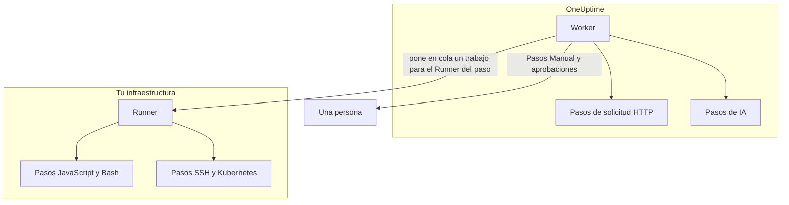

# Configuración y seguridad de runbooks

Esta es la referencia para operadores y revisores de seguridad: dónde se ejecuta cada tipo de paso, los límites y tiempos de espera que se aplican a un paso, quién puede hacer qué y cómo se refuerzan los runbooks.

:::cards
- [Dónde se ejecuta cada tipo de paso](#dónde-se-ejecuta-cada-tipo-de-paso): El Worker, un Runner o una persona.
- [Límites de salida y tiempos de espera](#límites-de-salida-y-tiempos-de-espera): Cada límite que se aplica a un paso.
- [Permisos](#permisos): Permisos granulares, los tres roles de runbook y a qué runbooks llega un rol.
- [Notas de endurecimiento](#notas-de-endurecimiento): Sandbox, acceso a la red y autenticación de los Runners.
:::

## Dónde se ejecuta cada tipo de paso

| Tipo de paso | Se ejecuta en | Cómo |
| --- | --- | --- |
| Manual | Una persona | La ejecución espera hasta que alguien completa u omite el paso. |
| JavaScript | Un Runner | En un sandbox `isolated-vm`. |
| HTTP request | El Worker de OneUptime | Una llamada HTTP saliente. |
| Bash | Un Runner | `bash -c <script>`. |
| SSH | Un Runner | Una conexión SSH, con una [credencial](/docs/runbooks/credentials). |
| Kubernetes | Un Runner | Una llamada al servidor de API del clúster, con una credencial. |
| AI | El Worker de OneUptime | Una llamada al proveedor de LLM del proyecto. |

## Cómo se envían los pasos de Runner

Los pasos JavaScript, Bash, SSH y Kubernetes **nunca se ejecutan en el Worker de OneUptime**. Se envían como trabajos a un [agente de runbook](/docs/runbooks/agents) concreto: un pequeño proceso que instalas en un host de tu propia infraestructura.

El modelo de envío:

1. Quien escribe el paso del runbook elige un Runner en la lista desplegable al escribir el paso.
2. Cuando el paso se ejecuta, el Worker inserta una fila en `RunnerJob` con `targetAgentId` igual al ID de ese Runner y estado `Pending`.
3. Ese Runner concreto (y solo ese Runner) reclama el trabajo de forma atómica, lo ejecuta localmente — Bash mediante `bash -c <script>`, JavaScript dentro de un sandbox `isolated-vm`, SSH y Kubernetes con la credencial del paso — y devuelve el resultado.
4. El Worker reanuda el runbook con el resultado.

Ya no existe el indicador de entorno `RUNBOOK_BASH_ENABLED`. Que estos pasos funcionen en un despliegue depende únicamente de que el proyecto tenga un Runner conectado con **Ejecuta runbooks** activado.

## Límites de salida y tiempos de espera

| Límite | Valor | Se aplica a |
| --- | --- | --- |
| Salida por paso | **50 KB**. La salida más larga se corta con una marca. | Cada paso automatizado |
| Tiempo de espera de ejecución | **30 segundos** por defecto | Pasos JavaScript, Bash, SSH y Kubernetes |
| Tiempo de espera de la solicitud | **30 segundos** por defecto | Pasos de solicitud HTTP |
| Tiempo de espera de reclamación | **2 minutos** por defecto: cuánto espera el Worker a que el Runner elegido tome el trabajo antes de darlo por fallido | Pasos JavaScript, Bash, SSH y Kubernetes |
| Rango de los tiempos de espera | **1 segundo a 1 hora** | Cada tiempo de espera |
| Espera de una persona | Sin límite | Pasos Manual y aprobaciones |

Configura los tiempos de espera paso a paso en la página **Pasos** del runbook; deja un campo vacío para mantener el valor predeterminado. Un valor fuera del rango se ajusta al límite al ejecutarse el paso, de modo que una configuración mal escrita no puede ni desactivar el tiempo de espera ni ocupar indefinidamente un hueco del Worker.

## Permisos

Los permisos de runbook están en el grupo de permisos `Runbook`:

- `CreateRunbook`, `EditRunbook`, `DeleteRunbook`, `ReadRunbook` — gestionar las plantillas de runbook.
- `CreateRunbookExecution`, `EditRunbookExecution`, `DeleteRunbookExecution`, `ReadRunbookExecution` — iniciar, marcar, eliminar y leer ejecuciones.
- `CreateRunbookRule`, `EditRunbookRule`, `DeleteRunbookRule`, `ReadRunbookRule` — gestionar las reglas de activación automática.
- `CreateRunner`, `EditRunner`, `DeleteRunner`, `ReadRunner` — gestionar los Runners que ejecutan pasos en tu propia infraestructura. (Se llamaban `*RunbookAgent` antes del cambio de nombre a Runner; las asignaciones existentes se migraron, así que no hay que reasignar nada.)
- `RunbookAdmin`, `RunbookMember`, `RunbookViewer` (roles) — `RunbookAdmin` construye runbooks, sus reglas y los Runners en los que se ejecutan, y los ejecuta. `RunbookMember` abre runbooks y sus ejecuciones y los ejecuta — inicia una ejecución, completa u omite sus pasos y la cancela —, pero no crea, cambia ni elimina ningún runbook ni Runner. `RunbookViewer` lee runbooks y sus ejecuciones y no ejecuta nada. `RunbookAdmin` reúne todos los permisos granulares anteriores.

Un rol ejecuta los runbooks a los que llega su alcance. Una asignación de `RunbookMember`, `RunbookAdmin` o `ProjectMember` limitada a algunas etiquetas inicia y hace avanzar las ejecuciones de los runbooks que llevan esas etiquetas, una limitada a **Owned** las de los runbooks de los que su equipo es propietario, y el bloqueo de una etiqueta por un equipo le quita esos runbooks. `CreateRunbookExecution` y `EditRunbookExecution` tratan sobre ejecuciones, que no llevan etiquetas, así que llegan a todos los runbooks del proyecto. Aprobar una sugerencia de remediación que inicia un runbook se comprueba de la misma manera.

Las credenciales y los secretos quedan fuera de `RunbookAdmin`. Gestionarlos requiere `ProjectOwner` o `ProjectAdmin`, o los permisos `CreateRunbookCredential`, `EditRunbookCredential`, `DeleteRunbookCredential`, `ReadRunbookCredential` y `CreateRunbookSecret`, `EditRunbookSecret`, `DeleteRunbookSecret`, `ReadRunbookSecret`. Consulta [Credenciales de runbook](/docs/runbooks/credentials).

Las reglas de propietario y de etiquetas de **Runbooks → Ajustes** también quedan fuera de `RunbookAdmin`. Gestionarlas requiere `ProjectOwner` o `ProjectAdmin`, o los permisos `CreateRunbookOwnerRule` y `CreateRunbookLabelRule` con sus equivalentes de edición, eliminación y lectura.

Para saber cómo se combinan los roles y los permisos granulares, consulta [Usuarios, equipos y permisos](/docs/permissions/index).

## Cola y worker

Las ejecuciones de runbook se ejecutan en la cola de BullMQ `Runbook`. Cada proceso Worker ejecuta hasta 25 ejecuciones a la vez; el número está fijado en el código, no lo define una variable de entorno.

Cuando se marca un paso manual a través de la API, la ejecución se vuelve a poner en cola para continuar desde el siguiente paso. Espera como `Scheduled` hasta que un Worker la retoma, y una ejecución en cola nunca falla por esperar.

## Notas de endurecimiento

- **JavaScript, Bash, SSH y Kubernetes** se ejecutan en un host de Runner que tú controlas, no en el Worker de OneUptime. JavaScript se ejecuta en un aislamiento `isolated-vm` separado con 128 MB de memoria y sin acceso al sistema de archivos ni a los procesos del Runner; puede hacer solicitudes HTTP con `axios`, pero se rechazan las solicitudes a redes privadas y a direcciones de loopback y de enlace local. Bash se ejecuta mediante `bash -c`, con su tiempo de espera aplicado en el Runner.
- **Los pasos HTTP** usan una validación de estado permisiva, de modo que una respuesta 4xx o 5xx se registra como paso fallido en lugar de lanzar una excepción, y la salida capturada refleja lo que el servicio remoto devolvió de verdad. Las redirecciones no se siguen. El Worker nunca llama a direcciones de loopback ni de enlace local, como un endpoint de metadatos de la nube; en OneUptime Cloud también rechaza las direcciones de red privada, y un OneUptime autoalojado las rechaza con `DATA_SOURCE_BLOCK_PRIVATE_ADDRESSES=true`.
- **Los pasos de IA** nunca ven las notas privadas de los incidentes ni los mensajes de Slack y Microsoft Teams, y la salida de los pasos anteriores se analiza en busca de secretos, que se ocultan antes de llegar al modelo. Las imágenes incrustadas y los datos codificados largos se dejan fuera de la indicación. Consulta [AI](/docs/runbooks/authoring#ai).
- **La autenticación de los Runners** se hace con un ID y una clave secreta, definidos en el contenedor del Runner como variables de entorno. En el servidor, la identidad válida del Runner sale de la fila de la base de datos que corresponde al ID y la clave presentados: un cliente no puede hacerse pasar por otro Runner ni siquiera con una clave comprometida.
- **Las credenciales y los secretos** están cifrados en reposo, la API nunca los devuelve y solo se entregan a los Runners a los que están asignados, cuando estos reclaman un paso.

## Tablas de la base de datos

| Tabla | Qué contiene |
| --- | --- |
| `Runbook` | La plantilla: nombre, slug, descripción, `isEnabled`, etiquetas y los pasos en JSON. |
| `RunbookExecution` | Una fila por ejecución, con las claves foráneas opcionales `incidentId`, `alertId` y `scheduledMaintenanceId` y un array JSON `stepExecutions` que guarda una instantánea de los pasos y del estado de cada uno. |
| `RunbookRule` | Las reglas de activación automática, con un discriminador `triggerEntityType` (Incident, Alert, ScheduledMaintenance), una relación de muchos a muchos con los runbooks que iniciar y aquello con lo que comparan: una columna JSON `criteria` (las condiciones) más vínculos de muchos a muchos con monitores, gravedades de incidente, gravedades de alerta, etiquetas y etiquetas de monitor, y patrones de título, descripción, nombre de monitor y descripción de monitor. |
| `Runner` | Una fila por Runner instalado: nombre, clave secreta, `lastAlive`, `connectionStatus`, información del host y capacidades. |
| `RunnerJob` | Una fila por paso enviado a un Runner: `targetAgentId` (el Runner que eligió quien escribió el paso), tipo de paso, script o carga útil, estado (`Pending` → `Claimed` → `Running` → `Succeeded`, `Failed`, `TimedOut` o `Cancelled`), plazo de reclamación, concesión, salida y código de salida. |
| `RunbookCredential` | Las credenciales SSH y Kubernetes, con sus campos secretos cifrados, y los Runners a los que están asignadas. |
| `RunbookSecret` | Los secretos de runbook, cifrados, y los Runners que pueden recibirlos. |

## Consejos de operación

- **Asegúrate de que el Runner que eliges en un paso está sano.** Si necesitas redundancia, ejecuta un segundo Runner y reparte los pasos entre ambos, o mantén un runbook de respaldo que apunte al otro Runner.
- **Captura URL, no blobs.** Si un paso genera más de unos pocos KB de salida, escríbela en un almacenamiento de objetos o en tu sistema de logs y devuelve la URL.
- **La idempotencia importa.** Un paso de solicitud HTTP o de IA se vuelve a ejecutar si el Worker se reinicia a mitad del paso y la ejecución se reanuda. Un paso en un Runner se envía como mucho una vez por ejecución, pero un script puede haberse ejecutado en parte antes de un fallo, y puede que vuelvas a ejecutar el runbook. Diseña los pasos para que se puedan repetir sin riesgo.

## Siguientes pasos

:::cards
- [Agentes de runbook](/docs/runbooks/agents): Instalar, operar y solucionar problemas de los Runners.
- [Credenciales de runbook](/docs/runbooks/credentials): Acceso SSH y Kubernetes gestionado, y secretos para scripts.
- [Usuarios, equipos y permisos](/docs/permissions/index): Cómo deciden los roles, las etiquetas y los equipos quién ejecuta qué.
:::
