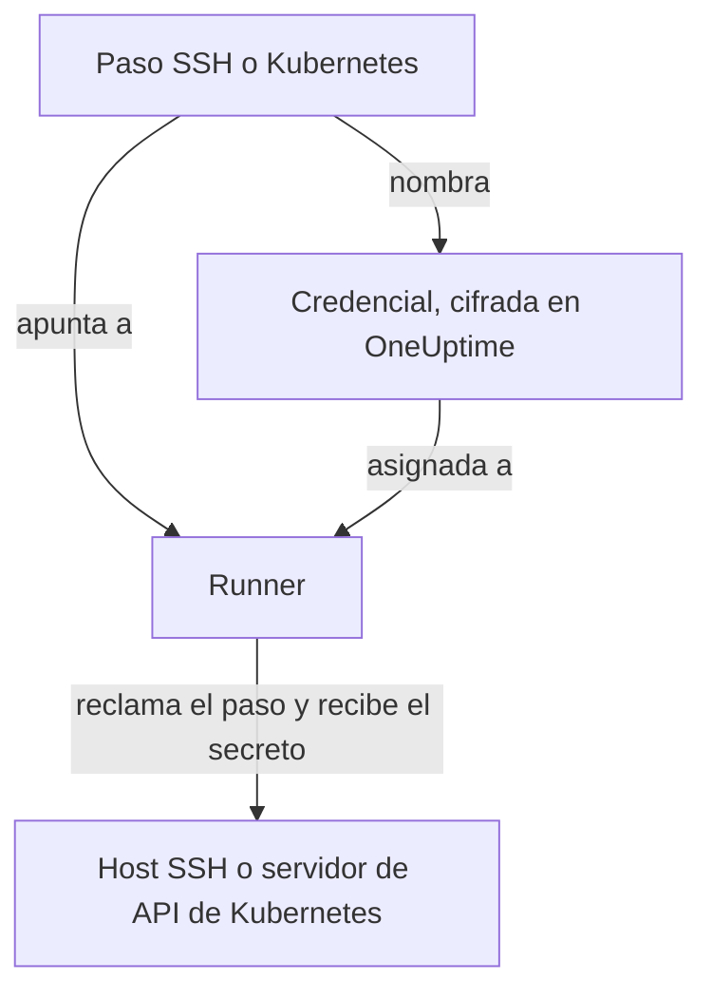

# Credenciales de runbook

Una credencial es la forma en que un runbook llega a algo que **no** es el propio host del Runner: un servidor por SSH o un clúster de Kubernetes. Sin ella, «reiniciar el servicio» significa escribir un script de shell y colocar a mano una clave o un kubeconfig en el host del Runner, donde queda en el disco fuera del control de OneUptime. Una credencial es ese mismo acceso como objeto gestionado: cifrada en reposo, asignada a Runners concretos y referenciada por su nombre desde un paso.

Gestiónalas en **Runbooks → Agentes de runbook → Credenciales**.

:::cards
- [Crear una credencial](#crear-una-credencial): Su acceso y los Runners que pueden usarla.
- [Mínimo privilegio en el otro extremo](#mínimo-privilegio-en-el-otro-extremo): Limitar lo que puede hacer la clave o el token.
- [Secretos para scripts](#secretos-para-scripts): Dar una contraseña o un token a un script de Bash o JavaScript.
:::

## Cómo se usa una credencial



Un paso SSH o Kubernetes nombra una credencial y un Runner. Cuando ese Runner reclama el paso, OneUptime comprueba que la credencial le está asignada, descifra el secreto y lo entrega solo en la respuesta a esa reclamación. El secreto nunca se guarda en el trabajo y nunca se puede leer a través de la API.

## Antes de empezar

- **Un rol que gestione credenciales.** Project Owner y Project Admin, o cualquiera con el permiso **Create Runbook Credential**. El rol Runbook Admin no lo incluye. Asignar una credencial SSH a un Runner que ejecuta los comandos de OneUptime AI también requiere **Read Runbook Credential**; consulta [Runners que ejecutan los comandos de OneUptime AI](#runners-que-ejecutan-los-comandos-de-oneuptime-ai).
- **Un plan que las incluya.** En OneUptime Cloud, las credenciales de runbook necesitan el plan **Growth** o superior.
- **Un [Runner](/docs/runbooks/agents)** que llegue por la red al host o al servidor de API del clúster.

## Crear una credencial

:::steps
### Abrir Credenciales

Abre **Runbooks → Agentes de runbook → Credenciales** y haz clic en **Crear Credencial de runbook**.

### Ponerle nombre y elegir su tipo

En el paso **Credencial**, escribe un **Nombre**, como `prod-cluster`, una **Descripción** opcional y el **Tipo**: **SSH** o **Kubernetes**. El tipo no se puede cambiar después; crea una credencial nueva en su lugar.

### Introducir el acceso

:::tabs
@tab SSH
En **Host SSH**, escribe el **Nombre de host**, el **Puerto** (22 si se deja vacío) y el **Nombre de usuario**. En **Autenticación SSH**, pega una **Clave privada (PEM)**, con su **Frase de contraseña de la clave privada** si la tiene, o escribe una **Contraseña** para un host sin acceso por clave. Una clave es la mejor opción cuando puedes elegir.
@tab Kubernetes
En **Kubernetes**, escribe la **URL del servidor de API**, como `https://10.0.0.1:6443`, el **Token de cuenta de servicio** y el **Certificado de CA (PEM)** para que el Runner pueda verificar el servidor de API. Deja la CA vacía solo si el servidor de API presenta un certificado en el que el Runner ya confía.
:::

### Asignarla a Runners

En el paso **Agentes de runbook**, elige los Runners que pueden usar la credencial y haz clic en **Crear Credencial de runbook**. Una credencial que no está asignada a ningún Runner no la puede usar ningún paso.

### Usarla en un paso

En un [paso SSH o Kubernetes](/docs/runbooks/authoring#tipos-de-paso), elige uno de esos Runners y después la credencial en **Credencial**. Un paso solo ofrece credenciales de su propio tipo, y guardar un paso que nombra una credencial requiere permiso para leer las credenciales de runbook.
:::

## Qué se guarda

| Tipo | Campos |
| --- | --- |
| SSH | Nombre de host, puerto (22 por defecto), nombre de usuario y, o bien una clave privada PEM (con una frase de contraseña opcional), o bien una contraseña. |
| Kubernetes | URL del servidor de API, un token de cuenta de servicio y el certificado de la CA del clúster. |

## Los valores secretos son de solo escritura

Las claves privadas, frases de contraseña, contraseñas y tokens de cuenta de servicio están cifrados en reposo y la API **nunca los devuelve**: ni al panel, ni a un flujo de trabajo, ni a una exportación. La tabla puede mostrarte lo que *es* una credencial sin mostrar nunca lo que contiene.

Por eso no hay un «ver» para un valor secreto, solo «reemplazar»: volver a introducir un valor es la forma de rotarlo. Si pierdes el original, emite una clave nueva en el sistema de destino y actualiza la credencial.

## Asignar una credencial a Runners

Una credencial solo la pueden usar los Runners a los que la asignas, y un paso debe apuntar a uno de esos Runners. Si un paso nombra una credencial que no está asignada a su Runner, el paso **falla en lugar de ejecutarse**: un Runner que no hace nada en silencio se ve exactamente igual que uno que funcionó.

La asignación es el límite de acceso, así que mantenla estrecha: un Runner que solo reinicia un clúster no necesita la clave SSH de tus hosts de base de datos.

### Runners que ejecutan los comandos de OneUptime AI

En un Runner con **Ejecuta comandos de remediación con IA** activado, OneUptime AI elige entre las credenciales SSH asignadas al Runner para los comandos que ejecuta allí. Por eso una credencial SSH solo llega a un Runner así a través de alguien que puede leer las credenciales de runbook (**Read Runbook Credential**, o un Project Owner o un Project Admin), sea lo que sea lo que se guarde primero:

- **Asignar la credencial.** Crear una credencial SSH con un Runner así, o añadir un Runner así a una credencial, requiere ese permiso. Sin él, el guardado se rechaza y nombra el Runner: asigna la credencial a Runners que no ejecuten comandos de remediación con IA, o pide a alguien con el permiso que la asigne.
- **Activar el interruptor.** Activar **Ejecuta comandos de remediación con IA** en un Runner que tiene credenciales SSH requiere el mismo permiso.

Quitar Runners de una credencial, guardar una credencial con los Runners que ya tiene y las credenciales de Kubernetes no piden nada más: los comandos kubectl de OneUptime AI se ejecutan con la credencial vinculada a su clúster. Las asignaciones de credenciales y la activación del interruptor por alguien sin ese permiso se guardan de una en una en un proyecto, para que las dos no puedan superar sus comprobaciones a la vez; un guardado que llega mientras se guarda otro lo espera, y si tarda demasiado se rechaza con *Try again in a moment*. Vuelve a guardarlo.

Los pasos de un flujo de trabajo actúan como un Project Admin, pero no se les presta la lectura de credenciales de runbook de un Project Admin: un paso la tiene solo si la tiene la persona que guardó por última vez los pasos del flujo de trabajo. Consulta [Qué pueden hacer los pasos de un flujo de trabajo](/docs/workflows/configuration#qué-pueden-hacer-los-pasos-de-un-workflow).

## Mínimo privilegio en el otro extremo

OneUptime no puede limitar lo que tu credencial puede hacer en el sistema de destino: eso le toca al sistema de destino, y merece la pena hacerlo:

- **SSH**: prefiere una clave a una contraseña, da al usuario solo los comandos que necesita (un comando forzado o una shell restringida cuando sea práctico) y no reutilices la clave personal de un administrador.
- **Kubernetes**: vincula la cuenta de servicio a un Role que permita `patch` exactamente en las cargas de trabajo que tocan tus runbooks, exactamente en los espacios de nombres donde se ejecutan. **Reiniciar carga de trabajo** modifica la propia carga de trabajo, y **Escalar carga de trabajo** modifica su subrecurso `scale`: no hace falta nada más.

Por ejemplo, una cuenta de servicio que puede reiniciar y escalar un Deployment, y nada más:

```yaml title="oneuptime-runbooks-rbac.yaml"
apiVersion: v1
kind: ServiceAccount
metadata:
  name: oneuptime-runbooks
  namespace: checkout
---
apiVersion: rbac.authorization.k8s.io/v1
kind: Role
metadata:
  name: oneuptime-runbooks
  namespace: checkout
rules:
  # Restart workload: patches the Deployment's pod template.
  - apiGroups: ["apps"]
    resources: ["deployments"]
    resourceNames: ["checkout-api"]
    verbs: ["patch"]
  # Scale workload: patches the Deployment's scale subresource.
  - apiGroups: ["apps"]
    resources: ["deployments/scale"]
    resourceNames: ["checkout-api"]
    verbs: ["patch"]
---
apiVersion: rbac.authorization.k8s.io/v1
kind: RoleBinding
metadata:
  name: oneuptime-runbooks
  namespace: checkout
subjects:
  - kind: ServiceAccount
    name: oneuptime-runbooks
    namespace: checkout
roleRef:
  apiGroup: rbac.authorization.k8s.io
  kind: Role
  name: oneuptime-runbooks
```

Para un StatefulSet o un DaemonSet, usa `statefulsets` o `daemonsets` en su lugar. Un DaemonSet no se puede escalar, así que no necesita una regla `scale`.

## Secretos para scripts

Los pasos Bash y JavaScript no tienen campo **Credencial**. Para dar a un script una contraseña, un token o una clave de API sin escribirla en el runbook, guárdala como **secreto de runbook**. Los secretos se gestionan en **Runbooks → Ajustes → Secretos**, por los Project Owners y Project Admins o con el permiso **Create Runbook Secret**.

:::steps
### Crear el secreto

Haz clic en **Crear Secreto de runbook**. En el paso **Secreto**, escribe un **Nombre** (letras, números, guiones y guiones bajos), una **Descripción** opcional y el **Valor del secreto**. En el paso **Acceso**, elige los Runners en **Agentes de runbook que tienen acceso a este secreto**.

### Usarlo en un script

Escribe `{{runbookSecrets.NAME}}` donde va el valor:

```bash
curl -s -X POST \
  -H "Authorization: Bearer {{runbookSecrets.CDN_API_TOKEN}}" \
  "https://api.cdn.example.com/v1/purge"
```

Cuando un Runner al que está asignado el secreto reclama el paso, recibe el script con el valor ya insertado.
:::

Como los campos secretos de una credencial, el valor de un secreto está cifrado en reposo y la API nunca lo devuelve: **Actualizar valor del secreto** lo reemplaza. En OneUptime Cloud, los secretos de runbook también necesitan el plan **Growth** o superior.

| | Credencial | Secreto de runbook |
| --- | --- | --- |
| Lo usan | Los pasos SSH y Kubernetes | Los scripts de Bash y JavaScript |
| Contiene | Un host y su clave, o la URL y el token de un clúster | Cualquier valor único |
| Se gestiona en | **Runbooks → Agentes de runbook → Credenciales** | **Runbooks → Ajustes → Secretos** |
| Llega al Runner | En la respuesta a la reclamación de un paso que la nombra | Insertado en el script del paso que reclama |
| Se puede volver a leer por la API | Solo sus campos no secretos | Nunca su valor |

## Quién puede verlas

Crear, editar y eliminar credenciales requiere los permisos de credenciales de runbook (o Project Owner/Admin). Leer una credencial muestra solo sus campos no secretos.

Ten en cuenta que la **clave de agente** de un Runner equivale a las credenciales que tiene asignadas: cualquier cosa que tenga la clave puede reclamar trabajo como ese Runner y recibir material de credenciales. Por eso las claves de agente solo las pueden leer los Project Owners, los Project Admins y los Runbook Admins: trátalas igual que tratarías las propias credenciales.

## Siguientes pasos

:::cards
- [Crear un runbook](/docs/runbooks/authoring): Escribir los pasos SSH y Kubernetes que usan una credencial.
- [Agentes de runbook](/docs/runbooks/agents): Instalar el Runner al que se asigna una credencial.
- [Configuración y seguridad de runbooks](/docs/runbooks/configuration): Permisos y endurecimiento de toda la pila de runbooks.
:::
