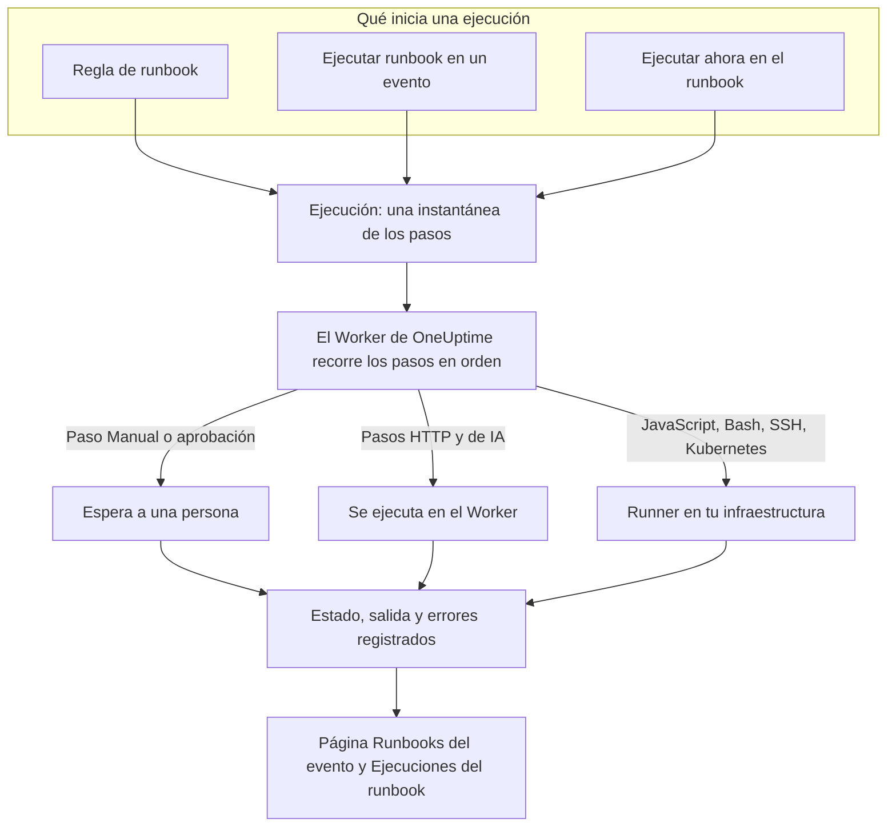

# Visión general de los Runbooks

Un runbook es un procedimiento de respuesta reutilizable: una lista ordenada de pasos manuales y automatizados que ejecutas sobre un incidente, una alerta o un evento de mantenimiento programado. Convierte el hilo de «¿y ahora qué hacemos?» en una lista de comprobación que cualquier persona de guardia puede seguir a las 3 de la madrugada, con los scripts, las llamadas a API y las aprobaciones ya escritos. Los runbooks son para los ingenieros de guardia que responden a los incidentes y para los equipos de plataforma que automatizan esa respuesta.

:::cards
- [Crear un runbook](/docs/runbooks/authoring): Crear un runbook y escribir sus pasos.
- [Reglas de runbook](/docs/runbooks/rules): Iniciar runbooks en nuevos incidentes, alertas y eventos de mantenimiento.
- [Ejecutar un runbook](/docs/runbooks/running): Iniciar una ejecución, completar y aprobar sus pasos, cancelarla.
- [Agentes de runbook](/docs/runbooks/agents): Instalar el Runner que ejecuta tus scripts en tu propia infraestructura.
:::

## Cómo se ejecuta un runbook



Cada ejecución de un runbook es una **ejecución**. Al empezar, los pasos del runbook se copian en ella y OneUptime los recorre en orden. Un paso Manual, o un paso que necesita aprobación, pausa la ejecución hasta que alguien actúa.

Los pasos HTTP y de IA se ejecutan en el Worker de OneUptime. Los pasos JavaScript, Bash, SSH y Kubernetes se ejecutan en un [Runner](/docs/runbooks/agents) que instalas en tu propia infraestructura, así que tus scripts nunca se ejecutan en los servidores de OneUptime. El estado, la salida y el mensaje de error de cada paso se registran en la ejecución, que queda unida al incidente, la alerta o el evento para el que se ejecutó.

## Conceptos clave

| Término | Significado |
| --- | --- |
| **Runbook** | La plantilla. Un procedimiento con nombre y reutilizable, con una lista ordenada de pasos y un interruptor **Ejecutar este runbook**. |
| **Paso** | Un elemento de un runbook. Tiene un tipo (Manual, JavaScript, HTTP request, Bash, SSH, Kubernetes o AI), un título, una descripción y ajustes propios de su tipo. |
| **Regla de runbook** | Una regla que adjunta automáticamente uno o más runbooks a los incidentes, alertas o eventos de mantenimiento programado que cumplen sus condiciones: sus monitores, su gravedad, sus etiquetas, las etiquetas de sus monitores, su título o su descripción. |
| **Ejecución** | Una ejecución de un runbook. Se crea cuando una regla se activa, cuando alguien hace clic en **Ejecutar runbook** en un evento o cuando alguien hace clic en **Ejecutar ahora** en el propio runbook. Guarda una instantánea de los pasos y el estado y la salida de cada paso. |
| **Instantánea** | La copia congelada de los pasos del runbook que vive en cada ejecución. Puedes editar el runbook más tarde sin reescribir el historial de las ejecuciones anteriores. |
| **Runner** | Un pequeño agente que ejecutas en un host de tu propia infraestructura. Ejecuta los pasos JavaScript, Bash, SSH y Kubernetes que lo nombran. También se llama agente de runbook. |
| **Credencial** | Acceso SSH o Kubernetes gestionado que usan los pasos SSH y Kubernetes. Cifrada en reposo y entregada solo a los Runners a los que la asignas. |
| **Secreto** | Un único valor, como un token de API, que un script de Bash o JavaScript usa como `{{runbookSecrets.NAME}}`. Cifrado en reposo y entregado solo a los Runners a los que lo asignas. |

## Tipos de paso

Elige el tipo que encaja con cada paso. [Crear un runbook](/docs/runbooks/authoring) detalla los ajustes de cada tipo.

| Tipo de paso | Se ejecuta en | Úsalo cuando… | Ejemplo |
| --- | --- | --- | --- |
| **Manual** | Una persona | Una persona tiene que verificar algo, tomar una decisión o actuar donde OneUptime no puede. | «Confirmar que el tráfico se ha movido a la región secundaria». |
| **JavaScript** | Un Runner | Necesitas un cálculo pequeño y acotado, en un sandbox. | Calcular el retraso de réplica y decidir si continuar. |
| **HTTP request** | El Worker de OneUptime | Llamas a una API existente: un proveedor de nube, PagerDuty, un webhook de Slack, tu propio servicio. | `POST` a tu orquestador de failover. |
| **Bash** | Un Runner | Necesitas comandos de shell en tu propia infraestructura. | Ejecutar `kubectl rollout restart` o un script de recuperación. |
| **SSH** | Un Runner | Necesitas un comando en un host remoto, con una credencial SSH gestionada. | Reiniciar un servicio en un servidor web. |
| **Kubernetes** | Un Runner | Necesitas reiniciar o escalar un Deployment, un StatefulSet o un DaemonSet. | Reiniciar `checkout-api` en `production`. |
| **AI** | El Worker de OneUptime | Quieres un análisis, un resumen o una valoración a mitad de la ejecución, del proveedor de LLM de tu proyecto. | «Revisa los diagnósticos de arriba. ¿Es seguro hacer el failover?» |

Un runbook puede mezclarlos todos. La fuerza de los runbooks está en intercalar comprobaciones humanas con automatización y análisis de IA.

## Qué inicia una ejecución

| Cómo | Dónde | La ejecución queda unida a |
| --- | --- | --- |
| Una regla de runbook | **Incidentes**, **Alertas** o **Mantenimiento programado** → **Reglas** → **Reglas de runbook** | El nuevo incidente, alerta o evento |
| **Ejecutar runbook** | La página **Runbooks** de un incidente, una alerta o un evento de mantenimiento programado | Ese evento |
| **Ejecutar ahora** | La página **Vista general** del runbook | Nada: una ejecución puntual |
| Una regla de remediación automática | Consulta [AI SRE](/docs/ai/ai-sre) | El incidente o la alerta |

Un runbook cuyo interruptor **Ejecutar este runbook** está desactivado, en su página **Ajustes**, no se inicia por ninguna de estas vías. Las ejecuciones ya iniciadas continúan.

## Dónde están los runbooks en el panel

Runbooks está en **Productos**, en el grupo **Paneles y automatización**.

| Página | Qué haces allí |
| --- | --- |
| **Productos → Runbooks** | Explorar, crear y abrir runbooks. |
| Los **Pasos** de un runbook | Escribir y reordenar sus pasos, y después **Guardar pasos**. |
| La **Vista general** de un runbook | Ver su última ejecución y sus resultados, y hacer clic en **Ejecutar ahora**. |
| Las **Ejecuciones** de un runbook | Todas las ejecuciones de este runbook, filtradas por estado o fecha de inicio. |
| Los **Propietarios** de un runbook | Añadir las personas y los equipos responsables de él. |
| Los **Ajustes** de un runbook | Desactivar **Ejecutar este runbook** sin eliminar el runbook. |
| **Runbooks → Ejecuciones** | Todas las ejecuciones de todos los runbooks del proyecto. |
| **Runbooks → Agentes de runbook** y **Runbooks → Agentes de runbook → Credenciales** | Instalar [Runners](/docs/runbooks/agents) y gestionar [credenciales](/docs/runbooks/credentials). |
| **Runbooks → Ajustes** | Gestionar los [secretos](/docs/runbooks/credentials#secretos-para-scripts) de los scripts, y las **Reglas del propietario** y **Reglas de etiquetas** que añaden propietarios y etiquetas a los runbooks nuevos. |
| **Incidentes / Alertas / Mantenimiento programado → Reglas → Reglas de runbook** | Crear las reglas que inician runbooks automáticamente. |
| Un incidente, una alerta o un evento de mantenimiento → **Runbooks** | Ver las ejecuciones unidas a él, y hacer clic en **Ejecutar runbook** para iniciar una. |

## Un ejemplo completo

Supongamos que quieres que cada incidente con «db-primary» en el título inicie un runbook de failover de base de datos de cinco pasos.

:::steps
### Crear el runbook

En **Runbooks**, haz clic en **Crear Runbook** y llámalo «DB primary failover». Ábrelo, ve a **Pasos**, añade estos pasos y haz clic en **Guardar pasos**:

| # | Tipo | Título |
| --- | --- | --- |
| 1 | JavaScript | Capturar el retraso de réplica antes del failover |
| 2 | Manual | Confirmar en el panel del DBA que la réplica está sana |
| 3 | HTTP request | `POST` al orquestador de failover |
| 4 | Manual | Verificar que las escrituras van al nuevo primario |
| 5 | HTTP request | Publicar el aviso de normalidad en `#db-incidents` en Slack |

### Añadir una regla

En **Incidentes → Reglas → Reglas de runbook**, crea una regla con una condición y el runbook que se debe iniciar:

```text
Conditions:  Incident Title starts with db-primary
Runbooks:    [DB primary failover]
```

### Dejar que se ejecute

Un monitor abre el incidente `INC-4821 · db-primary connection timeout`. La regla coincide y empieza una ejecución:

- El paso 1 (JavaScript) se ejecuta en el Runner que elegiste para él. Su valor de retorno, por ejemplo `{ lagMs: 412 }`, queda capturado.
- El paso 2 (Manual) pausa la ejecución, que muestra **Esperándote**. La persona de guardia revisa el panel y hace clic en **Marcar como completado**.
- El paso 3 (HTTP request) se ejecuta y la respuesta al `POST` queda capturada.
- El paso 4 (Manual) vuelve a pausar la ejecución hasta que alguien lo completa.
- El paso 5 (HTTP request) se ejecuta y la ejecución queda **Completado**.

### Revisarla

La ejecución se queda en la página **Runbooks** del incidente. Cuando escribas el postmortem, la salida, el error y los tiempos de cada paso están a un clic.
:::

## Casos de uso habituales

- **Failover de base de datos**: capturar el estado con JavaScript, pedir al DBA de guardia que confirme la salud de la réplica (Manual), llamar al orquestador (HTTP request), confirmar el DNS (Manual), publicar el aviso de normalidad (HTTP request).
- **Vaciado de caché**: una solicitud HTTP y después un paso Manual «confirmar que la tasa de aciertos de la caché se recupera».
- **Incidente con impacto en clientes**: Manual «publicar una actualización en la página de estado», una solicitud HTTP para avisar al equipo de soporte, JavaScript para obtener la lista de cuentas afectadas.
- **Comprobación previa de un mantenimiento programado**: tomar instantáneas de métricas, confirmar la ventana de cambio con las partes interesadas (Manual), activar el modo de mantenimiento en el balanceador de carga (HTTP request).
- **Diagnosticar y luego corregir**: un paso Bash recoge diagnósticos, un paso de IA con **Requerir aprobación** los lee y recomienda una corrección, y un paso Kubernetes reinicia la carga de trabajo solo cuando una persona lo ha aprobado.
- **Higiene que siempre se ejecuta**: una regla sin condiciones que captura el estado del sistema en cada incidente, para el postmortem.

## Cómo encajan los runbooks con el resto de OneUptime

- Los **monitores** abren incidentes y alertas, y las **reglas de runbook** los convierten en ejecuciones de runbook: detectar, desencadenar, responder, registrar.
- Las **[políticas de guardia](/docs/on-call/schedules)** deciden a quién se avisa. Los runbooks deciden qué hace esa persona una vez despierta.
- Las **[conexiones de espacio de trabajo](/docs/workspace-connections/slack)**, como Slack y Microsoft Teams, son destinos naturales de los pasos de solicitud HTTP que publican actualizaciones.
- Las **[páginas de estado](/docs/status-pages/index)** suelen actualizarse en un paso Manual de un runbook de cara al cliente.

## Siguientes pasos

:::cards
- [Crear un runbook](/docs/runbooks/authoring): Crear tu primer runbook y sus pasos.
- [Agentes de runbook](/docs/runbooks/agents): Instalar un Runner antes de escribir un paso JavaScript, Bash, SSH o Kubernetes.
- [Reglas de runbook](/docs/runbooks/rules): Iniciar runbooks automáticamente al crearse incidentes.
- [Configuración y seguridad de runbooks](/docs/runbooks/configuration): Límites, tiempos de espera, permisos y endurecimiento.
:::
