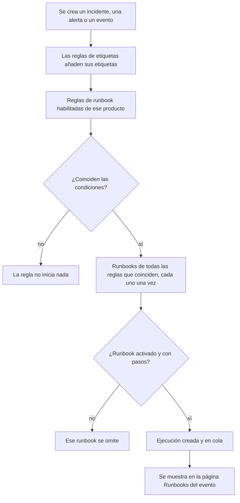

# Reglas de runbook

Las reglas de runbook inician runbooks automáticamente cuando se crea un **incidente**, una **alerta** o un **evento de mantenimiento programado**, para que nadie tenga que acordarse de ejecutarlos en mitad de una caída. Cada producto tiene su propia página de reglas, en su menú **Reglas**:

- Incidentes → Reglas → **Reglas de runbook**
- Alertas → Reglas → **Reglas de runbook**
- Mantenimiento programado → Reglas → **Reglas de runbook**

Las tres páginas editan el mismo tipo de regla, filtrado a las reglas de ese producto.

:::cards
- [Crear una regla de runbook](#crear-una-regla-de-runbook): Cuatro pasos: un nombre, condiciones y los runbooks que iniciar.
- [Condiciones](#condiciones): Cada criterio y operador que puede usar una regla.
- [Semántica de coincidencia](#semántica-de-coincidencia): Varias reglas, condiciones de monitor y reglas de etiquetas.
- [Ejemplos](#ejemplos): Tres reglas para copiar.
:::

## Cómo inicia una regla un runbook



Cuando una regla se activa, para cada runbook que nombra:

1. Se carga el runbook.
2. Sus pasos se copian como **instantánea** en una nueva ejecución de runbook.
3. La ejecución se pone en la cola del worker de runbooks.
4. La ejecución se vincula con la entidad de origen: aparece en la página **Runbooks** del incidente, la alerta o el evento de mantenimiento programado y en la lista **Ejecuciones** del runbook.

Puedes ver todas las ejecuciones, las iniciadas por reglas y las demás, en **Runbooks → Ejecuciones**, filtradas por estado, runbook o fecha de inicio.

## Antes de empezar

- **Un runbook que pueda ejecutarse.** Necesita al menos un paso y **Ejecutar este runbook** activado, en su página **Ajustes**. Consulta [Crear un runbook](/docs/runbooks/authoring).
- **Permiso para gestionar reglas.** Project Owner, Project Admin y Runbook Admin crean reglas de runbook, igual que cualquiera con el permiso **Create Runbook Rule**.

## Crear una regla de runbook

:::steps
### Abrir las reglas de runbook

En **Incidentes**, **Alertas** o **Mantenimiento programado**, abre **Reglas → Reglas de runbook** y haz clic en **Crear Regla de runbook**.

### Nombrar la regla

En **Información básica**, escribe un **Nombre**, como «Iniciar el failover de BD en incidentes de base de datos», y, si quieres, una **Descripción**.

### Añadir condiciones

En **Criterios de coincidencia**, haz clic en **Añadir condición**, elige un criterio y un operador, y escribe o elige el valor. Añade más condiciones si las necesitas y elige **Coincidir con todas** o **Coincidir con cualquiera**. No añadas ninguna para iniciar los runbooks en cada evento nuevo de este tipo.

### Elegir los runbooks

En **Runbooks**, elige uno o más **Runbooks para iniciar** y haz clic en **Crear Regla de runbook**. La regla está activa en cuanto se crea y aparece en la lista con el estado **Habilitado**.
:::

## Anatomía de una regla

| Campo | Para qué sirve |
| --- | --- |
| **Nombre** | Una etiqueta corta y comprensible para la regla. |
| **Descripción** | Contexto opcional para el equipo. |
| **Habilitado** | Activado en una regla nueva. Desactívalo en el formulario de edición de la regla para suspenderla sin eliminarla. |
| **Condiciones** | Lo que la regla compara, en el paso **Criterios de coincidencia**. Déjalo vacío para que coincida con cada evento de su tipo. |
| **Runbooks para iniciar** | Uno o más runbooks que se lanzan cuando la regla se activa. |

## Condiciones

Cada condición compara una característica del incidente, la alerta o el evento de mantenimiento programado con un valor que tú indicas. Una regla de runbook ofrece los mismos criterios que las demás reglas de su producto: una regla de runbook de incidentes compara lo mismo que una regla de privacidad o de guardia de incidentes.

| Criterio | Qué comprueba |
| --- | --- |
| **Monitores** | Los monitores a los que afecta el incidente o el evento de mantenimiento programado, o el monitor que generó la alerta. |
| **Gravedades de incidente** / **Gravedades de alerta** | La gravedad del incidente o de la alerta. Los eventos de mantenimiento programado no tienen gravedad, así que sus reglas no la ofrecen. |
| **Etiquetas de incidentes** / **Etiquetas de alertas** / **Etiquetas del evento** | Las etiquetas del propio incidente, alerta o evento, incluidas las que las reglas de etiquetas añadieron al crearlo. |
| **Etiquetas del monitor** | Las etiquetas de sus monitores. Etiqueta tus monitores como `production` o `staging` para ejecutar un runbook solo en un entorno. |
| **Título del incidente** / **Título de la alerta** / **Título del evento** | Su título. |
| **Descripción del incidente** / **Descripción de la alerta** / **Descripción del evento** | Su descripción. |
| **Nombre del monitor** / **Descripción del monitor** | El nombre o la descripción de sus monitores. |

Elige un operador para cada condición:

- Un criterio de lista — **Monitores**, las gravedades y las etiquetas — usa **Tiene alguno de**, **Tiene todos los** o **No tiene ninguno de** los valores que elijas.
- Un criterio de texto usa **Contiene** (con el que empieza una condición nueva), **No contiene**, **Es igual a**, **No es igual a**, **Empieza por**, **Termina en**, o **Coincide con el patrón** / **No coincide con el patrón** para una expresión regular sin distinguir mayúsculas o un comodín `*`. Las comparaciones de texto no distinguen mayúsculas y minúsculas.

Con dos o más condiciones, elige **Coincidir con todas** (todas las condiciones deben cumplirse) o **Coincidir con cualquiera** (al menos una debe cumplirse).

## Semántica de coincidencia

- Una regla sin condiciones se aplica a cada evento de su tipo (una regla global de «ejecutar siempre»).
- Varias reglas pueden coincidir con el mismo evento. Cada coincidencia se activa y se ejecuta la unión de sus runbooks: cada runbook tiene su propia ejecución, y un runbook que nombran dos reglas coincidentes se ejecuta una sola vez.
- Las condiciones de monitor se comprueban monitor por monitor. Con **Coincidir con todas**, «**Nombre del monitor** contiene `api`» y «**Etiquetas del monitor** tiene alguno de _Production_» necesitan un monitor que cumpla ambas, no un monitor para cada una.
- Las reglas de runbook se ejecutan después de las reglas de etiquetas, así que una etiqueta que una regla de etiquetas añade a un incidente, una alerta o un evento nuevo puede iniciar un runbook.
- Un incidente o una alerta que se crea ya resuelto no inicia ningún runbook: terminó antes de registrarse. Consulta [Declarado ya reconocido o resuelto](/docs/incidents/declaring-incidents#declarado-ya-reconocido-o-resuelto).
- Una condición sobre la gravedad de otro producto — **Gravedades de alerta** en una regla de incidentes, por ejemplo — nunca puede cumplirse, así que la API se niega a guardarla.
- Las reglas se evalúan una sola vez, cuando se crea el evento. Editar después el título, la gravedad o las etiquetas de un incidente no vuelve a activar las reglas.

## Ejemplos

### Failover de BD para incidentes de base de datos

```text
Name:        Start DB failover for DB incidents
Trigger:     Incident
Conditions:  Incident Title matches pattern (?:^|\b)(db|database|postgres|mysql|mongo)
Runbooks:    [DB failover playbook, Notify DBA team]
```

Esto crea dos ejecuciones de runbook cada vez que se crea un incidente con «db», «database», «postgres», etc. en el título.

### Solo para incidentes críticos de producción

```text
Name:        Flush the CDN cache for critical production incidents
Trigger:     Incident
Conditions:  Match all
             Monitor Labels has any of Production
             Incident Severities has any of Critical
Runbooks:    [Flush CDN cache]
```

Se ejecuta para un incidente crítico en un monitor con la etiqueta _Production_, y para nada en staging.

### Regla de higiene que siempre se ejecuta

```text
Name:        Always-run pre-flight check
Trigger:     Incident
Conditions:  (none)
Runbooks:    [Capture pre-incident state]
```

Se activa en cada incidente: útil para capturar instantáneas del estado del sistema, métricas y similares para el postmortem.

## Runbooks desactivados

Si una regla nombra un runbook desactivado (**Ejecutar este runbook** desactivado en la página **Ajustes** del runbook, `isEnabled = false`), la regla sigue coincidiendo pero la ejecución del runbook se omite. Vuelve a activar el interruptor para reanudarla. Un runbook sin pasos se omite de la misma forma.

## Probar una regla

Antes de confiar en una regla en producción, crea un incidente (o una alerta) de prueba que cumpla sus condiciones y comprueba que los runbooks esperados aparecen en su página **Runbooks**.

> [!NOTE]
> Las reglas de runbook solo actúan sobre eventos nuevos. A diferencia de las reglas de etiquetas y de propietarios, no se pueden [ejecutar sobre registros existentes](/docs/configuration/run-rules-now): eso iniciaría runbooks para incidentes que ya terminaron.

## Solución de problemas

:::details Una regla coincidió, pero no se ejecutó ningún runbook
Comprueba, en orden:

- La regla está **Habilitado**.
- Cada runbook tiene **Ejecutar este runbook** activado, en su página **Ajustes**, y al menos un paso guardado.
- El incidente o la alerta no se creó ya resuelto.
- La ejecución del runbook no está simplemente esperando: ábrela desde la página **Runbooks** del evento. Un paso Manual o una aprobación muestra **Esperándote**.
:::

:::details Una regla nunca coincide
Las reglas ven el evento tal como se creó, con las etiquetas que las reglas de etiquetas añadieron en ese momento. Una etiqueta, una gravedad o un título cambiados después no se ven. Con varias condiciones, revisa **Coincidir con todas** frente a **Coincidir con cualquiera**, y recuerda que las condiciones de monitor deben cumplirse todas en un mismo monitor.
:::

:::details La API rechaza una regla con "can only be used by"
Un criterio de gravedad pertenece a un solo producto. **Gravedades de alerta** en una regla de incidentes, o **Gravedades de incidente** en una regla de alertas, nunca podría coincidir, así que la regla se rechaza con un mensaje como "Alert Severities can only be used by alert runbook rules." Elimina esa condición. El panel solo ofrece los criterios propios de cada producto.
:::

## Siguientes pasos

:::cards
- [Ejecutar un runbook](/docs/runbooks/running): Qué ven quienes responden cuando una regla inicia una ejecución.
- [Crear un runbook](/docs/runbooks/authoring): Escribir los runbooks que inician tus reglas.
- [Declarar un incidente](/docs/incidents/declaring-incidents): Cómo se crean los incidentes y cuándo los ven las reglas.
:::
